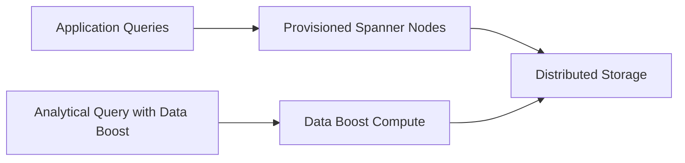

# How to Use Spanner Data Boost for Resource-Isolated Analytical Queries

Author: [nawazdhandala](https://www.github.com/nawazdhandala)

Tags: GCP, Cloud Spanner, Data Boost, Analytics, Database Performance

Description: Learn how to use Cloud Spanner Data Boost to run heavy analytical queries and data exports without impacting your production OLTP workloads through resource-isolated compute.

---

One of the oldest tensions in database management is running analytical queries against a production database. Your application needs consistent, low-latency reads and writes for transactional workloads. But someone in the analytics team wants to scan millions of rows for a report, and suddenly your API response times spike. Cloud Spanner's Data Boost feature solves this for supported analytical workloads by running them on separate, isolated compute resources instead of your provisioned Spanner nodes.

Data Boost is essentially on-demand compute that reads directly from Spanner's distributed storage layer. Your OLTP workload keeps humming along on your provisioned nodes while the analytical workload runs on independent resources. There is no shared CPU or memory with your provisioned instance capacity.

## How Data Boost Works

In a standard Spanner setup, all queries - transactional and analytical - share the same set of provisioned nodes. When you run a heavy table scan, it competes for CPU and memory with your application queries.

Data Boost changes this by introducing a separate compute path. When you execute an eligible partitioned query or read with Data Boost enabled, Spanner routes it to independently provisioned compute resources. These resources read directly from Spanner's Colossus-based storage layer, bypassing your provisioned nodes.

The flow looks like this:


```mermaid
graph LR
    A[Application Queries] --> B[Provisioned Spanner Nodes]
    B --> C[Distributed Storage]
    D[Analytical Query with Data Boost] --> E[Data Boost Compute]
    E --> C
```

The important thing to notice is that the analytical query path and the application query path share storage but not compute. This is what gives you isolation.

## Enabling Data Boost

Data Boost does not require any changes to your Spanner instance configuration. The principal running the workload must have the `spanner.databases.useDataBoost` IAM permission, and the request must be a supported partitioned read or query. Eligible queries are queries whose first operator in the execution plan is a distributed union.

You enable Data Boost by setting the `data_boost_enabled` or `DataBoostEnabled` option on the partitioned read or query request. The `gcloud spanner databases execute-sql` command does not currently expose a Data Boost flag for ad-hoc SQL execution.

```bash
# This runs a normal Spanner SQL query; it does not use Data Boost.
gcloud spanner databases execute-sql my-database \
  --instance=my-instance \
  --sql="SELECT COUNT(*) as total, status FROM orders GROUP BY status"
```

## Using Data Boost in Application Code

Here is how to enable Data Boost in the most common client libraries.

### Python

```python
from google.cloud import spanner

client = spanner.Client()
instance = client.instance('my-instance')
database = instance.database('my-database')

# Run an analytical query as partitioned batch work with Data Boost enabled
batch_txn = database.batch_snapshot()

partitions = batch_txn.generate_query_batches(
    sql=(
        "SELECT user_id, total "
        "FROM orders"
    ),
    data_boost_enabled=True  # Routes partitioned work to isolated compute
)

for partition in partitions:
    results = batch_txn.process(partition)
    for row in results:
        print(f"User: {row[0]}, Revenue: {row[1]}")

batch_txn.close()
```

### Java

```java
import com.google.cloud.spanner.*;

// Create a Spanner client and get a database client
SpannerOptions options = SpannerOptions.newBuilder().build();
Spanner spanner = options.getService();
DatabaseClient dbClient = spanner.getDatabaseClient(
    DatabaseId.of("my-project", "my-instance", "my-database")
);

// Enable Data Boost only for partitioned reads or partitioned queries.
// Options.dataBoostEnabled(true) is a Data Boost option for partitioned work,
// not for ordinary single-use executeQuery calls.
Options.DataBoostQueryOption dataBoost = Options.dataBoostEnabled(true);
```

### Go

```go
package main

import (
    "context"
    "fmt"
    "log"

    "cloud.google.com/go/spanner"
)

func runDataBoostQuery() {
    ctx := context.Background()
    client, err := spanner.NewClient(ctx,
        "projects/my-project/instances/my-instance/databases/my-database")
    if err != nil {
        log.Fatal(err)
    }
    defer client.Close()

    // Data Boost is enabled through QueryOptions for partitioned queries.
    stmt := spanner.Statement{
        SQL: `SELECT product_id, quantity FROM order_items`,
    }
    queryOptions := spanner.QueryOptions{DataBoostEnabled: true}

    _ = stmt
    _ = queryOptions
    fmt.Println("Use queryOptions with partitioned query execution.")
}
```

## Data Boost with Batch Reads

Data Boost is particularly useful with Spanner's batch read API, which is designed for large-scale data processing. Batch reads partition a query across multiple workers for parallel execution:

```python
from google.cloud import spanner

client = spanner.Client()
instance = client.instance('my-instance')
database = instance.database('my-database')

# Create a batch transaction with Data Boost
# This is ideal for large exports or ETL jobs
batch_txn = database.batch_snapshot()

# Generate partitions for parallel reading
partitions = batch_txn.generate_read_batches(
    table='events',
    columns=['event_id', 'event_type', 'timestamp', 'payload'],
    keyset=spanner.KeySet(all_=True),
    data_boost_enabled=True  # All partitions use Data Boost
)

# Process each partition (in production, distribute across workers)
total_rows = 0
for partition in partitions:
    results = batch_txn.process(partition)
    for row in results:
        total_rows += 1
        # Process each row

print(f"Processed {total_rows} rows without impacting production")
batch_txn.close()
```

## Data Boost with Dataflow and Spark

Data Boost integrates with GCP's data processing ecosystem. When using connectors that support Data Boost, such as the Spark SQL connector for Spanner or Dataflow export templates, you can enable Data Boost to reduce impact on production.

For a Dataflow pipeline:

```python
import apache_beam as beam
from apache_beam.io.gcp.spanner import ReadFromSpanner

# Apache Beam pipeline that reads from Spanner.
# The Python ReadFromSpanner transform does not expose a data_boost_enabled
# parameter; this example is a normal Spanner read.
with beam.Pipeline() as pipeline:
    rows = (
        pipeline
        | 'ReadFromSpanner' >> ReadFromSpanner(
            project_id='my-project',
            instance_id='my-instance',
            database_id='my-database',
            sql="SELECT * FROM large_table WHERE created_at > TIMESTAMP '2026-01-01T00:00:00Z'"
        )
        | 'TransformData' >> beam.Map(transform_row)
        | 'WriteToBigQuery' >> beam.io.WriteToBigQuery(
            'my-project:my_dataset.my_table',
            write_disposition=beam.io.BigQueryDisposition.WRITE_APPEND
        )
    )
```

## Cost Considerations

Data Boost is billed separately from your provisioned Spanner nodes. You pay for the actual processing units used by queries that run on Data Boost. This is a usage-based cost on top of your base Spanner instance cost.

The pricing model means Data Boost is most cost-effective for periodic analytical workloads rather than continuous ones. If you need constant analytical capacity, adding read replicas or provisioning additional nodes might be more economical. But for daily reports, ad-hoc analysis, and periodic data exports, Data Boost is usually cheaper than over-provisioning your instance to handle both OLTP and analytical workloads.

You can monitor Data Boost usage and costs in Cloud Monitoring and, when audit logs are enabled, with Spanner audit logs.

## When to Use Data Boost

Data Boost is the right choice in several scenarios. Large table scans for reporting and analytics are the primary use case. ETL and ELT pipelines that read data from Spanner for processing elsewhere benefit greatly. Data exports to BigQuery or Cloud Storage become safe operations. Ad-hoc analytical queries from data scientists or analysts no longer require coordination with the operations team.

Data Boost is not the right choice for transactional workloads (it only supports read operations), queries that are not partitionable, or continuous streaming reads where provisioned capacity would be more economical.

## Monitoring Data Boost Queries

You can track Data Boost usage in Cloud Monitoring:

```bash
# View Data Boost metrics for your instance
gcloud monitoring metrics list \
  --filter="metric.type = starts_with(\"spanner.googleapis.com/instance/data_boost\")"
```

The key metric to watch is `instance/data_boost/processing_unit_second_count`, which reports the total processing units used for Data Boost operations.

## Wrapping Up

Data Boost is one of those features that eliminates an entire category of operational headaches. The separation between OLTP and analytical compute means you no longer need to schedule supported reports during off-peak hours, over-provision your instance for occasional heavy reads, or say no to the analytics team. You add the Data Boost option to a supported partitioned read or query, and it runs on isolated resources. For teams running mixed workloads on Spanner, this is a significant quality-of-life improvement.
