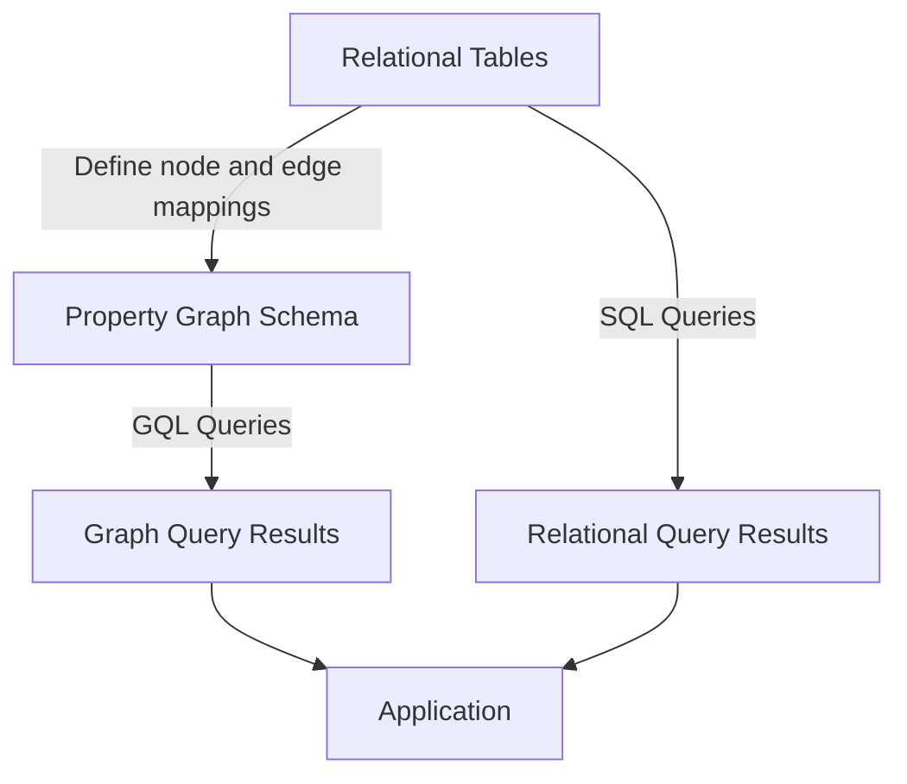

# How to Use Spanner Graph for Property Graph Queries

Author: [nawazdhandala](https://www.github.com/nawazdhandala)

Tags: GCP, Cloud Spanner, Spanner Graph, Graph Database, Property Graph

Description: Learn how to use Spanner Graph to run property graph queries on your relational data using GQL without moving data to a separate graph database.

---

Graph queries are powerful for exploring relationships in data - social networks, recommendation engines, fraud detection, knowledge graphs. Traditionally, you needed a separate graph database for these workloads. Cloud Spanner now supports property graph queries natively through Spanner Graph, letting you define graph schemas on top of your existing relational tables and query them using GQL (Graph Query Language). In this post, I will show you how to set up and use Spanner Graph.

## What is Spanner Graph?

Spanner Graph is not a separate product. It is a capability built into Cloud Spanner that lets you:

1. Define a property graph schema that maps your existing tables to nodes and edges
2. Query the graph using GQL, the ISO standard graph query language
3. Combine graph queries with standard SQL in the same query

The data stays in your regular Spanner tables. The graph schema is just a view that tells Spanner how to interpret the tables as a graph. There is no data duplication.

## Setting Up Graph Tables

First, you need tables that represent your graph's nodes and edges. Let's build a social network example:

```sql
-- Node table: People in the network
CREATE TABLE Person (
    PersonId STRING(36) NOT NULL,
    Name STRING(256) NOT NULL,
    Email STRING(256),
    JoinedAt TIMESTAMP NOT NULL
) PRIMARY KEY (PersonId);

-- Edge table: Friendship connections between people
CREATE TABLE Friendship (
    PersonId1 STRING(36) NOT NULL,
    PersonId2 STRING(36) NOT NULL,
    ConnectedAt TIMESTAMP NOT NULL
) PRIMARY KEY (PersonId1, PersonId2);

-- Node table: Posts created by people
CREATE TABLE Post (
    PostId STRING(36) NOT NULL,
    AuthorId STRING(36) NOT NULL,
    Content STRING(MAX),
    CreatedAt TIMESTAMP NOT NULL
) PRIMARY KEY (PostId);

-- Edge table: Likes on posts
CREATE TABLE PostLike (
    PersonId STRING(36) NOT NULL,
    PostId STRING(36) NOT NULL,
    LikedAt TIMESTAMP NOT NULL
) PRIMARY KEY (PersonId, PostId);
```

## Defining the Property Graph Schema

Now define the graph schema that maps these tables to nodes and edges:

```sql
-- Define the property graph schema
CREATE OR REPLACE PROPERTY GRAPH SocialGraph
  NODE TABLES (
    Person
      KEY (PersonId)
      PROPERTIES (Name, Email, JoinedAt),
    Post
      KEY (PostId)
      PROPERTIES (Content, CreatedAt)
  )
  EDGE TABLES (
    Friendship
      KEY (PersonId1, PersonId2)
      SOURCE KEY (PersonId1) REFERENCES Person (PersonId)
      DESTINATION KEY (PersonId2) REFERENCES Person (PersonId)
      PROPERTIES (ConnectedAt)
      LABEL IS_FRIENDS_WITH,
    PostLike
      KEY (PersonId, PostId)
      SOURCE KEY (PersonId) REFERENCES Person (PersonId)
      DESTINATION KEY (PostId) REFERENCES Post (PostId)
      PROPERTIES (LikedAt)
      LABEL LIKES,
    Post
      KEY (PostId)
      SOURCE KEY (AuthorId) REFERENCES Person (PersonId)
      DESTINATION KEY (PostId) REFERENCES Post (PostId)
      LABEL AUTHORED
  );
```

This tells Spanner that:
- Person and Post rows are nodes
- Friendship rows are edges connecting two Person nodes
- PostLike rows are edges connecting Person to Post
- Posts also create edges from Person (author) to Post

## Basic Graph Queries with GQL

GQL uses a pattern-matching syntax that feels natural for graph traversal. Let's start with simple queries.

### Find Friends of a Person

```sql
-- Find all friends of Alice
GRAPH SocialGraph
MATCH (p:Person {Name: 'Alice'})-[:IS_FRIENDS_WITH]-(friend:Person)
RETURN friend.Name, friend.Email;
```

The `-[:IS_FRIENDS_WITH]-` pattern matches the friendship edge in either direction. Friendships are bidirectional in this model.

### Find Friends of Friends

```sql
-- Find friends-of-friends who are not direct friends with Alice
GRAPH SocialGraph
MATCH (p:Person {Name: 'Alice'})-[:IS_FRIENDS_WITH]-(friend:Person)-[:IS_FRIENDS_WITH]-(fof:Person)
WHERE fof.PersonId != p.PersonId
  AND NOT EXISTS {
    MATCH (p)-[:IS_FRIENDS_WITH]-(fof)
  }
RETURN DISTINCT fof.Name;
```

This is the classic "people you may know" query. It finds people who are two hops away but not directly connected.

### Find Posts Liked by Friends

```sql
-- Find posts that Alice's friends have liked
GRAPH SocialGraph
MATCH (p:Person {Name: 'Alice'})-[:IS_FRIENDS_WITH]-(friend:Person)-[:LIKES]->(post:Post)
RETURN friend.Name, post.Content, post.CreatedAt
ORDER BY post.CreatedAt DESC
LIMIT 20;
```

## Variable-Length Path Queries

One of the most powerful features of graph queries is variable-length path matching:

```sql
-- Find all people within 3 hops of Alice
GRAPH SocialGraph
MATCH (p:Person {Name: 'Alice'})-[:IS_FRIENDS_WITH]-{1,3}(connected:Person)
RETURN DISTINCT connected.Name, connected.Email;
```

The `{1,3}` means "follow the IS_FRIENDS_WITH edge 1 to 3 times." This is much more natural than writing a recursive SQL query with CTEs.

### Shortest Path

```sql
-- Find the shortest path between Alice and Bob
GRAPH SocialGraph
MATCH SHORTEST (a:Person {Name: 'Alice'})-[:IS_FRIENDS_WITH]-+(b:Person {Name: 'Bob'})
RETURN a.Name, b.Name;
```

## Combining GQL with SQL

Spanner Graph lets you mix GQL and SQL in the same query. This is useful when you need graph traversal combined with relational operations:

```sql
-- Find friends of Alice and join with their order data from a regular table
GRAPH SocialGraph
MATCH (p:Person {Name: 'Alice'})-[:IS_FRIENDS_WITH]-(friend:Person)
RETURN friend.PersonId AS FriendId, friend.Name AS FriendName

-- Combine graph results with SQL
UNION ALL

SELECT u.UserId AS FriendId, u.DisplayName AS FriendName
FROM Users u
WHERE u.Region = 'US';
```

You can also use graph query results as a subquery:

```sql
-- Use graph results in a SQL query
SELECT o.OrderId, o.TotalAmount
FROM Orders o
WHERE o.UserId IN (
    GRAPH SocialGraph
    MATCH (p:Person {Name: 'Alice'})-[:IS_FRIENDS_WITH]-(friend:Person)
    RETURN friend.PersonId
);
```

## Real-World Use Cases

### Fraud Detection

```sql
-- Find accounts that share payment methods with flagged accounts
GRAPH PaymentGraph
MATCH (flagged:Account {Status: 'FLAGGED'})-[:USES_PAYMENT]->(pm:PaymentMethod)<-[:USES_PAYMENT]-(suspect:Account)
WHERE suspect.Status = 'ACTIVE'
RETURN DISTINCT suspect.AccountId, suspect.Email, pm.LastFourDigits;
```

### Recommendation Engine

```sql
-- Recommend products based on what similar users purchased
GRAPH CommerceGraph
MATCH (u:User {UserId: 'user-123'})-[:PURCHASED]->(p1:Product)<-[:PURCHASED]-(similar:User)-[:PURCHASED]->(recommended:Product)
WHERE NOT EXISTS {
    MATCH (u)-[:PURCHASED]->(recommended)
}
RETURN recommended.ProductId, recommended.Name, COUNT(similar) AS similarity_score
ORDER BY similarity_score DESC
LIMIT 10;
```

### Organizational Hierarchy

```sql
-- Find all reports (direct and indirect) under a manager
GRAPH OrgGraph
MATCH (manager:Employee {Name: 'Jane Smith'})-[:MANAGES]->{1,10}(report:Employee)
RETURN report.Name, report.Title, report.Department;
```

## Performance Considerations

Graph queries in Spanner benefit from the same indexing strategies as regular SQL:

```sql
-- Add indexes to improve graph traversal performance
CREATE INDEX FriendshipByPerson1 ON Friendship(PersonId1);
CREATE INDEX FriendshipByPerson2 ON Friendship(PersonId2);
CREATE INDEX PostLikeByPerson ON PostLike(PersonId);
CREATE INDEX PostByAuthor ON Post(AuthorId);
```

For variable-length path queries, Spanner needs to traverse edges iteratively. Deep traversals (high hop counts) can be expensive. Limit the maximum path length when possible.

The graph schema definition flow:



## Managing the Graph Schema

Update the graph schema when your tables change:

```sql
-- Add a new edge type to the graph
CREATE OR REPLACE PROPERTY GRAPH SocialGraph
  NODE TABLES (
    Person KEY (PersonId) PROPERTIES (Name, Email, JoinedAt),
    Post KEY (PostId) PROPERTIES (Content, CreatedAt),
    Group KEY (GroupId) PROPERTIES (GroupName, Description)
  )
  EDGE TABLES (
    Friendship KEY (PersonId1, PersonId2)
      SOURCE KEY (PersonId1) REFERENCES Person
      DESTINATION KEY (PersonId2) REFERENCES Person
      LABEL IS_FRIENDS_WITH,
    GroupMembership KEY (PersonId, GroupId)
      SOURCE KEY (PersonId) REFERENCES Person
      DESTINATION KEY (GroupId) REFERENCES Group
      LABEL MEMBER_OF
  );
```

To remove a graph schema:

```sql
DROP PROPERTY GRAPH SocialGraph;
```

Dropping the graph schema does not affect the underlying tables or data.

## Wrapping Up

Spanner Graph brings graph query capabilities to your existing Spanner data without requiring a separate graph database. You define a property graph schema on top of your relational tables, and then use GQL to query relationships that would be awkward or slow in pure SQL. The sweet spot is applications that need both transactional relational queries and graph traversals on the same data - social features, recommendation systems, fraud detection, and organizational hierarchies are all natural fits. Since the data stays in your regular tables, you get Spanner's consistency, availability, and scalability guarantees for both your relational and graph workloads.
