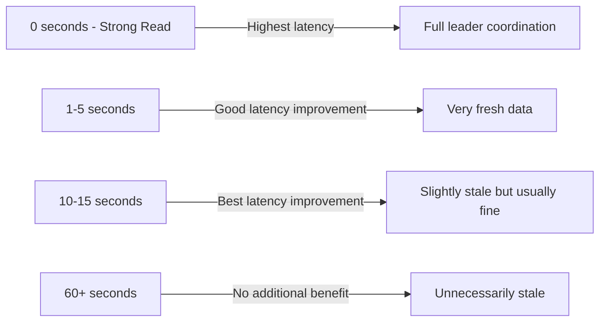

# How to Use Stale Reads in Cloud Spanner to Reduce Latency

Author: [nawazdhandala](https://www.github.com/nawazdhandala)

Tags: GCP, Cloud Spanner, Stale Reads, Performance, Latency

Description: Learn how to use stale reads in Cloud Spanner to reduce read latency by trading off slight data freshness for faster response times.

---

Every strong read in Cloud Spanner needs to check that it is seeing the most up-to-date committed data. In a multi-region deployment, this means coordinating with the leader region, which adds latency. Stale reads offer an alternative: you tell Spanner that you are okay reading data that might be a few seconds old, and in return, Spanner can serve the read from the nearest replica without waiting for the latest data. In this post, I will show you when stale reads make sense and how to use them effectively.

## How Strong Reads Work

To understand why stale reads are faster, you first need to understand strong reads. When you perform a strong read:

1. Your request arrives at the nearest replica
2. The replica checks with the leader to determine the latest commit timestamp
3. The replica waits until it has all data up to that timestamp
4. The replica returns the results

That coordination with the leader adds latency, especially if the leader is in a different region. For a nam-eur-asia1 multi-region configuration, the leader might be in the US while your reader is in Europe. Each strong read requires a cross-continent round trip.

## How Stale Reads Work

With a stale read, you specify how old the data can be. Spanner then:

1. Your request arrives at the nearest replica
2. The replica checks its local timestamp
3. If the replica has data that satisfies your staleness bound, it returns immediately
4. No coordination with the leader is needed

This eliminates the cross-region round trip, which can save 100-300ms per read in multi-region configurations.

## Types of Stale Reads

Spanner supports two types of staleness:

### Exact Staleness

You specify an exact duration. The read returns data as of `now - duration`:

```python
from google.cloud import spanner
import datetime

client = spanner.Client()
instance = client.instance("my-instance")
database = instance.database("my-database")

# Read data that is at most 15 seconds old
staleness = datetime.timedelta(seconds=15)
with database.snapshot(exact_staleness=staleness) as snapshot:
    results = snapshot.execute_sql(
        "SELECT UserId, Email, DisplayName FROM Users WHERE UserId = @id",
        params={"id": "user-123"},
        param_types={"id": spanner.param_types.STRING}
    )
    for row in results:
        print(row)
```

### Min Read Timestamp (Bounded Staleness)

You specify a minimum timestamp. Spanner returns data that is at least as fresh as that timestamp:

```python
# Read data that was current as of a specific time
min_timestamp = datetime.datetime(2026, 2, 17, 10, 0, 0, tzinfo=datetime.timezone.utc)
with database.snapshot(min_read_timestamp=min_timestamp) as snapshot:
    results = snapshot.execute_sql(
        "SELECT UserId, Email FROM Users WHERE UserId = @id",
        params={"id": "user-123"},
        param_types={"id": spanner.param_types.STRING}
    )
    for row in results:
        print(row)
```

## Stale Reads in Go

```go
func getProductStale(ctx context.Context, client *spanner.Client, productID string) (*Product, error) {
    // Create a read with 10-second staleness tolerance
    ro := client.ReadOnlyTransaction().WithTimestampBound(
        spanner.ExactStaleness(10 * time.Second))
    defer ro.Close()

    // Read the product - served from the nearest replica without leader check
    row, err := ro.ReadRow(ctx, "Products",
        spanner.Key{productID},
        []string{"ProductId", "Name", "Price", "StockCount"})
    if err != nil {
        return nil, fmt.Errorf("reading product: %w", err)
    }

    var product Product
    if err := row.ToStruct(&product); err != nil {
        return nil, err
    }

    return &product, nil
}
```

## Stale Reads in Java

```java
public Product getProductStale(String productId) {
    // Create a read with 15-second staleness
    TimestampBound bound = TimestampBound.ofExactStaleness(15, TimeUnit.SECONDS);

    try (ReadOnlyTransaction txn = dbClient.singleUseReadOnlyTransaction(bound)) {
        Struct row = txn.readRow("Products",
            Key.of(productId),
            Arrays.asList("ProductId", "Name", "Price", "StockCount"));

        if (row == null) {
            return null;
        }

        return new Product(
            row.getString("ProductId"),
            row.getString("Name"),
            row.getDouble("Price"),
            row.getLong("StockCount")
        );
    }
}
```

## When to Use Stale Reads

Stale reads are a good fit when:

- **Product catalog pages** - A product listing that is 10 seconds behind is fine for most users
- **Dashboard data** - Aggregate counts and charts do not need to be real-time
- **Search results** - A slight delay in reflecting new or updated items is acceptable
- **Caching layers** - Data feeding a cache does not need to be perfectly fresh since the cache itself introduces staleness
- **Analytics queries** - Historical analysis does not care about the last few seconds of data
- **Read replicas in other regions** - Any read that does not require split-second freshness

Stale reads are NOT appropriate when:

- **Account balances** during a transfer - You need the exact current balance
- **Inventory checks** during checkout - Over-selling is worse than slightly higher latency
- **Consistency-critical workflows** - Any operation where acting on stale data could cause incorrect behavior

## Choosing the Right Staleness Duration

The staleness duration is a tradeoff between latency improvement and data freshness:



In practice, 10-15 seconds is the sweet spot for most applications. Going beyond 15 seconds rarely provides additional latency improvement because replicas are usually caught up within a few seconds.

## Measuring the Latency Difference

Here is a quick benchmark to compare strong vs stale reads:

```python
import time

def benchmark_reads(database, user_id, iterations=100):
    """Compare strong read vs stale read latency."""

    # Benchmark strong reads
    strong_times = []
    for _ in range(iterations):
        start = time.time()
        with database.snapshot() as snapshot:
            list(snapshot.execute_sql(
                "SELECT * FROM Users WHERE UserId = @id",
                params={"id": user_id},
                param_types={"id": spanner.param_types.STRING}
            ))
        strong_times.append(time.time() - start)

    # Benchmark stale reads with 10-second staleness
    stale_times = []
    staleness = datetime.timedelta(seconds=10)
    for _ in range(iterations):
        start = time.time()
        with database.snapshot(exact_staleness=staleness) as snapshot:
            list(snapshot.execute_sql(
                "SELECT * FROM Users WHERE UserId = @id",
                params={"id": user_id},
                param_types={"id": spanner.param_types.STRING}
            ))
        stale_times.append(time.time() - start)

    # Report results
    avg_strong = sum(strong_times) / len(strong_times) * 1000
    avg_stale = sum(stale_times) / len(stale_times) * 1000
    p99_strong = sorted(strong_times)[int(iterations * 0.99)] * 1000
    p99_stale = sorted(stale_times)[int(iterations * 0.99)] * 1000

    print(f"Strong reads - avg: {avg_strong:.1f}ms, p99: {p99_strong:.1f}ms")
    print(f"Stale reads  - avg: {avg_stale:.1f}ms, p99: {p99_stale:.1f}ms")
    print(f"Improvement  - avg: {(avg_strong - avg_stale):.1f}ms "
          f"({(1 - avg_stale/avg_strong) * 100:.0f}%)")
```

For a multi-region instance, you might see something like:

```
Strong reads - avg: 45.2ms, p99: 112.3ms
Stale reads  - avg: 3.8ms, p99: 8.1ms
Improvement  - avg: 41.4ms (92%)
```

The difference is dramatic for multi-region instances. For single-region instances, the improvement is smaller but still meaningful (typically 2-10ms savings).

## Combining Strong and Stale Reads in an Application

A practical pattern is to use stale reads for most operations and strong reads only when freshness is critical:

```python
class UserService:
    def __init__(self, database):
        self.database = database

    def get_user_profile(self, user_id):
        """Stale read is fine for displaying a profile page."""
        staleness = datetime.timedelta(seconds=10)
        with self.database.snapshot(exact_staleness=staleness) as snapshot:
            return self._read_user(snapshot, user_id)

    def get_user_for_auth(self, user_id):
        """Strong read for authentication - need the latest permissions."""
        with self.database.snapshot() as snapshot:
            return self._read_user(snapshot, user_id)

    def _read_user(self, snapshot, user_id):
        """Shared read logic used by both stale and strong reads."""
        results = snapshot.execute_sql(
            "SELECT UserId, Email, DisplayName, Role FROM Users WHERE UserId = @id",
            params={"id": user_id},
            param_types={"id": spanner.param_types.STRING}
        )
        rows = list(results)
        return rows[0] if rows else None
```

## Wrapping Up

Stale reads are one of the simplest performance optimizations you can make with Cloud Spanner, especially for multi-region deployments. A 10-15 second staleness window eliminates cross-region coordination for reads, cutting latency from tens of milliseconds to single-digit milliseconds. The key is identifying which reads in your application actually need perfect freshness (usually fewer than you think) and using stale reads for everything else. It is a low-risk, high-reward optimization that you can adopt incrementally, one query at a time.
