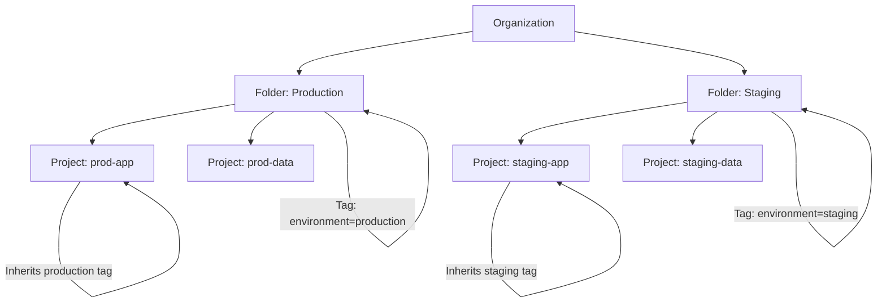

# How to Use Tags with IAM Conditions for Resource-Level Access Control in GCP

Author: [nawazdhandala](https://www.github.com/nawazdhandala)

Tags: GCP, IAM, Tags, Conditional Access, Security

Description: Learn how to combine GCP resource tags with IAM conditions to create fine-grained, attribute-based access control policies that target specific resources dynamically.

---

Standard IAM in GCP works at the project level. You grant someone a role on a project, and they get that role on every resource in the project. This is simple to manage but often too broad. A developer who needs to manage Cloud SQL instances in the staging environment should not automatically have access to production databases, even if they live in the same project.

IAM Conditions solve part of this problem by letting you add conditional logic to role bindings. Tags take it further by giving you a way to label resources with metadata that conditions can evaluate. Together, tags and IAM conditions let you build attribute-based access control (ABAC) that targets specific resources without reorganizing your project structure.

## Understanding Tags vs Labels

GCP has both labels and tags, and they serve different purposes. Labels are key-value metadata you can attach to resources for billing and organization. Tags are part of the Resource Manager service and are designed specifically to work with IAM and organization policies. Only tags can be used in IAM conditions - labels cannot.

Tags are defined at the organization level as tag keys with allowed tag values. You then bind tag values to resources. For example, you might create a tag key called `environment` with values `production`, `staging`, and `development`, and then bind the appropriate value to each resource.

## Prerequisites

- A GCP organization (tags require an org node)
- The `roles/resourcemanager.tagAdmin` role to create tag keys and values
- The `roles/resourcemanager.tagUser` role to bind tags to resources
- The `roles/iam.securityAdmin` or equivalent to modify IAM policies

## Step 1 - Create Tag Keys and Values

First, create the tag key at the organization level:

```bash
# Create a tag key for environment classification
gcloud resource-manager tags keys create environment \
  --parent=organizations/ORG_ID \
  --description="Environment classification for resources"
```

Note the tag key ID returned - you will need it for creating values. Then create the tag values:

```bash
# Create tag values for each environment
gcloud resource-manager tags values create production \
  --parent=organizations/ORG_ID/tagKeys/TAG_KEY_ID \
  --description="Production environment"

gcloud resource-manager tags values create staging \
  --parent=organizations/ORG_ID/tagKeys/TAG_KEY_ID \
  --description="Staging environment"

gcloud resource-manager tags values create development \
  --parent=organizations/ORG_ID/tagKeys/TAG_KEY_ID \
  --description="Development environment"
```

## Step 2 - Bind Tags to Resources

Now attach tag values to your resources. Tags can be bound to projects, folders, and many individual resources:

```bash
# Bind the "production" tag to a Cloud SQL instance
gcloud resource-manager tags bindings create \
  --tag-value=organizations/ORG_ID/tagKeys/TAG_KEY_ID/tagValues/PRODUCTION_VALUE_ID \
  --parent=//sqladmin.googleapis.com/projects/my-project/instances/prod-database \
  --location=us-central1

# Bind the "staging" tag to another instance
gcloud resource-manager tags bindings create \
  --tag-value=organizations/ORG_ID/tagKeys/TAG_KEY_ID/tagValues/STAGING_VALUE_ID \
  --parent=//sqladmin.googleapis.com/projects/my-project/instances/staging-database \
  --location=us-central1
```

You can also bind tags at the project level, and they will be inherited by resources in that project:

```bash
# Bind a tag to an entire project
gcloud resource-manager tags bindings create \
  --tag-value=organizations/ORG_ID/tagKeys/TAG_KEY_ID/tagValues/PRODUCTION_VALUE_ID \
  --parent=//cloudresourcemanager.googleapis.com/projects/my-prod-project
```

## Step 3 - Create IAM Bindings with Tag Conditions

Here is where it comes together. You create an IAM binding with a condition that checks for a specific tag value. The following grants Cloud SQL Editor role only on resources tagged as "staging":

```bash
# Grant Cloud SQL Editor role only on resources tagged as staging
gcloud projects add-iam-policy-binding my-project \
  --member="user:developer@example.com" \
  --role="roles/cloudsql.editor" \
  --condition="expression=resource.matchTag('ORG_ID/environment', 'staging'),title=staging-only-access,description=Access restricted to staging resources"
```

The condition expression uses `resource.matchTag()` which checks whether the target resource (or any of its ancestors) has the specified tag value. This means if a project is tagged as staging, all resources in that project match the condition.

## Using Terraform for Tag-Based IAM

Here is how to set up the complete tag-based access control system in Terraform:

```hcl
# Create the tag key
resource "google_tags_tag_key" "environment" {
  parent      = "organizations/${var.org_id}"
  short_name  = "environment"
  description = "Environment classification for ABAC"
}

# Create tag values
resource "google_tags_tag_value" "production" {
  parent      = google_tags_tag_key.environment.id
  short_name  = "production"
  description = "Production environment"
}

resource "google_tags_tag_value" "staging" {
  parent      = google_tags_tag_key.environment.id
  short_name  = "staging"
  description = "Staging environment"
}

# Bind tags to resources
resource "google_tags_tag_binding" "prod_project" {
  parent    = "//cloudresourcemanager.googleapis.com/projects/${var.prod_project_number}"
  tag_value = google_tags_tag_value.production.id
}

# Create conditional IAM binding
resource "google_project_iam_binding" "staging_sql_editor" {
  project = var.project_id
  role    = "roles/cloudsql.editor"

  members = [
    "user:developer@example.com",
  ]

  condition {
    title       = "staging-only-access"
    description = "Access restricted to staging environment"
    expression  = "resource.matchTag('${var.org_id}/environment', 'staging')"
  }
}
```

## Combining Multiple Conditions

You can combine tag conditions with other condition types for even more precise control. For example, restrict access to staging resources only during business hours:

```bash
# Access to staging resources only during business hours (UTC)
gcloud projects add-iam-policy-binding my-project \
  --member="user:developer@example.com" \
  --role="roles/cloudsql.editor" \
  --condition="expression=resource.matchTag('ORG_ID/environment', 'staging') && request.time.getHours('UTC') >= 8 && request.time.getHours('UTC') <= 18,title=staging-business-hours,description=Staging access during business hours only"
```

Or combine environment and team tags for multi-dimensional access control:

```bash
# Access only to resources tagged as staging AND owned by team-alpha
gcloud projects add-iam-policy-binding my-project \
  --member="group:team-alpha@example.com" \
  --role="roles/cloudsql.editor" \
  --condition="expression=resource.matchTag('ORG_ID/environment', 'staging') && resource.matchTag('ORG_ID/team', 'alpha'),title=team-alpha-staging,description=Team Alpha staging access"
```

## Tag Inheritance

Tags follow the resource hierarchy. If you tag a folder as "production," all projects in that folder and all resources in those projects inherit that tag. This means you can set up your conditions once and have them automatically apply to new resources as they are created, as long as the parent is properly tagged.



## Common Patterns

**Environment isolation**: Use an `environment` tag to separate production, staging, and development access. Developers get broad roles on staging and development, but read-only on production.

**Team ownership**: Use a `team` tag to ensure teams can only manage resources they own. The platform team gets access to infrastructure resources, while application teams get access to their own services.

**Data classification**: Use a `data-sensitivity` tag with values like `public`, `internal`, and `confidential`. Grant access to confidential data only to principals who have passed additional verification.

**Temporary access**: Combine tags with time-based conditions for temporary elevated access. A developer can get production access for a specific maintenance window, and the condition automatically expires.

## Limitations to Know About

Not all GCP resources support tag bindings yet. Check the documentation for the specific resource types you need. As of now, most major resource types (Compute Engine, Cloud SQL, Cloud Storage, BigQuery, GKE clusters) are supported.

Tag conditions are evaluated at request time, so there is no retroactive enforcement. If a resource's tag changes, existing sessions may still have access until their tokens expire.

There is a limit of 50 tag bindings per resource and 1000 tag values per tag key. For most organizations this is plenty, but keep it in mind if you are designing a very granular tagging scheme.

IAM conditions including tag checks add a small amount of latency to permission evaluation. In practice this is negligible, but if you have deeply nested conditions with many tag checks, it is worth testing performance.

Tags with IAM conditions give you the building blocks for attribute-based access control in GCP without forcing you to restructure your projects. The investment in setting up a tagging taxonomy pays off quickly once you start using it for conditional access, organization policies, and cost allocation.
