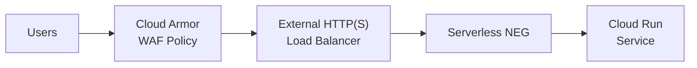

# How to Use Terraform to Configure Cloud Armor WAF Policies for a Cloud Run Service Behind a Load Balancer

Author: [nawazdhandala](https://www.github.com/nawazdhandala)

Tags: GCP, Terraform, Cloud Armor, Cloud Run, WAF, Security, Google Cloud Platform

Description: Configure Cloud Armor WAF policies with Terraform to protect a Cloud Run service behind a Google Cloud Load Balancer, including OWASP rules, rate limiting, and geo-blocking.

---

Cloud Run services are publicly accessible by default. While that is fine for development, production services need protection against common web attacks like SQL injection, cross-site scripting, and DDoS. Google Cloud Armor provides a Web Application Firewall (WAF) that sits in front of your load balancer and filters malicious traffic before it reaches your service.

The catch is that Cloud Armor only works with external HTTP(S) load balancers, not with Cloud Run's default URL. So you need to put your Cloud Run service behind a load balancer first, then attach Cloud Armor policies to it.

Let me walk through the full setup with Terraform.

## Architecture Overview



## Step 1: Deploy the Cloud Run Service

First, the Cloud Run service itself. Note that we set `ingress` to allow internal and load balancer traffic only - this prevents users from bypassing the WAF by hitting the Cloud Run URL directly:

```hcl
# cloud-run.tf - Deploy the service with restricted ingress

resource "google_cloud_run_v2_service" "app" {
  project  = var.project_id
  name     = "${var.environment}-app"
  location = var.region

  # Only allow traffic from internal sources and the load balancer
  ingress = "INGRESS_TRAFFIC_INTERNAL_AND_CLOUD_LOAD_BALANCING"

  template {
    containers {
      image = var.container_image

      resources {
        limits = {
          cpu    = "2"
          memory = "1Gi"
        }
      }
    }

    scaling {
      min_instance_count = 0
      max_instance_count = 10
    }
  }
}

# Allow unauthenticated access since auth is handled at the LB/WAF level
resource "google_cloud_run_v2_service_iam_member" "public" {
  project  = var.project_id
  location = var.region
  name     = google_cloud_run_v2_service.app.name
  role     = "roles/run.invoker"
  member   = "allUsers"
}
```

## Step 2: Create the Serverless NEG and Backend Service

The load balancer connects to Cloud Run through a serverless Network Endpoint Group (NEG):

```hcl
# neg.tf - Serverless NEG pointing to the Cloud Run service

resource "google_compute_region_network_endpoint_group" "cloud_run_neg" {
  project               = var.project_id
  name                  = "${var.environment}-cloud-run-neg"
  network_endpoint_type = "SERVERLESS"
  region                = var.region

  cloud_run {
    service = google_cloud_run_v2_service.app.name
  }
}

# Backend service that the load balancer routes traffic to
resource "google_compute_backend_service" "app" {
  project = var.project_id
  name    = "${var.environment}-app-backend"

  protocol    = "HTTP"
  port_name   = "http"
  timeout_sec = 30

  # Attach the Cloud Armor security policy
  security_policy = google_compute_security_policy.waf.id

  backend {
    group = google_compute_region_network_endpoint_group.cloud_run_neg.id
  }

  # Enable Cloud CDN for static content (optional)
  enable_cdn = false

  log_config {
    enable      = true
    sample_rate = 1.0
  }
}
```

## Step 3: Set Up the Load Balancer

The external HTTP(S) load balancer with SSL:

```hcl
# load-balancer.tf - External HTTP(S) Load Balancer

# Reserve a static external IP
resource "google_compute_global_address" "lb_ip" {
  project = var.project_id
  name    = "${var.environment}-lb-ip"
}

# URL map - routes all traffic to our backend service
resource "google_compute_url_map" "app" {
  project         = var.project_id
  name            = "${var.environment}-url-map"
  default_service = google_compute_backend_service.app.id
}

# Managed SSL certificate
resource "google_compute_managed_ssl_certificate" "app" {
  project = var.project_id
  name    = "${var.environment}-ssl-cert"

  managed {
    domains = [var.domain_name]
  }
}

# HTTPS target proxy
resource "google_compute_target_https_proxy" "app" {
  project          = var.project_id
  name             = "${var.environment}-https-proxy"
  url_map          = google_compute_url_map.app.id
  ssl_certificates = [google_compute_managed_ssl_certificate.app.id]
}

# Forwarding rule - maps the external IP to the proxy
resource "google_compute_global_forwarding_rule" "app" {
  project    = var.project_id
  name       = "${var.environment}-forwarding-rule"
  target     = google_compute_target_https_proxy.app.id
  port_range = "443"
  ip_address = google_compute_global_address.lb_ip.address
}

# HTTP to HTTPS redirect
resource "google_compute_url_map" "http_redirect" {
  project = var.project_id
  name    = "${var.environment}-http-redirect"

  default_url_redirect {
    https_redirect         = true
    redirect_response_code = "MOVED_PERMANENTLY_DEFAULT"
    strip_query            = false
  }
}

resource "google_compute_target_http_proxy" "redirect" {
  project = var.project_id
  name    = "${var.environment}-http-proxy"
  url_map = google_compute_url_map.http_redirect.id
}

resource "google_compute_global_forwarding_rule" "http_redirect" {
  project    = var.project_id
  name       = "${var.environment}-http-redirect-rule"
  target     = google_compute_target_http_proxy.redirect.id
  port_range = "80"
  ip_address = google_compute_global_address.lb_ip.address
}
```

## Step 4: Configure Cloud Armor WAF Policies

Now the main event - the Cloud Armor security policy with WAF rules:

```hcl
# cloud-armor.tf - WAF policy with OWASP rules, rate limiting, and geo-blocking

resource "google_compute_security_policy" "waf" {
  project = var.project_id
  name    = "${var.environment}-waf-policy"

  # Default rule - allow all traffic that passes other rules
  rule {
    action   = "allow"
    priority = "2147483647"

    match {
      versioned_expr = "SRC_IPS_V1"
      config {
        src_ip_ranges = ["*"]
      }
    }

    description = "Default allow rule"
  }

  # OWASP Top 10 protection - SQL injection
  rule {
    action   = "deny(403)"
    priority = 1000

    match {
      expr {
        expression = "evaluatePreconfiguredExpr('sqli-v33-stable')"
      }
    }

    description = "Block SQL injection attempts"
  }

  # OWASP Top 10 protection - Cross-site scripting
  rule {
    action   = "deny(403)"
    priority = 1001

    match {
      expr {
        expression = "evaluatePreconfiguredExpr('xss-v33-stable')"
      }
    }

    description = "Block XSS attempts"
  }

  # OWASP Top 10 protection - Local file inclusion
  rule {
    action   = "deny(403)"
    priority = 1002

    match {
      expr {
        expression = "evaluatePreconfiguredExpr('lfi-v33-stable')"
      }
    }

    description = "Block local file inclusion attempts"
  }

  # OWASP Top 10 protection - Remote file inclusion
  rule {
    action   = "deny(403)"
    priority = 1003

    match {
      expr {
        expression = "evaluatePreconfiguredExpr('rfi-v33-stable')"
      }
    }

    description = "Block remote file inclusion attempts"
  }

  # OWASP Top 10 protection - Remote code execution
  rule {
    action   = "deny(403)"
    priority = 1004

    match {
      expr {
        expression = "evaluatePreconfiguredExpr('rce-v33-stable')"
      }
    }

    description = "Block remote code execution attempts"
  }

  # OWASP Top 10 protection - Scanner detection
  rule {
    action   = "deny(403)"
    priority = 1005

    match {
      expr {
        expression = "evaluatePreconfiguredExpr('scannerdetection-v33-stable')"
      }
    }

    description = "Block known vulnerability scanners"
  }

  # Rate limiting - prevent abuse
  rule {
    action   = "rate_based_ban"
    priority = 2000

    match {
      versioned_expr = "SRC_IPS_V1"
      config {
        src_ip_ranges = ["*"]
      }
    }

    rate_limit_options {
      conform_action = "allow"
      exceed_action  = "deny(429)"

      rate_limit_threshold {
        count        = 100
        interval_sec = 60
      }

      ban_duration_sec = 300

      enforce_on_key = "IP"
    }

    description = "Rate limit to 100 requests per minute per IP"
  }

  # Geo-blocking - block traffic from specific countries if needed
  rule {
    action   = "deny(403)"
    priority = 3000

    match {
      expr {
        expression = "origin.region_code == 'XX'"
      }
    }

    description = "Geo-blocking rule (customize country codes as needed)"
    preview = true
  }
}
```

## Step 5: Adaptive Protection

Cloud Armor's Adaptive Protection uses machine learning to detect and respond to layer 7 DDoS attacks:

```hcl
# Add adaptive protection to the security policy
resource "google_compute_security_policy" "waf" {
  # ... previous rules ...

  adaptive_protection_config {
    layer_7_ddos_defense_config {
      enable = true

      # AUTO_DEPLOY automatically creates rules for detected attacks
      rule_visibility = "STANDARD"
    }
  }
}
```

## Variables

```hcl
# variables.tf
variable "project_id" {
  type = string
}

variable "region" {
  type    = string
  default = "us-central1"
}

variable "environment" {
  type = string
}

variable "container_image" {
  description = "Container image for the Cloud Run service"
  type        = string
}

variable "domain_name" {
  description = "Domain name for the SSL certificate"
  type        = string
}
```

## Testing Your WAF Rules

After deploying, test that the WAF rules are working:

```bash
# Test SQL injection blocking
curl -v "https://your-domain.com/?id=1' OR '1'='1"
# Should return 403

# Test XSS blocking
curl -v "https://your-domain.com/?q=<script>alert('xss')</script>"
# Should return 403

# Test normal request passes through
curl -v "https://your-domain.com/"
# Should return 200

# Check Cloud Armor logs
gcloud logging read \
  "resource.type=http_load_balancer AND jsonPayload.enforcedSecurityPolicy.name=${ENVIRONMENT}-waf-policy" \
  --project=your-project --limit=10
```

## Using Preview Mode

When you first deploy WAF rules, set them to preview mode. In preview mode, rules log what they would do without actually blocking traffic. This lets you check for false positives before enabling enforcement:

```hcl
rule {
  action   = "deny(403)"
  priority = 1000
  preview  = true  # Log only, do not block

  match {
    expr {
      expression = "evaluatePreconfiguredExpr('sqli-v33-stable')"
    }
  }
}
```

Review the logs for a few days, tune the rules, then set `preview = false` to enforce.

## Summary

Protecting a Cloud Run service with Cloud Armor requires several pieces working together - the serverless NEG, the external load balancer, the SSL certificate, and the security policy itself. The Terraform configuration in this post gives you OWASP protection, rate limiting, geo-blocking, and adaptive DDoS defense. Start with rules in preview mode, verify there are no false positives, and then enable enforcement for production traffic.
