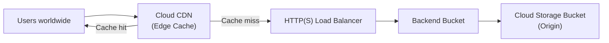

# How to Use Terraform to Configure Cloud CDN with a Cloud Storage Bucket Origin and Cache Invalidation

Author: [nawazdhandala](https://www.github.com/nawazdhandala)

Tags: GCP, Terraform, Cloud CDN, Cloud Storage, Performance, Google Cloud Platform

Description: Configure Google Cloud CDN with a Cloud Storage bucket as the origin using Terraform, including custom cache policies, signed URLs for private content, and automated cache invalidation.

---

Serving static assets - images, CSS, JavaScript, videos - directly from a Cloud Storage bucket works, but it can be slow for users far from the bucket's region. Cloud CDN caches your content at Google's edge locations around the world, reducing latency from hundreds of milliseconds to single-digit milliseconds for cached content.

Setting this up requires a load balancer in front of your storage bucket, with CDN enabled on the backend. Let me show you how to build this with Terraform, including the cache configuration and invalidation setup that most guides skip.

## Architecture



## Creating the Storage Bucket

The origin bucket holds your static content. Set it up with proper access controls and CORS if needed:

```hcl
# bucket.tf - Cloud Storage bucket serving as the CDN origin

resource "google_storage_bucket" "cdn_origin" {
  project                     = var.project_id
  name                        = "${var.project_id}-cdn-assets"
  location                    = var.region
  uniform_bucket_level_access = true
  force_destroy               = false

  # Enable versioning for rollback capability
  versioning {
    enabled = true
  }

  # Lifecycle rules to clean up old versions
  lifecycle_rule {
    condition {
      num_newer_versions = 3
      with_state         = "ARCHIVED"
    }
    action {
      type = "Delete"
    }
  }

  # CORS configuration for web applications
  cors {
    origin          = var.allowed_origins
    method          = ["GET", "HEAD", "OPTIONS"]
    response_header = ["Content-Type", "Cache-Control", "Content-Length"]
    max_age_seconds = 3600
  }

  # Website configuration for serving index and error pages
  website {
    main_page_suffix = "index.html"
    not_found_page   = "404.html"
  }
}

# Make the bucket publicly readable for CDN to serve content
resource "google_storage_bucket_iam_member" "public_read" {
  bucket = google_storage_bucket.cdn_origin.name
  role   = "roles/storage.objectViewer"
  member = "allUsers"
}
```

## Setting Up the Backend Bucket

A backend bucket connects the load balancer to the Cloud Storage bucket:

```hcl
# backend.tf - Backend bucket with CDN enabled

resource "google_compute_backend_bucket" "cdn" {
  project     = var.project_id
  name        = "${var.environment}-cdn-backend"
  bucket_name = google_storage_bucket.cdn_origin.name
  enable_cdn  = true

  # Custom CDN cache policy
  cdn_policy {
    # Cache mode determines how responses are cached
    # CACHE_ALL_STATIC caches common static file types automatically
    cache_mode = "CACHE_ALL_STATIC"

    # Default TTL for responses without a Cache-Control header (1 hour)
    default_ttl = 3600

    # Maximum TTL even if the origin sets a longer one (1 day)
    max_ttl = 86400

    # Client-facing TTL - what browsers see (1 hour)
    client_ttl = 3600

    # Cache negative responses (404s) for 5 minutes
    # Prevents origin from being hammered for missing files
    negative_caching = true
    negative_caching_policy {
      code = 404
      ttl  = 300
    }

    negative_caching_policy {
      code = 403
      ttl  = 60
    }

    # Serve stale content while revalidating in the background
    serve_while_stale = 86400

    # Cache key policy - what makes a cache entry unique
    cache_key_policy {
      # Include the query string so ?v=2 busts the cache
      include_query_string = true
    }
  }

  # Custom response headers
  custom_response_headers = [
    "X-CDN-Cache: {cdn_cache_status}",
    "X-Cache-ID: {cdn_cache_id}"
  ]
}
```

## Creating the Load Balancer

The HTTP(S) load balancer that sits in front of everything:

```hcl
# load-balancer.tf - External HTTP(S) Load Balancer for CDN

# Reserve a static IP for the CDN endpoint
resource "google_compute_global_address" "cdn" {
  project = var.project_id
  name    = "${var.environment}-cdn-ip"
}

# URL map routes requests to the backend bucket
resource "google_compute_url_map" "cdn" {
  project         = var.project_id
  name            = "${var.environment}-cdn-url-map"
  default_service = google_compute_backend_bucket.cdn.id

  # Optional: route specific paths to different backends
  host_rule {
    hosts        = [var.cdn_domain]
    path_matcher = "static-assets"
  }

  path_matcher {
    name            = "static-assets"
    default_service = google_compute_backend_bucket.cdn.id

    # Cache images aggressively
    path_rule {
      paths   = ["/images/*", "/img/*"]
      service = google_compute_backend_bucket.cdn.id

      route_action {
        cdn_policy {
          default_ttl = 86400
          max_ttl     = 604800
          client_ttl  = 86400
          cache_mode  = "FORCE_CACHE_ALL"
        }
      }
    }
  }
}

# Managed SSL certificate for the CDN domain
resource "google_compute_managed_ssl_certificate" "cdn" {
  project = var.project_id
  name    = "${var.environment}-cdn-ssl"

  managed {
    domains = [var.cdn_domain]
  }
}

# HTTPS proxy
resource "google_compute_target_https_proxy" "cdn" {
  project          = var.project_id
  name             = "${var.environment}-cdn-https-proxy"
  url_map          = google_compute_url_map.cdn.id
  ssl_certificates = [google_compute_managed_ssl_certificate.cdn.id]
}

# Forwarding rule
resource "google_compute_global_forwarding_rule" "cdn" {
  project    = var.project_id
  name       = "${var.environment}-cdn-forwarding-rule"
  target     = google_compute_target_https_proxy.cdn.id
  port_range = "443"
  ip_address = google_compute_global_address.cdn.address
}
```

## Signed URLs for Private Content

If some content should not be publicly accessible, use signed URLs with CDN:

```hcl
# signed-urls.tf - CDN signed URL configuration for private content

# Create a signing key for URL signing
resource "google_compute_backend_bucket_signed_url_key" "cdn_key" {
  project        = var.project_id
  name           = "${var.environment}-cdn-signing-key"
  key_value      = var.signing_key_base64
  backend_bucket = google_compute_backend_bucket.cdn.name
}
```

To use signed URLs, your application generates time-limited URLs:

```python
# Example Python code to generate a signed URL
# This runs in your application server, not in Terraform

import datetime
import hashlib
import hmac
import base64
from urllib.parse import urlparse, urlencode

def sign_url(url, key_name, key_value, expiration_time):
    """Generate a signed URL for Cloud CDN."""
    # Strip existing query parameters for signing
    parsed = urlparse(url)
    url_to_sign = f"{parsed.scheme}://{parsed.netloc}{parsed.path}"

    # Build the signed URL parameters
    expiration = int(expiration_time.timestamp())
    url_to_sign += f"?Expires={expiration}&KeyName={key_name}"

    # Create the signature
    decoded_key = base64.urlsafe_b64decode(key_value)
    signature = hmac.new(
        decoded_key,
        url_to_sign.encode("utf-8"),
        hashlib.sha1
    ).digest()

    encoded_sig = base64.urlsafe_b64encode(signature).decode("utf-8")
    return f"{url_to_sign}&Signature={encoded_sig}"
```

## Cache Invalidation

When you update content, you need to invalidate the CDN cache. Terraform cannot do this directly during apply (since it is an imperative action), but you can set up automated invalidation.

Using a Cloud Build trigger that invalidates cache on bucket updates:

```hcl
# invalidation.tf - Automated cache invalidation setup

# Cloud Function that invalidates CDN cache when bucket objects change
resource "google_cloudfunctions2_function" "cache_invalidator" {
  project  = var.project_id
  name     = "${var.environment}-cdn-invalidator"
  location = var.region

  build_config {
    runtime     = "python312"
    entry_point = "invalidate_cache"

    source {
      storage_source {
        bucket = google_storage_bucket.functions_source.name
        object = google_storage_bucket_object.invalidator_source.name
      }
    }
  }

  service_config {
    available_memory      = "256Mi"
    timeout_seconds       = 60
    service_account_email = google_service_account.invalidator.email

    environment_variables = {
      PROJECT_ID = var.project_id
      URL_MAP    = google_compute_url_map.cdn.name
    }
  }

  event_trigger {
    event_type   = "google.cloud.storage.object.v1.finalized"
    trigger_region = var.region

    event_filters {
      attribute = "bucket"
      value     = google_storage_bucket.cdn_origin.name
    }
  }
}

# Service account for the invalidator function
resource "google_service_account" "invalidator" {
  project      = var.project_id
  account_id   = "cdn-invalidator"
  display_name = "CDN Cache Invalidator"
}

# Permission to invalidate CDN cache
resource "google_project_iam_member" "invalidator_compute" {
  project = var.project_id
  role    = "roles/compute.loadBalancerAdmin"
  member  = "serviceAccount:${google_service_account.invalidator.email}"
}
```

The invalidation function code:

```python
# Cloud Function to invalidate CDN cache
import os
import functions_framework
from google.cloud import compute_v1

@functions_framework.cloud_event
def invalidate_cache(cloud_event):
    """Invalidate CDN cache when a storage object is updated."""
    data = cloud_event.data
    object_name = data["name"]

    project = os.environ["PROJECT_ID"]
    url_map = os.environ["URL_MAP"]

    # Build the path to invalidate
    path = f"/{object_name}"

    # Create the invalidation request
    client = compute_v1.UrlMapsClient()
    invalidation = compute_v1.CacheInvalidationRule(path=path)
    request = compute_v1.InvalidateCacheUrlMapRequest(
        project=project,
        url_map=url_map,
        cache_invalidation_rule_resource=invalidation,
    )

    operation = client.invalidate_cache(request=request)
    print(f"Cache invalidated for path: {path}")
```

## Manual Invalidation

For manual invalidation, use gcloud:

```bash
# Invalidate a specific path
gcloud compute url-maps invalidate-cdn-cache dev-cdn-url-map \
  --path="/css/main.css" \
  --project=my-project

# Invalidate everything under a directory
gcloud compute url-maps invalidate-cdn-cache dev-cdn-url-map \
  --path="/images/*" \
  --project=my-project

# Invalidate everything (nuclear option)
gcloud compute url-maps invalidate-cdn-cache dev-cdn-url-map \
  --path="/*" \
  --project=my-project
```

## Variables and Outputs

```hcl
# variables.tf
variable "project_id" { type = string }
variable "region" { type = string; default = "US" }
variable "environment" { type = string }
variable "cdn_domain" { type = string }
variable "allowed_origins" { type = list(string); default = ["*"] }
variable "signing_key_base64" { type = string; sensitive = true; default = "" }

# outputs.tf
output "cdn_ip_address" {
  value = google_compute_global_address.cdn.address
}

output "bucket_name" {
  value = google_storage_bucket.cdn_origin.name
}

output "cdn_url" {
  value = "https://${var.cdn_domain}"
}
```

## Summary

Cloud CDN with a Cloud Storage origin is a powerful combination for serving static content globally. The Terraform setup in this post gives you a proper CDN configuration with custom cache policies, signed URLs for private content, and automated cache invalidation when bucket objects change. The key decisions are choosing the right cache mode for your content type, setting appropriate TTLs to balance freshness and performance, and having a reliable invalidation strategy for when you need to update content immediately.
