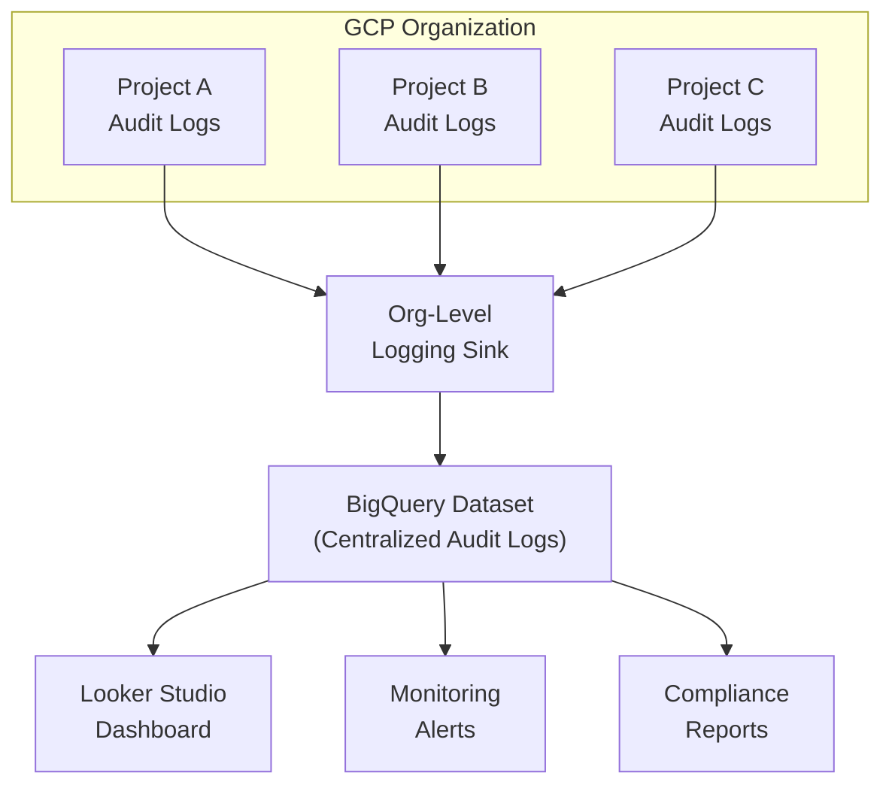

# How to Use Terraform to Configure Org-Level Logging Sinks That Export to BigQuery for Audit Analytics

Author: [nawazdhandala](https://www.github.com/nawazdhandala)

Tags: GCP, Terraform, Cloud Logging, BigQuery, Audit, Google Cloud Platform

Description: Configure organization-level logging sinks with Terraform to export GCP audit logs to BigQuery, enabling SQL-based analytics for compliance reporting and security investigations.

---

GCP generates audit logs for virtually every API call made across your organization. These logs are valuable for security investigations, compliance reporting, and understanding who did what and when. But by default, they are scattered across individual projects and retained for a limited time.

Organization-level logging sinks solve this by capturing audit logs from every project in your org and routing them to a centralized BigQuery dataset. With BigQuery, you can run SQL queries against your audit data, build dashboards, and set up alerts for suspicious activity.

Here is how to set this up with Terraform.

## Architecture



## Creating the BigQuery Dataset for Logs

First, create the BigQuery dataset that will receive the exported logs. This should be in a dedicated security or logging project:

```hcl
# bigquery.tf - BigQuery dataset for centralized audit logs

resource "google_bigquery_dataset" "audit_logs" {
  project    = var.logging_project_id
  dataset_id = "org_audit_logs"
  location   = var.region

  friendly_name = "Organization Audit Logs"
  description   = "Centralized audit logs from all GCP projects in the organization"

  # Keep audit logs for 2 years (730 days)
  default_table_expiration_ms     = 63072000000
  default_partition_expiration_ms = 63072000000

  # Restrict access to the security team
  access {
    role          = "OWNER"
    user_by_email = var.dataset_owner_email
  }

  access {
    role           = "READER"
    group_by_email = var.security_team_email
  }

  labels = {
    environment = "security"
    purpose     = "audit-logs"
    managed_by  = "terraform"
  }
}
```

## Creating the Organization-Level Logging Sink

The org-level sink captures logs from all projects. You need organization-level permissions to create this:

```hcl
# org-sink.tf - Organization-level logging sink

# Sink for admin activity audit logs
resource "google_logging_organization_sink" "admin_activity" {
  name             = "org-admin-activity-to-bigquery"
  org_id           = var.org_id
  destination      = "bigquery.googleapis.com/projects/${var.logging_project_id}/datasets/${google_bigquery_dataset.audit_logs.dataset_id}"
  include_children = true

  # Filter for admin activity audit logs
  # These capture resource creation, modification, and deletion
  filter = <<-FILTER
    logName:"cloudaudit.googleapis.com/activity"
  FILTER

  # Use partitioned tables for better query performance and cost
  bigquery_options {
    use_partitioned_tables = true
  }
}

# Sink for data access audit logs
resource "google_logging_organization_sink" "data_access" {
  name             = "org-data-access-to-bigquery"
  org_id           = var.org_id
  destination      = "bigquery.googleapis.com/projects/${var.logging_project_id}/datasets/${google_bigquery_dataset.audit_logs.dataset_id}"
  include_children = true

  # Filter for data access audit logs
  # These capture who read what data and when
  filter = <<-FILTER
    logName:"cloudaudit.googleapis.com/data_access"
  FILTER

  bigquery_options {
    use_partitioned_tables = true
  }
}

# Sink for system event audit logs
resource "google_logging_organization_sink" "system_events" {
  name             = "org-system-events-to-bigquery"
  org_id           = var.org_id
  destination      = "bigquery.googleapis.com/projects/${var.logging_project_id}/datasets/${google_bigquery_dataset.audit_logs.dataset_id}"
  include_children = true

  filter = <<-FILTER
    logName:"cloudaudit.googleapis.com/system_event"
  FILTER

  bigquery_options {
    use_partitioned_tables = true
  }
}

# Sink for policy denied audit logs
resource "google_logging_organization_sink" "policy_denied" {
  name             = "org-policy-denied-to-bigquery"
  org_id           = var.org_id
  destination      = "bigquery.googleapis.com/projects/${var.logging_project_id}/datasets/${google_bigquery_dataset.audit_logs.dataset_id}"
  include_children = true

  filter = <<-FILTER
    logName:"cloudaudit.googleapis.com/policy"
  FILTER

  bigquery_options {
    use_partitioned_tables = true
  }
}
```

## IAM for the Sink Service Account

Each logging sink creates a unique service account (called a writer identity) that needs permission to write to the destination:

```hcl
# iam.tf - Grant sink service accounts access to write to BigQuery

# Grant BigQuery data editor role to the admin activity sink's service account
resource "google_bigquery_dataset_iam_member" "admin_activity_writer" {
  project    = var.logging_project_id
  dataset_id = google_bigquery_dataset.audit_logs.dataset_id
  role       = "roles/bigquery.dataEditor"
  member     = google_logging_organization_sink.admin_activity.writer_identity
}

# Grant to data access sink
resource "google_bigquery_dataset_iam_member" "data_access_writer" {
  project    = var.logging_project_id
  dataset_id = google_bigquery_dataset.audit_logs.dataset_id
  role       = "roles/bigquery.dataEditor"
  member     = google_logging_organization_sink.data_access.writer_identity
}

# Grant to system events sink
resource "google_bigquery_dataset_iam_member" "system_events_writer" {
  project    = var.logging_project_id
  dataset_id = google_bigquery_dataset.audit_logs.dataset_id
  role       = "roles/bigquery.dataEditor"
  member     = google_logging_organization_sink.system_events.writer_identity
}

# Grant to policy denied sink
resource "google_bigquery_dataset_iam_member" "policy_denied_writer" {
  project    = var.logging_project_id
  dataset_id = google_bigquery_dataset.audit_logs.dataset_id
  role       = "roles/bigquery.dataEditor"
  member     = google_logging_organization_sink.policy_denied.writer_identity
}
```

## Enabling Data Access Audit Logs

Data access audit logs are disabled by default for most services because they generate high volume. Enable them selectively at the org level:

```hcl
# audit-config.tf - Enable data access logging at the organization level

resource "google_organization_iam_audit_config" "all_services" {
  org_id  = var.org_id
  service = "allServices"

  # Log all admin reads (viewing IAM policies, configs, etc.)
  audit_log_config {
    log_type = "ADMIN_READ"
  }

  # Log data reads for specific critical services
  audit_log_config {
    log_type = "DATA_READ"

    # Exempt service accounts that generate high-volume reads
    exempted_members = var.audit_exempt_members
  }

  # Log data writes
  audit_log_config {
    log_type = "DATA_WRITE"
  }
}

# Enable more detailed logging for specific sensitive services
resource "google_organization_iam_audit_config" "iam" {
  org_id  = var.org_id
  service = "iam.googleapis.com"

  audit_log_config {
    log_type = "ADMIN_READ"
  }

  audit_log_config {
    log_type = "DATA_READ"
  }

  audit_log_config {
    log_type = "DATA_WRITE"
  }
}

resource "google_organization_iam_audit_config" "storage" {
  org_id  = var.org_id
  service = "storage.googleapis.com"

  audit_log_config {
    log_type = "DATA_READ"
  }

  audit_log_config {
    log_type = "DATA_WRITE"
  }
}
```

## Useful BigQuery Queries for Audit Analytics

Once logs are flowing into BigQuery, here are some queries your security team will find useful.

Find all IAM policy changes across the organization:

```sql
-- Who changed IAM policies and when
SELECT
  timestamp,
  protopayload_auditlog.authenticationInfo.principalEmail AS actor,
  resource.labels.project_id AS project,
  protopayload_auditlog.methodName AS action,
  protopayload_auditlog.resourceName AS resource_name
FROM `logging_project.org_audit_logs.cloudaudit_googleapis_com_activity`
WHERE
  protopayload_auditlog.methodName LIKE '%SetIamPolicy%'
  AND timestamp > TIMESTAMP_SUB(CURRENT_TIMESTAMP(), INTERVAL 7 DAY)
ORDER BY timestamp DESC
LIMIT 100
```

Detect service account key creation events:

```sql
-- Service account key creation events (potential security risk)
SELECT
  timestamp,
  protopayload_auditlog.authenticationInfo.principalEmail AS creator,
  resource.labels.project_id AS project,
  protopayload_auditlog.resourceName AS service_account
FROM `logging_project.org_audit_logs.cloudaudit_googleapis_com_activity`
WHERE
  protopayload_auditlog.methodName = 'google.iam.admin.v1.CreateServiceAccountKey'
  AND timestamp > TIMESTAMP_SUB(CURRENT_TIMESTAMP(), INTERVAL 30 DAY)
ORDER BY timestamp DESC
```

Find resource deletions:

```sql
-- All resource deletions across the organization
SELECT
  timestamp,
  protopayload_auditlog.authenticationInfo.principalEmail AS actor,
  resource.labels.project_id AS project,
  protopayload_auditlog.methodName AS method,
  protopayload_auditlog.resourceName AS deleted_resource
FROM `logging_project.org_audit_logs.cloudaudit_googleapis_com_activity`
WHERE
  protopayload_auditlog.methodName LIKE '%delete%'
  OR protopayload_auditlog.methodName LIKE '%Delete%'
  AND timestamp > TIMESTAMP_SUB(CURRENT_TIMESTAMP(), INTERVAL 7 DAY)
ORDER BY timestamp DESC
LIMIT 500
```

## Creating Scheduled Queries for Reports

Automate reporting with scheduled queries:

```hcl
# scheduled-queries.tf - Automated audit reports

resource "google_bigquery_data_transfer_config" "weekly_iam_report" {
  project                = var.logging_project_id
  display_name           = "Weekly IAM Changes Report"
  data_source_id         = "scheduled_query"
  location               = var.region
  schedule               = "every monday 09:00"
  destination_dataset_id = google_bigquery_dataset.audit_reports.dataset_id

  params = {
    destination_table_name_template = "weekly_iam_changes_{run_date}"
    write_disposition               = "WRITE_TRUNCATE"
    query                           = <<-SQL
      SELECT
        DATE(timestamp) as date,
        protopayload_auditlog.authenticationInfo.principalEmail AS actor,
        resource.labels.project_id AS project,
        protopayload_auditlog.methodName AS action,
        COUNT(*) as change_count
      FROM `${var.logging_project_id}.org_audit_logs.cloudaudit_googleapis_com_activity`
      WHERE
        protopayload_auditlog.methodName LIKE '%SetIamPolicy%'
        AND timestamp > TIMESTAMP_SUB(CURRENT_TIMESTAMP(), INTERVAL 7 DAY)
      GROUP BY date, actor, project, action
      ORDER BY date DESC, change_count DESC
    SQL
  }

  service_account_name = google_service_account.bq_scheduler.email
}

resource "google_bigquery_dataset" "audit_reports" {
  project    = var.logging_project_id
  dataset_id = "audit_reports"
  location   = var.region

  default_table_expiration_ms = 7776000000  # 90 days
}

resource "google_service_account" "bq_scheduler" {
  project      = var.logging_project_id
  account_id   = "bq-audit-scheduler"
  display_name = "BigQuery Audit Report Scheduler"
}
```

## Variables

```hcl
# variables.tf
variable "org_id" {
  description = "GCP organization ID"
  type        = string
}

variable "logging_project_id" {
  description = "Project ID for the centralized logging project"
  type        = string
}

variable "region" {
  description = "BigQuery dataset region"
  type        = string
  default     = "US"
}

variable "dataset_owner_email" {
  description = "Email of the dataset owner"
  type        = string
}

variable "security_team_email" {
  description = "Email of the security team group"
  type        = string
}

variable "audit_exempt_members" {
  description = "Members exempt from data access audit logging"
  type        = list(string)
  default     = []
}
```

## Cost Considerations

Audit logs can generate significant volume, especially data access logs. A few ways to manage costs:

- Use inclusion filters on sinks to only capture the log types you need
- Set table expiration on the BigQuery dataset to automatically delete old data
- Use BigQuery partitioned tables (which the sink config enables) to reduce query costs
- Exempt high-volume, low-risk service accounts from data access logging

## Summary

Organization-level logging sinks with BigQuery export give your security team a powerful tool for audit analytics. Every IAM change, resource creation and deletion, and data access event across your entire GCP organization flows into BigQuery where it can be queried with SQL. The Terraform configuration in this post sets up the sinks, IAM permissions, and BigQuery dataset. Add the example queries and scheduled reports, and you have a solid foundation for compliance and security monitoring.
