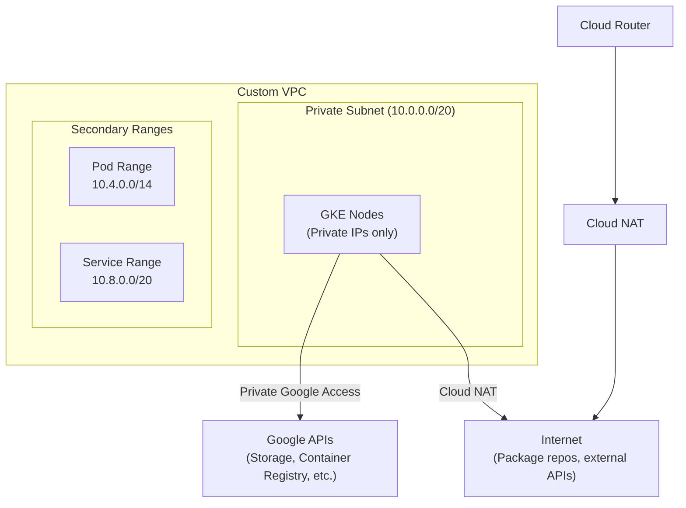

# How to Use Terraform to Create a VPC with Private Google Access and Cloud NAT for GKE

Author: [nawazdhandala](https://www.github.com/nawazdhandala)

Tags: GCP, Terraform, VPC, Cloud NAT, GKE, Google Cloud Platform

Description: Create a secure VPC network with Private Google Access and Cloud NAT using Terraform, designed to support GKE clusters that run without public IP addresses on their nodes.

---

When you run a GKE cluster in production, you want your nodes to have private IP addresses only. No public IPs means a smaller attack surface. But those nodes still need to pull container images, reach Google APIs, and occasionally download packages from the internet. That is where Private Google Access and Cloud NAT come in.

Private Google Access lets instances without external IP addresses reach Google APIs and services. Cloud NAT provides outbound internet connectivity for those same instances without exposing them to inbound traffic. Together, they give you the best of both worlds - private nodes that can still do everything they need to.

Here is how to set this up with Terraform.

## The Network Architecture

Before diving into code, let us understand what we are building:



## Creating the VPC and Subnet

Start with the VPC itself. For GKE, you need a custom-mode VPC with subnets that have secondary IP ranges for pods and services.

```hcl
# vpc.tf - Custom VPC with subnets configured for GKE
# Auto-create is disabled so we control the subnet configuration

resource "google_compute_network" "main" {
  project                 = var.project_id
  name                    = "${var.environment}-vpc"
  auto_create_subnetworks = false
  routing_mode            = "REGIONAL"
}

# Primary subnet for GKE nodes with secondary ranges for pods and services
resource "google_compute_subnetwork" "gke" {
  project       = var.project_id
  name          = "${var.environment}-gke-subnet"
  ip_cidr_range = "10.0.0.0/20"
  region        = var.region
  network       = google_compute_network.main.id

  # This is the key setting - allows instances without external IPs
  # to reach Google APIs through internal routing
  private_ip_google_access = true

  # Secondary ranges required by GKE for pod and service IPs
  secondary_ip_range {
    range_name    = "pods"
    ip_cidr_range = "10.4.0.0/14"
  }

  secondary_ip_range {
    range_name    = "services"
    ip_cidr_range = "10.8.0.0/20"
  }

  # Enable VPC Flow Logs for network debugging and security analysis
  log_config {
    aggregation_interval = "INTERVAL_5_SEC"
    flow_sampling        = 0.5
    metadata             = "INCLUDE_ALL_METADATA"
  }
}
```

A few things to note about the CIDR ranges. The primary range `/20` gives you 4,094 node IPs - plenty for most clusters. The pod range `/14` gives you over 250,000 pod IPs. The service range `/20` gives you 4,094 service IPs. Size these based on your expected workload.

## Setting Up Cloud Router

Cloud NAT requires a Cloud Router to function. The router handles the BGP routing that Cloud NAT uses under the hood.

```hcl
# router.tf - Cloud Router that Cloud NAT uses for routing
resource "google_compute_router" "main" {
  project = var.project_id
  name    = "${var.environment}-router"
  region  = var.region
  network = google_compute_network.main.id

  bgp {
    asn = 64514
  }
}
```

## Configuring Cloud NAT

Now the Cloud NAT gateway itself. This gives your private GKE nodes outbound internet access:

```hcl
# nat.tf - Cloud NAT configuration for outbound internet access
# Automatically allocates external IPs as needed

resource "google_compute_router_nat" "main" {
  project = var.project_id
  name    = "${var.environment}-nat"
  router  = google_compute_router.main.name
  region  = var.region

  # AUTO_ONLY lets Google manage the external IPs for NAT
  nat_ip_allocate_option             = "AUTO_ONLY"
  source_subnetwork_ip_ranges_to_nat = "LIST_OF_SUBNETWORKS"

  # Only NAT traffic from our GKE subnet
  subnetwork {
    name                    = google_compute_subnetwork.gke.id
    source_ip_ranges_to_nat = ["ALL_IP_RANGES"]
  }

  # Logging configuration - useful for debugging connectivity issues
  log_config {
    enable = true
    filter = "ERRORS_ONLY"
  }

  # Timeout settings tuned for typical application workloads
  min_ports_per_vm                 = 64
  udp_idle_timeout_sec             = 30
  icmp_idle_timeout_sec            = 30
  tcp_established_idle_timeout_sec = 1200
  tcp_transitory_idle_timeout_sec  = 30
}
```

Setting `source_subnetwork_ip_ranges_to_nat` to `LIST_OF_SUBNETWORKS` and then specifying only the GKE subnet is a best practice. It gives you explicit control over which subnets use NAT instead of applying it to everything.

## Firewall Rules

GKE needs certain firewall rules to function properly. Here are the essentials:

```hcl
# firewall.tf - Required firewall rules for GKE with private nodes

# Allow internal communication between all nodes in the VPC
resource "google_compute_firewall" "internal" {
  project = var.project_id
  name    = "${var.environment}-allow-internal"
  network = google_compute_network.main.name

  allow {
    protocol = "tcp"
  }

  allow {
    protocol = "udp"
  }

  allow {
    protocol = "icmp"
  }

  # Allow traffic within the node and pod CIDR ranges
  source_ranges = ["10.0.0.0/20", "10.4.0.0/14"]
}

# Allow the GKE control plane to reach kubelets and webhooks
resource "google_compute_firewall" "gke_master" {
  project = var.project_id
  name    = "${var.environment}-allow-gke-master"
  network = google_compute_network.main.name

  allow {
    protocol = "tcp"
    ports    = ["443", "10250"]
  }

  # The master CIDR is set when creating the GKE cluster
  source_ranges = [var.master_ipv4_cidr_block]
}
```

## Variables File

Here are the variables used across these resources:

```hcl
# variables.tf
variable "project_id" {
  description = "GCP project ID"
  type        = string
}

variable "environment" {
  description = "Environment name used in resource naming"
  type        = string
}

variable "region" {
  description = "GCP region for all resources"
  type        = string
  default     = "us-central1"
}

variable "master_ipv4_cidr_block" {
  description = "CIDR block for the GKE master network"
  type        = string
  default     = "172.16.0.0/28"
}
```

## Outputs for GKE

Export the values that the GKE module will need:

```hcl
# outputs.tf
output "network_id" {
  value = google_compute_network.main.id
}

output "network_self_link" {
  value = google_compute_network.main.self_link
}

output "subnet_id" {
  value = google_compute_subnetwork.gke.id
}

output "subnet_self_link" {
  value = google_compute_subnetwork.gke.self_link
}

output "pod_range_name" {
  value = "pods"
}

output "service_range_name" {
  value = "services"
}
```

## Creating the GKE Cluster

With the networking in place, here is how the GKE cluster references it:

```hcl
# gke.tf - Private GKE cluster using the VPC we created
resource "google_container_cluster" "primary" {
  project  = var.project_id
  name     = "${var.environment}-cluster"
  location = var.region

  network    = module.vpc.network_self_link
  subnetwork = module.vpc.subnet_self_link

  # Use the secondary ranges we defined in the subnet
  ip_allocation_policy {
    cluster_secondary_range_name  = module.vpc.pod_range_name
    services_secondary_range_name = module.vpc.service_range_name
  }

  # Private cluster configuration - nodes get private IPs only
  private_cluster_config {
    enable_private_nodes    = true
    enable_private_endpoint = false
    master_ipv4_cidr_block  = "172.16.0.0/28"
  }

  # Start with a default node pool then remove it
  # in favor of separately managed node pools
  remove_default_node_pool = true
  initial_node_count       = 1
}

# Separately managed node pool for better lifecycle control
resource "google_container_node_pool" "primary" {
  project    = var.project_id
  name       = "${var.environment}-node-pool"
  location   = var.region
  cluster    = google_container_cluster.primary.name
  node_count = var.node_count

  node_config {
    machine_type = var.machine_type

    # Minimal OAuth scopes - use Workload Identity instead
    oauth_scopes = [
      "https://www.googleapis.com/auth/cloud-platform"
    ]

    # No external IP on nodes - this is what makes them private
    metadata = {
      disable-legacy-endpoints = "true"
    }
  }
}
```

## Verifying the Setup

After applying the Terraform, verify that everything works correctly:

```bash
# Check that nodes have private IPs only
gcloud compute instances list --project=YOUR_PROJECT \
  --filter="name~gke" \
  --format="table(name, networkInterfaces[0].networkIP, networkInterfaces[0].accessConfigs[0].natIP)"

# The natIP column should be empty for all GKE nodes

# Test that Cloud NAT is working from inside a pod
kubectl run test-nat --image=curlimages/curl --rm -it -- \
  curl -s https://ifconfig.me
```

## Summary

This setup gives you a secure networking foundation for GKE. Your nodes stay private, Private Google Access handles communication with Google services without leaving Google's network, and Cloud NAT provides controlled outbound internet access. The Terraform code is modular enough to reuse across environments - just change the variables for different CIDR ranges, regions, or project IDs.
