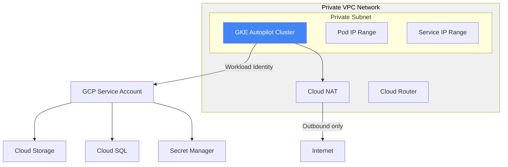

# How to Use Terraform to Deploy a GKE Autopilot Cluster with Workload Identity and Private Networking

Author: [nawazdhandala](https://www.github.com/nawazdhandala)

Tags: GCP, Terraform, GKE, Autopilot, Workload Identity, Kubernetes

Description: Deploy a production-ready GKE Autopilot cluster using Terraform with Workload Identity for secure service authentication and private networking.

---

GKE Autopilot is Google's fully managed Kubernetes offering. Unlike Standard mode where you manage node pools and machine types, Autopilot handles all of that for you. You deploy workloads, and Google figures out the infrastructure. Combined with Workload Identity for secure GCP service access and private networking for security, you get a production-ready Kubernetes cluster with minimal operational overhead.

Setting this up through Terraform gives you reproducible infrastructure that you can version control and apply across environments. Let me walk through the setup.

## What We Are Building



## Project Structure

```
terraform/
  main.tf
  variables.tf
  outputs.tf
  network.tf
  gke.tf
  iam.tf
  nat.tf
```

## Variables

```hcl
# variables.tf

variable "project_id" {
  description = "GCP project ID"
  type        = string
}

variable "region" {
  description = "GCP region"
  type        = string
  default     = "us-central1"
}

variable "cluster_name" {
  description = "Name of the GKE cluster"
  type        = string
  default     = "autopilot-cluster"
}

variable "network_name" {
  description = "Name of the VPC network"
  type        = string
  default     = "gke-network"
}

variable "subnet_cidr" {
  description = "CIDR range for the subnet"
  type        = string
  default     = "10.0.0.0/20"
}

variable "pods_cidr" {
  description = "Secondary CIDR range for pods"
  type        = string
  default     = "10.4.0.0/14"
}

variable "services_cidr" {
  description = "Secondary CIDR range for services"
  type        = string
  default     = "10.8.0.0/20"
}

variable "master_cidr" {
  description = "CIDR range for the control plane"
  type        = string
  default     = "172.16.0.0/28"
}

variable "authorized_networks" {
  description = "Networks allowed to access the cluster master"
  type = list(object({
    cidr_block   = string
    display_name = string
  }))
  default = []
}

variable "workload_service_accounts" {
  description = "Kubernetes service accounts to bind to GCP service accounts"
  type = map(object({
    namespace  = string
    k8s_sa     = string
    gcp_roles  = list(string)
  }))
  default = {}
}
```

## VPC Network

Private networking is essential for production clusters. This setup uses a custom VPC with secondary ranges for pods and services.

```hcl
# network.tf - VPC and subnet configuration

# Create a custom VPC network
resource "google_compute_network" "gke_network" {
  name                    = var.network_name
  project                 = var.project_id
  auto_create_subnetworks = false
  routing_mode            = "REGIONAL"
}

# Create a subnet with secondary ranges for GKE
resource "google_compute_subnetwork" "gke_subnet" {
  name          = "${var.network_name}-subnet"
  project       = var.project_id
  region        = var.region
  network       = google_compute_network.gke_network.id
  ip_cidr_range = var.subnet_cidr

  # Secondary ranges for pods and services
  secondary_ip_range {
    range_name    = "pods"
    ip_cidr_range = var.pods_cidr
  }

  secondary_ip_range {
    range_name    = "services"
    ip_cidr_range = var.services_cidr
  }

  # Enable private Google access for reaching GCP APIs
  private_ip_google_access = true

  log_config {
    aggregation_interval = "INTERVAL_5_SEC"
    flow_sampling        = 0.5
    metadata             = "INCLUDE_ALL_METADATA"
  }
}

# Firewall rules
resource "google_compute_firewall" "allow_internal" {
  name    = "${var.network_name}-allow-internal"
  project = var.project_id
  network = google_compute_network.gke_network.id

  allow {
    protocol = "tcp"
  }
  allow {
    protocol = "udp"
  }
  allow {
    protocol = "icmp"
  }

  # Allow traffic within the VPC
  source_ranges = [var.subnet_cidr, var.pods_cidr, var.services_cidr]
}
```

## Cloud NAT

Since the cluster is private, nodes need Cloud NAT for outbound internet access (pulling container images, etc.).

```hcl
# nat.tf - Cloud NAT for outbound internet access

resource "google_compute_router" "router" {
  name    = "${var.network_name}-router"
  project = var.project_id
  region  = var.region
  network = google_compute_network.gke_network.id
}

resource "google_compute_router_nat" "nat" {
  name    = "${var.network_name}-nat"
  project = var.project_id
  region  = var.region
  router  = google_compute_router.router.name

  nat_ip_allocate_option             = "AUTO_ONLY"
  source_subnetwork_ip_ranges_to_nat = "ALL_SUBNETWORKS_ALL_IP_RANGES"

  log_config {
    enable = true
    filter = "ERRORS_ONLY"
  }
}
```

## GKE Autopilot Cluster

Here is the main cluster definition.

```hcl
# gke.tf - GKE Autopilot cluster configuration

resource "google_container_cluster" "autopilot" {
  name     = var.cluster_name
  project  = var.project_id
  location = var.region

  # Enable Autopilot mode
  enable_autopilot = true

  # Network configuration
  network    = google_compute_network.gke_network.id
  subnetwork = google_compute_subnetwork.gke_subnet.id

  ip_allocation_policy {
    cluster_secondary_range_name  = "pods"
    services_secondary_range_name = "services"
  }

  # Private cluster configuration
  private_cluster_config {
    enable_private_nodes    = true
    enable_private_endpoint = false  # Set to true for fully private clusters
    master_ipv4_cidr_block  = var.master_cidr

    master_global_access_config {
      enabled = true
    }
  }

  # Master authorized networks
  dynamic "master_authorized_networks_config" {
    for_each = length(var.authorized_networks) > 0 ? [1] : []
    content {
      dynamic "cidr_blocks" {
        for_each = var.authorized_networks
        content {
          cidr_block   = cidr_blocks.value.cidr_block
          display_name = cidr_blocks.value.display_name
        }
      }
    }
  }

  # Workload Identity - this is the key security feature
  workload_identity_config {
    workload_pool = "${var.project_id}.svc.id.goog"
  }

  # Release channel for automatic upgrades
  release_channel {
    channel = "REGULAR"
  }

  # Maintenance window - weekday nights
  maintenance_policy {
    recurring_window {
      start_time = "2026-01-01T02:00:00Z"
      end_time   = "2026-01-01T06:00:00Z"
      recurrence = "FREQ=WEEKLY;BYDAY=TU,WE,TH"
    }
  }

  # Cluster-level logging and monitoring
  logging_config {
    enable_components = ["SYSTEM_COMPONENTS", "WORKLOADS"]
  }

  monitoring_config {
    enable_components = ["SYSTEM_COMPONENTS"]
    managed_prometheus {
      enabled = true
    }
  }

  # Binary Authorization for container security
  binary_authorization {
    evaluation_mode = "PROJECT_SINGLETON_POLICY_ENFORCE"
  }

  # DNS config for internal service discovery
  dns_config {
    cluster_dns        = "CLOUD_DNS"
    cluster_dns_scope  = "CLUSTER_SCOPE"
    cluster_dns_domain = "cluster.local"
  }

  deletion_protection = true
}
```

## Workload Identity IAM

Workload Identity lets Kubernetes service accounts act as GCP service accounts without managing keys.

```hcl
# iam.tf - Workload Identity bindings

# Create GCP service accounts for each workload
resource "google_service_account" "workload_sa" {
  for_each = var.workload_service_accounts

  account_id   = each.key
  display_name = "Workload Identity SA for ${each.key}"
  project      = var.project_id
}

# Grant the required GCP roles to each service account
resource "google_project_iam_member" "workload_roles" {
  for_each = {
    for pair in flatten([
      for sa_key, sa in var.workload_service_accounts : [
        for role in sa.gcp_roles : {
          key  = "${sa_key}-${role}"
          sa   = sa_key
          role = role
        }
      ]
    ]) : pair.key => pair
  }

  project = var.project_id
  role    = each.value.role
  member  = "serviceAccount:${google_service_account.workload_sa[each.value.sa].email}"
}

# Bind Kubernetes service accounts to GCP service accounts
resource "google_service_account_iam_member" "workload_identity" {
  for_each = var.workload_service_accounts

  service_account_id = google_service_account.workload_sa[each.key].name
  role               = "roles/iam.workloadIdentityUser"
  member             = "serviceAccount:${var.project_id}.svc.id.goog[${each.value.namespace}/${each.value.k8s_sa}]"
}
```

## Outputs

```hcl
# outputs.tf

output "cluster_name" {
  description = "The name of the GKE cluster"
  value       = google_container_cluster.autopilot.name
}

output "cluster_endpoint" {
  description = "The cluster API endpoint"
  value       = google_container_cluster.autopilot.endpoint
  sensitive   = true
}

output "cluster_ca_certificate" {
  description = "The cluster CA certificate"
  value       = google_container_cluster.autopilot.master_auth[0].cluster_ca_certificate
  sensitive   = true
}

output "workload_service_account_emails" {
  description = "Email addresses of the workload service accounts"
  value = {
    for k, v in google_service_account.workload_sa : k => v.email
  }
}

output "get_credentials_command" {
  description = "Command to get cluster credentials"
  value       = "gcloud container clusters get-credentials ${var.cluster_name} --region ${var.region} --project ${var.project_id}"
}
```

## Usage Example

```hcl
# environments/production/main.tf

module "gke_cluster" {
  source = "../../modules/gke-autopilot"

  project_id   = "my-production-project"
  region       = "us-central1"
  cluster_name = "production-cluster"

  authorized_networks = [
    {
      cidr_block   = "203.0.113.0/24"
      display_name = "Office VPN"
    }
  ]

  workload_service_accounts = {
    api-service = {
      namespace = "default"
      k8s_sa    = "api-service"
      gcp_roles = [
        "roles/cloudsql.client",
        "roles/secretmanager.secretAccessor",
      ]
    }
    worker-service = {
      namespace = "workers"
      k8s_sa    = "worker"
      gcp_roles = [
        "roles/storage.objectViewer",
        "roles/pubsub.subscriber",
      ]
    }
  }
}
```

## Wrapping Up

GKE Autopilot with Terraform gives you a production-ready Kubernetes cluster with minimal operational burden. Workload Identity eliminates the need for service account key files, and private networking keeps your cluster secure. This Terraform configuration is a solid starting point - extend it with additional features like backup policies, network policies, or custom monitoring as your needs evolve.

For monitoring your GKE cluster and the workloads running on it, OneUptime can provide uptime checks, performance metrics, and alerting that gives you visibility into your Kubernetes infrastructure.
