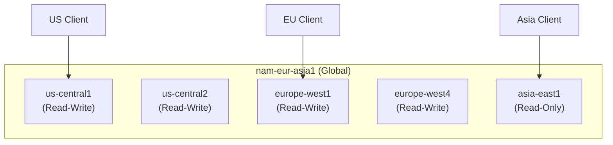

# How to Use Terraform to Deploy a Multi-Region Cloud Spanner Instance with Fine-Grained Access Control

Author: [nawazdhandala](https://www.github.com/nawazdhandala)

Tags: GCP, Terraform, Cloud Spanner, Multi-Region, Database, Google Cloud Platform

Description: Deploy a multi-region Cloud Spanner instance with Terraform, including database creation, schema management, fine-grained IAM access control, and backup configuration.

---

Cloud Spanner is Google's globally distributed, strongly consistent database. It gives you the scalability of NoSQL with the ACID guarantees of a relational database. The multi-region configuration makes it ideal for applications that need low-latency reads and writes across geographies with automatic failover.

Deploying Spanner with Terraform lets you manage the instance, databases, schemas, and access controls as code. Let me walk through a production-grade setup.

## Understanding Spanner Multi-Region Configurations

Spanner offers several multi-region configurations, each with different trade-offs between latency, availability, and cost:



The most common multi-region options are:
- `nam14` - Three regions in North America
- `eur6` - Three regions in Europe
- `nam-eur-asia1` - Global coverage across continents
- `nam7` - Four regions in North America (higher availability)

## Creating the Spanner Instance

Here is the Terraform configuration for a multi-region Spanner instance:

```hcl
# spanner.tf - Multi-region Cloud Spanner instance

resource "google_spanner_instance" "main" {
  project      = var.project_id
  name         = "${var.environment}-spanner"
  display_name = "${title(var.environment)} Spanner Instance"

  # Multi-region configuration
  # nam-eur-asia1 provides global coverage
  config = "nam-eur-asia1"

  # Processing units determine capacity
  # 1000 processing units = 1 node
  # Minimum is 100 for multi-region (1000 for production)
  processing_units = var.processing_units

  # Autoscaling configuration for dynamic workloads
  autoscaling_config {
    autoscaling_limits {
      min_processing_units = var.min_processing_units
      max_processing_units = var.max_processing_units
    }

    autoscaling_targets {
      # Target CPU utilization percentage (65-90 recommended)
      high_priority_cpu_utilization_percent = 65

      # Target storage utilization percentage
      storage_utilization_percent = 90
    }
  }

  labels = {
    environment = var.environment
    team        = var.team
    managed_by  = "terraform"
  }
}
```

## Creating Databases and Tables

Spanner databases are created within instances, and you can manage schemas through Terraform:

```hcl
# database.tf - Spanner database with schema

resource "google_spanner_database" "app" {
  project  = var.project_id
  instance = google_spanner_instance.main.name
  name     = "app-database"

  # Database dialect - GoogleSQL or PostgreSQL
  database_dialect = "GOOGLE_STANDARD_SQL"

  # DDL statements to create the schema
  # These run in order during database creation
  ddl = [
    # Users table with UUID primary key
    <<-SQL
      CREATE TABLE Users (
        UserId STRING(36) NOT NULL,
        Email STRING(256) NOT NULL,
        DisplayName STRING(256),
        CreatedAt TIMESTAMP NOT NULL OPTIONS (allow_commit_timestamp=true),
        UpdatedAt TIMESTAMP OPTIONS (allow_commit_timestamp=true),
        IsActive BOOL NOT NULL DEFAULT (true),
      ) PRIMARY KEY (UserId)
    SQL
    ,

    # Index for email lookups
    "CREATE UNIQUE INDEX UsersByEmail ON Users(Email)",

    # Orders table interleaved with Users for co-located storage
    <<-SQL
      CREATE TABLE Orders (
        UserId STRING(36) NOT NULL,
        OrderId STRING(36) NOT NULL,
        Status STRING(20) NOT NULL,
        TotalAmountCents INT64 NOT NULL,
        Currency STRING(3) NOT NULL DEFAULT ('USD'),
        CreatedAt TIMESTAMP NOT NULL OPTIONS (allow_commit_timestamp=true),
      ) PRIMARY KEY (UserId, OrderId),
        INTERLEAVE IN PARENT Users ON DELETE CASCADE
    SQL
    ,

    # Index for orders by status
    "CREATE INDEX OrdersByStatus ON Orders(Status)",

    # Order items interleaved with Orders
    <<-SQL
      CREATE TABLE OrderItems (
        UserId STRING(36) NOT NULL,
        OrderId STRING(36) NOT NULL,
        ItemId STRING(36) NOT NULL,
        ProductId STRING(36) NOT NULL,
        Quantity INT64 NOT NULL,
        PriceCents INT64 NOT NULL,
      ) PRIMARY KEY (UserId, OrderId, ItemId),
        INTERLEAVE IN PARENT Orders ON DELETE CASCADE
    SQL
  ]

  # Prevent accidental deletion
  deletion_protection = true

  # Enable version retention for point-in-time recovery
  version_retention_period = "7d"

  # Drop protection prevents database deletion even with Terraform destroy
  enable_drop_protection = true
}
```

## Fine-Grained IAM Access Control

Spanner supports IAM at the instance, database, and even table level. Here is how to set up access for different teams:

```hcl
# iam.tf - Fine-grained access control for Spanner

# Service account for the application
resource "google_service_account" "app" {
  project      = var.project_id
  account_id   = "spanner-app"
  display_name = "Application Spanner Access"
}

# Application gets read/write access to the database
resource "google_spanner_database_iam_member" "app_user" {
  project  = var.project_id
  instance = google_spanner_instance.main.name
  database = google_spanner_database.app.name
  role     = "roles/spanner.databaseUser"
  member   = "serviceAccount:${google_service_account.app.email}"
}

# Read-only service account for analytics
resource "google_service_account" "analytics" {
  project      = var.project_id
  account_id   = "spanner-analytics"
  display_name = "Analytics Spanner Read Access"
}

resource "google_spanner_database_iam_member" "analytics_reader" {
  project  = var.project_id
  instance = google_spanner_instance.main.name
  database = google_spanner_database.app.name
  role     = "roles/spanner.databaseReader"
  member   = "serviceAccount:${google_service_account.analytics.email}"
}

# Admin access for the DBA team - instance level
resource "google_spanner_instance_iam_member" "dba_admin" {
  project  = var.project_id
  instance = google_spanner_instance.main.name
  role     = "roles/spanner.admin"
  member   = "group:dba-team@myorg.com"
}

# Fine-grained access using IAM conditions
# Allow a service account to read only during business hours
resource "google_spanner_database_iam_member" "batch_reader" {
  project  = var.project_id
  instance = google_spanner_instance.main.name
  database = google_spanner_database.app.name
  role     = "roles/spanner.databaseReader"
  member   = "serviceAccount:${google_service_account.batch_processor.email}"

  condition {
    title       = "business-hours-only"
    description = "Allow access only during business hours UTC"
    expression  = "request.time.getHours('UTC') >= 8 && request.time.getHours('UTC') <= 18"
  }
}

resource "google_service_account" "batch_processor" {
  project      = var.project_id
  account_id   = "spanner-batch"
  display_name = "Batch Processor Spanner Access"
}
```

## Database-Level Fine-Grained Access Control

Spanner also supports fine-grained access at the table and column level using database roles:

```hcl
# fine-grained-access.tf - Table and column-level access control

# Create database roles using DDL
resource "google_spanner_database" "app" {
  # ... previous config ...

  ddl = [
    # ... previous DDL statements ...,

    # Create a database role for analysts with restricted access
    "CREATE ROLE analyst",

    # Grant SELECT on specific tables only
    "GRANT SELECT ON TABLE Users TO ROLE analyst",
    "GRANT SELECT ON TABLE Orders TO ROLE analyst",

    # Revoke access to sensitive columns
    # Analysts can see orders but not the full user details
    "GRANT SELECT(UserId, Email, IsActive) ON TABLE Users TO ROLE analyst",

    # Create a role for the order processing service
    "CREATE ROLE order_service",

    # Full access to Orders and OrderItems
    "GRANT SELECT, INSERT, UPDATE, DELETE ON TABLE Orders TO ROLE order_service",
    "GRANT SELECT, INSERT, UPDATE, DELETE ON TABLE OrderItems TO ROLE order_service",

    # Read-only access to Users (for lookups)
    "GRANT SELECT ON TABLE Users TO ROLE order_service",
  ]
}

# Bind the database role to an IAM member
resource "google_spanner_database_iam_member" "analyst_role" {
  project  = var.project_id
  instance = google_spanner_instance.main.name
  database = google_spanner_database.app.name
  role     = "roles/spanner.fineGrainedAccessUser"
  member   = "group:analysts@myorg.com"

  condition {
    title      = "analyst-role"
    expression = "resource.type == 'spanner.googleapis.com/DatabaseRole' && resource.name.endsWith('/analyst')"
  }
}
```

## Backup Configuration

Automated backups are critical for any database:

```hcl
# backup.tf - Automated backup schedule for Spanner

resource "google_spanner_backup_schedule" "daily" {
  project  = var.project_id
  instance = google_spanner_instance.main.name
  database = google_spanner_database.app.name
  name     = "daily-backup"

  retention_duration = "2592000s"  # 30 days

  spec {
    cron_spec {
      # Run daily at 2 AM UTC
      text = "0 2 * * *"
    }
  }

  # Full backup type
  full_backup_spec {}
}
```

## Monitoring and Alerting

Set up monitoring for key Spanner metrics:

```hcl
# monitoring.tf - Alerts for Spanner health

# Alert when CPU utilization is too high
resource "google_monitoring_alert_policy" "spanner_cpu" {
  project      = var.project_id
  display_name = "Spanner CPU Utilization High"

  conditions {
    display_name = "CPU utilization over 80%"

    condition_threshold {
      filter          = "resource.type = \"spanner_instance\" AND resource.labels.instance_id = \"${google_spanner_instance.main.name}\" AND metric.type = \"spanner.googleapis.com/instance/cpu/utilization\""
      comparison      = "COMPARISON_GT"
      threshold_value = 0.8
      duration        = "300s"

      aggregations {
        alignment_period   = "60s"
        per_series_aligner = "ALIGN_MEAN"
      }
    }
  }

  notification_channels = var.notification_channels
}

# Alert when storage is approaching limit
resource "google_monitoring_alert_policy" "spanner_storage" {
  project      = var.project_id
  display_name = "Spanner Storage Utilization High"

  conditions {
    display_name = "Storage over 80%"

    condition_threshold {
      filter          = "resource.type = \"spanner_instance\" AND resource.labels.instance_id = \"${google_spanner_instance.main.name}\" AND metric.type = \"spanner.googleapis.com/instance/storage/utilization\""
      comparison      = "COMPARISON_GT"
      threshold_value = 0.8
      duration        = "300s"

      aggregations {
        alignment_period   = "60s"
        per_series_aligner = "ALIGN_MEAN"
      }
    }
  }

  notification_channels = var.notification_channels
}
```

## Variables and Outputs

```hcl
# variables.tf
variable "project_id" { type = string }
variable "environment" { type = string }
variable "team" { type = string; default = "platform" }
variable "processing_units" { type = number; default = 1000 }
variable "min_processing_units" { type = number; default = 1000 }
variable "max_processing_units" { type = number; default = 5000 }
variable "notification_channels" { type = list(string); default = [] }

# outputs.tf
output "instance_id" {
  value = google_spanner_instance.main.name
}

output "database_id" {
  value = google_spanner_database.app.name
}

output "app_service_account_email" {
  value = google_service_account.app.email
}
```

## Cost Considerations

Spanner pricing has three components: compute (processing units), storage, and network. Multi-region configurations cost significantly more than single-region. For example, `nam-eur-asia1` costs roughly 9x more per processing unit than a single-region setup.

Start with the smallest multi-region configuration that meets your latency requirements. Use autoscaling so you only pay for what you need. And make sure to set up budget alerts - a runaway Spanner instance can get expensive fast.

## Summary

Deploying Cloud Spanner with Terraform gives you a reproducible, version-controlled setup for one of GCP's most powerful databases. The multi-region configuration provides global consistency and high availability. Fine-grained access control at the instance, database, table, and column level ensures that different teams and services see only the data they need. Combined with automated backups and monitoring, you get a production-grade Spanner deployment that is both secure and maintainable.
