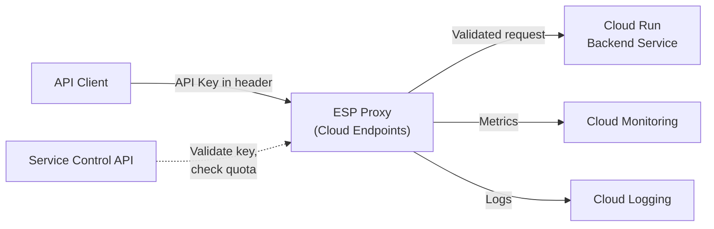

# How to Use Terraform to Deploy Cloud Endpoints with OpenAPI Specification and API Key Authentication

Author: [nawazdhandala](https://www.github.com/nawazdhandala)

Tags: GCP, Terraform, Cloud Endpoints, OpenAPI, API Management, Google Cloud Platform

Description: Deploy Google Cloud Endpoints with Terraform using an OpenAPI specification for API definition, configure API key authentication, and set up rate limiting and monitoring for your API.

---

If you are building APIs on GCP, Cloud Endpoints gives you API management features - authentication, rate limiting, monitoring, and documentation - without running a separate API gateway. It works by deploying an Extensible Service Proxy (ESP) alongside your backend that validates requests before they reach your service.

Managing Cloud Endpoints with Terraform means your API configuration is versioned and reproducible. Let me show you how to set it up with an OpenAPI spec and API key authentication.

## How Cloud Endpoints Works



The ESP proxy sits in front of your backend. It validates API keys, checks rate limits, and reports metrics - all before the request touches your application code.

## The OpenAPI Specification

Start with the OpenAPI (Swagger) spec that defines your API. This file describes every endpoint, its parameters, and the authentication requirements:

```hcl
# Create the OpenAPI spec as a template so we can inject the backend URL
locals {
  openapi_spec = templatefile("${path.module}/openapi.yaml.tpl", {
    backend_url  = google_cloud_run_v2_service.backend.uri
    project_id   = var.project_id
    service_name = var.api_service_name
  })
}
```

Here is the OpenAPI spec template:

```yaml
# openapi.yaml.tpl - API definition with authentication
swagger: "2.0"
info:
  title: "My API"
  description: "Production API with Cloud Endpoints"
  version: "1.0.0"
host: "${service_name}"
basePath: "/"
schemes:
  - "https"
produces:
  - "application/json"
consumes:
  - "application/json"

# Security definitions - API key authentication
securityDefinitions:
  api_key:
    type: "apiKey"
    name: "x-api-key"
    in: "header"

# Apply API key requirement globally
security:
  - api_key: []

# Backend configuration
x-google-backend:
  address: "${backend_url}"
  protocol: "h2"

# API endpoints
paths:
  /health:
    get:
      summary: "Health check"
      operationId: "healthCheck"
      # Health check does not require authentication
      security: []
      responses:
        200:
          description: "Service is healthy"

  /api/v1/users:
    get:
      summary: "List users"
      operationId: "listUsers"
      parameters:
        - name: "page"
          in: "query"
          type: "integer"
          default: 1
        - name: "limit"
          in: "query"
          type: "integer"
          default: 20
      responses:
        200:
          description: "List of users"
        401:
          description: "Invalid or missing API key"

    post:
      summary: "Create user"
      operationId: "createUser"
      parameters:
        - name: "body"
          in: "body"
          required: true
          schema:
            type: "object"
            required:
              - "name"
              - "email"
            properties:
              name:
                type: "string"
              email:
                type: "string"
                format: "email"
      responses:
        201:
          description: "User created"
        400:
          description: "Invalid request body"
        401:
          description: "Invalid or missing API key"

  /api/v1/users/{user_id}:
    get:
      summary: "Get user by ID"
      operationId: "getUser"
      parameters:
        - name: "user_id"
          in: "path"
          type: "string"
          required: true
      responses:
        200:
          description: "User details"
        404:
          description: "User not found"

    put:
      summary: "Update user"
      operationId: "updateUser"
      parameters:
        - name: "user_id"
          in: "path"
          type: "string"
          required: true
        - name: "body"
          in: "body"
          required: true
          schema:
            type: "object"
            properties:
              name:
                type: "string"
              email:
                type: "string"
      responses:
        200:
          description: "User updated"
        404:
          description: "User not found"

    delete:
      summary: "Delete user"
      operationId: "deleteUser"
      parameters:
        - name: "user_id"
          in: "path"
          type: "string"
          required: true
      responses:
        204:
          description: "User deleted"
        404:
          description: "User not found"
```

## Deploying the Cloud Endpoints Service

The Endpoints service configuration is deployed using the `google_endpoints_service` resource:

```hcl
# endpoints.tf - Cloud Endpoints service deployment

# Enable required APIs
resource "google_project_service" "endpoints" {
  for_each = toset([
    "servicemanagement.googleapis.com",
    "servicecontrol.googleapis.com",
    "endpoints.googleapis.com",
  ])

  project = var.project_id
  service = each.value

  disable_dependent_services = false
  disable_on_destroy         = false
}

# Deploy the OpenAPI spec as a Cloud Endpoints service
resource "google_endpoints_service" "api" {
  project      = var.project_id
  service_name = var.api_service_name
  openapi_config = local.openapi_spec

  depends_on = [google_project_service.endpoints]
}
```

## Backend Cloud Run Service with ESP

Deploy the backend service with the ESP sidecar:

```hcl
# cloud-run.tf - Backend service with ESP proxy

resource "google_cloud_run_v2_service" "backend" {
  project  = var.project_id
  name     = "${var.environment}-api-backend"
  location = var.region
  ingress  = "INGRESS_TRAFFIC_ALL"

  template {
    containers {
      # ESP proxy container
      name  = "esp"
      image = "gcr.io/endpoints-release/endpoints-runtime-serverless:2"

      env {
        name  = "ENDPOINTS_SERVICE_NAME"
        value = var.api_service_name
      }

      env {
        name  = "ESPv2_ARGS"
        value = "--cors_preset=cors_with_regex --cors_allow_origin_regex=.*"
      }

      ports {
        container_port = 8080
      }

      startup_probe {
        http_get {
          path = "/health"
          port = 8080
        }
        initial_delay_seconds = 5
        period_seconds        = 5
      }
    }

    containers {
      # Your actual backend application
      name  = "backend"
      image = var.backend_image

      env {
        name  = "PORT"
        value = "8081"
      }

      ports {
        container_port = 8081
      }
    }

    scaling {
      min_instance_count = var.min_instances
      max_instance_count = var.max_instances
    }
  }
}

# Allow public access (authentication is handled by ESP)
resource "google_cloud_run_v2_service_iam_member" "public" {
  project  = var.project_id
  location = var.region
  name     = google_cloud_run_v2_service.backend.name
  role     = "roles/run.invoker"
  member   = "allUsers"
}
```

## API Key Management

Create API keys for consumers:

```hcl
# api-keys.tf - API key creation and management

# API key for the mobile app
resource "google_apikeys_key" "mobile_app" {
  project      = var.project_id
  name         = "mobile-app-key"
  display_name = "Mobile Application API Key"

  restrictions {
    # Restrict to specific APIs
    api_targets {
      service = google_endpoints_service.api.service_name
    }

    # Restrict to specific Android apps
    android_key_restrictions {
      allowed_applications {
        package_name     = "com.myorg.mobileapp"
        sha1_fingerprint = var.android_sha1_fingerprint
      }
    }
  }
}

# API key for a third-party partner
resource "google_apikeys_key" "partner" {
  project      = var.project_id
  name         = "partner-acme-key"
  display_name = "Partner ACME Corp API Key"

  restrictions {
    api_targets {
      service = google_endpoints_service.api.service_name

      # Restrict which methods the partner can call
      methods = [
        "GET /api/v1/users",
        "GET /api/v1/users/{user_id}",
      ]
    }

    # Restrict to specific IP ranges
    server_key_restrictions {
      allowed_ips = var.partner_ip_ranges
    }
  }
}

# API key for internal services
resource "google_apikeys_key" "internal" {
  project      = var.project_id
  name         = "internal-services-key"
  display_name = "Internal Services API Key"

  restrictions {
    api_targets {
      service = google_endpoints_service.api.service_name
    }

    server_key_restrictions {
      allowed_ips = ["10.0.0.0/8"]
    }
  }
}
```

## Rate Limiting with Service Control

Configure quota limits per API key:

```yaml
# Add to openapi.yaml.tpl - Rate limiting configuration

x-google-management:
  metrics:
    - name: "read-requests"
      displayName: "Read requests"
      valueType: INT64
      metricKind: DELTA
    - name: "write-requests"
      displayName: "Write requests"
      valueType: INT64
      metricKind: DELTA

  quota:
    limits:
      - name: "read-limit"
        metric: "read-requests"
        unit: "1/min/{project}"
        values:
          STANDARD: 100

      - name: "write-limit"
        metric: "write-requests"
        unit: "1/min/{project}"
        values:
          STANDARD: 20

paths:
  /api/v1/users:
    get:
      x-google-quota:
        metricCosts:
          read-requests: 1
    post:
      x-google-quota:
        metricCosts:
          write-requests: 1
```

## Monitoring

Cloud Endpoints automatically reports metrics to Cloud Monitoring. Set up alerts for important conditions:

```hcl
# monitoring.tf - API monitoring alerts

# Alert on high error rate
resource "google_monitoring_alert_policy" "api_errors" {
  project      = var.project_id
  display_name = "API Error Rate High"

  conditions {
    display_name = "5xx error rate above 5%"

    condition_threshold {
      filter = <<-FILTER
        resource.type = "api"
        AND resource.labels.service = "${var.api_service_name}"
        AND metric.type = "serviceruntime.googleapis.com/api/producer/by_consumer/error_count"
      FILTER

      comparison      = "COMPARISON_GT"
      threshold_value = 5
      duration        = "300s"

      aggregations {
        alignment_period   = "60s"
        per_series_aligner = "ALIGN_RATE"
      }
    }
  }

  notification_channels = var.notification_channels
}

# Alert on high latency
resource "google_monitoring_alert_policy" "api_latency" {
  project      = var.project_id
  display_name = "API Latency High"

  conditions {
    display_name = "P95 latency above 2 seconds"

    condition_threshold {
      filter = <<-FILTER
        resource.type = "api"
        AND resource.labels.service = "${var.api_service_name}"
        AND metric.type = "serviceruntime.googleapis.com/api/producer/total_latencies"
      FILTER

      comparison      = "COMPARISON_GT"
      threshold_value = 2000
      duration        = "300s"

      aggregations {
        alignment_period     = "60s"
        per_series_aligner   = "ALIGN_PERCENTILE_95"
      }
    }
  }

  notification_channels = var.notification_channels
}
```

## Variables and Outputs

```hcl
# variables.tf
variable "project_id" { type = string }
variable "region" { type = string; default = "us-central1" }
variable "environment" { type = string }
variable "api_service_name" { type = string }
variable "backend_image" { type = string }
variable "min_instances" { type = number; default = 0 }
variable "max_instances" { type = number; default = 10 }
variable "notification_channels" { type = list(string); default = [] }
variable "android_sha1_fingerprint" { type = string; default = "" }
variable "partner_ip_ranges" { type = list(string); default = [] }

# outputs.tf
output "api_url" {
  value = google_cloud_run_v2_service.backend.uri
}

output "service_name" {
  value = google_endpoints_service.api.service_name
}

output "mobile_api_key" {
  value     = google_apikeys_key.mobile_app.key_string
  sensitive = true
}
```

## Testing

Test the API with and without an API key:

```bash
# Without API key - should get 401
curl -s https://your-api-url.com/api/v1/users
# Response: {"code": 401, "message": "UNAUTHENTICATED"}

# With valid API key - should get 200
curl -s -H "x-api-key: YOUR_API_KEY" https://your-api-url.com/api/v1/users

# Health check - no key needed
curl -s https://your-api-url.com/health
```

## Summary

Cloud Endpoints with Terraform gives you a managed API gateway for your GCP services. The OpenAPI spec defines your API contract, API keys control access, rate limiting prevents abuse, and built-in monitoring tracks everything automatically. The ESP proxy handles all of this without any changes to your backend application code - it just sees clean, validated requests.
