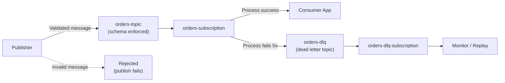

# How to Use Terraform to Deploy Pub/Sub Topics with Schema Validation and Dead Letter Queues

Author: [nawazdhandala](https://www.github.com/nawazdhandala)

Tags: GCP, Terraform, Pub/Sub, Messaging, Google Cloud Platform

Description: Deploy Google Cloud Pub/Sub topics and subscriptions with schema validation and dead letter queues using Terraform to ensure message quality and handle processing failures gracefully.

---

Pub/Sub is the backbone of event-driven architectures on GCP. But without proper guardrails, it is easy to end up with a topic that accepts any garbage data and a subscriber that silently drops messages it cannot process. Schema validation ensures publishers send well-formed messages. Dead letter queues catch messages that fail processing so you can investigate and replay them.

Let me show you how to set both of these up with Terraform.

## What We Are Building



## Defining the Schema

Pub/Sub supports Avro and Protocol Buffer schemas. Avro is more common for Pub/Sub because it handles schema evolution well. Here is how to create an Avro schema with Terraform:

```hcl
# schema.tf - Pub/Sub schema for message validation
# Using Avro format which supports schema evolution

resource "google_pubsub_schema" "order_events" {
  project    = var.project_id
  name       = "order-events-schema"
  type       = "AVRO"

  # Avro schema definition - validates message structure
  definition = jsonencode({
    type = "record"
    name = "OrderEvent"
    fields = [
      {
        name = "order_id"
        type = "string"
      },
      {
        name = "customer_id"
        type = "string"
      },
      {
        name = "event_type"
        type = {
          type    = "enum"
          name    = "EventType"
          symbols = ["CREATED", "UPDATED", "CANCELLED", "COMPLETED"]
        }
      },
      {
        name = "amount_cents"
        type = "long"
      },
      {
        name = "currency"
        type = "string"
      },
      {
        name = "timestamp"
        type = {
          type        = "long"
          logicalType = "timestamp-millis"
        }
      },
      {
        name    = "metadata"
        type    = ["null", { type = "map", values = "string" }]
        default = null
      }
    ]
  })
}
```

## Creating the Main Topic with Schema Validation

With the schema defined, create the topic and attach the schema:

```hcl
# topic.tf - Pub/Sub topic with schema validation enabled

resource "google_pubsub_topic" "orders" {
  project = var.project_id
  name    = "${var.environment}-orders"

  # Attach the schema for validation
  schema_settings {
    schema   = google_pubsub_schema.order_events.id
    encoding = "JSON"
  }

  # Retain messages for 7 days even after acknowledgment
  # Useful for replaying messages or debugging
  message_retention_duration = "604800s"

  # Labels for organization
  labels = {
    environment = var.environment
    team        = "orders"
  }
}
```

The `encoding` field determines whether messages are validated as JSON or binary Avro. JSON is easier to debug since you can read the messages in the console, but binary Avro is more compact for high-throughput topics.

## Setting Up the Dead Letter Topic

The dead letter queue is just another Pub/Sub topic. Messages that fail processing get forwarded here automatically:

```hcl
# dlq.tf - Dead letter topic and its subscription

# Dead letter topic receives messages that failed processing
resource "google_pubsub_topic" "orders_dlq" {
  project = var.project_id
  name    = "${var.environment}-orders-dlq"

  # Keep dead letter messages for 14 days
  message_retention_duration = "1209600s"

  labels = {
    environment = var.environment
    team        = "orders"
    purpose     = "dead-letter-queue"
  }
}

# Subscription on the dead letter topic for monitoring and replay
resource "google_pubsub_subscription" "orders_dlq" {
  project = var.project_id
  name    = "${var.environment}-orders-dlq-sub"
  topic   = google_pubsub_topic.orders_dlq.name

  # Long ack deadline since DLQ messages are handled manually
  ack_deadline_seconds = 600

  # Keep messages available for 14 days
  message_retention_duration = "1209600s"

  # Do not expire this subscription
  expiration_policy {
    ttl = ""
  }

  # Retain acknowledged messages so they can be replayed
  retain_acked_messages = true

  labels = {
    environment = var.environment
    purpose     = "dead-letter-monitoring"
  }
}
```

## Creating the Main Subscription with Dead Letter Policy

Now the subscription that connects consumers to the orders topic, configured with a dead letter policy:

```hcl
# subscription.tf - Main subscription with dead letter policy

resource "google_pubsub_subscription" "orders" {
  project = var.project_id
  name    = "${var.environment}-orders-sub"
  topic   = google_pubsub_topic.orders.name

  # How long the subscriber has to acknowledge a message
  ack_deadline_seconds = 60

  # Retry configuration for failed messages
  retry_policy {
    # Start with 10 second delay between retries
    minimum_backoff = "10s"
    # Cap at 10 minutes between retries
    maximum_backoff = "600s"
  }

  # Dead letter policy - forward to DLQ after 5 failed attempts
  dead_letter_policy {
    dead_letter_topic     = google_pubsub_topic.orders_dlq.id
    max_delivery_attempts = 5
  }

  # Message ordering if you need it (requires a key on publish)
  enable_message_ordering = false

  # Exactly-once delivery for critical messages
  enable_exactly_once_delivery = true

  # Keep messages for 7 days if not acknowledged
  message_retention_duration = "604800s"

  # Do not auto-expire the subscription
  expiration_policy {
    ttl = ""
  }

  labels = {
    environment = var.environment
    team        = "orders"
  }
}
```

## IAM Configuration

Pub/Sub needs specific IAM permissions for dead letter forwarding to work:

```hcl
# iam.tf - Service account permissions for Pub/Sub

# Service account for the subscriber application
resource "google_service_account" "orders_subscriber" {
  project      = var.project_id
  account_id   = "orders-subscriber"
  display_name = "Orders Pub/Sub Subscriber"
}

# The subscriber needs permission to consume messages
resource "google_pubsub_subscription_iam_member" "subscriber" {
  project      = var.project_id
  subscription = google_pubsub_subscription.orders.name
  role         = "roles/pubsub.subscriber"
  member       = "serviceAccount:${google_service_account.orders_subscriber.email}"
}

# The Pub/Sub service account needs permission to publish to the DLQ
# and subscribe to the source subscription for forwarding
resource "google_pubsub_topic_iam_member" "dlq_publisher" {
  project = var.project_id
  topic   = google_pubsub_topic.orders_dlq.name
  role    = "roles/pubsub.publisher"
  member  = "serviceAccount:service-${data.google_project.current.number}@gcp-sa-pubsub.iam.gserviceaccount.com"
}

resource "google_pubsub_subscription_iam_member" "dlq_subscriber" {
  project      = var.project_id
  subscription = google_pubsub_subscription.orders.name
  role         = "roles/pubsub.subscriber"
  member       = "serviceAccount:service-${data.google_project.current.number}@gcp-sa-pubsub.iam.gserviceaccount.com"
}

data "google_project" "current" {
  project_id = var.project_id
}
```

The IAM setup for dead letter queues is the part most people forget. Without granting the Pub/Sub service agent permission to publish to the DLQ topic and subscribe to the source subscription, dead letter forwarding silently fails.

## Push Subscription Alternative

If you want Pub/Sub to push messages to an HTTP endpoint instead of your app pulling them:

```hcl
# push-subscription.tf - Push-based subscription to a Cloud Run endpoint

resource "google_pubsub_subscription" "orders_push" {
  project = var.project_id
  name    = "${var.environment}-orders-push-sub"
  topic   = google_pubsub_topic.orders.name

  ack_deadline_seconds = 60

  push_config {
    push_endpoint = var.cloud_run_endpoint

    # Authenticate push requests with an OIDC token
    oidc_token {
      service_account_email = google_service_account.orders_subscriber.email
    }

    # Custom attributes added to the HTTP request
    attributes = {
      x-custom-header = "orders-processor"
    }
  }

  dead_letter_policy {
    dead_letter_topic     = google_pubsub_topic.orders_dlq.id
    max_delivery_attempts = 5
  }

  retry_policy {
    minimum_backoff = "10s"
    maximum_backoff = "600s"
  }
}
```

## Testing Schema Validation

After deploying, test that schema validation works:

```bash
# This should succeed - valid message
gcloud pubsub topics publish dev-orders \
  --project=my-project \
  --message='{"order_id":"ord-123","customer_id":"cust-456","event_type":"CREATED","amount_cents":5000,"currency":"USD","timestamp":1708185600000}'

# This should fail - missing required field
gcloud pubsub topics publish dev-orders \
  --project=my-project \
  --message='{"order_id":"ord-123"}'
# Expected: INVALID_ARGUMENT error

# This should fail - invalid enum value
gcloud pubsub topics publish dev-orders \
  --project=my-project \
  --message='{"order_id":"ord-123","customer_id":"cust-456","event_type":"INVALID","amount_cents":5000,"currency":"USD","timestamp":1708185600000}'
# Expected: INVALID_ARGUMENT error
```

## Monitoring Dead Letter Queues

Set up alerting on your dead letter queue to catch processing issues:

```hcl
# monitoring.tf - Alert when messages land in the DLQ

resource "google_monitoring_alert_policy" "dlq_messages" {
  project      = var.project_id
  display_name = "Orders DLQ Messages"

  conditions {
    display_name = "DLQ message count"

    condition_threshold {
      filter     = "resource.type = \"pubsub_subscription\" AND resource.labels.subscription_id = \"${var.environment}-orders-dlq-sub\" AND metric.type = \"pubsub.googleapis.com/subscription/num_undelivered_messages\""
      comparison = "COMPARISON_GT"

      threshold_value = 0
      duration        = "60s"

      aggregations {
        alignment_period   = "60s"
        per_series_aligner = "ALIGN_MAX"
      }
    }
  }

  notification_channels = var.notification_channels

  alert_strategy {
    auto_close = "86400s"
  }
}
```

## Summary

Schema validation and dead letter queues are two features that belong in every production Pub/Sub setup. Schemas catch malformed messages at publish time rather than letting them flow through your system and cause errors downstream. Dead letter queues ensure that messages which fail processing are preserved for investigation and replay instead of being lost. The Terraform configuration in this post sets up both features along with proper IAM permissions and monitoring, giving you a reliable messaging foundation on GCP.
