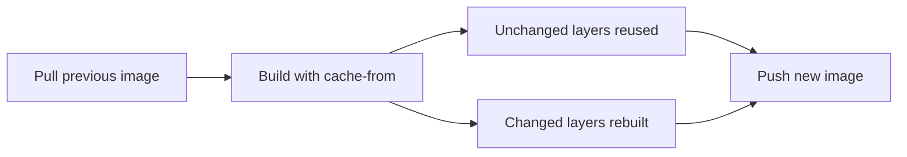

# How to Use the cache-from Flag in Cloud Build to Reuse Docker Image Layers

Author: [nawazdhandala](https://www.github.com/nawazdhandala)

Tags: GCP, Cloud Build, Docker, Cache, Build Optimization, CI/CD

Description: Learn how to use Docker's cache-from flag in Google Cloud Build to pull previous image layers and speed up your container builds.

---

Cloud Build starts every build with a clean slate - no Docker daemon cache, no leftover layers from previous runs. This means every `docker build` does everything from scratch, which is slow and wasteful when most of your Dockerfile layers have not changed. The `--cache-from` flag tells Docker to use a previously built image as a cache source, letting it skip layers that match. In this post, I will show you how to implement this in Cloud Build and when it makes sense compared to other caching strategies.

## How cache-from Works

When you run `docker build` locally, Docker caches every layer it builds. On your next build, it checks each layer's inputs (the Dockerfile instruction and the files it references) against the cache. If nothing changed, it reuses the cached layer.

In Cloud Build, there is no persistent Docker daemon between builds, so this local cache does not exist. The `--cache-from` flag works around this by pulling a specified image from a registry and using its layers as the cache source.

The flow looks like this:



Docker compares each layer in the Dockerfile against the layers in the cache-from image. If a layer matches, it skips building it. Once a layer differs, all subsequent layers are rebuilt (just like normal Docker caching behavior).

## Basic Implementation

Here is a cloudbuild.yaml that implements cache-from:

```yaml
# Cloud Build configuration with cache-from for layer reuse
steps:
  # Step 1: Pull the previous image to use as cache
  - name: 'gcr.io/cloud-builders/docker'
    id: 'pull-cache'
    entrypoint: 'bash'
    args:
      - '-c'
      - |
        # Pull the latest image for cache; ignore failure if image does not exist yet
        docker pull gcr.io/$PROJECT_ID/my-app:latest || true

  # Step 2: Build the new image using the pulled image as cache source
  - name: 'gcr.io/cloud-builders/docker'
    id: 'build'
    args:
      - 'build'
      - '--cache-from'
      - 'gcr.io/$PROJECT_ID/my-app:latest'
      - '-t'
      - 'gcr.io/$PROJECT_ID/my-app:$SHORT_SHA'
      - '-t'
      - 'gcr.io/$PROJECT_ID/my-app:latest'
      - '.'

images:
  - 'gcr.io/$PROJECT_ID/my-app:$SHORT_SHA'
  - 'gcr.io/$PROJECT_ID/my-app:latest'
```

Let me break down what happens:

1. The first step pulls the `latest` tag of the image from the registry. The `|| true` ensures the build does not fail if the image does not exist yet (first build).
2. The second step runs `docker build` with `--cache-from` pointing to the pulled image. Docker checks each layer against the cached image's layers.
3. The built image is pushed with both a commit-specific tag and the `latest` tag, so the next build can use it as cache.

## Making It Work with Multi-Stage Dockerfiles

If your Dockerfile uses multi-stage builds, `--cache-from` only caches the final stage by default. To cache intermediate stages, you need to build and push them separately:

```dockerfile
# Multi-stage Dockerfile with a build stage and runtime stage
FROM node:20 AS builder
WORKDIR /app
COPY package*.json ./
RUN npm ci
COPY . .
RUN npm run build

FROM node:20-alpine AS runtime
WORKDIR /app
COPY --from=builder /app/dist ./dist
COPY --from=builder /app/node_modules ./node_modules
EXPOSE 8080
CMD ["node", "dist/server.js"]
```

The cloudbuild.yaml needs to handle both stages:

```yaml
# Cache both stages of a multi-stage Dockerfile
steps:
  # Pull the cached builder stage
  - name: 'gcr.io/cloud-builders/docker'
    id: 'pull-builder-cache'
    entrypoint: 'bash'
    args:
      - '-c'
      - 'docker pull gcr.io/$PROJECT_ID/my-app:builder || true'

  # Pull the cached runtime stage
  - name: 'gcr.io/cloud-builders/docker'
    id: 'pull-runtime-cache'
    entrypoint: 'bash'
    args:
      - '-c'
      - 'docker pull gcr.io/$PROJECT_ID/my-app:latest || true'

  # Build the builder stage with cache
  - name: 'gcr.io/cloud-builders/docker'
    id: 'build-builder'
    args:
      - 'build'
      - '--target'
      - 'builder'
      - '--cache-from'
      - 'gcr.io/$PROJECT_ID/my-app:builder'
      - '-t'
      - 'gcr.io/$PROJECT_ID/my-app:builder'
      - '.'

  # Build the final image using both cached stages
  - name: 'gcr.io/cloud-builders/docker'
    id: 'build-final'
    args:
      - 'build'
      - '--cache-from'
      - 'gcr.io/$PROJECT_ID/my-app:builder'
      - '--cache-from'
      - 'gcr.io/$PROJECT_ID/my-app:latest'
      - '-t'
      - 'gcr.io/$PROJECT_ID/my-app:$SHORT_SHA'
      - '-t'
      - 'gcr.io/$PROJECT_ID/my-app:latest'
      - '.'

images:
  - 'gcr.io/$PROJECT_ID/my-app:builder'
  - 'gcr.io/$PROJECT_ID/my-app:$SHORT_SHA'
  - 'gcr.io/$PROJECT_ID/my-app:latest'
```

This pushes the builder stage as a separate image so it can be used as cache in the next build. The final build step uses both the builder cache and the previous runtime cache.

## Using BuildKit with cache-from

Docker BuildKit (the modern build engine) supports an enhanced `--cache-from` syntax that works with external cache manifests. To enable BuildKit in Cloud Build:

```yaml
# Enable BuildKit for enhanced caching features
steps:
  - name: 'gcr.io/cloud-builders/docker'
    id: 'pull-cache'
    entrypoint: 'bash'
    args:
      - '-c'
      - 'docker pull gcr.io/$PROJECT_ID/my-app:latest || true'

  - name: 'gcr.io/cloud-builders/docker'
    id: 'build'
    env:
      - 'DOCKER_BUILDKIT=1'
    args:
      - 'build'
      - '--build-arg'
      - 'BUILDKIT_INLINE_CACHE=1'
      - '--cache-from'
      - 'gcr.io/$PROJECT_ID/my-app:latest'
      - '-t'
      - 'gcr.io/$PROJECT_ID/my-app:$SHORT_SHA'
      - '-t'
      - 'gcr.io/$PROJECT_ID/my-app:latest'
      - '.'

images:
  - 'gcr.io/$PROJECT_ID/my-app:$SHORT_SHA'
  - 'gcr.io/$PROJECT_ID/my-app:latest'
```

The key addition is `--build-arg BUILDKIT_INLINE_CACHE=1`. This tells BuildKit to embed cache metadata directly in the built image. When this image is later used as a `--cache-from` source, BuildKit can match layers more effectively because it has richer metadata about what went into each layer.

## Branch-Based Caching Strategy

For projects with feature branches, you might want to use branch-specific cache images:

```yaml
# Use branch-specific and main cache images
steps:
  # Try to pull cache from the current branch first, fall back to main
  - name: 'gcr.io/cloud-builders/docker'
    id: 'pull-cache'
    entrypoint: 'bash'
    args:
      - '-c'
      - |
        # Try branch-specific cache first
        docker pull gcr.io/$PROJECT_ID/my-app:cache-$BRANCH_NAME || \
        # Fall back to main branch cache
        docker pull gcr.io/$PROJECT_ID/my-app:cache-main || true

  # Build with all available cache sources
  - name: 'gcr.io/cloud-builders/docker'
    id: 'build'
    args:
      - 'build'
      - '--cache-from'
      - 'gcr.io/$PROJECT_ID/my-app:cache-$BRANCH_NAME'
      - '--cache-from'
      - 'gcr.io/$PROJECT_ID/my-app:cache-main'
      - '-t'
      - 'gcr.io/$PROJECT_ID/my-app:$SHORT_SHA'
      - '-t'
      - 'gcr.io/$PROJECT_ID/my-app:cache-$BRANCH_NAME'
      - '.'

images:
  - 'gcr.io/$PROJECT_ID/my-app:$SHORT_SHA'
  - 'gcr.io/$PROJECT_ID/my-app:cache-$BRANCH_NAME'
```

This way, feature branch builds use their own cache when available, falling back to the main branch cache when the feature branch does not have one yet.

## Performance Considerations

The cache-from approach has a significant tradeoff: you need to pull the entire previous image before the build starts. For large images, this pull can take 30-60 seconds. The caching only saves time if the layers you skip take longer to build than the time spent pulling the cache image.

Here is a rough decision framework:

- **Image size is small (under 500MB), build is fast (under 2 min)** - cache-from might not save time. The pull overhead eats into the savings.
- **Image has heavy dependency installation (5+ min)** - cache-from is worth it. Skipping `npm install` or `pip install` easily makes up for the pull time.
- **Image is very large (2GB+)** - Consider Kaniko instead. Kaniko caches individual layers, so it does not need to pull the entire image.

## Measuring Cache Effectiveness

Add timing to your build steps to measure the impact:

```yaml
# Measure build time with and without cache
steps:
  - name: 'gcr.io/cloud-builders/docker'
    id: 'pull-cache'
    entrypoint: 'bash'
    args:
      - '-c'
      - |
        START=$(date +%s)
        docker pull gcr.io/$PROJECT_ID/my-app:latest || true
        END=$(date +%s)
        echo "Cache pull took $((END-START)) seconds"

  - name: 'gcr.io/cloud-builders/docker'
    id: 'build'
    entrypoint: 'bash'
    args:
      - '-c'
      - |
        START=$(date +%s)
        docker build \
          --cache-from gcr.io/$PROJECT_ID/my-app:latest \
          -t gcr.io/$PROJECT_ID/my-app:$SHORT_SHA \
          -t gcr.io/$PROJECT_ID/my-app:latest \
          .
        END=$(date +%s)
        echo "Build took $((END-START)) seconds"

images:
  - 'gcr.io/$PROJECT_ID/my-app:$SHORT_SHA'
  - 'gcr.io/$PROJECT_ID/my-app:latest'
```

Compare the total time (pull + build) against builds without cache-from to see if it is actually faster.

## Cleaning Up Old Cache Images

Over time, cache images accumulate in your registry. Set up a cleanup policy to remove old ones:

```bash
# Delete cache images older than 30 days from Artifact Registry
gcloud artifacts docker images list \
  us-central1-docker.pkg.dev/my-project/my-repo/my-app \
  --include-tags \
  --filter="createTime < '2024-01-01'" \
  --format="value(DIGEST)" | \
while read digest; do
  gcloud artifacts docker images delete \
    "us-central1-docker.pkg.dev/my-project/my-repo/my-app@${digest}" \
    --quiet
done
```

For Artifact Registry, you can also set up automatic cleanup policies in the repository settings.

## Wrapping Up

The cache-from flag is the simplest way to add layer caching to your Cloud Build Docker builds. It requires no additional tools - just pull the previous image and reference it in your build command. For multi-stage builds, cache each stage separately. For the best results, structure your Dockerfile to maximize layer reuse and always measure the actual time savings to make sure the pull overhead is worth it. If you find that cache-from is not fast enough, consider Kaniko for more granular layer-level caching.
