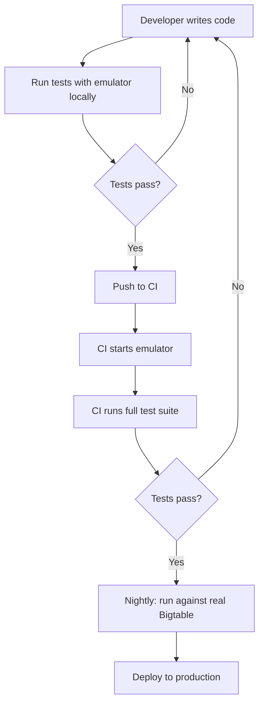

# How to Use the Cloud Bigtable Emulator for Local Development and Testing

Author: [nawazdhandala](https://www.github.com/nawazdhandala)

Tags: GCP, Cloud Bigtable, Emulator, Local Development, Testing

Description: Set up and use the Cloud Bigtable emulator for local development and testing, eliminating the need for a real Bigtable instance during development cycles.

---

Running tests against a real Cloud Bigtable instance is slow and expensive. Every read and write costs money, tests depend on network connectivity, and if multiple developers share the same instance, they can step on each other's data. The Cloud Bigtable emulator solves all of these problems by giving you a local, in-memory Bigtable that runs on your machine.

I use the emulator constantly during development. It starts in under a second, runs entirely on localhost, and supports the full Bigtable API surface. In this post, I will show you how to set it up, write tests against it, and integrate it into your CI/CD pipeline.

## Installing the Emulator

The Bigtable emulator comes bundled with the Google Cloud SDK. If you have `gcloud` installed, you already have it.

```bash
# Install the Bigtable emulator component via gcloud
gcloud components install bigtable

# Verify the installation
gcloud emulators bigtable --help
```

If you prefer Docker, you can also run the emulator in a container:

```bash
# Run the Bigtable emulator in a Docker container
docker run -p 8086:8086 google/cloud-sdk:latest \
  gcloud beta emulators bigtable start --host-port=0.0.0.0:8086
```

## Starting the Emulator

Launch the emulator with a single command:

```bash
# Start the Bigtable emulator on the default port (8086)
gcloud beta emulators bigtable start
```

By default, it listens on `localhost:8086`. You can change the port if needed:

```bash
# Start the emulator on a custom port
gcloud beta emulators bigtable start --host-port=localhost:9035
```

The emulator runs in the foreground and stores everything in memory. When you stop it, all data is gone. This is actually a feature - every test run starts with a clean slate.

## Configuring Your Application to Use the Emulator

The Bigtable client libraries detect the emulator through the `BIGTABLE_EMULATOR_HOST` environment variable. When this variable is set, the client connects to the emulator instead of the real Bigtable service.

```bash
# Set the environment variable to point at the emulator
export BIGTABLE_EMULATOR_HOST=localhost:8086

# Now any Bigtable client will automatically connect to the emulator
```

You can also use the gcloud helper to set this up:

```bash
# Use gcloud to print the environment variable setup command
gcloud beta emulators bigtable env-init
# This outputs: export BIGTABLE_EMULATOR_HOST=localhost:8086
```

## Creating Tables in the Emulator

The emulator starts empty - no instances, no tables. You need to create them before running your tests. Here is how to set up tables using Python:

```python
# setup_emulator_tables.py - Create test tables in the Bigtable emulator
import os
from google.cloud import bigtable
from google.cloud.bigtable import column_family

def create_test_tables():
    """Create tables in the emulator for testing."""

    # The emulator ignores project and instance IDs,
    # but you still need to provide them
    client = bigtable.Client(project="test-project", admin=True)
    instance = client.instance("test-instance")

    # Create the user-events table
    table = instance.table("user-events")

    if not table.exists():
        table.create()
        # Add column families with garbage collection rules
        cf_events = table.column_family("events",
            gc_rule=column_family.MaxVersionsGCRule(5))
        cf_events.create()

        cf_meta = table.column_family("metadata",
            gc_rule=column_family.MaxVersionsGCRule(1))
        cf_meta.create()

        print("Created table: user-events")
    else:
        print("Table user-events already exists")

if __name__ == "__main__":
    # Make sure the emulator host is set
    assert os.environ.get("BIGTABLE_EMULATOR_HOST"), \
        "BIGTABLE_EMULATOR_HOST must be set"
    create_test_tables()
```

## Writing Tests Against the Emulator

Here is a complete example of writing pytest tests that use the Bigtable emulator:

```python
# test_bigtable_operations.py - Tests using the Bigtable emulator
import os
import pytest
import subprocess
import time
import datetime
from google.cloud import bigtable
from google.cloud.bigtable import column_family, row_filters

# Global emulator process reference
_emulator_process = None

@pytest.fixture(scope="session", autouse=True)
def start_emulator():
    """Start the Bigtable emulator before tests and stop it after."""
    global _emulator_process

    # Start emulator as a subprocess
    _emulator_process = subprocess.Popen(
        ["gcloud", "beta", "emulators", "bigtable", "start",
         "--host-port=localhost:8086"],
        stdout=subprocess.PIPE,
        stderr=subprocess.PIPE
    )

    # Set environment variable so client libraries use the emulator
    os.environ["BIGTABLE_EMULATOR_HOST"] = "localhost:8086"

    # Give the emulator a moment to start
    time.sleep(2)

    yield

    # Clean up after all tests complete
    _emulator_process.terminate()
    _emulator_process.wait()
    del os.environ["BIGTABLE_EMULATOR_HOST"]

@pytest.fixture(scope="session")
def bigtable_table():
    """Create and return a test table in the emulator."""
    client = bigtable.Client(project="test-project", admin=True)
    instance = client.instance("test-instance")
    table = instance.table("test-table")

    if not table.exists():
        table.create()
        cf = table.column_family("cf1",
            gc_rule=column_family.MaxVersionsGCRule(3))
        cf.create()

    return table

def test_write_and_read_single_row(bigtable_table):
    """Verify we can write a row and read it back."""
    # Write a single row
    row_key = b"test-row-1"
    row = bigtable_table.direct_row(row_key)
    row.set_cell("cf1", "name", "Alice", timestamp=datetime.datetime.now())
    row.set_cell("cf1", "age", "30", timestamp=datetime.datetime.now())
    row.commit()

    # Read it back
    result = bigtable_table.read_row(row_key)
    assert result is not None

    name = result.cells["cf1"][b"name"][0].value.decode("utf-8")
    assert name == "Alice"

def test_row_key_prefix_scan(bigtable_table):
    """Verify prefix-based row scanning works correctly."""
    # Write multiple rows with a common prefix
    for i in range(5):
        row_key = f"scan-test#{i}".encode("utf-8")
        row = bigtable_table.direct_row(row_key)
        row.set_cell("cf1", "value", str(i), timestamp=datetime.datetime.now())
        row.commit()

    # Scan rows with the prefix
    rows = bigtable_table.read_rows(
        start_key=b"scan-test#",
        end_key=b"scan-test$"
    )
    rows.consume_all()

    assert len(rows.rows) == 5

def test_column_filter(bigtable_table):
    """Verify column-level filtering works."""
    # Write a row with multiple columns
    row_key = b"filter-test-1"
    row = bigtable_table.direct_row(row_key)
    row.set_cell("cf1", "visible", "yes", timestamp=datetime.datetime.now())
    row.set_cell("cf1", "hidden", "secret", timestamp=datetime.datetime.now())
    row.commit()

    # Read with a column qualifier filter
    col_filter = row_filters.ColumnQualifierRegexFilter(b"visible")
    result = bigtable_table.read_row(row_key, filter_=col_filter)

    assert b"visible" in result.cells["cf1"]
    assert b"hidden" not in result.cells["cf1"]
```

## Using the Emulator in CI/CD

For CI/CD pipelines, you want the emulator to start automatically. Here is a GitHub Actions workflow example:

```yaml
# .github/workflows/test.yml - CI workflow with Bigtable emulator
name: Run Tests with Bigtable Emulator

on: [push, pull_request]

jobs:
  test:
    runs-on: ubuntu-latest

    steps:
      - uses: actions/checkout@v4

      - name: Set up Python
        uses: actions/setup-python@v5
        with:
          python-version: '3.11'

      - name: Install Google Cloud SDK
        uses: google-github-actions/setup-gcloud@v2
        with:
          install_components: bigtable

      - name: Start Bigtable Emulator
        run: |
          gcloud beta emulators bigtable start &
          echo "BIGTABLE_EMULATOR_HOST=localhost:8086" >> $GITHUB_ENV
          sleep 3

      - name: Install dependencies
        run: pip install -r requirements.txt

      - name: Run tests
        run: pytest tests/ -v
```

## Docker Compose Setup

For teams using Docker Compose, you can include the emulator as a service:

```yaml
# docker-compose.test.yml - Includes Bigtable emulator for local testing
version: '3.8'

services:
  bigtable-emulator:
    image: google/cloud-sdk:latest
    command: gcloud beta emulators bigtable start --host-port=0.0.0.0:8086
    ports:
      - "8086:8086"
    healthcheck:
      test: ["CMD", "curl", "-f", "http://localhost:8086"]
      interval: 5s
      timeout: 3s
      retries: 5

  app:
    build: .
    environment:
      - BIGTABLE_EMULATOR_HOST=bigtable-emulator:8086
    depends_on:
      bigtable-emulator:
        condition: service_healthy
```

## Emulator Limitations

The emulator is excellent for functional testing, but there are some limitations to be aware of:

- **No performance testing.** The emulator is single-threaded and in-memory. Performance numbers from the emulator mean nothing about production performance.
- **No IAM.** The emulator does not enforce authentication or authorization. Any client can connect without credentials.
- **No replication.** Multi-cluster replication is not emulated. If your code relies on replication behavior, you need a real instance to test it.
- **No data persistence.** Everything is lost when the emulator stops. This is intentional for testing but means you cannot use it as a development database.
- **Eventual consistency.** Some behaviors around garbage collection timing may differ from production Bigtable.

## Tips for Effective Emulator Testing

**Seed data in fixtures.** Use pytest fixtures or setup methods to create consistent test data before each test.

**Clean up between tests.** Since the emulator keeps state during a session, delete test data between tests or use unique row key prefixes per test.

**Test the same code paths.** Make sure your application code does not have separate logic for the emulator vs. production. The `BIGTABLE_EMULATOR_HOST` variable should be the only difference.

**Combine with integration tests.** Use the emulator for unit and integration tests in CI. Run a smaller set of end-to-end tests against a real Bigtable instance periodically, perhaps nightly.

Here is a workflow for how the emulator fits into your testing strategy:



## Wrapping Up

The Cloud Bigtable emulator is one of those tools that dramatically improves your development workflow once you set it up. Local tests run in seconds instead of depending on network calls to a remote service. Your CI pipeline does not need GCP credentials or a real Bigtable instance. And you get a clean, reproducible test environment every time. Set it up once and you will wonder how you ever developed without it.
