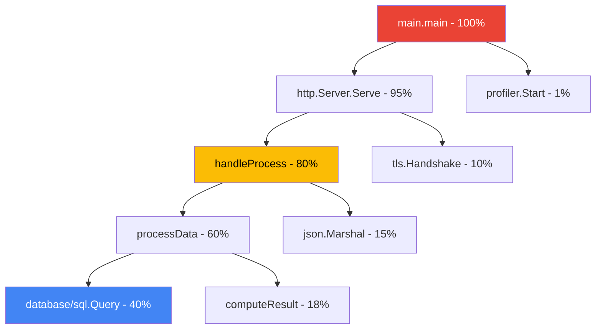

# How to Use the Go Cloud Profiler Agent to Profile a Go Service Running on Cloud Run

Author: [nawazdhandala](https://www.github.com/nawazdhandala)

Tags: GCP, Cloud Profiler, Go, Cloud Run, Performance, Profiling

Description: Set up the Go Cloud Profiler agent to continuously profile a Go service running on Cloud Run for identifying CPU and memory bottlenecks in production.

---

Performance problems in production are a different beast than what you find during development. Your local benchmarks might look great, but once real traffic hits with varied payloads and concurrent requests, hot spots emerge that you never anticipated. Cloud Profiler gives you continuous production profiling without meaningful performance overhead.

The Go Cloud Profiler agent is particularly well-suited for this. It collects CPU and heap profiles periodically and uploads them to Cloud Profiler where you can analyze flame graphs, compare profiles across versions, and identify exactly where your service spends its time.

## What Cloud Profiler Collects

The Go agent collects several profile types:

- **CPU** - Where your goroutines spend CPU time
- **Heap** - Current memory allocations and what is holding onto memory
- **Goroutine** - Number and state of goroutines
- **Threads** - OS thread usage
- **Contention** - Where goroutines are blocking on mutexes

Each profile is collected for a short window (typically 10 seconds) every few minutes, so the overhead is negligible.

## Setting Up

Install the profiler library:

```bash
go get cloud.google.com/go/profiler
```

## Basic Integration

Adding the profiler to your service takes just a few lines. The key is to start it early in main, before your server starts handling requests.

```go
package main

import (
    "context"
    "log"
    "net/http"
    "os"

    "cloud.google.com/go/profiler"
)

func main() {
    // Start the profiler as early as possible
    if err := startProfiler(); err != nil {
        // Log the error but do not crash - profiling is optional
        log.Printf("Warning: Failed to start profiler: %v", err)
    }

    // Set up your HTTP server
    mux := http.NewServeMux()
    mux.HandleFunc("/api/process", handleProcess)
    mux.HandleFunc("/health", handleHealth)

    port := os.Getenv("PORT")
    if port == "" {
        port = "8080"
    }

    log.Printf("Server starting on port %s", port)
    log.Fatal(http.ListenAndServe(":"+port, mux))
}

// startProfiler initializes the Cloud Profiler agent
func startProfiler() error {
    cfg := profiler.Config{
        // Service name appears in the Cloud Profiler UI
        Service: os.Getenv("K_SERVICE"),
        // Version helps you compare profiles across deployments
        ServiceVersion: os.Getenv("K_REVISION"),
        // Project ID is auto-detected on Cloud Run
        ProjectID: os.Getenv("GOOGLE_CLOUD_PROJECT"),
        // Enable mutex profiling to find lock contention
        MutexProfiling: true,
    }

    // If running locally, set the service name explicitly
    if cfg.Service == "" {
        cfg.Service = "my-service-local"
    }
    if cfg.ServiceVersion == "" {
        cfg.ServiceVersion = "dev"
    }

    return profiler.Start(cfg)
}
```

That is it for the basic setup. The profiler runs in the background, collecting and uploading profiles automatically.

## Profiling Specific Operations

Sometimes you want to understand specific operations better. While Cloud Profiler handles continuous sampling, you can add custom labels to help filter profiles.

```go
import (
    "runtime/pprof"
)

// handleProcess is an HTTP handler with custom profiler labels
func handleProcess(w http.ResponseWriter, r *http.Request) {
    // Add custom labels that appear in the profiler UI
    // This helps you filter profiles by endpoint or operation
    labels := pprof.Labels(
        "endpoint", r.URL.Path,
        "method", r.Method,
    )

    pprof.Do(r.Context(), labels, func(ctx context.Context) {
        // All CPU time spent in this function will be tagged with the labels
        result, err := processData(ctx)
        if err != nil {
            http.Error(w, "Processing failed", http.StatusInternalServerError)
            return
        }

        w.Header().Set("Content-Type", "application/json")
        w.Write(result)
    })
}
```

## Understanding the Flame Graph

When you open Cloud Profiler in the console, you see a flame graph. Here is how to read it:



The width of each block represents the percentage of total CPU time. In this example, you would see that `database/sql.Query` takes 40% of CPU time, which points to database access as the primary bottleneck.

## Profiling Memory Usage

Heap profiling is especially important for Go services on Cloud Run because memory-constrained instances can lead to OOM kills.

```go
package main

import (
    "runtime"
)

// monitorMemory logs memory statistics periodically
// This supplements Cloud Profiler with real-time visibility
func monitorMemory() {
    var stats runtime.MemStats
    runtime.ReadMemStats(&stats)

    log.Printf("Memory stats: Alloc=%d MB, Sys=%d MB, NumGC=%d, Goroutines=%d",
        stats.Alloc/1024/1024,
        stats.Sys/1024/1024,
        stats.NumGC,
        runtime.NumGoroutine(),
    )
}
```

Cloud Profiler's heap profile shows you:
- Which functions allocate the most memory
- What objects are staying alive the longest
- Where you might be leaking memory through retained references

## Comparing Profiles Across Versions

One of Cloud Profiler's best features is comparing profiles between versions. When you deploy a new revision, you can overlay the flame graphs to see if anything got slower or started using more memory.

```go
// Set the service version from your deployment metadata
cfg := profiler.Config{
    Service: "my-service",
    // Use the git commit hash or deployment timestamp
    ServiceVersion: getVersionFromEnv(),
}

func getVersionFromEnv() string {
    // Cloud Run sets K_REVISION automatically
    if rev := os.Getenv("K_REVISION"); rev != "" {
        return rev
    }
    // Fall back to a build-time version
    if ver := os.Getenv("APP_VERSION"); ver != "" {
        return ver
    }
    return "unknown"
}
```

In the Cloud Profiler UI, you can select two versions and see a comparison view that highlights what changed between them.

## Profiling a CPU-Intensive Service

Here is a more realistic example - a service that processes images and has genuine performance concerns.

```go
package main

import (
    "bytes"
    "context"
    "image"
    "image/jpeg"
    "image/png"
    "log"
    "net/http"
    "runtime/pprof"

    "cloud.google.com/go/profiler"
    "cloud.google.com/go/storage"
)

func main() {
    profiler.Start(profiler.Config{
        Service:        "image-processor",
        ServiceVersion: os.Getenv("K_REVISION"),
        MutexProfiling: true,
    })

    storageClient, _ := storage.NewClient(context.Background())

    mux := http.NewServeMux()
    mux.HandleFunc("/resize", func(w http.ResponseWriter, r *http.Request) {
        labels := pprof.Labels("operation", "resize")
        pprof.Do(r.Context(), labels, func(ctx context.Context) {
            resizeImage(ctx, w, r, storageClient)
        })
    })

    log.Fatal(http.ListenAndServe(":8080", mux))
}

func resizeImage(ctx context.Context, w http.ResponseWriter, r *http.Request, client *storage.Client) {
    bucket := r.URL.Query().Get("bucket")
    object := r.URL.Query().Get("object")

    // Download the image - this will show up as I/O time in the profile
    reader, err := client.Bucket(bucket).Object(object).NewReader(ctx)
    if err != nil {
        http.Error(w, "Failed to read image", http.StatusInternalServerError)
        return
    }
    defer reader.Close()

    // Decode the image - this is CPU-intensive
    img, format, err := image.Decode(reader)
    if err != nil {
        http.Error(w, "Failed to decode image", http.StatusBadRequest)
        return
    }

    // Resize (simplified - just re-encode)
    var buf bytes.Buffer
    switch format {
    case "jpeg":
        jpeg.Encode(&buf, img, &jpeg.Options{Quality: 80})
    case "png":
        png.Encode(&buf, img)
    }

    w.Header().Set("Content-Type", "image/"+format)
    w.Write(buf.Bytes())
}
```

## Profiler Configuration Options

```go
cfg := profiler.Config{
    Service:        "my-service",
    ServiceVersion: "v1.2.3",
    ProjectID:      "my-project",

    // Enable mutex profiling to find lock contention
    MutexProfiling: true,

    // Enable goroutine profiling
    // Useful for detecting goroutine leaks
    AllocForceGC: true,

    // Custom debug logging callback
    DebugLogging: false,
}
```

## What to Look For

When analyzing profiles, here are the common patterns that indicate problems:

1. **Flat tops** - A function taking a large percentage of CPU time usually means it is doing too much work or being called too often.

2. **Deep stacks** - Very deep call stacks can indicate excessive abstraction layers or recursive algorithms that might benefit from iteration.

3. **Memory growth** - If the heap profile shows increasing allocations over time without corresponding frees, you have a memory leak.

4. **Mutex contention** - High mutex wait time means goroutines are competing for shared resources. Consider reducing lock scope or using read/write locks.

5. **Goroutine spikes** - A growing number of goroutines often means something is spawning goroutines without proper lifecycle management.

## Cloud Run Specific Tips

- **Set memory limits appropriately** - If heap profiles show you are consistently using 200 MB, do not set the Cloud Run memory limit to 256 MB. Give yourself headroom.
- **CPU throttling matters** - On Cloud Run, CPU is throttled when not processing requests (unless you opt out). Profiler samples during active request processing, so the data is representative.
- **Min instances** - If you set min instances to 0, the profiler will not collect data during cold starts. Consider min instances of 1 if you need startup profiles.

## Wrapping Up

Cloud Profiler is one of the easiest performance tools to set up, and the insight it provides is invaluable. A few lines of code in your main function gives you continuous production profiling with flame graphs, version comparisons, and multiple profile types. When something is slow in production, you can look at actual production profiles instead of guessing.

For comprehensive production monitoring that combines profiling data with uptime checks, error tracking, and performance metrics, OneUptime can help you correlate performance issues with real user impact.
