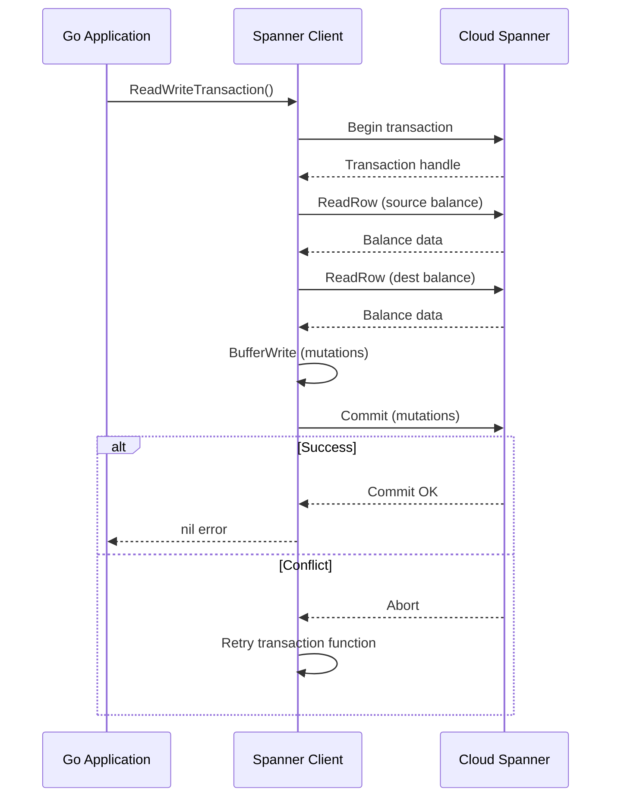

# How to Use the Go Cloud Spanner Client Library for Read-Write Transactions and Mutations

Author: [nawazdhandala](https://www.github.com/nawazdhandala)

Tags: GCP, Cloud Spanner, Go, Transactions, Database, Google Cloud

Description: Learn how to use the Go Cloud Spanner client library for read-write transactions and mutations with practical examples and best practices.

---

Cloud Spanner is Google's globally distributed relational database. It gives you the consistency of a traditional relational database with horizontal scalability that most relational databases simply cannot offer. The Go client library provides a clean interface for working with Spanner, but the transaction model has some quirks that are worth understanding before you write production code.

In this post, I will focus on read-write transactions and mutations - the two primary ways to modify data in Spanner.

## Setup

Install the Spanner client library and create a test database.

```bash
# Install the Go client library
go get cloud.google.com/go/spanner

# Create a Spanner instance (if you do not have one)
gcloud spanner instances create test-instance \
  --config=regional-us-central1 \
  --description="Test Instance" \
  --nodes=1

# Create a database with a schema
gcloud spanner databases create testdb --instance=test-instance \
  --ddl="CREATE TABLE Users (
    UserID STRING(36) NOT NULL,
    Email STRING(256) NOT NULL,
    Name STRING(256),
    Balance INT64 NOT NULL DEFAULT (0),
    CreatedAt TIMESTAMP NOT NULL OPTIONS (allow_commit_timestamp=true)
  ) PRIMARY KEY (UserID)"
```

## Creating the Client

The Spanner client manages sessions and connection pooling internally.

```go
package main

import (
    "context"
    "fmt"
    "log"

    "cloud.google.com/go/spanner"
)

// createSpannerClient initializes a Spanner client for the given database
func createSpannerClient(ctx context.Context) (*spanner.Client, error) {
    // Database path format: projects/PROJECT/instances/INSTANCE/databases/DATABASE
    db := "projects/my-project/instances/test-instance/databases/testdb"

    client, err := spanner.NewClient(ctx, db)
    if err != nil {
        return nil, fmt.Errorf("failed to create spanner client: %w", err)
    }

    return client, nil
}
```

## Mutations vs. DML

Spanner offers two ways to write data:

- **Mutations** - Programmatic data modification operations. They are applied atomically at commit time. Good for simple insert, update, and delete operations.
- **DML (Data Manipulation Language)** - SQL-based writes executed within read-write transactions. Better when your write logic depends on read results.

## Working with Mutations

Mutations are the simpler approach. You build a set of mutations and apply them.

### Insert

```go
// insertUser creates a new user record using a mutation
func insertUser(ctx context.Context, client *spanner.Client, userID, email, name string) error {
    // InsertOrUpdate will insert the row if it does not exist,
    // or update it if it does
    m := spanner.InsertOrUpdate("Users",
        []string{"UserID", "Email", "Name", "Balance", "CreatedAt"},
        []interface{}{userID, email, name, 0, spanner.CommitTimestamp},
    )

    // Apply executes the mutation outside of an explicit transaction
    _, err := client.Apply(ctx, []*spanner.Mutation{m})
    if err != nil {
        return fmt.Errorf("failed to insert user: %w", err)
    }

    log.Printf("Inserted user %s", userID)
    return nil
}
```

### Batch Insert

For inserting multiple rows at once, batch your mutations together.

```go
// batchInsertUsers inserts multiple users in a single atomic operation
func batchInsertUsers(ctx context.Context, client *spanner.Client, users []User) error {
    var mutations []*spanner.Mutation

    for _, u := range users {
        // Build a mutation for each user
        m := spanner.Insert("Users",
            []string{"UserID", "Email", "Name", "Balance", "CreatedAt"},
            []interface{}{u.ID, u.Email, u.Name, 0, spanner.CommitTimestamp},
        )
        mutations = append(mutations, m)
    }

    // All mutations are applied atomically
    _, err := client.Apply(ctx, mutations)
    if err != nil {
        return fmt.Errorf("batch insert failed: %w", err)
    }

    log.Printf("Inserted %d users", len(users))
    return nil
}
```

### Update and Delete

```go
// updateUserEmail changes a user's email address
func updateUserEmail(ctx context.Context, client *spanner.Client, userID, newEmail string) error {
    m := spanner.Update("Users",
        []string{"UserID", "Email"},
        []interface{}{userID, newEmail},
    )

    _, err := client.Apply(ctx, []*spanner.Mutation{m})
    return err
}

// deleteUser removes a user by their primary key
func deleteUser(ctx context.Context, client *spanner.Client, userID string) error {
    m := spanner.Delete("Users", spanner.Key{userID})

    _, err := client.Apply(ctx, []*spanner.Mutation{m})
    return err
}
```

## Read-Write Transactions

Read-write transactions are more powerful. They let you read data and make decisions about what to write based on those reads - all within a single atomic operation.

### The Basic Pattern

Spanner's read-write transactions use an optimistic concurrency model. The client library handles retries automatically if there is a conflict, which means your transaction function might be called more than once. This has important implications: your function must be idempotent and should not have side effects outside the transaction.

```go
// transferBalance moves funds from one user to another
// This demonstrates a read-write transaction where writes depend on read values
func transferBalance(ctx context.Context, client *spanner.Client, fromID, toID string, amount int64) error {
    _, err := client.ReadWriteTransaction(ctx, func(ctx context.Context, txn *spanner.ReadWriteTransaction) error {
        // Read the source user's balance
        row, err := txn.ReadRow(ctx, "Users",
            spanner.Key{fromID},
            []string{"Balance"},
        )
        if err != nil {
            return fmt.Errorf("failed to read source balance: %w", err)
        }

        var fromBalance int64
        if err := row.Columns(&fromBalance); err != nil {
            return err
        }

        // Check if the source has enough funds
        if fromBalance < amount {
            return fmt.Errorf("insufficient balance: have %d, need %d", fromBalance, amount)
        }

        // Read the destination user's balance
        row, err = txn.ReadRow(ctx, "Users",
            spanner.Key{toID},
            []string{"Balance"},
        )
        if err != nil {
            return fmt.Errorf("failed to read destination balance: %w", err)
        }

        var toBalance int64
        if err := row.Columns(&toBalance); err != nil {
            return err
        }

        // Apply both balance changes atomically using buffer write
        txn.BufferWrite([]*spanner.Mutation{
            spanner.Update("Users",
                []string{"UserID", "Balance"},
                []interface{}{fromID, fromBalance - amount},
            ),
            spanner.Update("Users",
                []string{"UserID", "Balance"},
                []interface{}{toID, toBalance + amount},
            ),
        })

        return nil
    })

    if err != nil {
        return fmt.Errorf("transfer failed: %w", err)
    }

    log.Printf("Transferred %d from %s to %s", amount, fromID, toID)
    return nil
}
```

### Using DML in Transactions

You can also use SQL statements inside transactions.

```go
// deactivateInactiveUsers uses DML to update users who have not logged in recently
func deactivateInactiveUsers(ctx context.Context, client *spanner.Client, cutoffDays int) (int64, error) {
    var rowCount int64

    _, err := client.ReadWriteTransaction(ctx, func(ctx context.Context, txn *spanner.ReadWriteTransaction) error {
        // Use a DML statement to update matching rows
        stmt := spanner.Statement{
            SQL: `UPDATE Users SET Active = FALSE
                  WHERE LastLogin < TIMESTAMP_SUB(CURRENT_TIMESTAMP(), INTERVAL @days DAY)
                  AND Active = TRUE`,
            Params: map[string]interface{}{
                "days": cutoffDays,
            },
        }

        count, err := txn.Update(ctx, stmt)
        if err != nil {
            return err
        }
        rowCount = count
        return nil
    })

    return rowCount, err
}
```

## Transaction Flow



## Important Rules for Read-Write Transactions

1. **Keep them short** - Spanner aborts transactions that run too long (the default deadline is 60 seconds). Do not do external I/O inside a transaction.

2. **Expect retries** - Your transaction function can be called multiple times. Do not send emails, enqueue messages, or write to external systems from inside the function.

3. **Read before write** - If you need to read data that you will modify, do it inside the transaction. Reading outside and writing inside creates a race condition.

4. **Use mutations for simple writes** - If you do not need to read first, `client.Apply()` with mutations is simpler and often faster.

5. **Batch mutations** - Combine related mutations into a single `BufferWrite` call rather than calling it multiple times.

## Error Handling

Spanner has specific error codes you should handle.

```go
import "google.golang.org/grpc/codes"
import "google.golang.org/grpc/status"

// handleSpannerError provides specific handling for Spanner errors
func handleSpannerError(err error) {
    st, ok := status.FromError(err)
    if !ok {
        log.Printf("Non-gRPC error: %v", err)
        return
    }

    switch st.Code() {
    case codes.NotFound:
        log.Println("Row not found")
    case codes.AlreadyExists:
        log.Println("Row already exists - use InsertOrUpdate instead")
    case codes.Aborted:
        log.Println("Transaction aborted - client library should retry automatically")
    case codes.DeadlineExceeded:
        log.Println("Transaction took too long")
    default:
        log.Printf("Spanner error [%s]: %s", st.Code(), st.Message())
    }
}
```

## Wrapping Up

Cloud Spanner's transaction model takes a bit of getting used to if you are coming from traditional SQL databases. The key things to remember are: mutations are great for straightforward writes, read-write transactions handle the complex cases where you need to read-then-write atomically, and transaction functions must be prepared to run more than once.

Once you have internalized these patterns, working with Spanner in Go becomes quite natural. For monitoring your Spanner operations in production - tracking transaction latencies, abort rates, and throughput - tools like OneUptime can help you maintain visibility into your database performance.
