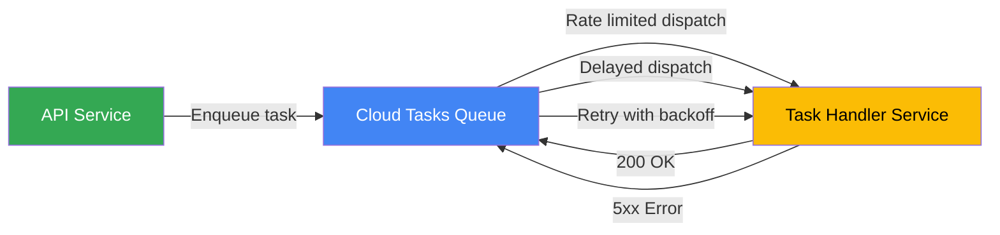

# How to Use the Go Cloud Tasks Client Library to Enqueue HTTP Requests with Delayed Execution

Author: [nawazdhandala](https://www.github.com/nawazdhandala)

Tags: GCP, Cloud Tasks, Go, Task Queues, Google Cloud, Serverless

Description: Learn how to use the Go Cloud Tasks client library to enqueue HTTP requests with delayed execution for background job processing on GCP.

---

Cloud Tasks is Google Cloud's managed task queue. You push tasks onto a queue, and Cloud Tasks delivers them as HTTP requests to your target service at a controlled rate. The "delayed execution" part is what makes it especially useful - you can schedule a task to run 5 minutes from now, tomorrow, or any time within the 30-day limit.

Common use cases include sending delayed notifications, retrying failed operations, scheduling cleanup jobs, and rate-limiting outbound API calls. Let me show you how to set this up with Go.

## Prerequisites

Enable the Cloud Tasks API and create a queue:

```bash
# Enable the API
gcloud services enable cloudtasks.googleapis.com

# Create a queue with rate limiting
gcloud tasks queues create my-task-queue \
  --location=us-central1 \
  --max-dispatches-per-second=10 \
  --max-concurrent-dispatches=5 \
  --max-attempts=3 \
  --min-backoff=10s \
  --max-backoff=300s
```

Install the Go client library:

```bash
go get cloud.google.com/go/cloudtasks/apiv2
go get cloud.google.com/go/cloudtasks/apiv2/cloudtaskspb
```

## Creating the Task Client

```go
package main

import (
    "context"
    "fmt"
    "log"
    "os"

    cloudtasks "cloud.google.com/go/cloudtasks/apiv2"
    taskspb "cloud.google.com/go/cloudtasks/apiv2/cloudtaskspb"
    "google.golang.org/protobuf/types/known/timestamppb"
)

// TaskEnqueuer wraps the Cloud Tasks client with helper methods
type TaskEnqueuer struct {
    client    *cloudtasks.Client
    projectID string
    location  string
    queueID   string
}

// NewTaskEnqueuer creates a new task enqueuer
func NewTaskEnqueuer(ctx context.Context) (*TaskEnqueuer, error) {
    client, err := cloudtasks.NewClient(ctx)
    if err != nil {
        return nil, fmt.Errorf("failed to create tasks client: %w", err)
    }

    return &TaskEnqueuer{
        client:    client,
        projectID: os.Getenv("GOOGLE_CLOUD_PROJECT"),
        location:  os.Getenv("TASK_QUEUE_LOCATION"),
        queueID:   os.Getenv("TASK_QUEUE_ID"),
    }, nil
}

// Close cleans up the client resources
func (e *TaskEnqueuer) Close() {
    e.client.Close()
}

// queuePath returns the fully qualified queue path
func (e *TaskEnqueuer) queuePath() string {
    return fmt.Sprintf("projects/%s/locations/%s/queues/%s",
        e.projectID, e.location, e.queueID)
}
```

## Enqueuing a Basic HTTP Task

The simplest case is sending an HTTP request to a target URL.

```go
// EnqueueHTTPTask creates a task that sends an HTTP request to the target URL
func (e *TaskEnqueuer) EnqueueHTTPTask(ctx context.Context, url string, payload []byte) (*taskspb.Task, error) {
    req := &taskspb.CreateTaskRequest{
        Parent: e.queuePath(),
        Task: &taskspb.Task{
            MessageType: &taskspb.Task_HttpRequest{
                HttpRequest: &taskspb.HttpRequest{
                    HttpMethod: taskspb.HttpMethod_POST,
                    Url:        url,
                    Headers: map[string]string{
                        "Content-Type": "application/json",
                    },
                    Body: payload,
                },
            },
        },
    }

    task, err := e.client.CreateTask(ctx, req)
    if err != nil {
        return nil, fmt.Errorf("failed to create task: %w", err)
    }

    log.Printf("Created task: %s", task.Name)
    return task, nil
}
```

## Enqueuing with Delayed Execution

This is where it gets interesting. You can schedule a task to execute at a specific time in the future.

```go
import "time"

// EnqueueDelayedTask creates a task that will execute after the specified delay
func (e *TaskEnqueuer) EnqueueDelayedTask(ctx context.Context, url string, payload []byte, delay time.Duration) (*taskspb.Task, error) {
    // Calculate the execution time
    scheduleTime := time.Now().Add(delay)

    req := &taskspb.CreateTaskRequest{
        Parent: e.queuePath(),
        Task: &taskspb.Task{
            // ScheduleTime tells Cloud Tasks when to dispatch the task
            ScheduleTime: timestamppb.New(scheduleTime),
            MessageType: &taskspb.Task_HttpRequest{
                HttpRequest: &taskspb.HttpRequest{
                    HttpMethod: taskspb.HttpMethod_POST,
                    Url:        url,
                    Headers: map[string]string{
                        "Content-Type": "application/json",
                    },
                    Body: payload,
                },
            },
        },
    }

    task, err := e.client.CreateTask(ctx, req)
    if err != nil {
        return nil, fmt.Errorf("failed to create delayed task: %w", err)
    }

    log.Printf("Created task %s, scheduled for %s", task.Name, scheduleTime.Format(time.RFC3339))
    return task, nil
}
```

## Enqueuing with Authentication

When your target is a Cloud Run service that requires authentication, you need to include an OIDC token with the task.

```go
// EnqueueAuthenticatedTask creates a task with OIDC authentication for Cloud Run targets
func (e *TaskEnqueuer) EnqueueAuthenticatedTask(
    ctx context.Context,
    url string,
    payload []byte,
    serviceAccountEmail string,
    delay time.Duration,
) (*taskspb.Task, error) {
    scheduleTime := time.Now().Add(delay)

    req := &taskspb.CreateTaskRequest{
        Parent: e.queuePath(),
        Task: &taskspb.Task{
            ScheduleTime: timestamppb.New(scheduleTime),
            MessageType: &taskspb.Task_HttpRequest{
                HttpRequest: &taskspb.HttpRequest{
                    HttpMethod: taskspb.HttpMethod_POST,
                    Url:        url,
                    Headers: map[string]string{
                        "Content-Type": "application/json",
                    },
                    Body: payload,
                    // OIDC token for authenticating with Cloud Run
                    AuthorizationHeader: &taskspb.HttpRequest_OidcToken{
                        OidcToken: &taskspb.OidcToken{
                            ServiceAccountEmail: serviceAccountEmail,
                            Audience:            url,
                        },
                    },
                },
            },
        },
    }

    task, err := e.client.CreateTask(ctx, req)
    if err != nil {
        return nil, fmt.Errorf("failed to create authenticated task: %w", err)
    }

    return task, nil
}
```

## Deduplication with Task Names

Cloud Tasks supports task names for deduplication. If you try to create a task with the same name as an existing one, the request is rejected.

```go
// EnqueueDeduplicatedTask creates a task with a unique name to prevent duplicates
func (e *TaskEnqueuer) EnqueueDeduplicatedTask(
    ctx context.Context,
    taskID string,
    url string,
    payload []byte,
) (*taskspb.Task, error) {
    // Task name must be unique within the queue
    taskName := fmt.Sprintf("%s/tasks/%s", e.queuePath(), taskID)

    req := &taskspb.CreateTaskRequest{
        Parent: e.queuePath(),
        Task: &taskspb.Task{
            Name: taskName,
            MessageType: &taskspb.Task_HttpRequest{
                HttpRequest: &taskspb.HttpRequest{
                    HttpMethod: taskspb.HttpMethod_POST,
                    Url:        url,
                    Body:       payload,
                },
            },
        },
    }

    task, err := e.client.CreateTask(ctx, req)
    if err != nil {
        return nil, fmt.Errorf("failed to create task %s: %w", taskID, err)
    }

    return task, nil
}
```

Note: After a task with a given name completes or is deleted, you cannot reuse that name for about an hour. Plan your naming scheme accordingly.

## The Task Handler Service

The service that receives the tasks is a regular HTTP server. Here is a Cloud Run service that processes the tasks.

```go
package main

import (
    "encoding/json"
    "io"
    "log"
    "net/http"
    "os"
)

// OrderTask represents the payload of an order processing task
type OrderTask struct {
    OrderID  string  `json:"order_id"`
    Action   string  `json:"action"`
    Amount   float64 `json:"amount"`
    UserID   string  `json:"user_id"`
}

func main() {
    http.HandleFunc("/process-order", handleOrderTask)
    http.HandleFunc("/send-reminder", handleReminderTask)

    port := os.Getenv("PORT")
    if port == "" {
        port = "8080"
    }

    log.Printf("Task handler listening on port %s", port)
    log.Fatal(http.ListenAndServe(":"+port, nil))
}

// handleOrderTask processes order tasks from Cloud Tasks
func handleOrderTask(w http.ResponseWriter, r *http.Request) {
    // Read the task payload
    body, err := io.ReadAll(r.Body)
    if err != nil {
        log.Printf("Failed to read body: %v", err)
        http.Error(w, "Bad request", http.StatusBadRequest)
        return
    }

    var task OrderTask
    if err := json.Unmarshal(body, &task); err != nil {
        log.Printf("Failed to parse task: %v", err)
        // Return 200 for malformed tasks so they are not retried
        w.WriteHeader(http.StatusOK)
        return
    }

    log.Printf("Processing order %s: %s", task.OrderID, task.Action)

    // Process the order
    if err := processOrder(task); err != nil {
        log.Printf("Order processing failed: %v", err)
        // Return 500 to trigger a retry
        http.Error(w, "Processing failed", http.StatusInternalServerError)
        return
    }

    // Return 200 to acknowledge the task
    w.WriteHeader(http.StatusOK)
}
```

## Task Flow



## Practical Example: Delayed Email Reminders

Here is a real-world example - scheduling email reminders that go out 24 hours after a user signs up.

```go
// scheduleWelcomeEmail enqueues a welcome email to be sent 24 hours after signup
func scheduleWelcomeEmail(ctx context.Context, enqueuer *TaskEnqueuer, userID, email string) error {
    payload, err := json.Marshal(map[string]string{
        "user_id": userID,
        "email":   email,
        "type":    "welcome_reminder",
    })
    if err != nil {
        return err
    }

    // Schedule the email for 24 hours from now
    _, err = enqueuer.EnqueueAuthenticatedTask(
        ctx,
        "https://email-service-xxxxx.run.app/send-reminder",
        payload,
        "tasks-sa@your-project.iam.gserviceaccount.com",
        24*time.Hour,
    )

    return err
}
```

## Wrapping Up

Cloud Tasks fills the gap between synchronous HTTP calls and full-blown message queues. The delayed execution feature is particularly useful for scheduling future work without running a cron job or a background worker. Combined with Cloud Run, you get a fully serverless task processing pipeline that only costs money when tasks are actually being processed.

For monitoring your task queues and handlers in production - tracking dispatch rates, retry counts, and handler latencies - OneUptime can help you set up the observability you need to keep your background jobs running reliably.
