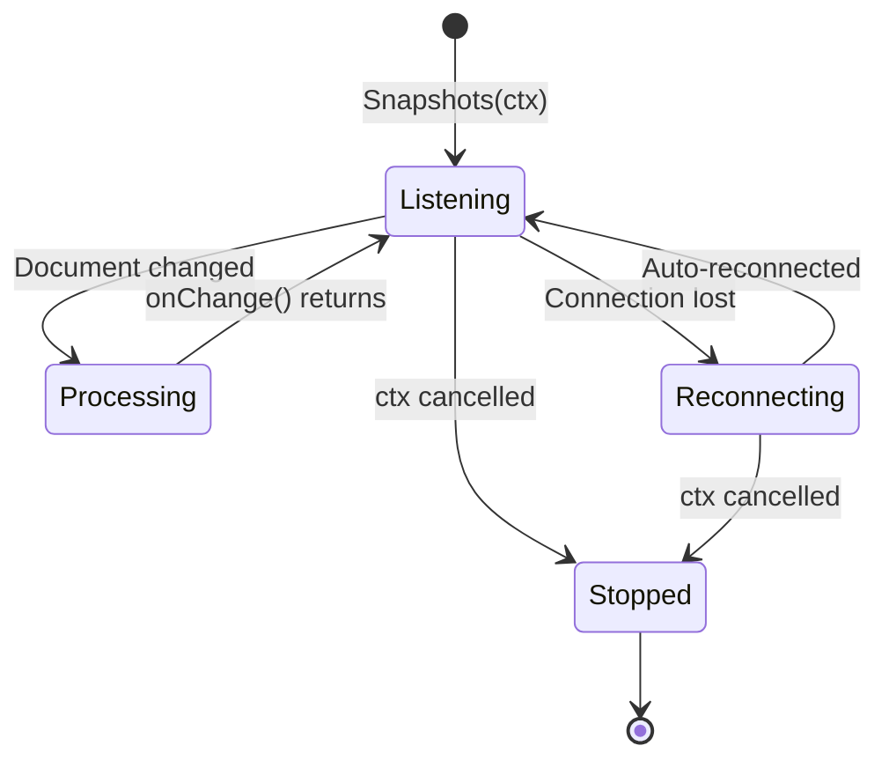

# How to Use the Go Firestore Client Library for Real-Time Document Snapshots in a Long-Running Service

Author: [nawazdhandala](https://www.github.com/nawazdhandala)

Tags: GCP, Firestore, Go, Real-Time, Document Snapshots, Google Cloud

Description: Use the Go Firestore client library to listen for real-time document changes using snapshot listeners in a long-running Go service on GCP.

---

Firestore's real-time listeners are one of its best features. Instead of polling the database for changes, you set up a listener and Firestore pushes updates to you the moment they happen. This is great for building dashboards, syncing state between services, or reacting to configuration changes without redeployment.

The Go client library supports snapshot listeners for both individual documents and collection queries. In this post, I will show you how to set them up properly in a long-running service, handle reconnections, and avoid common pitfalls.

## When to Use Snapshot Listeners

Snapshot listeners make sense when:

- You need to react to changes within seconds
- You are building a service that maintains in-memory state from Firestore
- You want to avoid the cost and latency of polling
- You need to sync configuration changes across service instances

They do not make sense when:

- You only need data at request time (just read it)
- You are running in a short-lived environment like Cloud Functions
- You have millions of documents to watch (use Firestore triggers instead)

## Setting Up the Client

```go
package main

import (
    "context"
    "fmt"
    "log"
    "os"
    "sync"
    "time"

    "cloud.google.com/go/firestore"
    "google.golang.org/grpc/codes"
    "google.golang.org/grpc/status"
)

// FirestoreWatcher manages real-time listeners on Firestore documents
type FirestoreWatcher struct {
    client    *firestore.Client
    projectID string
}

// NewFirestoreWatcher creates a new Firestore watcher
func NewFirestoreWatcher(ctx context.Context) (*FirestoreWatcher, error) {
    projectID := os.Getenv("GOOGLE_CLOUD_PROJECT")

    client, err := firestore.NewClient(ctx, projectID)
    if err != nil {
        return nil, fmt.Errorf("failed to create firestore client: %w", err)
    }

    return &FirestoreWatcher{
        client:    client,
        projectID: projectID,
    }, nil
}

// Close cleans up the Firestore client
func (fw *FirestoreWatcher) Close() {
    fw.client.Close()
}
```

## Watching a Single Document

The most basic listener watches a single document for changes.

```go
// WatchDocument listens for changes to a specific document
// The onChange callback is called every time the document changes
func (fw *FirestoreWatcher) WatchDocument(
    ctx context.Context,
    collection, docID string,
    onChange func(data map[string]interface{}),
) error {
    docRef := fw.client.Collection(collection).Doc(docID)

    // Create a snapshot listener
    iter := docRef.Snapshots(ctx)
    defer iter.Stop()

    for {
        // Next blocks until a change occurs or the context is cancelled
        snap, err := iter.Next()
        if err != nil {
            // Check if the context was cancelled (shutdown)
            if status.Code(err) == codes.Canceled || ctx.Err() != nil {
                log.Printf("Document watcher stopped for %s/%s", collection, docID)
                return nil
            }
            return fmt.Errorf("snapshot error: %w", err)
        }

        // Check if the document exists
        if !snap.Exists() {
            log.Printf("Document %s/%s was deleted", collection, docID)
            continue
        }

        // Call the change handler with the document data
        onChange(snap.Data())
    }
}
```

## Watching a Collection Query

You can also watch the results of a query and get notified when any matching document changes.

```go
// WatchQuery listens for changes to documents matching a query
func (fw *FirestoreWatcher) WatchQuery(
    ctx context.Context,
    collection string,
    query firestore.Query,
    onChange func(changes []DocumentChange),
) error {
    iter := query.Snapshots(ctx)
    defer iter.Stop()

    for {
        snap, err := iter.Next()
        if err != nil {
            if status.Code(err) == codes.Canceled || ctx.Err() != nil {
                return nil
            }
            return fmt.Errorf("query snapshot error: %w", err)
        }

        // Convert the changes to our own type
        var changes []DocumentChange
        for _, change := range snap.Changes {
            dc := DocumentChange{
                DocID: change.Doc.Ref.ID,
                Data:  change.Doc.Data(),
            }

            // Determine the type of change
            switch change.Kind {
            case firestore.DocumentAdded:
                dc.Kind = "added"
            case firestore.DocumentModified:
                dc.Kind = "modified"
            case firestore.DocumentRemoved:
                dc.Kind = "removed"
            }

            changes = append(changes, dc)
        }

        if len(changes) > 0 {
            onChange(changes)
        }
    }
}

// DocumentChange represents a single document change in a query snapshot
type DocumentChange struct {
    Kind  string                 // "added", "modified", or "removed"
    DocID string
    Data  map[string]interface{}
}
```

## Real-World Example: Configuration Watcher

A common pattern is using Firestore to store service configuration that updates in real time.

```go
// ConfigWatcher watches a Firestore document for configuration changes
// and keeps an in-memory copy of the current config
type ConfigWatcher struct {
    fw     *FirestoreWatcher
    config map[string]interface{}
    mu     sync.RWMutex
}

// NewConfigWatcher creates a watcher that keeps config in sync with Firestore
func NewConfigWatcher(fw *FirestoreWatcher) *ConfigWatcher {
    return &ConfigWatcher{
        fw:     fw,
        config: make(map[string]interface{}),
    }
}

// Start begins watching the configuration document
func (cw *ConfigWatcher) Start(ctx context.Context) error {
    return cw.fw.WatchDocument(ctx, "config", "app-settings", func(data map[string]interface{}) {
        cw.mu.Lock()
        defer cw.mu.Unlock()

        cw.config = data
        log.Printf("Configuration updated: %v", data)
    })
}

// Get returns the current value of a configuration key
func (cw *ConfigWatcher) Get(key string) (interface{}, bool) {
    cw.mu.RLock()
    defer cw.mu.RUnlock()

    val, ok := cw.config[key]
    return val, ok
}

// GetString returns a configuration value as a string
func (cw *ConfigWatcher) GetString(key string, defaultVal string) string {
    val, ok := cw.Get(key)
    if !ok {
        return defaultVal
    }
    if s, ok := val.(string); ok {
        return s
    }
    return defaultVal
}
```

## Real-World Example: Active Orders Dashboard

Here is another example - watching a collection of active orders for a real-time dashboard.

```go
// OrderTracker watches active orders and maintains an in-memory index
type OrderTracker struct {
    fw     *FirestoreWatcher
    orders map[string]Order
    mu     sync.RWMutex
}

// Order represents an order document
type Order struct {
    ID        string
    Customer  string
    Status    string
    Total     float64
    UpdatedAt time.Time
}

// StartTracking begins watching the active orders collection
func (ot *OrderTracker) StartTracking(ctx context.Context) error {
    // Build a query for active orders
    query := ot.fw.client.Collection("orders").
        Where("status", "in", []string{"pending", "processing", "shipped"}).
        OrderBy("updatedAt", firestore.Desc).
        Limit(100)

    return ot.fw.WatchQuery(ctx, "orders", query, func(changes []DocumentChange) {
        ot.mu.Lock()
        defer ot.mu.Unlock()

        for _, change := range changes {
            switch change.Kind {
            case "added", "modified":
                order := Order{
                    ID:       change.DocID,
                    Customer: change.Data["customer"].(string),
                    Status:   change.Data["status"].(string),
                }
                if total, ok := change.Data["total"].(float64); ok {
                    order.Total = total
                }
                ot.orders[change.DocID] = order
                log.Printf("Order %s: %s - %s", change.Kind, change.DocID, order.Status)

            case "removed":
                delete(ot.orders, change.DocID)
                log.Printf("Order removed from active list: %s", change.DocID)
            }
        }
    })
}

// GetActiveOrders returns a copy of all currently tracked orders
func (ot *OrderTracker) GetActiveOrders() []Order {
    ot.mu.RLock()
    defer ot.mu.RUnlock()

    orders := make([]Order, 0, len(ot.orders))
    for _, o := range ot.orders {
        orders = append(orders, o)
    }
    return orders
}
```

## Putting It Together

```go
func main() {
    ctx, cancel := context.WithCancel(context.Background())
    defer cancel()

    watcher, err := NewFirestoreWatcher(ctx)
    if err != nil {
        log.Fatalf("Failed to create watcher: %v", err)
    }
    defer watcher.Close()

    // Start the config watcher in a goroutine
    configWatcher := NewConfigWatcher(watcher)
    go func() {
        if err := configWatcher.Start(ctx); err != nil {
            log.Printf("Config watcher error: %v", err)
        }
    }()

    // Set up HTTP handlers that use the live config
    http.HandleFunc("/api/settings", func(w http.ResponseWriter, r *http.Request) {
        maintenanceMode := configWatcher.GetString("maintenance_mode", "false")
        if maintenanceMode == "true" {
            http.Error(w, "Service is under maintenance", http.StatusServiceUnavailable)
            return
        }
        w.WriteHeader(http.StatusOK)
    })

    port := os.Getenv("PORT")
    if port == "" {
        port = "8080"
    }

    log.Printf("Starting server on port %s", port)
    log.Fatal(http.ListenAndServe(":"+port, nil))
}
```

## Listener Lifecycle



## Things to Watch Out For

1. **First snapshot is the full document** - The first call to `Next()` returns the current state of the document, not a change. Handle this in your callback.

2. **Connection management** - The client library handles reconnections automatically. If the connection drops, it will reconnect and deliver any changes you missed.

3. **Memory usage** - If you are watching a query that matches thousands of documents, all of them will be held in memory by the snapshot iterator. Use limits and filters to keep the working set manageable.

4. **Goroutine cleanup** - Always pass a cancellable context to your watchers and cancel it during shutdown. Otherwise, you will leak goroutines.

5. **Error handling** - Not all errors are fatal. The library retries transient errors internally. Only surface errors that you cannot recover from.

## Wrapping Up

Firestore snapshot listeners give your Go services a powerful way to stay in sync with data changes in real time. The pattern of watching documents and maintaining in-memory state works well for configuration management, real-time dashboards, and state synchronization. Just make sure you handle the lifecycle properly - pass cancellable contexts, clean up listeners on shutdown, and be mindful of memory usage with large query results.

For monitoring your Firestore-backed services and tracking listener health, OneUptime can help you detect issues like disconnections or stale data before they affect your users.
