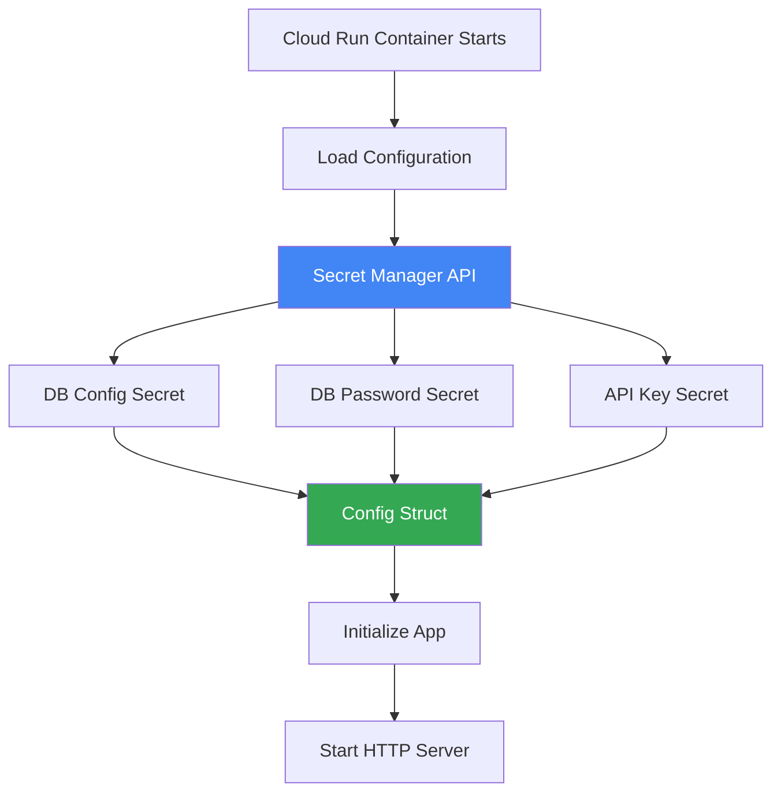

# How to Use the Go Secret Manager Client Library to Load Configuration at Startup in Cloud Run

Author: [nawazdhandala](https://www.github.com/nawazdhandala)

Tags: GCP, Secret Manager, Go, Cloud Run, Configuration, Security

Description: Use the Go Secret Manager client library to securely load configuration secrets at startup in a Cloud Run service instead of environment variables.

---

Storing secrets in environment variables works for simple setups, but it has real downsides. Anyone with access to your Cloud Run revision can see them. They show up in deployment logs. And rotating a secret means redeploying your service.

Secret Manager gives you a better option. Your secrets are stored encrypted, access is controlled by IAM, every access is audited, and you can rotate secrets without redeploying. The Go client library makes it easy to pull secrets at startup and use them throughout your application.

## Why Not Use Cloud Run's Built-In Secret Integration?

Cloud Run can mount secrets as environment variables or files directly. That is fine for simple cases, but the client library approach gives you:

- Programmatic control over which secret version to use
- Ability to refresh secrets without restarting the container
- Better error handling and fallback logic
- Secret caching to reduce API calls

## Setting Up

Create some secrets and install the client library.

```bash
# Create secrets in Secret Manager
echo -n "my-db-password" | gcloud secrets create db-password --data-file=-
echo -n "my-api-key-12345" | gcloud secrets create api-key --data-file=-
echo -n '{"host":"10.0.0.1","port":5432,"database":"mydb"}' | \
  gcloud secrets create db-config --data-file=-

# Grant the Cloud Run service account access to read secrets
gcloud secrets add-iam-policy-binding db-password \
  --member="serviceAccount:YOUR_PROJECT_NUMBER-compute@developer.gserviceaccount.com" \
  --role="roles/secretmanager.secretAccessor"

# Install the Go dependency
go get cloud.google.com/go/secretmanager/apiv1
go get cloud.google.com/go/secretmanager/apiv1/secretmanagerpb
```

## Basic Secret Loading

Here is the simplest way to load a secret.

```go
package main

import (
    "context"
    "fmt"
    "log"
    "os"

    secretmanager "cloud.google.com/go/secretmanager/apiv1"
    smpb "cloud.google.com/go/secretmanager/apiv1/secretmanagerpb"
)

// loadSecret retrieves the latest version of a secret from Secret Manager
func loadSecret(ctx context.Context, client *secretmanager.Client, secretName string) (string, error) {
    projectID := os.Getenv("GOOGLE_CLOUD_PROJECT")

    // Build the resource name for the latest version
    name := fmt.Sprintf("projects/%s/secrets/%s/versions/latest", projectID, secretName)

    // Access the secret version
    result, err := client.AccessSecretVersion(ctx, &smpb.AccessSecretVersionRequest{
        Name: name,
    })
    if err != nil {
        return "", fmt.Errorf("failed to access secret %s: %w", secretName, err)
    }

    return string(result.Payload.Data), nil
}
```

## Loading Configuration at Startup

For a production service, you want to load all your secrets once at startup and store them in a configuration struct.

```go
import (
    "encoding/json"
    "sync"
)

// Config holds all application configuration including secrets
type Config struct {
    // Database settings
    DBHost     string `json:"host"`
    DBPort     int    `json:"port"`
    DBName     string `json:"database"`
    DBPassword string `json:"-"` // loaded separately

    // API keys
    APIKey     string `json:"-"`

    // Non-secret configuration
    ServiceName string
    Environment string
}

// SecretLoader handles loading and caching secrets from Secret Manager
type SecretLoader struct {
    client    *secretmanager.Client
    projectID string
    cache     map[string]string
    mu        sync.RWMutex
}

// NewSecretLoader creates a new secret loader
func NewSecretLoader(ctx context.Context) (*SecretLoader, error) {
    client, err := secretmanager.NewClient(ctx)
    if err != nil {
        return nil, fmt.Errorf("failed to create secret manager client: %w", err)
    }

    return &SecretLoader{
        client:    client,
        projectID: os.Getenv("GOOGLE_CLOUD_PROJECT"),
        cache:     make(map[string]string),
    }, nil
}

// Close cleans up the client
func (sl *SecretLoader) Close() {
    sl.client.Close()
}

// GetSecret loads a secret, using the cache if available
func (sl *SecretLoader) GetSecret(ctx context.Context, name string) (string, error) {
    // Check cache first
    sl.mu.RLock()
    if val, ok := sl.cache[name]; ok {
        sl.mu.RUnlock()
        return val, nil
    }
    sl.mu.RUnlock()

    // Load from Secret Manager
    resourceName := fmt.Sprintf("projects/%s/secrets/%s/versions/latest", sl.projectID, name)

    result, err := sl.client.AccessSecretVersion(ctx, &smpb.AccessSecretVersionRequest{
        Name: resourceName,
    })
    if err != nil {
        return "", fmt.Errorf("failed to access secret %s: %w", name, err)
    }

    value := string(result.Payload.Data)

    // Cache the value
    sl.mu.Lock()
    sl.cache[name] = value
    sl.mu.Unlock()

    return value, nil
}

// LoadConfig loads the complete application configuration
func LoadConfig(ctx context.Context) (*Config, error) {
    loader, err := NewSecretLoader(ctx)
    if err != nil {
        return nil, err
    }
    defer loader.Close()

    config := &Config{
        ServiceName: os.Getenv("K_SERVICE"),
        Environment: os.Getenv("ENVIRONMENT"),
    }

    // Load the database configuration (stored as JSON)
    dbConfigJSON, err := loader.GetSecret(ctx, "db-config")
    if err != nil {
        return nil, fmt.Errorf("failed to load db config: %w", err)
    }

    if err := json.Unmarshal([]byte(dbConfigJSON), config); err != nil {
        return nil, fmt.Errorf("failed to parse db config: %w", err)
    }

    // Load individual secrets
    config.DBPassword, err = loader.GetSecret(ctx, "db-password")
    if err != nil {
        return nil, fmt.Errorf("failed to load db password: %w", err)
    }

    config.APIKey, err = loader.GetSecret(ctx, "api-key")
    if err != nil {
        return nil, fmt.Errorf("failed to load api key: %w", err)
    }

    log.Printf("Configuration loaded: service=%s, db=%s:%d/%s",
        config.ServiceName, config.DBHost, config.DBPort, config.DBName)

    return config, nil
}
```

## Using the Configuration

Wire the config into your main function and pass it to your handlers.

```go
package main

import (
    "net/http"
    "time"
)

func main() {
    ctx := context.Background()

    // Load all configuration at startup
    config, err := LoadConfig(ctx)
    if err != nil {
        log.Fatalf("Failed to load configuration: %v", err)
    }

    // Initialize your application with the loaded config
    app, err := NewApp(config)
    if err != nil {
        log.Fatalf("Failed to initialize app: %v", err)
    }

    mux := http.NewServeMux()
    mux.HandleFunc("/api/data", app.HandleData)
    mux.HandleFunc("/health", func(w http.ResponseWriter, r *http.Request) {
        w.WriteHeader(http.StatusOK)
    })

    port := os.Getenv("PORT")
    if port == "" {
        port = "8080"
    }

    server := &http.Server{
        Addr:         ":" + port,
        Handler:      mux,
        ReadTimeout:  10 * time.Second,
        WriteTimeout: 30 * time.Second,
    }

    log.Printf("Server starting on port %s", port)
    log.Fatal(server.ListenAndServe())
}
```

## Loading a Specific Secret Version

Sometimes you need a specific version rather than the latest.

```go
// GetSecretVersion loads a specific version of a secret
func (sl *SecretLoader) GetSecretVersion(ctx context.Context, name string, version string) (string, error) {
    resourceName := fmt.Sprintf("projects/%s/secrets/%s/versions/%s",
        sl.projectID, name, version)

    result, err := sl.client.AccessSecretVersion(ctx, &smpb.AccessSecretVersionRequest{
        Name: resourceName,
    })
    if err != nil {
        return "", fmt.Errorf("failed to access secret %s version %s: %w", name, version, err)
    }

    return string(result.Payload.Data), nil
}
```

## Secret Refresh Without Restart

For long-running services that need to pick up rotated secrets, you can refresh the cache periodically.

```go
// StartSecretRefresh periodically refreshes cached secrets
func (sl *SecretLoader) StartSecretRefresh(ctx context.Context, interval time.Duration, secretNames []string) {
    ticker := time.NewTicker(interval)
    go func() {
        defer ticker.Stop()
        for {
            select {
            case <-ctx.Done():
                return
            case <-ticker.C:
                sl.refreshSecrets(ctx, secretNames)
            }
        }
    }()
}

// refreshSecrets reloads all specified secrets from Secret Manager
func (sl *SecretLoader) refreshSecrets(ctx context.Context, names []string) {
    for _, name := range names {
        resourceName := fmt.Sprintf("projects/%s/secrets/%s/versions/latest",
            sl.projectID, name)

        result, err := sl.client.AccessSecretVersion(ctx, &smpb.AccessSecretVersionRequest{
            Name: resourceName,
        })
        if err != nil {
            log.Printf("Failed to refresh secret %s: %v", name, err)
            continue
        }

        sl.mu.Lock()
        sl.cache[name] = string(result.Payload.Data)
        sl.mu.Unlock()

        log.Printf("Refreshed secret: %s", name)
    }
}
```

## Configuration Loading Flow



## Error Handling and Fallbacks

In production, you want to handle the case where Secret Manager is temporarily unavailable.

```go
// GetSecretWithFallback tries Secret Manager first, then falls back to an env var
func (sl *SecretLoader) GetSecretWithFallback(ctx context.Context, secretName, envVar string) (string, error) {
    // Try Secret Manager first
    value, err := sl.GetSecret(ctx, secretName)
    if err == nil {
        return value, nil
    }

    log.Printf("Warning: Failed to load secret %s from Secret Manager: %v", secretName, err)

    // Fall back to environment variable
    value = os.Getenv(envVar)
    if value == "" {
        return "", fmt.Errorf("secret %s not available from Secret Manager or env var %s", secretName, envVar)
    }

    log.Printf("Using fallback env var %s for secret %s", envVar, secretName)
    return value, nil
}
```

## Best Practices

1. **Load secrets at startup** - Do not call Secret Manager on every request. Load once and cache.
2. **Use IAM for access control** - Grant only the minimum permissions needed.
3. **Version your secrets** - Use version numbers for rollback capability instead of always using "latest".
4. **Audit access** - Secret Manager logs every access in Cloud Audit Logs.
5. **Do not log secret values** - Log that you loaded a secret, but never log the actual value.

## Wrapping Up

Loading secrets from Secret Manager at startup is a small change that significantly improves your security posture. Your secrets are encrypted at rest, access is audited, rotation does not require redeployment, and you get proper access control through IAM. The Go client library handles the API calls cleanly, and with caching, you will not notice any performance impact.

For monitoring your services and ensuring they start up correctly with all required secrets, OneUptime can alert you when startup failures occur so you can investigate configuration issues quickly.
