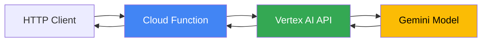

# How to Use the Go Vertex AI Client Library to Call Gemini Models from a Cloud Function

Author: [nawazdhandala](https://www.github.com/nawazdhandala)

Tags: GCP, Vertex AI, Go, Gemini, Cloud Functions, AI/ML

Description: Learn how to call Gemini models using the Go Vertex AI client library from a Google Cloud Function with practical examples and cost optimization tips.

---

Running AI inference in a serverless function is a compelling pattern. You get per-request billing, automatic scaling, and zero infrastructure to manage. Google Cloud Functions paired with Vertex AI's Gemini models gives you exactly that - a function that wakes up, calls Gemini, and goes back to sleep.

The Go Vertex AI client library makes this straightforward. Let me walk through building a Cloud Function that calls Gemini for text generation, handles streaming responses, and deals with the real-world concerns like timeouts and cost.

## Prerequisites

You need:

- A GCP project with Vertex AI API enabled
- Cloud Functions API enabled
- Go 1.21 or later

Enable the APIs if you have not already:

```bash
gcloud services enable cloudfunctions.googleapis.com
gcloud services enable aiplatform.googleapis.com
```

## Project Structure

Cloud Functions in Go follow a specific layout:

```
my-function/
  go.mod
  go.sum
  function.go
```

Initialize the module and add the Vertex AI dependency:

```bash
go mod init my-function
go get cloud.google.com/go/vertexai/genai
```

## Basic Text Generation

Here is a Cloud Function that takes a prompt and returns a Gemini response.

```go
package myfunction

import (
    "context"
    "encoding/json"
    "fmt"
    "log"
    "net/http"
    "os"

    "cloud.google.com/go/vertexai/genai"
    "github.com/GoogleCloudPlatform/functions-framework-go/functions"
)

// init registers the Cloud Function entry point
func init() {
    functions.HTTP("GenerateText", GenerateText)
}

// GenerateRequest represents the incoming request payload
type GenerateRequest struct {
    Prompt      string  `json:"prompt"`
    MaxTokens   int     `json:"max_tokens,omitempty"`
    Temperature float32 `json:"temperature,omitempty"`
}

// GenerateResponse represents the response payload
type GenerateResponse struct {
    Text         string `json:"text"`
    TokenCount   int    `json:"token_count,omitempty"`
    FinishReason string `json:"finish_reason,omitempty"`
}

// GenerateText handles HTTP requests for text generation using Gemini
func GenerateText(w http.ResponseWriter, r *http.Request) {
    if r.Method != http.MethodPost {
        http.Error(w, "Method not allowed", http.StatusMethodNotAllowed)
        return
    }

    // Parse the request body
    var req GenerateRequest
    if err := json.NewDecoder(r.Body).Decode(&req); err != nil {
        http.Error(w, "Invalid request body", http.StatusBadRequest)
        return
    }

    if req.Prompt == "" {
        http.Error(w, "Prompt is required", http.StatusBadRequest)
        return
    }

    // Set defaults for optional parameters
    if req.MaxTokens == 0 {
        req.MaxTokens = 1024
    }
    if req.Temperature == 0 {
        req.Temperature = 0.7
    }

    // Call Gemini
    text, err := callGemini(r.Context(), req)
    if err != nil {
        log.Printf("Gemini call failed: %v", err)
        http.Error(w, "Generation failed", http.StatusInternalServerError)
        return
    }

    // Return the response
    resp := GenerateResponse{Text: text}
    w.Header().Set("Content-Type", "application/json")
    json.NewEncoder(w).Encode(resp)
}
```

## The Gemini Client

The client setup is where the Vertex AI specifics come in. You need your project ID and region.

```go
// callGemini sends a prompt to the Gemini model and returns the generated text
func callGemini(ctx context.Context, req GenerateRequest) (string, error) {
    projectID := os.Getenv("GOOGLE_CLOUD_PROJECT")
    region := os.Getenv("VERTEX_AI_REGION")
    if region == "" {
        region = "us-central1"
    }

    // Create the Vertex AI client
    client, err := genai.NewClient(ctx, projectID, region)
    if err != nil {
        return "", fmt.Errorf("failed to create client: %w", err)
    }
    defer client.Close()

    // Select the Gemini model
    model := client.GenerativeModel("gemini-1.5-flash")

    // Configure generation parameters
    model.SetMaxOutputTokens(int32(req.MaxTokens))
    model.SetTemperature(req.Temperature)

    // Optional: set safety settings
    model.SafetySettings = []*genai.SafetySetting{
        {
            Category:  genai.HarmCategoryDangerousContent,
            Threshold: genai.HarmBlockMediumAndAbove,
        },
    }

    // Generate content from the prompt
    resp, err := model.GenerateContent(ctx, genai.Text(req.Prompt))
    if err != nil {
        return "", fmt.Errorf("generation failed: %w", err)
    }

    // Extract text from the response
    if len(resp.Candidates) == 0 || len(resp.Candidates[0].Content.Parts) == 0 {
        return "", fmt.Errorf("empty response from model")
    }

    // The response parts can be different types - we want the text parts
    var result string
    for _, part := range resp.Candidates[0].Content.Parts {
        if text, ok := part.(genai.Text); ok {
            result += string(text)
        }
    }

    return result, nil
}
```

## Multi-Turn Conversations

Gemini supports chat-style interactions where you send conversation history along with each request.

```go
// ChatRequest represents a multi-turn conversation request
type ChatRequest struct {
    Messages []ChatMessage `json:"messages"`
}

type ChatMessage struct {
    Role    string `json:"role"` // "user" or "model"
    Content string `json:"content"`
}

// callGeminiChat handles multi-turn conversations
func callGeminiChat(ctx context.Context, messages []ChatMessage) (string, error) {
    projectID := os.Getenv("GOOGLE_CLOUD_PROJECT")
    region := "us-central1"

    client, err := genai.NewClient(ctx, projectID, region)
    if err != nil {
        return "", err
    }
    defer client.Close()

    model := client.GenerativeModel("gemini-1.5-flash")

    // Start a chat session
    chat := model.StartChat()

    // Add conversation history (all messages except the last one)
    for _, msg := range messages[:len(messages)-1] {
        chat.History = append(chat.History, &genai.Content{
            Role: msg.Role,
            Parts: []genai.Part{
                genai.Text(msg.Content),
            },
        })
    }

    // Send the latest message
    lastMsg := messages[len(messages)-1]
    resp, err := chat.SendMessage(ctx, genai.Text(lastMsg.Content))
    if err != nil {
        return "", fmt.Errorf("chat failed: %w", err)
    }

    // Extract the response text
    var result string
    for _, part := range resp.Candidates[0].Content.Parts {
        if text, ok := part.(genai.Text); ok {
            result += string(text)
        }
    }

    return result, nil
}
```

## Handling Structured Output

You can ask Gemini to return JSON and parse it directly.

```go
// summarizeDocument asks Gemini to return a structured summary
func summarizeDocument(ctx context.Context, document string) (*DocumentSummary, error) {
    projectID := os.Getenv("GOOGLE_CLOUD_PROJECT")

    client, err := genai.NewClient(ctx, projectID, "us-central1")
    if err != nil {
        return nil, err
    }
    defer client.Close()

    model := client.GenerativeModel("gemini-1.5-flash")
    model.SetTemperature(0.2) // Lower temperature for more deterministic output

    // System instruction to guide the model's behavior
    model.SystemInstruction = &genai.Content{
        Parts: []genai.Part{
            genai.Text("You are a document summarizer. Always respond with valid JSON."),
        },
    }

    prompt := fmt.Sprintf(`Summarize this document and return JSON with these fields:
    - title: string
    - summary: string (2-3 sentences)
    - key_points: array of strings
    - sentiment: "positive", "negative", or "neutral"

    Document:
    %s`, document)

    resp, err := model.GenerateContent(ctx, genai.Text(prompt))
    if err != nil {
        return nil, err
    }

    // Parse the structured response
    var summary DocumentSummary
    text := extractText(resp)
    if err := json.Unmarshal([]byte(text), &summary); err != nil {
        return nil, fmt.Errorf("failed to parse structured response: %w", err)
    }

    return &summary, nil
}

type DocumentSummary struct {
    Title     string   `json:"title"`
    Summary   string   `json:"summary"`
    KeyPoints []string `json:"key_points"`
    Sentiment string   `json:"sentiment"`
}
```

## Deployment

Deploy the function with the right memory and timeout settings.

```bash
# Deploy the Cloud Function
gcloud functions deploy generate-text \
  --gen2 \
  --runtime=go122 \
  --region=us-central1 \
  --source=. \
  --entry-point=GenerateText \
  --trigger-http \
  --allow-unauthenticated \
  --memory=512Mi \
  --timeout=60s \
  --set-env-vars="VERTEX_AI_REGION=us-central1"
```

## Architecture



## Cost Optimization Tips

1. **Use Gemini Flash** - It is significantly cheaper than Gemini Pro for most tasks and responds faster.
2. **Set max tokens** - Do not let the model generate more text than you need.
3. **Cache the client** - In Cloud Functions with min instances, the client can be reused across invocations to avoid setup overhead.
4. **Use lower temperature** - For factual tasks, lower temperature reduces output length and cost.

## Testing

```bash
# Test the deployed function
curl -X POST https://REGION-PROJECT.cloudfunctions.net/generate-text \
  -H "Content-Type: application/json" \
  -d '{"prompt": "Explain Kubernetes in 3 sentences", "max_tokens": 200}'
```

## Wrapping Up

Calling Gemini from a Cloud Function is a clean way to add AI capabilities to your application without managing infrastructure. The Go Vertex AI client library handles authentication and serialization, and Cloud Functions gives you automatic scaling and per-invocation billing. Just watch your timeouts - Gemini calls can take a few seconds, and the default Cloud Function timeout might be too short for longer prompts.

For monitoring your AI-powered functions - tracking latency, error rates, and cost per invocation - OneUptime can help you stay on top of your serverless AI workloads.
