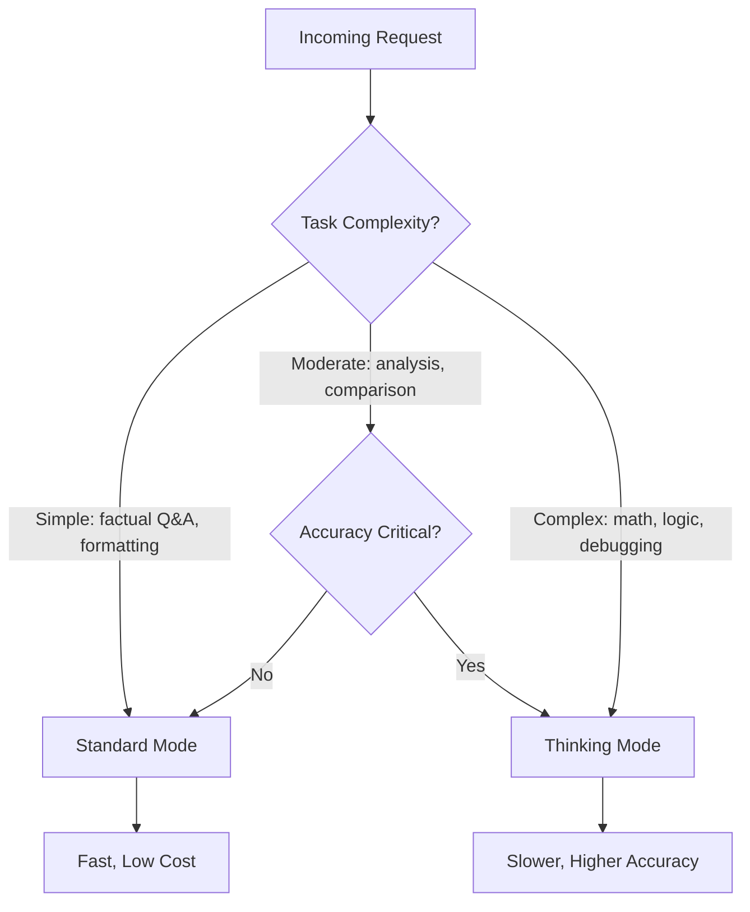

# How to Use Thinking Mode in Gemini 3 for Complex Reasoning Tasks

Author: [nawazdhandala](https://www.github.com/nawazdhandala)

Tags: GCP, Gemini, Vertex AI, Thinking Mode, Reasoning

Description: Learn how to use thinking mode in Gemini 3 on Vertex AI for complex reasoning tasks that require step-by-step analysis and multi-step problem solving.

---

Some problems are too complex for a model to solve in a single pass. Multi-step math, code debugging, strategic planning, and logical puzzles all benefit from the model taking time to think through the problem before giving an answer. Gemini 3 introduces a thinking mode that makes this explicit - the model shows its reasoning process before arriving at a conclusion.

This is not just chain-of-thought prompting. Thinking mode is a native capability where the model uses dedicated thinking tokens to work through problems. The result is more accurate answers on complex tasks, with the added benefit of transparency into how the model reached its conclusion.

## What Is Thinking Mode?

In thinking mode, Gemini generates two types of output: thinking tokens and response tokens. Thinking tokens represent the model's internal reasoning process - breaking down the problem, considering different approaches, checking its work. Response tokens are the final answer delivered to the user.

The thinking tokens are visible to you as the developer, which is useful for debugging and understanding model behavior. You can also control how many thinking tokens the model is allowed to use, trading off between reasoning depth and latency.

## Enabling Thinking Mode

Thinking mode is enabled through the generation configuration. Here is the basic setup:

```python
import vertexai
from vertexai.generative_models import GenerativeModel, GenerationConfig

# Initialize Vertex AI
vertexai.init(project="your-project-id", location="us-central1")

# Enable thinking mode through generation config
thinking_config = GenerationConfig(
    thinking_config={
        "thinking_budget": 8192  # Max thinking tokens to use
    }
)

# Create a model with thinking enabled
model = GenerativeModel("gemini-3.0-flash")

# Ask a complex reasoning question
response = model.generate_content(
    "A farmer has 100 meters of fencing. What dimensions should they use "
    "to create a rectangular enclosure with the maximum area, and what is "
    "that maximum area?",
    generation_config=thinking_config
)

print(response.text)
```

## Accessing the Thinking Process

The response includes both the thinking process and the final answer. You can access them separately.

```python
# Generate a response with thinking
response = model.generate_content(
    "Determine whether this syllogism is valid: "
    "All cats are animals. Some animals are pets. "
    "Therefore, some cats are pets.",
    generation_config=thinking_config
)

# Access different parts of the response
for part in response.candidates[0].content.parts:
    if hasattr(part, 'thought') and part.thought:
        print("=== THINKING PROCESS ===")
        print(part.text)
        print()
    else:
        print("=== FINAL ANSWER ===")
        print(part.text)
```

## Configuring Thinking Budget

The thinking budget controls how many tokens the model can use for reasoning. A higher budget allows deeper thinking but increases latency and cost. A lower budget forces the model to reason more quickly.

```python
# Low budget for simpler reasoning tasks
quick_config = GenerationConfig(
    thinking_config={"thinking_budget": 1024}
)

# Medium budget for moderate complexity
moderate_config = GenerationConfig(
    thinking_config={"thinking_budget": 4096}
)

# High budget for very complex problems
deep_config = GenerationConfig(
    thinking_config={"thinking_budget": 16384}
)

# Compare results with different budgets
problem = (
    "A company has 3 factories. Factory A produces 40% of products with "
    "a 2% defect rate. Factory B produces 35% with a 3% defect rate. "
    "Factory C produces 25% with a 5% defect rate. If a randomly selected "
    "product is defective, what is the probability it came from Factory C?"
)

for label, config in [("Quick", quick_config), ("Moderate", moderate_config), ("Deep", deep_config)]:
    response = model.generate_content(problem, generation_config=config)
    print(f"\n{label} thinking:")
    print(response.text[:300])
```

## Complex Code Debugging

Thinking mode shines when debugging complex code. The model can systematically trace through code execution and identify issues.

```python
buggy_code = '''
def find_duplicates(lst):
    """Find all duplicate elements in a list."""
    seen = set()
    duplicates = set()
    for item in lst:
        if item in seen:
            duplicates.add(item)
        seen.add(item)
    return list(duplicates)

def merge_sorted_lists(list1, list2):
    """Merge two sorted lists into one sorted list."""
    result = []
    i = j = 0
    while i < len(list1) and j < len(list2):
        if list1[i] <= list2[j]:
            result.append(list1[i])
            i += 1
        else:
            result.append(list2[j])
            j += 1
    return result

# This test fails
test1 = merge_sorted_lists([1, 3, 5], [2, 4, 6])
# Expected: [1, 2, 3, 4, 5, 6]
# Actual: [1, 2, 3, 4, 5]
'''

response = model.generate_content(
    f"Find and fix the bug in this code. Explain your reasoning step by step.\n\n{buggy_code}",
    generation_config=deep_config
)

print(response.text)
```

## Mathematical Problem Solving

For math problems that require multiple steps, thinking mode provides transparency into each step of the solution.

```python
math_problem = """
Solve this optimization problem:

A company manufactures two products, X and Y.
- Product X requires 2 hours of machining and 1 hour of assembly
- Product Y requires 1 hour of machining and 3 hours of assembly
- Available machining time: 100 hours per week
- Available assembly time: 90 hours per week
- Profit per unit of X: $40
- Profit per unit of Y: $60

Find the number of each product to manufacture to maximize profit.
Use the simplex method or graphical method, showing all work.
"""

response = model.generate_content(
    math_problem,
    generation_config=GenerationConfig(
        thinking_config={"thinking_budget": 8192}
    )
)

print(response.text)
```

## Strategic Analysis

Thinking mode is valuable for tasks that require weighing multiple factors and considering trade-offs.

```python
strategy_prompt = """
We are deciding between three database options for our new microservice:

1. Cloud SQL (PostgreSQL) - managed relational database
2. Cloud Spanner - globally distributed relational database
3. Firestore - document database

Our requirements:
- Expected data volume: 500GB growing to 5TB over 2 years
- Read-heavy workload (90% reads, 10% writes)
- Need strong consistency
- Multi-region deployment planned for year 2
- Team has strong SQL experience but limited NoSQL experience
- Budget is moderate (not a startup, but cost matters)
- Need to support complex queries with joins

Analyze each option against our requirements and recommend the best choice
with a clear justification.
"""

response = model.generate_content(
    strategy_prompt,
    generation_config=GenerationConfig(
        thinking_config={"thinking_budget": 8192}
    )
)

print(response.text)
```

## Using Thinking Mode in Chat

Thinking mode works in multi-turn conversations. The model can build on its previous reasoning across turns.

```python
chat = model.start_chat()

# Turn 1: Present the problem
response = chat.send_message(
    "I have a distributed system where service A calls service B, "
    "which calls service C. Lately we are seeing intermittent timeouts "
    "in service A, but services B and C seem healthy according to their "
    "own metrics. Help me debug this.",
    generation_config=thinking_config
)
print(response.text)

# Turn 2: Provide more context based on the model's questions
response = chat.send_message(
    "Service A has a 5-second timeout for calls to B. "
    "B has a 3-second timeout for calls to C. "
    "C's p99 latency is 2.8 seconds. "
    "B's processing adds about 500ms.",
    generation_config=thinking_config
)
print(response.text)

# Turn 3: Drill deeper
response = chat.send_message(
    "That makes sense. How would you restructure the timeout chain "
    "to prevent this cascading timeout issue?",
    generation_config=thinking_config
)
print(response.text)
```

## When to Use Thinking Mode

Thinking mode is not always necessary. It adds latency and cost, so use it selectively.



Good use cases for thinking mode:
- Multi-step mathematical calculations
- Code debugging and analysis
- Logical reasoning and puzzles
- Strategic decision analysis
- Complex data interpretation
- Root cause analysis

Probably not worth it for:
- Simple factual questions
- Text formatting or translation
- Classification tasks
- Summarization

## Comparing Results With and Without Thinking

To validate whether thinking mode improves your specific use case, compare outputs systematically.

```python
def compare_thinking_modes(prompt, num_runs=3):
    """Compare responses with and without thinking mode."""
    standard_config = GenerationConfig(temperature=0.1)
    thinking_config_local = GenerationConfig(
        temperature=0.1,
        thinking_config={"thinking_budget": 8192}
    )

    print(f"Prompt: {prompt[:80]}...\n")

    for mode, config in [("Standard", standard_config), ("Thinking", thinking_config_local)]:
        responses = []
        for _ in range(num_runs):
            response = model.generate_content(prompt, generation_config=config)
            responses.append(response.text)

        print(f"\n{mode} mode responses:")
        for i, r in enumerate(responses):
            print(f"  Run {i+1}: {r[:200]}...")

compare_thinking_modes(
    "What is 17 * 23 + 45 * 12 - 89 * 3 + 156 / 12?"
)
```

## Wrapping Up

Thinking mode in Gemini 3 gives you a tool for problems where accuracy matters more than speed. It makes the model's reasoning transparent and verifiable, which is especially important for complex analysis, debugging, and mathematical tasks. Use it selectively - not every query needs deep reasoning - and adjust the thinking budget based on problem complexity. Monitor the latency impact with tools like OneUptime to find the right balance for your application between reasoning depth and response time.
