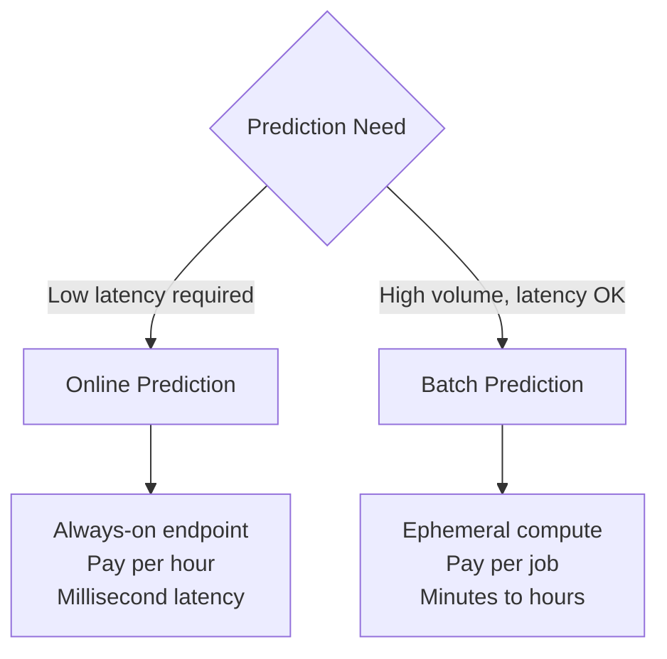

# How to Use Vertex AI Batch Prediction for Large-Scale Inference Workloads

Author: [nawazdhandala](https://www.github.com/nawazdhandala)

Tags: GCP, Vertex AI, Batch Prediction, Inference, Large Scale

Description: Learn how to run large-scale batch prediction jobs on Vertex AI for efficiently processing millions of records without maintaining always-on serving infrastructure.

---

Not every prediction needs to happen in real-time. When you need to score your entire customer database for a marketing campaign, generate recommendations for all users overnight, or classify millions of documents, running these through an online endpoint is slow and expensive. Batch prediction processes all your data in one job, scales the compute automatically, and shuts down when it is done.

Vertex AI Batch Prediction takes your data from BigQuery or GCS, runs it through your model using multiple machines in parallel, and writes the results back. You pay only for the compute time used, which is significantly cheaper than keeping prediction endpoints running 24/7 for occasional large-scale inference.

## When to Use Batch vs Online Prediction

Online prediction is for real-time, low-latency requests - a user makes a purchase and you need a fraud score in milliseconds. Batch prediction is for processing large volumes where latency is not critical - scoring all transactions from the past day for audit purposes.



## Running a Basic Batch Prediction Job

The simplest batch prediction reads from GCS and writes results back to GCS.

This code submits a batch prediction job:

```python
from google.cloud import aiplatform

aiplatform.init(project="your-project-id", location="us-central1")

# Reference your uploaded model
model = aiplatform.Model(
    "projects/your-project-id/locations/us-central1/models/YOUR_MODEL_ID"
)

# Submit batch prediction job
batch_job = model.batch_predict(
    job_display_name="customer-scoring-2026-02",
    gcs_source="gs://your-bucket/data/customers.jsonl",
    gcs_destination_prefix="gs://your-bucket/predictions/customer-scoring/",
    instances_format="jsonl",  # Input format: jsonl, csv, tf-record, etc
    predictions_format="jsonl",  # Output format
    machine_type="n1-standard-4",
    starting_replica_count=5,  # Start with 5 machines
    max_replica_count=20,  # Scale up to 20 if needed
    sync=False  # Do not block - run in background
)

print(f"Batch job submitted: {batch_job.resource_name}")
print(f"State: {batch_job.state}")
```

## Input Data Formats

Vertex AI Batch Prediction supports several input formats. The format must match what your model expects.

For JSONL input, each line is a JSON object representing one instance:

```json
{"feature1": 0.5, "feature2": "category_a", "feature3": 42}
{"feature1": 0.8, "feature2": "category_b", "feature3": 17}
{"feature1": 0.2, "feature2": "category_a", "feature3": 93}
```

For CSV input:

```
feature1,feature2,feature3
0.5,category_a,42
0.8,category_b,17
0.2,category_a,93
```

This code prepares JSONL input from a pandas DataFrame:

```python
import pandas as pd
import json

def prepare_batch_input(df, output_path, id_column=None):
    """Convert a DataFrame to JSONL format for batch prediction.

    Args:
        df: Input DataFrame with features
        output_path: Path to write the JSONL file
        id_column: Optional column to use as instance key (for joining results)
    """
    with open(output_path, "w") as f:
        for _, row in df.iterrows():
            instance = row.to_dict()

            # Vertex AI can pass through an instance key for matching
            if id_column and id_column in instance:
                # Move the ID to the instance key field
                pass  # Keep it in the instance for result matching

            f.write(json.dumps(instance) + "\n")

    print(f"Wrote {len(df)} instances to {output_path}")

# Example
df = pd.read_csv("customers.csv")
prepare_batch_input(df, "customers.jsonl", id_column="customer_id")
```

## Batch Prediction from BigQuery

For large datasets already in BigQuery, you can read directly from a BigQuery table and write results back to BigQuery.

This code runs batch prediction with BigQuery I/O:

```python
from google.cloud import aiplatform

aiplatform.init(project="your-project-id", location="us-central1")

model = aiplatform.Model(
    "projects/your-project-id/locations/us-central1/models/YOUR_MODEL_ID"
)

# Batch predict with BigQuery source and destination
batch_job = model.batch_predict(
    job_display_name="bq-customer-scoring",
    bigquery_source="bq://your-project-id.dataset.customer_features",
    bigquery_destination_prefix="bq://your-project-id.dataset",
    instances_format="bigquery",
    predictions_format="bigquery",
    machine_type="n1-standard-8",
    starting_replica_count=10,
    max_replica_count=50,
    sync=False
)

print(f"Job: {batch_job.resource_name}")
```

The output table will be created automatically with the prediction results appended to the original columns.

## GPU Batch Prediction

For deep learning models, use GPU machines to speed up batch inference.

This code configures a GPU batch job:

```python
batch_job = model.batch_predict(
    job_display_name="image-classification-batch",
    gcs_source="gs://your-bucket/data/images/*.jsonl",
    gcs_destination_prefix="gs://your-bucket/predictions/images/",
    instances_format="jsonl",
    predictions_format="jsonl",
    machine_type="n1-standard-8",
    accelerator_type="NVIDIA_TESLA_T4",
    accelerator_count=1,
    starting_replica_count=5,
    max_replica_count=20,
    sync=False
)
```

## Batch Prediction with Explanations

You can request feature attributions alongside predictions in batch mode. This is useful for model auditing and compliance.

```python
batch_job = model.batch_predict(
    job_display_name="batch-with-explanations",
    gcs_source="gs://your-bucket/data/loan-applications.jsonl",
    gcs_destination_prefix="gs://your-bucket/predictions/loan-explanations/",
    instances_format="jsonl",
    predictions_format="jsonl",
    machine_type="n1-standard-8",
    starting_replica_count=5,
    max_replica_count=20,
    generate_explanation=True,  # Include feature attributions
    sync=False
)
```

## Monitoring Batch Job Progress

Track the progress and status of your batch prediction job.

This code monitors a running job:

```python
from google.cloud import aiplatform
import time

def monitor_batch_job(job_resource_name):
    """Monitor a batch prediction job until completion."""
    job = aiplatform.BatchPredictionJob(job_resource_name)

    while True:
        job_state = job.state

        if job_state == "JOB_STATE_SUCCEEDED":
            print("Job completed successfully!")
            print(f"Output: {job.output_info}")
            return True

        elif job_state == "JOB_STATE_FAILED":
            print(f"Job failed: {job.error}")
            return False

        elif job_state == "JOB_STATE_CANCELLED":
            print("Job was cancelled")
            return False

        else:
            print(f"Job state: {job_state}")
            # Check completion percentage if available
            if hasattr(job, "completion_stats"):
                stats = job.completion_stats
                if stats:
                    print(f"  Completed: {stats.successful_count}")
                    print(f"  Failed: {stats.failed_count}")
                    print(f"  Incomplete: {stats.incomplete_count}")

            time.sleep(60)  # Check every minute

monitor_batch_job("projects/your-project/locations/us-central1/batchPredictionJobs/JOB_ID")
```

## Processing Batch Results

After the job completes, process the output predictions.

This code reads and processes JSONL output:

```python
import json
import pandas as pd
from google.cloud import storage

def read_batch_results(gcs_output_prefix):
    """Read all prediction output files from GCS."""
    client = storage.Client()

    # Parse the GCS prefix
    parts = gcs_output_prefix.replace("gs://", "").split("/", 1)
    bucket_name = parts[0]
    prefix = parts[1]

    bucket = client.bucket(bucket_name)
    blobs = list(bucket.list_blobs(prefix=prefix))

    all_results = []
    for blob in blobs:
        if blob.name.endswith(".jsonl"):
            content = blob.download_as_text()
            for line in content.strip().split("\n"):
                result = json.loads(line)
                all_results.append(result)

    print(f"Read {len(all_results)} predictions from {len(blobs)} files")
    return all_results

def results_to_dataframe(results):
    """Convert batch results to a pandas DataFrame."""
    rows = []
    for result in results:
        instance = result.get("instance", {})
        prediction = result.get("prediction", {})

        row = {**instance}

        # Flatten prediction into the row
        if isinstance(prediction, dict):
            for k, v in prediction.items():
                row[f"pred_{k}"] = v
        else:
            row["prediction"] = prediction

        rows.append(row)

    return pd.DataFrame(rows)

# Read and process results
results = read_batch_results("gs://your-bucket/predictions/customer-scoring/")
df = results_to_dataframe(results)

# Analyze the results
print(f"Total predictions: {len(df)}")
print(f"Positive predictions: {(df['prediction'] > 0.5).sum()}")
print(f"Average score: {df['prediction'].mean():.4f}")
```

## Scheduling Recurring Batch Jobs

For regular batch processing, use Cloud Scheduler to trigger batch jobs automatically.

This Cloud Function runs a batch prediction on schedule:

```python
import functions_framework
from google.cloud import aiplatform
from datetime import datetime

@functions_framework.http
def run_daily_batch(request):
    """Cloud Function triggered by Cloud Scheduler for daily batch prediction."""
    aiplatform.init(project="your-project-id", location="us-central1")

    today = datetime.now().strftime("%Y-%m-%d")

    model = aiplatform.Model(
        "projects/your-project-id/locations/us-central1/models/YOUR_MODEL_ID"
    )

    batch_job = model.batch_predict(
        job_display_name=f"daily-scoring-{today}",
        bigquery_source="bq://your-project-id.features.daily_features",
        bigquery_destination_prefix="bq://your-project-id.predictions",
        instances_format="bigquery",
        predictions_format="bigquery",
        machine_type="n1-standard-8",
        starting_replica_count=10,
        max_replica_count=50,
        sync=False
    )

    return {
        "status": "submitted",
        "job_name": batch_job.resource_name,
        "date": today
    }
```

## Cost Optimization Tips

Batch prediction pricing is based on compute hours (machine type and duration) plus any accelerators. Here are ways to minimize costs.

Choose the right machine type. For CPU models, n1-standard-4 is usually sufficient. Larger machines help if your model is memory-intensive. For GPU models, a single T4 per machine is the most cost-effective option for inference.

Set `starting_replica_count` based on your data size. For a million rows with a simple model, 5-10 replicas finish in minutes. For 100 million rows or complex deep learning models, start with 20-50 replicas.

Use preemptible machines for non-urgent batch jobs. While Vertex AI does not directly expose preemptible options for batch prediction, you can run custom jobs with preemptible VMs and implement your own batching logic for significant savings.

Split very large jobs. If you have a billion records, split them into smaller batch jobs that run in parallel. This provides better fault tolerance - if one job fails, you only need to retry that portion.

Batch prediction on Vertex AI removes the need to maintain always-on prediction infrastructure for periodic, high-volume inference workloads. The managed scaling and automatic cleanup mean you process your data efficiently and pay only for what you use.
