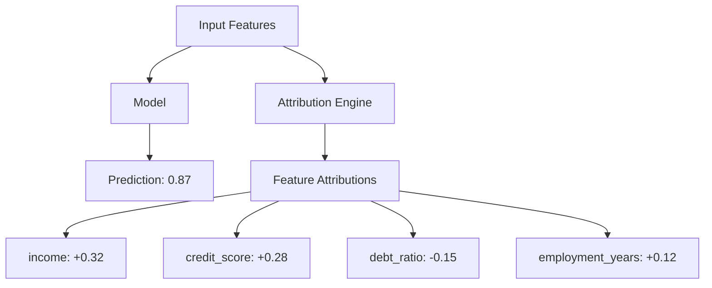

# How to Use Vertex AI Explainable AI for Feature Attribution on Tabular Models

Author: [nawazdhandala](https://www.github.com/nawazdhandala)

Tags: GCP, Vertex AI, Explainable AI, Feature Attribution, Tabular Models

Description: A practical guide to using Vertex AI Explainable AI to understand which features drive your tabular model predictions through feature attribution.

---

A model that predicts loan defaults with 95% accuracy is impressive until someone asks why a specific application was rejected. "The model said so" is not an acceptable answer for regulators, customers, or your own debugging process. Feature attribution tells you which input features contributed most to each prediction, turning your black-box model into something you can actually explain.

Vertex AI Explainable AI provides built-in feature attribution methods that work with tabular models deployed on Vertex AI endpoints. You configure it once during model upload, and every prediction can include explanations at no extra training cost.

## How Feature Attribution Works

Feature attribution assigns a numerical value to each input feature indicating how much it contributed to the prediction. A positive attribution means the feature pushed the prediction higher, while a negative attribution means it pushed it lower.

Vertex AI supports several attribution methods, but for tabular data, the most commonly used are Sampled Shapley and Integrated Gradients (for differentiable models like neural networks).



## Configuring Explanations During Model Upload

You configure the explanation method and parameters when uploading your model to the Vertex AI Model Registry.

This code uploads a model with Sampled Shapley explanations enabled:

```python
from google.cloud import aiplatform
from google.cloud.aiplatform import explain

aiplatform.init(project="your-project-id", location="us-central1")

# Define the explanation metadata
# This tells Vertex AI which inputs are features and which output to explain
explanation_metadata = explain.ExplanationMetadata(
    inputs={
        "income": explain.ExplanationMetadata.InputMetadata(
            input_tensor_name="income",
            encoding=explain.ExplanationMetadata.InputMetadata.Encoding.IDENTITY,
            modality="numeric"
        ),
        "credit_score": explain.ExplanationMetadata.InputMetadata(
            input_tensor_name="credit_score",
            encoding=explain.ExplanationMetadata.InputMetadata.Encoding.IDENTITY,
            modality="numeric"
        ),
        "debt_ratio": explain.ExplanationMetadata.InputMetadata(
            input_tensor_name="debt_ratio",
            encoding=explain.ExplanationMetadata.InputMetadata.Encoding.IDENTITY,
            modality="numeric"
        ),
        "employment_years": explain.ExplanationMetadata.InputMetadata(
            input_tensor_name="employment_years",
            encoding=explain.ExplanationMetadata.InputMetadata.Encoding.IDENTITY,
            modality="numeric"
        ),
        "loan_amount": explain.ExplanationMetadata.InputMetadata(
            input_tensor_name="loan_amount",
            encoding=explain.ExplanationMetadata.InputMetadata.Encoding.IDENTITY,
            modality="numeric"
        )
    },
    outputs={
        "default_probability": explain.ExplanationMetadata.OutputMetadata(
            output_tensor_name="default_probability"
        )
    }
)

# Configure Sampled Shapley with 25 sample paths
explanation_parameters = explain.ExplanationParameters(
    sampled_shapley_attribution=explain.SampledShapleyAttribution(
        path_count=25  # More paths = more accurate but slower
    )
)

# Upload the model with explanation config
model = aiplatform.Model.upload(
    display_name="loan-default-explainable",
    artifact_uri="gs://your-bucket/models/loan-default/",
    serving_container_image_uri="us-docker.pkg.dev/vertex-ai/prediction/tf2-cpu.2-13:latest",
    explanation_metadata=explanation_metadata,
    explanation_parameters=explanation_parameters
)

print(f"Model uploaded: {model.resource_name}")
```

## Deploying and Getting Explanations

After uploading the model with explanation configuration, deploy it to an endpoint and request explanations alongside predictions.

This code deploys the model and requests explanations:

```python
# Create and deploy to an endpoint
endpoint = aiplatform.Endpoint.create(
    display_name="loan-default-endpoint"
)

model.deploy(
    endpoint=endpoint,
    machine_type="n1-standard-4",
    min_replica_count=1,
    max_replica_count=3
)

# Send a prediction request with explanations
instances = [
    {
        "income": 75000,
        "credit_score": 680,
        "debt_ratio": 0.35,
        "employment_years": 5,
        "loan_amount": 250000
    },
    {
        "income": 45000,
        "credit_score": 580,
        "debt_ratio": 0.55,
        "employment_years": 1,
        "loan_amount": 300000
    }
]

# Request predictions with explanations
response = endpoint.explain(instances=instances)

# Process the explanations
for i, explanation in enumerate(response.explanations):
    print(f"\n--- Instance {i + 1} ---")
    print(f"Prediction: {response.predictions[i]}")

    attributions = explanation.attributions[0]
    print(f"Baseline output: {attributions.baseline_output_value}")
    print(f"Instance output: {attributions.instance_output_value}")
    print(f"Output index: {attributions.output_index}")

    # Print feature attributions sorted by magnitude
    feature_attrs = attributions.feature_attributions
    sorted_attrs = sorted(
        feature_attrs.items(),
        key=lambda x: abs(x[1]),
        reverse=True
    )

    print("Feature attributions (sorted by importance):")
    for feature, value in sorted_attrs:
        direction = "+" if value > 0 else ""
        print(f"  {feature}: {direction}{value:.4f}")
```

## Understanding the Attribution Output

The attribution output contains several important values. The baseline output is the model's prediction when all features are at their baseline values (typically the mean or median of the training data). The instance output is the actual prediction for the given input. The difference between these two is distributed across the feature attributions.

This means the attributions sum up to approximately the difference between the instance output and the baseline output. If the baseline default probability is 0.15 and the instance prediction is 0.72, the feature attributions should sum to approximately 0.57.

## Using Integrated Gradients for Neural Networks

If your model is a neural network (TensorFlow or PyTorch), Integrated Gradients often provides better explanations than Sampled Shapley because it can leverage the model's gradient information.

This code configures Integrated Gradients:

```python
# Configure Integrated Gradients instead of Sampled Shapley
explanation_parameters = explain.ExplanationParameters(
    integrated_gradients_attribution=explain.IntegratedGradientsAttribution(
        step_count=50,  # Number of interpolation steps
        smooth_grad_config=explain.SmoothGradConfig(
            noise_sigma=0.1,  # Adds noise for smoother attributions
            noisy_sample_count=3  # Number of noisy samples
        )
    )
)

# Upload with Integrated Gradients
model = aiplatform.Model.upload(
    display_name="loan-default-ig-explainable",
    artifact_uri="gs://your-bucket/models/loan-default-nn/",
    serving_container_image_uri="us-docker.pkg.dev/vertex-ai/prediction/tf2-cpu.2-13:latest",
    explanation_metadata=explanation_metadata,
    explanation_parameters=explanation_parameters
)
```

## Batch Explanations for Analysis

For analyzing feature importance across your entire dataset, use batch explanations instead of calling the endpoint one instance at a time.

This code runs batch explanations:

```python
# Run batch explanation job
batch_job = model.batch_predict(
    job_display_name="loan-default-batch-explain",
    gcs_source="gs://your-bucket/data/loan-applications.jsonl",
    gcs_destination_prefix="gs://your-bucket/explanations/",
    instances_format="jsonl",
    predictions_format="jsonl",
    generate_explanation=True,  # Include explanations in output
    machine_type="n1-standard-4",
    starting_replica_count=2,
    max_replica_count=5
)

batch_job.wait()
print(f"Batch explanations saved to: {batch_job.output_info}")
```

## Analyzing Feature Importance Across a Dataset

After running batch explanations, you can aggregate the attributions to understand global feature importance.

This code aggregates feature attributions from batch results:

```python
import json
import pandas as pd
import numpy as np

def analyze_global_feature_importance(explanations_path):
    """Aggregate feature attributions across all instances."""
    # Load batch explanation results
    attributions_list = []

    with open(explanations_path, "r") as f:
        for line in f:
            result = json.loads(line)
            attrs = result["explanation"]["attributions"][0]["featureAttributions"]
            attributions_list.append(attrs)

    # Convert to DataFrame
    attr_df = pd.DataFrame(attributions_list)

    # Calculate global importance metrics
    importance = pd.DataFrame({
        "mean_absolute_attribution": attr_df.abs().mean(),
        "mean_attribution": attr_df.mean(),
        "std_attribution": attr_df.std(),
        "positive_rate": (attr_df > 0).mean()
    })

    importance = importance.sort_values(
        "mean_absolute_attribution", ascending=False
    )

    print("Global Feature Importance:")
    print(importance.to_string())

    return importance

importance = analyze_global_feature_importance(
    "explanations_output.jsonl"
)
```

## Practical Considerations

The number of sample paths for Sampled Shapley directly affects both accuracy and latency. With 25 paths, each explanation request takes roughly 25 times longer than a plain prediction. For real-time serving where latency matters, start with 10 paths and increase only if the explanations seem unstable across repeated calls for the same input.

For categorical features with high cardinality, consider grouping related categories before computing attributions. Explaining 500 individual one-hot encoded features is less useful than explaining "product category" as a single grouped feature.

Feature attributions explain individual predictions, but they do not tell you whether the model is correct. A model could be confidently wrong while providing perfectly valid attributions. Always use explanations alongside standard evaluation metrics.

Finally, remember that explanations add cost. Each explanation request requires multiple forward passes through your model. If you only need explanations for a subset of predictions - like flagged or disputed decisions - consider setting up a separate explanation endpoint that you call selectively rather than requesting explanations for every single prediction.
