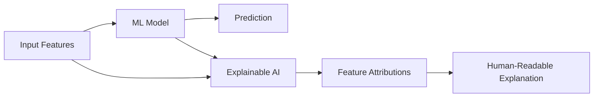

# How to Use Vertex AI Explainable AI to Interpret Predictions and Build Trust

Author: [nawazdhandala](https://www.github.com/nawazdhandala)

Tags: GCP, Vertex AI, Explainable AI, XAI, Machine Learning, Model Interpretability, Google Cloud

Description: Use Vertex AI Explainable AI to understand why your ML models make specific predictions, helping build trust and satisfy regulatory requirements.

---

A model that predicts a loan application will be denied is not useful if nobody can explain why. Regulators require it, customers expect it, and your own team needs it to debug problems. Vertex AI Explainable AI provides feature attributions - quantified explanations of how much each input feature contributed to a prediction. In this guide, I will show you how to configure explanations for your models and use them in practice.

## What Explainable AI Provides

Vertex AI Explainable AI computes feature attributions using methods like Sampled Shapley and Integrated Gradients. For each prediction, you get a breakdown showing which features pushed the prediction higher or lower, and by how much.

For example, if a model denies a loan, the explanation might show:
- Credit score: -0.35 (strong push toward denial)
- Income: +0.15 (pushed toward approval)
- Debt-to-income ratio: -0.28 (pushed toward denial)
- Employment length: +0.08 (mild push toward approval)



## Step 1: Configure Explanations for an AutoML Model

AutoML models get explanations automatically. You just need to enable them when deploying:

```python
from google.cloud import aiplatform

aiplatform.init(project="your-project-id", location="us-central1")

model = aiplatform.Model(
    model_name="projects/your-project-id/locations/us-central1/models/YOUR_MODEL_ID"
)

# Deploy with explanations enabled
# AutoML models use Sampled Shapley by default
endpoint = model.deploy(
    deployed_model_display_name="loan-model-with-explanations",
    machine_type="n1-standard-4",
    min_replica_count=1,
    max_replica_count=5,
    explanation_metadata=model.explanation_metadata,
    explanation_parameters=model.explanation_parameters,
)

print(f"Deployed with explanations: {endpoint.resource_name}")
```

## Step 2: Configure Explanations for a Custom Model

For custom-trained models, you need to specify the explanation configuration explicitly:

```python
from google.cloud.aiplatform import explain

# Define which features should be explained
explanation_metadata = explain.ExplanationMetadata(
    inputs={
        "credit_score": explain.ExplanationMetadata.InputMetadata(
            input_tensor_name="credit_score",
            encoding=explain.ExplanationMetadata.InputMetadata.Encoding.IDENTITY,
        ),
        "annual_income": explain.ExplanationMetadata.InputMetadata(
            input_tensor_name="annual_income",
            encoding=explain.ExplanationMetadata.InputMetadata.Encoding.IDENTITY,
        ),
        "debt_to_income": explain.ExplanationMetadata.InputMetadata(
            input_tensor_name="debt_to_income",
            encoding=explain.ExplanationMetadata.InputMetadata.Encoding.IDENTITY,
        ),
        "employment_years": explain.ExplanationMetadata.InputMetadata(
            input_tensor_name="employment_years",
            encoding=explain.ExplanationMetadata.InputMetadata.Encoding.IDENTITY,
        ),
        "loan_amount": explain.ExplanationMetadata.InputMetadata(
            input_tensor_name="loan_amount",
            encoding=explain.ExplanationMetadata.InputMetadata.Encoding.IDENTITY,
        ),
    },
    outputs={
        "approval_probability": explain.ExplanationMetadata.OutputMetadata(
            output_tensor_name="approval_probability",
        ),
    },
)

# Configure the explanation algorithm
# Sampled Shapley works for any model type
explanation_parameters = explain.ExplanationParameters(
    sampled_shapley_attribution=explain.SampledShapleyAttribution(
        path_count=25,  # More paths = more accurate but slower
    ),
)

# Deploy the custom model with explanation config
endpoint = model.deploy(
    deployed_model_display_name="custom-loan-model-explained",
    machine_type="n1-standard-4",
    explanation_metadata=explanation_metadata,
    explanation_parameters=explanation_parameters,
)
```

For deep learning models, use Integrated Gradients instead:

```python
# Integrated Gradients works better for neural network models
explanation_parameters = explain.ExplanationParameters(
    integrated_gradients_attribution=explain.IntegratedGradientsAttribution(
        step_count=50,  # Number of steps for the gradient path
        smooth_grad_config=explain.SmoothGradConfig(
            noise_sigma=0.1,  # Smoothing for more stable attributions
            noisy_sample_count=3,
        ),
    ),
)
```

## Step 3: Get Predictions with Explanations

Request explanations alongside predictions:

```python
def predict_with_explanations(endpoint, instances):
    """Get predictions and feature attributions in a single call.
    Returns both the prediction and the explanation for each instance."""

    response = endpoint.explain(instances=instances)

    results = []
    for prediction, explanation in zip(response.predictions, response.explanations):
        # Extract feature attributions from the explanation
        attributions = {}
        for attr in explanation.attributions:
            for feature_name, attribution in attr.feature_attributions.items():
                attributions[feature_name] = float(attribution)

        results.append({
            "prediction": prediction,
            "attributions": attributions,
            "baseline_prediction": float(attr.baseline_output_value),
            "instance_output": float(attr.instance_output_value),
            "approximation_error": float(attr.approximation_error),
        })

    return results

# Get an explained prediction
instances = [{
    "credit_score": 680,
    "annual_income": 75000,
    "debt_to_income": 0.35,
    "employment_years": 5,
    "loan_amount": 25000,
}]

results = predict_with_explanations(endpoint, instances)

for result in results:
    print(f"Prediction: {result['prediction']}")
    print(f"Approximation Error: {result['approximation_error']:.4f}")
    print("\nFeature Attributions (sorted by impact):")
    sorted_attrs = sorted(
        result['attributions'].items(),
        key=lambda x: abs(x[1]),
        reverse=True
    )
    for feature, attribution in sorted_attrs:
        direction = "+" if attribution > 0 else ""
        print(f"  {feature}: {direction}{attribution:.4f}")
```

## Step 4: Build Human-Readable Explanations

Convert raw attributions into explanations that non-technical users can understand:

```python
def generate_human_explanation(prediction_result, threshold=0.5):
    """Convert feature attributions into a natural language explanation.
    Useful for customer-facing applications where technical details are not appropriate."""

    prediction = prediction_result["prediction"]
    attributions = prediction_result["attributions"]
    decision = "approved" if prediction >= threshold else "denied"

    # Sort features by absolute attribution value
    sorted_features = sorted(
        attributions.items(),
        key=lambda x: abs(x[1]),
        reverse=True
    )

    # Build the explanation
    explanation_parts = [f"The application was {decision}."]
    explanation_parts.append("The main factors in this decision were:")

    # Map feature names to human-readable descriptions
    feature_names = {
        "credit_score": "credit score",
        "annual_income": "annual income",
        "debt_to_income": "debt-to-income ratio",
        "employment_years": "length of employment",
        "loan_amount": "requested loan amount",
    }

    for feature, attribution in sorted_features[:3]:  # Top 3 factors
        name = feature_names.get(feature, feature)
        if attribution > 0:
            explanation_parts.append(f"  - Your {name} positively contributed to the decision")
        else:
            explanation_parts.append(f"  - Your {name} negatively contributed to the decision")

    return "\n".join(explanation_parts)

# Generate a customer-facing explanation
explanation = generate_human_explanation(results[0])
print(explanation)
```

## Step 5: Monitor Explanations Over Time

Track how feature attributions change over time to detect model drift or data issues:

```python
# Store explanations in BigQuery for trend analysis
from google.cloud import bigquery
import json

bq_client = bigquery.Client()

def log_explanation(prediction_result, request_metadata):
    """Log prediction explanations to BigQuery for monitoring and auditing."""

    record = {
        "prediction_id": request_metadata.get("request_id"),
        "timestamp": datetime.utcnow().isoformat(),
        "prediction_value": prediction_result["prediction"],
        "attributions": json.dumps(prediction_result["attributions"]),
        "approximation_error": prediction_result["approximation_error"],
        "top_positive_feature": max(
            prediction_result["attributions"].items(),
            key=lambda x: x[1]
        )[0],
        "top_negative_feature": min(
            prediction_result["attributions"].items(),
            key=lambda x: x[1]
        )[0],
    }

    table_ref = bq_client.dataset("ml_monitoring").table("explanation_logs")
    bq_client.insert_rows_json(table_ref, [record])
```

Query for attribution trends:

```sql
-- Track which features are driving predictions over time
-- Significant shifts may indicate data drift or model problems
SELECT
    DATE(timestamp) AS date,
    top_positive_feature,
    COUNT(*) AS count,
    AVG(CAST(JSON_VALUE(attributions, CONCAT('$.', top_positive_feature)) AS FLOAT64)) AS avg_attribution
FROM `your-project.ml_monitoring.explanation_logs`
WHERE timestamp > TIMESTAMP_SUB(CURRENT_TIMESTAMP(), INTERVAL 30 DAY)
GROUP BY 1, 2
ORDER BY 1 DESC, count DESC;
```

## Step 6: Use Explanations for Model Debugging

When a model makes unexpected predictions, explanations help you understand why:

```python
def debug_unexpected_prediction(instance, prediction_result, expected_outcome):
    """Analyze why a prediction differs from the expected outcome.
    Useful for investigating model errors or edge cases."""

    attributions = prediction_result["attributions"]

    print(f"Expected: {expected_outcome}")
    print(f"Got: {prediction_result['prediction']}")
    print(f"\nInput values and their attributions:")

    for feature, attribution in sorted(
        attributions.items(), key=lambda x: abs(x[1]), reverse=True
    ):
        value = instance.get(feature, "N/A")
        print(f"  {feature} = {value} -> attribution: {attribution:+.4f}")

    # Check for surprising attributions
    print("\nPotential issues:")
    for feature, attribution in attributions.items():
        value = instance.get(feature)
        # Flag cases where attribution direction contradicts domain knowledge
        if feature == "credit_score" and value > 750 and attribution < -0.1:
            print(f"  SUSPICIOUS: High credit score ({value}) has negative attribution ({attribution:.4f})")
```

## Choosing the Right Explanation Method

- **Sampled Shapley**: Works with any model type. Good all-around choice. Slower for large feature sets.
- **Integrated Gradients**: Best for neural networks and deep learning models. Faster than Shapley for these model types.
- **XRAI**: Designed for image models. Highlights which regions of an image influenced the prediction.

## Monitoring

Use OneUptime to monitor the explanation endpoint latency - explanations take longer than plain predictions because of the additional computation. Set alerts for when explanation approximation errors exceed your threshold, which would indicate the explanations are not reliable.

## Summary

Vertex AI Explainable AI bridges the gap between model performance and model trust. Feature attributions give you concrete, quantifiable reasons behind each prediction, which satisfies regulatory requirements, helps debug model issues, and builds user confidence. The implementation is straightforward - configure the explanation method when deploying, call the explain endpoint instead of predict, and log the attributions for monitoring. The harder part is translating raw attributions into explanations that different audiences can understand and act on.
