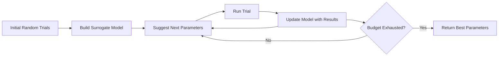

# How to Use Vertex AI Hyperparameter Tuning with Bayesian Optimization

Author: [nawazdhandala](https://www.github.com/nawazdhandala)

Tags: GCP, Vertex AI, Hyperparameter Tuning, Bayesian Optimization, Machine Learning

Description: Learn how to use Vertex AI hyperparameter tuning with Bayesian optimization to efficiently find the best model configuration without exhaustive search.

---

Grid search over hyperparameters is wasteful. If you have five hyperparameters, each with ten possible values, that is 100,000 combinations to try. Most of those combinations are terrible, and you know it after the first few trials. Bayesian optimization learns from previous trials to suggest the most promising hyperparameter combinations next, dramatically reducing the number of trials needed to find a good configuration.

Vertex AI's hyperparameter tuning service uses Bayesian optimization by default. You define the search space, the metric to optimize, and the number of trials to run. The service handles the rest - provisioning machines, scheduling trials, learning from results, and suggesting the next configuration to try.

## How Bayesian Optimization Works

Traditional grid search and random search treat each trial independently. Bayesian optimization builds a probabilistic model (usually a Gaussian Process) of how hyperparameters map to your objective metric. After each trial, it updates this model and uses it to choose the next set of hyperparameters that are most likely to improve the best result seen so far.



This means early trials explore broadly, while later trials exploit the regions of the search space that look most promising.

## Preparing Your Training Script

Your training script needs to accept hyperparameters as command-line arguments and report the optimization metric to Vertex AI.

This training script is set up for hyperparameter tuning:

```python
# train.py - Training script with HP tuning integration

import argparse
import os
import hypertune
import tensorflow as tf

def create_model(learning_rate, num_layers, units_per_layer, dropout_rate):
    """Build a model with configurable architecture."""
    model = tf.keras.Sequential()
    model.add(tf.keras.layers.Input(shape=(100,)))

    # Variable number of hidden layers
    for i in range(num_layers):
        model.add(tf.keras.layers.Dense(units_per_layer, activation="relu"))
        model.add(tf.keras.layers.Dropout(dropout_rate))

    model.add(tf.keras.layers.Dense(1, activation="sigmoid"))

    model.compile(
        optimizer=tf.keras.optimizers.Adam(learning_rate=learning_rate),
        loss="binary_crossentropy",
        metrics=["accuracy", tf.keras.metrics.AUC(name="auc")]
    )

    return model

def main(args):
    # Load data
    (x_train, y_train), (x_val, y_val) = load_data()

    # Build model with tunable hyperparameters
    model = create_model(
        learning_rate=args.learning_rate,
        num_layers=args.num_layers,
        units_per_layer=args.units_per_layer,
        dropout_rate=args.dropout_rate
    )

    # Train
    history = model.fit(
        x_train, y_train,
        validation_data=(x_val, y_val),
        epochs=args.epochs,
        batch_size=args.batch_size,
        verbose=1
    )

    # Get the best validation AUC
    best_val_auc = max(history.history["val_auc"])

    # Report the metric to Vertex AI HP tuning service
    # This is how the Bayesian optimizer knows how well this trial did
    hpt = hypertune.HyperTune()
    hpt.report_hyperparameter_tuning_metric(
        hyperparameter_metric_tag="val_auc",
        metric_value=best_val_auc,
        global_step=args.epochs
    )

    print(f"Best validation AUC: {best_val_auc:.4f}")

    # Save the model
    if best_val_auc > 0.85:  # Only save promising models
        model.save(os.environ.get("AIP_MODEL_DIR", args.model_dir))

if __name__ == "__main__":
    parser = argparse.ArgumentParser()
    parser.add_argument("--learning-rate", type=float, default=0.001)
    parser.add_argument("--num-layers", type=int, default=2)
    parser.add_argument("--units-per-layer", type=int, default=128)
    parser.add_argument("--dropout-rate", type=float, default=0.3)
    parser.add_argument("--batch-size", type=int, default=64)
    parser.add_argument("--epochs", type=int, default=50)
    parser.add_argument("--model-dir", type=str, default="gs://your-bucket/models/")
    args = parser.parse_args()
    main(args)
```

The critical piece is the `hypertune` library. It reports the optimization metric back to the Vertex AI service, which uses it to guide the Bayesian optimization.

## Defining the Search Space and Running the Tuning Job

Now configure the hyperparameter search space and submit the tuning job.

This code defines the search space and launches the job:

```python
from google.cloud import aiplatform
from google.cloud.aiplatform import hyperparameter_tuning as hpt

aiplatform.init(project="your-project-id", location="us-central1")

# Define the custom training job
custom_job = aiplatform.CustomJob(
    display_name="fraud-model-training",
    worker_pool_specs=[
        {
            "machine_spec": {
                "machine_type": "n1-standard-8",
                "accelerator_type": "NVIDIA_TESLA_T4",
                "accelerator_count": 1
            },
            "replica_count": 1,
            "python_package_spec": {
                "executor_image_uri": "us-docker.pkg.dev/vertex-ai/training/tf-gpu.2-13:latest",
                "package_uris": ["gs://your-bucket/packages/trainer-0.1.tar.gz"],
                "python_module": "trainer.train"
            }
        }
    ]
)

# Create the hyperparameter tuning job
hp_job = aiplatform.HyperparameterTuningJob(
    display_name="fraud-model-hp-tuning",
    custom_job=custom_job,
    metric_spec={
        "val_auc": "maximize"  # We want to maximize validation AUC
    },
    parameter_spec={
        # Continuous parameter - log scale for learning rate
        "learning-rate": hpt.DoubleParameterSpec(
            min=0.00001,
            max=0.01,
            scale="log"  # Log scale because learning rates span orders of magnitude
        ),
        # Integer parameter - number of hidden layers
        "num-layers": hpt.IntegerParameterSpec(
            min=1,
            max=5,
            scale="linear"
        ),
        # Integer parameter - units per layer (powers of 2 work well)
        "units-per-layer": hpt.DiscreteParameterSpec(
            values=[64, 128, 256, 512, 1024],
            scale="linear"
        ),
        # Continuous parameter - dropout rate
        "dropout-rate": hpt.DoubleParameterSpec(
            min=0.0,
            max=0.6,
            scale="linear"
        ),
        # Categorical parameter
        "batch-size": hpt.DiscreteParameterSpec(
            values=[32, 64, 128, 256],
            scale="linear"
        )
    },
    max_trial_count=50,  # Total trials to run
    parallel_trial_count=5,  # Trials running at the same time
    search_algorithm="default"  # Bayesian optimization
)

# Submit the tuning job
hp_job.run(sync=False)
print(f"HP tuning job submitted: {hp_job.resource_name}")
```

## Understanding Search Space Configuration

The `scale` parameter matters more than most people realize. For learning rate, use "log" scale because the difference between 0.001 and 0.01 is just as important as the difference between 0.00001 and 0.0001. For most other parameters, "linear" scale works fine.

The `parallel_trial_count` creates a trade-off. More parallel trials finish faster but give the Bayesian optimizer less information to work with for each decision. Five parallel trials is a good balance - the optimizer learns quickly while still making progress.

## Analyzing Tuning Results

After the job completes, examine the results to understand which hyperparameters mattered most.

This code retrieves and analyzes the tuning results:

```python
from google.cloud import aiplatform

aiplatform.init(project="your-project-id", location="us-central1")

# Get the completed HP tuning job
hp_job = aiplatform.HyperparameterTuningJob(
    "projects/your-project-id/locations/us-central1/hyperparameterTuningJobs/JOB_ID"
)

# Get all trial results
trials = hp_job.trials

# Sort by the optimization metric
sorted_trials = sorted(
    trials,
    key=lambda t: t.final_measurement.metrics[0].value,
    reverse=True
)

# Print the top 10 configurations
print("Top 10 hyperparameter configurations:")
print("-" * 80)

for i, trial in enumerate(sorted_trials[:10]):
    metric_value = trial.final_measurement.metrics[0].value
    params = {p.parameter_id: p.value for p in trial.parameters}

    print(f"\n#{i+1} - val_auc: {metric_value:.4f}")
    for param_name, param_value in params.items():
        print(f"  {param_name}: {param_value}")
```

## Warm-Starting from Previous Tuning Jobs

If you have already run a tuning job and want to continue exploring from where you left off, you can warm-start a new job using the results from the previous one.

```python
# Create a new HP tuning job that builds on previous results
hp_job_v2 = aiplatform.HyperparameterTuningJob(
    display_name="fraud-model-hp-tuning-v2",
    custom_job=custom_job,
    metric_spec={"val_auc": "maximize"},
    parameter_spec={
        # Narrower search space based on v1 results
        "learning-rate": hpt.DoubleParameterSpec(
            min=0.0001,
            max=0.003,
            scale="log"
        ),
        "num-layers": hpt.IntegerParameterSpec(
            min=2,
            max=4,
            scale="linear"
        ),
        "units-per-layer": hpt.DiscreteParameterSpec(
            values=[256, 512],
            scale="linear"
        ),
        "dropout-rate": hpt.DoubleParameterSpec(
            min=0.15,
            max=0.45,
            scale="linear"
        )
    },
    max_trial_count=30,
    parallel_trial_count=5
)

hp_job_v2.run(sync=False)
```

## Multi-Objective Tuning

Sometimes you want to optimize for multiple metrics simultaneously - like maximizing accuracy while minimizing inference latency.

```python
hp_job = aiplatform.HyperparameterTuningJob(
    display_name="multi-objective-tuning",
    custom_job=custom_job,
    metric_spec={
        "val_auc": "maximize",
        "inference_latency_ms": "minimize"
    },
    parameter_spec={
        "learning-rate": hpt.DoubleParameterSpec(min=0.0001, max=0.01, scale="log"),
        "num-layers": hpt.IntegerParameterSpec(min=1, max=6, scale="linear"),
        "units-per-layer": hpt.DiscreteParameterSpec(values=[64, 128, 256, 512], scale="linear")
    },
    max_trial_count=60,
    parallel_trial_count=5
)
```

With multiple objectives, the result is a Pareto frontier of non-dominated solutions. You pick the point on the frontier that best matches your requirements.

## Early Stopping

Vertex AI supports automated early stopping that terminates unpromising trials before they finish, saving compute cost.

```python
hp_job = aiplatform.HyperparameterTuningJob(
    display_name="tuning-with-early-stop",
    custom_job=custom_job,
    metric_spec={"val_auc": "maximize"},
    parameter_spec={...},
    max_trial_count=50,
    parallel_trial_count=5,
    # Enable median stopping rule
    # Stops trials performing below the median of completed trials
    search_algorithm="default"
)
```

In your training script, report the metric at regular intervals (not just at the end). This gives the early stopping algorithm enough information to decide whether a trial is worth continuing.

```python
# In your training loop
for epoch in range(args.epochs):
    train_one_epoch()
    val_auc = evaluate()

    # Report at each epoch for early stopping decisions
    hpt.report_hyperparameter_tuning_metric(
        hyperparameter_metric_tag="val_auc",
        metric_value=val_auc,
        global_step=epoch
    )
```

Bayesian optimization through Vertex AI hyperparameter tuning typically finds configurations within 5-10% of the global optimum in 30-50 trials, compared to hundreds or thousands of trials needed for grid or random search. The managed infrastructure means you focus on defining the right search space rather than managing compute resources.
