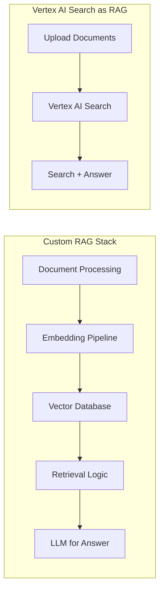

# How to Use Vertex AI Search as a RAG Backend for Generative AI Applications

Author: [nawazdhandala](https://www.github.com/nawazdhandala)

Tags: GCP, Vertex AI Search, RAG, Generative AI, Enterprise Search

Description: Use Vertex AI Search as a managed RAG backend for your generative AI applications, eliminating the need to build custom retrieval infrastructure on GCP.

---

Building a RAG (Retrieval-Augmented Generation) system from scratch requires managing vector databases, embedding pipelines, document chunking, and retrieval logic. That is a lot of infrastructure to build and maintain. Vertex AI Search can serve as a fully managed RAG backend that handles all of this for you. You feed it your documents, and it provides both traditional search results and AI-generated answers grounded in your data. This means you can focus on building the application layer rather than the retrieval infrastructure.

This guide shows how to use Vertex AI Search as the retrieval component in your generative AI applications.

## Why Vertex AI Search as a RAG Backend

The typical custom RAG stack involves:

1. Document processing and chunking
2. Embedding generation and storage
3. Vector database management
4. Retrieval and ranking logic
5. Context assembly for the LLM

Vertex AI Search replaces all five steps with a managed service. You upload documents, it handles processing, indexing, and retrieval. On top of that, it provides built-in answer generation, which means for many use cases you do not even need a separate LLM call.



## Prerequisites

- Google Cloud project with Vertex AI Search API enabled
- Documents in Cloud Storage, BigQuery, or accessible via web crawling
- Python 3.9+

```bash
pip install google-cloud-discoveryengine google-cloud-aiplatform langchain-google-vertexai
```

## Setting Up the RAG Backend

### Create and Populate the Data Store

```python
from google.cloud import discoveryengine_v1 as discoveryengine

def setup_rag_backend(project_id: str, location: str, data_store_id: str, gcs_uri: str):
    """Set up Vertex AI Search as a RAG backend."""

    # Step 1: Create the data store
    ds_client = discoveryengine.DataStoreServiceClient()
    parent = f"projects/{project_id}/locations/{location}/collections/default_collection"

    data_store = discoveryengine.DataStore(
        display_name="RAG Knowledge Base",
        industry_vertical=discoveryengine.IndustryVertical.GENERIC,
        content_config=discoveryengine.DataStore.ContentConfig.CONTENT_REQUIRED,
        solution_types=[discoveryengine.SolutionType.SOLUTION_TYPE_SEARCH],
    )

    operation = ds_client.create_data_store(
        parent=parent,
        data_store=data_store,
        data_store_id=data_store_id,
    )
    result = operation.result(timeout=300)
    print(f"Data store created: {result.name}")

    # Step 2: Import documents
    doc_client = discoveryengine.DocumentServiceClient()
    branch_parent = (
        f"projects/{project_id}/locations/{location}"
        f"/collections/default_collection/dataStores/{data_store_id}"
        f"/branches/default_branch"
    )

    gcs_source = discoveryengine.GcsSource(
        input_uris=[gcs_uri],
        data_schema="content",
    )

    import_request = discoveryengine.ImportDocumentsRequest(
        parent=branch_parent,
        gcs_source=gcs_source,
        reconciliation_mode=discoveryengine.ImportDocumentsRequest.ReconciliationMode.INCREMENTAL,
    )

    import_op = doc_client.import_documents(request=import_request)
    print("Importing documents...")
    import_result = import_op.result(timeout=600)
    print(f"Import complete. Errors: {len(import_result.error_samples)}")

    # Step 3: Create a search engine
    engine_client = discoveryengine.EngineServiceClient()

    engine = discoveryengine.Engine(
        display_name="RAG Search Engine",
        solution_type=discoveryengine.SolutionType.SOLUTION_TYPE_SEARCH,
        search_engine_config=discoveryengine.Engine.SearchEngineConfig(
            search_tier=discoveryengine.SearchTier.SEARCH_TIER_ENTERPRISE,
            search_add_ons=[discoveryengine.SearchAddOn.SEARCH_ADD_ON_LLM],
        ),
        data_store_ids=[data_store_id],
    )

    engine_op = engine_client.create_engine(
        parent=parent,
        engine=engine,
        engine_id=f"{data_store_id}-engine",
    )
    engine_result = engine_op.result(timeout=300)
    print(f"Search engine created: {engine_result.name}")

    return engine_result

# Set up the backend
setup_rag_backend(
    project_id="your-project-id",
    location="global",
    data_store_id="rag-backend",
    gcs_uri="gs://your-bucket/knowledge-base/**",
)
```

## Using Vertex AI Search for Retrieval

### Basic Retrieval

```python
def retrieve_context(
    project_id: str,
    location: str,
    engine_id: str,
    query: str,
    num_results: int = 5,
) -> list:
    """Retrieve relevant document passages for a given query."""
    client = discoveryengine.SearchServiceClient()

    serving_config = (
        f"projects/{project_id}/locations/{location}"
        f"/collections/default_collection/engines/{engine_id}"
        f"/servingConfigs/default_search"
    )

    request = discoveryengine.SearchRequest(
        serving_config=serving_config,
        query=query,
        page_size=num_results,
        content_search_spec=discoveryengine.SearchRequest.ContentSearchSpec(
            extractive_content_spec=discoveryengine.SearchRequest.ContentSearchSpec.ExtractiveContentSpec(
                max_extractive_answer_count=3,
                max_extractive_segment_count=3,
            ),
        ),
    )

    response = client.search(request)

    # Extract passages from results
    passages = []
    for result in response.results:
        doc_data = result.document.derived_struct_data
        title = doc_data.get("title", "Unknown")

        # Get extractive segments (longer passages with context)
        for segment in doc_data.get("extractive_segments", []):
            passages.append({
                "content": segment.get("content", ""),
                "source": title,
                "page": segment.get("pageNumber"),
            })

        # Get extractive answers (precise answer spans)
        for answer in doc_data.get("extractive_answers", []):
            passages.append({
                "content": answer.get("content", ""),
                "source": title,
                "page": answer.get("pageNumber"),
            })

    return passages

# Retrieve context for a question
passages = retrieve_context(
    project_id="your-project-id",
    location="global",
    engine_id="rag-backend-engine",
    query="What are the system requirements for installation?",
)

for p in passages:
    print(f"[{p['source']}] {p['content'][:200]}...")
```

### Using Built-in Answer Generation

For many applications, you can skip the separate LLM call entirely and use Vertex AI Search's built-in answer generation.

```python
def retrieve_with_answer(
    project_id: str,
    location: str,
    engine_id: str,
    query: str,
) -> dict:
    """Retrieve context and get an AI-generated answer in a single call."""
    client = discoveryengine.SearchServiceClient()

    serving_config = (
        f"projects/{project_id}/locations/{location}"
        f"/collections/default_collection/engines/{engine_id}"
        f"/servingConfigs/default_search"
    )

    request = discoveryengine.SearchRequest(
        serving_config=serving_config,
        query=query,
        page_size=5,
        content_search_spec=discoveryengine.SearchRequest.ContentSearchSpec(
            summary_spec=discoveryengine.SearchRequest.ContentSearchSpec.SummarySpec(
                summary_result_count=5,
                include_citations=True,
                model_spec=discoveryengine.SearchRequest.ContentSearchSpec.SummarySpec.ModelSpec(
                    version="gemini-1.5-flash-001/answer_gen/v1",
                ),
            ),
            extractive_content_spec=discoveryengine.SearchRequest.ContentSearchSpec.ExtractiveContentSpec(
                max_extractive_segment_count=3,
            ),
        ),
    )

    response = client.search(request)

    result = {
        "answer": None,
        "sources": [],
        "passages": [],
    }

    # Extract the generated answer
    if response.summary and response.summary.summary_text:
        result["answer"] = response.summary.summary_text

    # Extract source documents
    for search_result in response.results:
        doc_data = search_result.document.derived_struct_data
        result["sources"].append({
            "title": doc_data.get("title", "Unknown"),
            "link": doc_data.get("link", ""),
        })

    return result

# Get an answer with citations
answer = retrieve_with_answer(
    project_id="your-project-id",
    location="global",
    engine_id="rag-backend-engine",
    query="How do I configure SSL certificates for the application?",
)

print(f"Answer: {answer['answer']}")
print(f"\nSources:")
for s in answer['sources']:
    print(f"  - {s['title']}: {s['link']}")
```

## Integrating with Custom LLM Pipelines

When you need more control over the generation step, use Vertex AI Search for retrieval and your own LLM call for answer generation.

```python
from langchain_google_vertexai import ChatVertexAI
from langchain_core.prompts import ChatPromptTemplate
from langchain_core.output_parsers import StrOutputParser

# Initialize the LLM
llm = ChatVertexAI(
    model_name="gemini-1.5-pro",
    project="your-project-id",
    location="us-central1",
    temperature=0.2,
)

# RAG prompt that uses retrieved context
rag_prompt = ChatPromptTemplate.from_template("""
You are a helpful assistant that answers questions based on the provided context.
Use ONLY the information in the context to answer. If the context does not contain
enough information, say so. Cite the source document for each claim.

Context:
{context}

Question: {question}

Answer:""")

def rag_query(question: str) -> str:
    """Execute a full RAG query using Vertex AI Search for retrieval."""
    # Step 1: Retrieve relevant passages
    passages = retrieve_context(
        project_id="your-project-id",
        location="global",
        engine_id="rag-backend-engine",
        query=question,
    )

    # Step 2: Format context from passages
    context_parts = []
    for p in passages:
        context_parts.append(f"[Source: {p['source']}]\n{p['content']}")
    context = "\n\n---\n\n".join(context_parts)

    # Step 3: Generate answer with LLM
    chain = rag_prompt | llm | StrOutputParser()
    answer = chain.invoke({"context": context, "question": question})

    return answer

# Use the RAG pipeline
response = rag_query("What monitoring metrics should I track for production deployments?")
print(response)
```

## Building a Conversational RAG Interface

For multi-turn conversations where follow-up questions reference previous context.

```python
from langchain_core.messages import HumanMessage, AIMessage

class ConversationalRAG:
    """A conversational RAG system backed by Vertex AI Search."""

    def __init__(self, project_id: str, location: str, engine_id: str):
        self.project_id = project_id
        self.location = location
        self.engine_id = engine_id
        self.chat_history = []

        self.llm = ChatVertexAI(
            model_name="gemini-1.5-pro",
            project=project_id,
            location="us-central1",
            temperature=0.2,
        )

    def ask(self, question: str) -> str:
        """Ask a question with conversational context."""
        # Retrieve fresh context for this question
        passages = retrieve_context(
            self.project_id, self.location, self.engine_id, question
        )

        context = "\n\n".join(p["content"] for p in passages)

        # Include conversation history for follow-up questions
        history_text = ""
        for msg in self.chat_history[-6:]:  # Last 3 exchanges
            role = "User" if isinstance(msg, HumanMessage) else "Assistant"
            history_text += f"{role}: {msg.content}\n"

        prompt = ChatPromptTemplate.from_template("""
Based on the context and conversation history, answer the question.

Context from knowledge base:
{context}

Previous conversation:
{history}

Current question: {question}

Answer:""")

        chain = prompt | self.llm | StrOutputParser()
        answer = chain.invoke({
            "context": context,
            "history": history_text,
            "question": question,
        })

        # Update history
        self.chat_history.append(HumanMessage(content=question))
        self.chat_history.append(AIMessage(content=answer))

        return answer

# Usage
rag = ConversationalRAG("your-project-id", "global", "rag-backend-engine")
print(rag.ask("What databases does the platform support?"))
print(rag.ask("Which one do you recommend for time-series data?"))
print(rag.ask("How do I connect to it from a Cloud Run service?"))
```

## Keeping the RAG Backend Updated

```python
def incremental_update(project_id: str, location: str, data_store_id: str, new_docs_uri: str):
    """Add new documents to the existing RAG backend without rebuilding."""
    client = discoveryengine.DocumentServiceClient()

    parent = (
        f"projects/{project_id}/locations/{location}"
        f"/collections/default_collection/dataStores/{data_store_id}"
        f"/branches/default_branch"
    )

    gcs_source = discoveryengine.GcsSource(
        input_uris=[new_docs_uri],
        data_schema="content",
    )

    request = discoveryengine.ImportDocumentsRequest(
        parent=parent,
        gcs_source=gcs_source,
        reconciliation_mode=discoveryengine.ImportDocumentsRequest.ReconciliationMode.INCREMENTAL,
    )

    operation = client.import_documents(request=request)
    result = operation.result(timeout=600)
    print(f"Incremental update complete. New documents indexed.")
    return result
```

## Summary

Vertex AI Search as a RAG backend dramatically reduces the engineering effort needed to build retrieval-augmented applications. You skip the vector database management, the embedding pipeline, and the chunking logic. For straightforward question-answering applications, the built-in answer generation means you do not even need a separate LLM call. For applications that need custom generation logic, use Vertex AI Search purely as the retrieval layer and plug in your own LLM. Either way, you get a production-ready RAG system with significantly less infrastructure to maintain.
