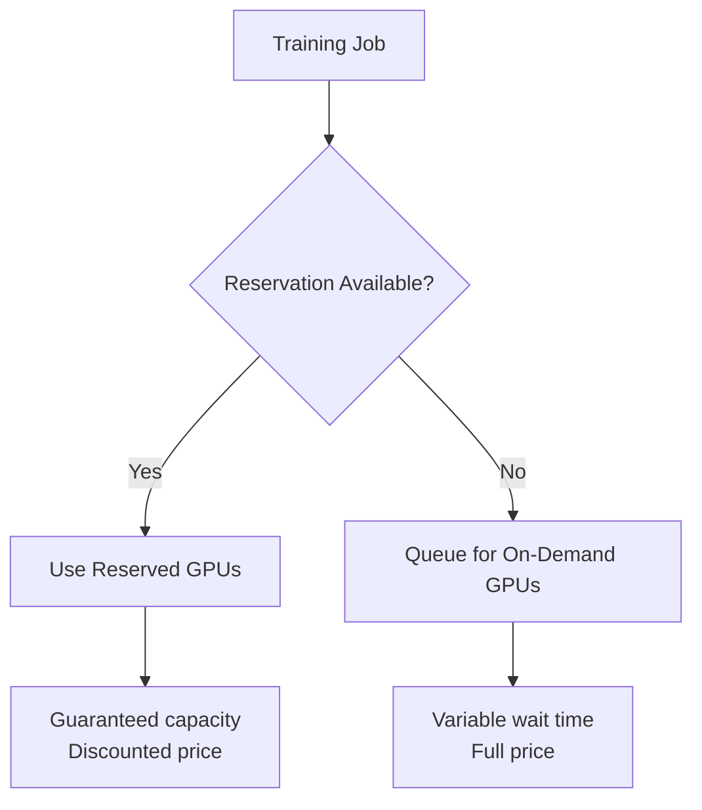

# How to Use Vertex AI Training with Reserved GPU Clusters for Predictable Workloads

Author: [nawazdhandala](https://www.github.com/nawazdhandala)

Tags: GCP, Vertex AI, GPU Reservations, Training, Cost Optimization

Description: Learn how to use Vertex AI Training with reserved GPU clusters to guarantee capacity and reduce costs for predictable ML training workloads.

---

GPU availability on cloud platforms can be unpredictable. You submit a training job at 2 PM and it sits in a queue because all the A100s in your region are taken. For teams running regular training jobs - nightly retraining pipelines, weekly model refreshes, or multi-day training runs - this unpredictability is a serious problem. Reserved GPU clusters guarantee that you have the GPUs you need, when you need them, at a discount compared to on-demand pricing.

Vertex AI integrates with Google Cloud's reservation system, letting you reserve GPU capacity and then direct your training jobs to use those reservations. This guide covers the setup, cost analysis, and practical workflow.

## Understanding GPU Reservations

GPU reservations work like hotel reservations. You commit to paying for a certain number of GPUs for a defined period (1 year or 3 years), and in return you get guaranteed availability at a discounted price. The discount is typically 40-60% compared to on-demand pricing.



## Creating a GPU Reservation

Reservations are created at the Google Compute Engine level and then referenced by Vertex AI training jobs.

These commands create a GPU reservation:

```bash
# Create a reservation for 8 A100 GPUs
gcloud compute reservations create ml-training-reservation \
    --project=your-project-id \
    --zone=us-central1-a \
    --vm-count=2 \
    --machine-type=a2-highgpu-4g \
    --accelerator=count=4,type=nvidia-tesla-a100 \
    --require-specific-reservation

# Verify the reservation
gcloud compute reservations describe ml-training-reservation \
    --project=your-project-id \
    --zone=us-central1-a
```

This creates a reservation for 2 VMs, each with 4 A100 GPUs, giving you 8 A100 GPUs total. The `--require-specific-reservation` flag means these GPUs are only used by jobs that explicitly request this reservation - they will not be consumed by random Compute Engine VMs.

## Submitting Training Jobs with Reservations

When submitting a Vertex AI custom training job, reference your reservation in the machine spec.

This code submits a training job that uses the reserved GPUs:

```python
from google.cloud import aiplatform

aiplatform.init(project="your-project-id", location="us-central1")

# Create a custom training job that uses the reservation
job = aiplatform.CustomJob(
    display_name="nightly-model-retrain",
    worker_pool_specs=[
        {
            "machine_spec": {
                "machine_type": "a2-highgpu-4g",
                "accelerator_type": "NVIDIA_TESLA_A100",
                "accelerator_count": 4
            },
            "replica_count": 2,  # 2 workers matching reservation
            "python_package_spec": {
                "executor_image_uri": "us-docker.pkg.dev/vertex-ai/training/pytorch-gpu.2-1:latest",
                "package_uris": ["gs://your-bucket/packages/trainer-0.1.tar.gz"],
                "python_module": "trainer.train",
                "args": [
                    "--epochs=50",
                    "--batch-size=256",
                    "--data-path=gs://your-bucket/data/training/"
                ]
            }
        }
    ],
    # Reference the specific reservation
    reservation_affinity={
        "reservation_affinity_type": "SPECIFIC_RESERVATION",
        "key": "compute.googleapis.com/reservation-name",
        "values": ["projects/your-project-id/zones/us-central1-a/reservations/ml-training-reservation"]
    }
)

job.run(sync=False)
print(f"Job submitted: {job.resource_name}")
```

## Scheduling Regular Training with Reservations

For nightly or weekly training, combine reservations with scheduled pipelines.

This code sets up a scheduled training pipeline:

```python
from google.cloud import aiplatform
from kfp import dsl
from kfp.dsl import component

@component(
    base_image="python:3.10",
    packages_to_install=["google-cloud-aiplatform"]
)
def submit_training_job(
    project: str,
    location: str,
    display_name: str,
    training_data_uri: str
) -> str:
    """Submit a training job using reserved GPUs."""
    from google.cloud import aiplatform

    aiplatform.init(project=project, location=location)

    job = aiplatform.CustomJob(
        display_name=display_name,
        worker_pool_specs=[
            {
                "machine_spec": {
                    "machine_type": "a2-highgpu-4g",
                    "accelerator_type": "NVIDIA_TESLA_A100",
                    "accelerator_count": 4
                },
                "replica_count": 2,
                "python_package_spec": {
                    "executor_image_uri": "us-docker.pkg.dev/vertex-ai/training/pytorch-gpu.2-1:latest",
                    "package_uris": ["gs://your-bucket/packages/trainer-latest.tar.gz"],
                    "python_module": "trainer.train",
                    "args": [f"--data-path={training_data_uri}"]
                }
            }
        ]
    )

    job.run(sync=True)
    return job.resource_name

@dsl.pipeline(name="nightly-training-pipeline")
def training_pipeline():
    """Pipeline that runs nightly with reserved GPUs."""
    submit_training_job(
        project="your-project-id",
        location="us-central1",
        display_name="nightly-retrain",
        training_data_uri="gs://your-bucket/data/latest/"
    )

# Compile and create schedule
from kfp import compiler

compiler.Compiler().compile(
    pipeline_func=training_pipeline,
    package_path="nightly_pipeline.json"
)

# Create the scheduled pipeline
schedule = aiplatform.PipelineJob(
    display_name="nightly-training",
    template_path="nightly_pipeline.json",
    pipeline_root="gs://your-bucket/pipeline-root/"
)

schedule.create_schedule(
    display_name="nightly-retrain-schedule",
    cron="0 2 * * *",  # Every night at 2 AM
    max_concurrent_run_count=1
)
```

## Cost Analysis: Reserved vs On-Demand

Let us do the math for a concrete scenario. Your team trains models every night for 4 hours on 8 A100 GPUs.

On-demand pricing for A100 in us-central1 is approximately $3.67/GPU/hour:

```
On-demand cost per night: 8 GPUs x 4 hours x $3.67 = $117.44
On-demand cost per month: $117.44 x 30 = $3,523.20
On-demand cost per year: $117.44 x 365 = $42,865.60
```

With a 1-year reservation at approximately 40% discount:

```
Reserved price: ~$2.20/GPU/hour
But you pay for 24 hours regardless: 8 GPUs x 24 hours x $2.20 = $422.40/day
Reserved cost per month: $422.40 x 30 = $12,672.00
Reserved cost per year: $422.40 x 365 = $154,176.00
```

Wait - reservations cost more? Only if you are using them 4 hours a day. Reservations make financial sense when your GPUs are utilized most of the time.

Break-even utilization: $3.67 x hours = $2.20 x 24 hours, so hours = 14.4.

You need to use the reserved GPUs for about 14-15 hours per day for reservations to be cheaper than on-demand. If you have multiple teams and multiple training jobs that can share the reservation throughout the day, this becomes very achievable.

```python
def calculate_reservation_savings(
    gpu_count,
    on_demand_price_per_gpu_hr,
    reserved_price_per_gpu_hr,
    daily_usage_hours,
    commitment_years=1
):
    """Calculate whether a reservation saves money."""
    days_per_year = 365

    # On-demand: pay only for what you use
    on_demand_annual = (
        gpu_count * on_demand_price_per_gpu_hr
        * daily_usage_hours * days_per_year
    )

    # Reserved: pay for 24/7 at discounted rate
    reserved_annual = (
        gpu_count * reserved_price_per_gpu_hr
        * 24 * days_per_year
    )

    savings = on_demand_annual - reserved_annual
    savings_pct = (savings / on_demand_annual) * 100

    print(f"On-demand annual cost: ${on_demand_annual:,.2f}")
    print(f"Reserved annual cost: ${reserved_annual:,.2f}")
    print(f"Annual savings: ${savings:,.2f} ({savings_pct:.1f}%)")
    print(f"Break-even usage: {reserved_price_per_gpu_hr * 24 / on_demand_price_per_gpu_hr:.1f} hrs/day")

    return savings

# Example calculation
calculate_reservation_savings(
    gpu_count=8,
    on_demand_price_per_gpu_hr=3.67,
    reserved_price_per_gpu_hr=2.20,
    daily_usage_hours=18  # Multiple teams sharing
)
```

## Maximizing Reservation Utilization

To make reservations cost-effective, share them across teams and jobs.

This code shows how to queue multiple jobs to use the same reservation:

```python
import time
from google.cloud import aiplatform

aiplatform.init(project="your-project-id", location="us-central1")

# Define multiple training jobs that share the reservation
jobs_config = [
    {
        "name": "fraud-model-retrain",
        "module": "trainer.fraud_train",
        "schedule": "02:00",
        "duration_hours": 4
    },
    {
        "name": "recommendation-retrain",
        "module": "trainer.rec_train",
        "schedule": "06:00",
        "duration_hours": 6
    },
    {
        "name": "churn-model-retrain",
        "module": "trainer.churn_train",
        "schedule": "12:00",
        "duration_hours": 3
    },
    {
        "name": "forecasting-retrain",
        "module": "trainer.forecast_train",
        "schedule": "15:00",
        "duration_hours": 5
    }
]

# Total: 18 hours of GPU usage per day across 4 jobs
# This utilization makes the reservation cost-effective

for config in jobs_config:
    job = aiplatform.CustomJob(
        display_name=config["name"],
        worker_pool_specs=[
            {
                "machine_spec": {
                    "machine_type": "a2-highgpu-4g",
                    "accelerator_type": "NVIDIA_TESLA_A100",
                    "accelerator_count": 4
                },
                "replica_count": 2,
                "python_package_spec": {
                    "executor_image_uri": "us-docker.pkg.dev/vertex-ai/training/pytorch-gpu.2-1:latest",
                    "package_uris": ["gs://your-bucket/packages/trainer-latest.tar.gz"],
                    "python_module": config["module"]
                }
            }
        ]
    )
    print(f"Configured: {config['name']} ({config['duration_hours']}h)")
```

## Monitoring Reservation Utilization

Track how well your reservation is being used to justify the cost.

```bash
# Check reservation utilization
gcloud compute reservations describe ml-training-reservation \
    --project=your-project-id \
    --zone=us-central1-a \
    --format="table(name, specificReservation.count, specificReservation.inUseCount)"
```

Reserved GPU clusters on Vertex AI are a strategic choice for teams with predictable, high-volume training workloads. The guaranteed availability eliminates the frustration of GPU queues, and the cost savings are real when utilization is kept above the break-even point. The key is planning your training schedule to maximize GPU utilization across the reservation period.
