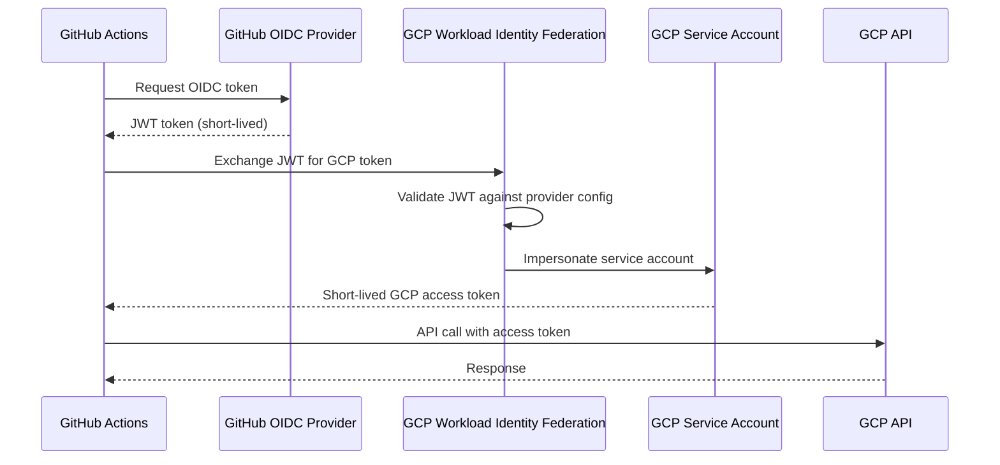

# How to Use Workload Identity Federation to Authenticate from GitHub Actions to GCP

Author: [nawazdhandala](https://www.github.com/nawazdhandala)

Tags: GCP, Workload Identity Federation, GitHub Actions, CI/CD, Google Cloud Security

Description: Learn how to use GCP Workload Identity Federation to authenticate GitHub Actions workflows to Google Cloud without storing service account keys as secrets.

---

Storing GCP service account keys as GitHub Actions secrets is a common but flawed pattern. Those keys are long-lived, hard to rotate, and if your repository is compromised, the attacker gets permanent access to your GCP resources. Workload Identity Federation eliminates this problem by letting GitHub Actions authenticate directly to GCP using short-lived tokens.

This post walks through the complete setup: creating the identity pool, configuring the provider, linking it to a service account, and updating your GitHub Actions workflow.

## How Workload Identity Federation Works

Instead of a static key file, the flow works like this:



The key difference: no long-lived credentials are stored anywhere. GitHub issues a JWT that identifies the workflow, and GCP exchanges it for a short-lived access token.

## Step 1: Create a Workload Identity Pool

The identity pool is a container for external identity providers:

```bash
# Create a Workload Identity Pool
gcloud iam workload-identity-pools create "github-pool" \
  --location="global" \
  --display-name="GitHub Actions Pool" \
  --description="Pool for GitHub Actions authentication" \
  --project=my-project
```

## Step 2: Create a Workload Identity Provider

Configure the pool to trust GitHub's OIDC provider:

```bash
# Create the GitHub OIDC provider in the pool
gcloud iam workload-identity-pools providers create-oidc "github-provider" \
  --location="global" \
  --workload-identity-pool="github-pool" \
  --display-name="GitHub OIDC Provider" \
  --issuer-uri="https://token.actions.githubusercontent.com" \
  --attribute-mapping="google.subject=assertion.sub,attribute.actor=assertion.actor,attribute.repository=assertion.repository,attribute.repository_owner=assertion.repository_owner" \
  --attribute-condition="assertion.repository_owner == 'my-github-org'" \
  --project=my-project
```

Let us break down the important parts:

- `issuer-uri` - GitHub's OIDC token issuer
- `attribute-mapping` - Maps GitHub JWT claims to GCP attributes
- `attribute-condition` - Only accepts tokens from your organization (critical for security)

The attribute condition is your first line of defense. Without it, any GitHub repository could authenticate to your GCP project.

## Step 3: Create a Service Account

Create a service account that the GitHub workflow will impersonate:

```bash
# Create a service account for GitHub Actions
gcloud iam service-accounts create github-actions-sa \
  --display-name="GitHub Actions Service Account" \
  --description="Used by GitHub Actions via Workload Identity Federation" \
  --project=my-project
```

Grant it the minimum permissions needed:

```bash
# Grant permissions to the service account
# Example: deploy to Cloud Run and push to Artifact Registry
gcloud projects add-iam-policy-binding my-project \
  --member="serviceAccount:github-actions-sa@my-project.iam.gserviceaccount.com" \
  --role="roles/run.admin"

gcloud projects add-iam-policy-binding my-project \
  --member="serviceAccount:github-actions-sa@my-project.iam.gserviceaccount.com" \
  --role="roles/artifactregistry.writer"

gcloud projects add-iam-policy-binding my-project \
  --member="serviceAccount:github-actions-sa@my-project.iam.gserviceaccount.com" \
  --role="roles/iam.serviceAccountUser"
```

## Step 4: Allow the Identity Pool to Impersonate the Service Account

This is the binding that connects the identity pool to the service account:

```bash
# Allow the GitHub pool to impersonate the service account
# Restrict to a specific repository for extra security
gcloud iam service-accounts add-iam-policy-binding \
  github-actions-sa@my-project.iam.gserviceaccount.com \
  --role="roles/iam.workloadIdentityUser" \
  --member="principalSet://iam.googleapis.com/projects/PROJECT_NUMBER/locations/global/workloadIdentityPools/github-pool/attribute.repository/my-github-org/my-repo" \
  --project=my-project
```

Note the use of `principalSet` with `attribute.repository`. This restricts impersonation to a specific repository, not the entire organization.

Get your project number:

```bash
# Get the project number (needed for the provider resource name)
gcloud projects describe my-project --format="value(projectNumber)"
```

## Step 5: Get the Provider Resource Name

You will need the full provider resource name for the GitHub Actions workflow:

```bash
# Get the full provider resource name
gcloud iam workload-identity-pools providers describe github-provider \
  --location="global" \
  --workload-identity-pool="github-pool" \
  --project=my-project \
  --format="value(name)"
```

This returns something like:
```
projects/123456789/locations/global/workloadIdentityPools/github-pool/providers/github-provider
```

## Step 6: Configure the GitHub Actions Workflow

Here is a complete workflow that authenticates to GCP and deploys to Cloud Run:

```yaml
# .github/workflows/deploy.yml
name: Deploy to Cloud Run

on:
  push:
    branches: [main]

# Required for the OIDC token request
permissions:
  contents: read
  id-token: write

jobs:
  deploy:
    runs-on: ubuntu-latest

    steps:
      - name: Checkout code
        uses: actions/checkout@v4

      # Authenticate to GCP using Workload Identity Federation
      - name: Authenticate to Google Cloud
        id: auth
        uses: google-github-actions/auth@v2
        with:
          workload_identity_provider: 'projects/123456789/locations/global/workloadIdentityPools/github-pool/providers/github-provider'
          service_account: 'github-actions-sa@my-project.iam.gserviceaccount.com'

      # Set up gcloud CLI
      - name: Set up Cloud SDK
        uses: google-github-actions/setup-gcloud@v2

      # Build and push the Docker image
      - name: Build and push container image
        run: |
          gcloud auth configure-docker us-central1-docker.pkg.dev --quiet
          docker build -t us-central1-docker.pkg.dev/my-project/my-repo/my-app:${{ github.sha }} .
          docker push us-central1-docker.pkg.dev/my-project/my-repo/my-app:${{ github.sha }}

      # Deploy to Cloud Run
      - name: Deploy to Cloud Run
        run: |
          gcloud run deploy my-app \
            --image=us-central1-docker.pkg.dev/my-project/my-repo/my-app:${{ github.sha }} \
            --region=us-central1 \
            --platform=managed \
            --project=my-project
```

The critical parts:

1. `permissions.id-token: write` - Allows the workflow to request an OIDC token
2. `google-github-actions/auth@v2` - Handles the token exchange
3. No secrets needed - the authentication is based on the workflow's identity

## Restricting by Branch or Environment

You can make the attribute condition more specific to restrict which branches or environments can authenticate:

```bash
# Only allow authentication from the main branch
gcloud iam workload-identity-pools providers update-oidc "github-provider" \
  --location="global" \
  --workload-identity-pool="github-pool" \
  --attribute-condition="assertion.repository_owner == 'my-github-org' && assertion.ref == 'refs/heads/main'" \
  --project=my-project
```

Or use the service account binding to restrict by branch:

```bash
# Only allow main branch to impersonate the production service account
gcloud iam service-accounts add-iam-policy-binding \
  github-actions-sa@my-project.iam.gserviceaccount.com \
  --role="roles/iam.workloadIdentityUser" \
  --member="principalSet://iam.googleapis.com/projects/PROJECT_NUMBER/locations/global/workloadIdentityPools/github-pool/attribute.repository/my-github-org/my-repo" \
  --condition="expression=assertion.ref=='refs/heads/main',title=main-branch-only" \
  --project=my-project
```

## Troubleshooting

### Authentication Fails with "Unable to exchange token"

Check the attribute condition. The most common issue is a typo in the organization name or repository name:

```bash
# Verify the provider configuration
gcloud iam workload-identity-pools providers describe github-provider \
  --location="global" \
  --workload-identity-pool="github-pool" \
  --project=my-project \
  --format="yaml(attributeCondition,attributeMapping)"
```

### Permission Denied After Authentication

The authentication succeeded but the API call failed. Check the service account's IAM permissions:

```bash
# List the service account's roles
gcloud projects get-iam-policy my-project \
  --flatten="bindings[].members" \
  --filter="bindings.members:github-actions-sa@my-project.iam.gserviceaccount.com" \
  --format="table(bindings.role)"
```

### Missing permissions.id-token in Workflow

If you see "Error: Unable to get ACTIONS_ID_TOKEN_REQUEST_URL," make sure your workflow has:

```yaml
permissions:
  id-token: write
```

This is required for GitHub to issue the OIDC token.

## Summary

Workload Identity Federation replaces static service account keys with short-lived tokens for GitHub Actions authentication to GCP. The setup involves creating an identity pool and provider, linking them to a service account, and using the `google-github-actions/auth` action in your workflow. No secrets to manage, no keys to rotate, and if your repository is compromised, the attacker cannot get persistent GCP access. Always use attribute conditions to restrict which repositories and branches can authenticate.
