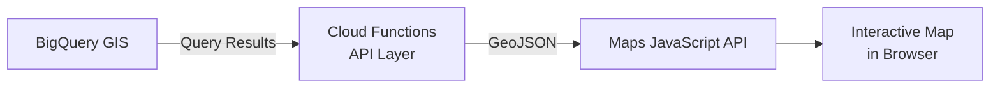

# How to Visualize BigQuery GIS Query Results on Google Maps Using the Maps JavaScript API

Author: [nawazdhandala](https://www.github.com/nawazdhandala)

Tags: GCP, BigQuery, GIS, Google Maps, JavaScript API, Visualization, Google Cloud

Description: Visualize BigQuery GIS geospatial query results on interactive Google Maps using the Maps JavaScript API for location-based dashboards and data exploration.

---

Running geospatial queries in BigQuery gives you the answers, but seeing the results on a map gives you the understanding. A table showing that Store A is 12.3 miles from Customer B is informative; seeing the actual locations, the coverage areas, and the clustering patterns on a map is insightful. The Google Maps JavaScript API is the natural visualization layer for BigQuery GIS data, and connecting the two is surprisingly straightforward.

In this post, I will build a web application that queries BigQuery GIS data and renders the results on an interactive Google Map, including points, polygons, heatmaps, and data-driven styling.

## Architecture

The data flows from BigQuery through an API layer to the Maps JavaScript frontend:



## Prerequisites

- BigQuery with geospatial data loaded
- Google Maps JavaScript API key
- Cloud Functions for the API layer
- Basic HTML/JavaScript knowledge

## Step 1: Create the API Layer

Build a Cloud Function that executes BigQuery GIS queries and returns results as GeoJSON, which the Maps API can render directly.

This Cloud Function accepts a query type parameter and returns GeoJSON:

```python
import functions_framework
from google.cloud import bigquery
import json

bq_client = bigquery.Client()

@functions_framework.http
def bigquery_geo_api(request):
    """API endpoint that returns BigQuery GIS results as GeoJSON."""
    # Handle CORS for browser requests
    if request.method == "OPTIONS":
        headers = {
            "Access-Control-Allow-Origin": "*",
            "Access-Control-Allow-Methods": "GET, POST",
            "Access-Control-Allow-Headers": "Content-Type",
        }
        return ("", 204, headers)

    headers = {"Access-Control-Allow-Origin": "*"}

    query_type = request.args.get("type", "stores")

    if query_type == "stores":
        return get_store_locations(headers)
    elif query_type == "customers":
        return get_customer_density(headers)
    elif query_type == "zones":
        return get_delivery_zones(headers)
    elif query_type == "coverage":
        return get_coverage_analysis(headers)
    else:
        return json.dumps({"error": "Unknown query type"}), 400, headers


def get_store_locations(headers):
    """Returns store locations as GeoJSON points."""
    query = """
        SELECT
            store_id,
            store_name,
            city,
            ST_ASGEOJSON(location) as geojson,
            ST_X(location) as lng,
            ST_Y(location) as lat
        FROM `MY_PROJECT.geo_analytics.store_locations`
    """
    results = bq_client.query(query).result()

    # Build GeoJSON FeatureCollection
    features = []
    for row in results:
        features.append({
            "type": "Feature",
            "geometry": json.loads(row.geojson),
            "properties": {
                "store_id": row.store_id,
                "store_name": row.store_name,
                "city": row.city,
            }
        })

    geojson = {
        "type": "FeatureCollection",
        "features": features
    }
    return json.dumps(geojson), 200, headers


def get_customer_density(headers):
    """Returns customer locations for density visualization."""
    query = """
        SELECT
            ST_X(location) as lng,
            ST_Y(location) as lat,
            lifetime_value
        FROM `MY_PROJECT.geo_analytics.customers`
        WHERE location IS NOT NULL
        LIMIT 10000
    """
    results = bq_client.query(query).result()

    # Return as array for heatmap use
    points = []
    for row in results:
        points.append({
            "lat": row.lat,
            "lng": row.lng,
            "weight": float(row.lifetime_value) if row.lifetime_value else 1,
        })

    return json.dumps({"points": points}), 200, headers


def get_delivery_zones(headers):
    """Returns delivery zone polygons as GeoJSON."""
    query = """
        SELECT
            zone_id,
            zone_name,
            ST_ASGEOJSON(boundary) as geojson,
            customer_count,
            avg_delivery_time_minutes
        FROM `MY_PROJECT.geo_analytics.delivery_zones_stats`
    """
    results = bq_client.query(query).result()

    features = []
    for row in results:
        features.append({
            "type": "Feature",
            "geometry": json.loads(row.geojson),
            "properties": {
                "zone_id": row.zone_id,
                "zone_name": row.zone_name,
                "customer_count": row.customer_count,
                "avg_delivery_time": row.avg_delivery_time_minutes,
            }
        })

    return json.dumps({"type": "FeatureCollection", "features": features}), 200, headers


def get_coverage_analysis(headers):
    """Returns store coverage circles as GeoJSON."""
    query = """
        SELECT
            store_id,
            store_name,
            -- Create a 10-mile buffer around each store
            ST_ASGEOJSON(ST_BUFFER(location, 16093.4)) as coverage_geojson,
            customer_count_in_radius
        FROM `MY_PROJECT.geo_analytics.store_coverage`
    """
    results = bq_client.query(query).result()

    features = []
    for row in results:
        features.append({
            "type": "Feature",
            "geometry": json.loads(row.coverage_geojson),
            "properties": {
                "store_id": row.store_id,
                "store_name": row.store_name,
                "customers": row.customer_count_in_radius,
            }
        })

    return json.dumps({"type": "FeatureCollection", "features": features}), 200, headers
```

Deploy the Cloud Function:

```bash
# Deploy the geo API function
gcloud functions deploy bigquery-geo-api \
  --gen2 \
  --runtime=python311 \
  --region=us-central1 \
  --source=. \
  --entry-point=bigquery_geo_api \
  --trigger-http \
  --allow-unauthenticated \
  --memory=512Mi
```

## Step 2: Build the Map Visualization

Create an HTML page that loads the Maps JavaScript API and renders the BigQuery data.

This HTML file creates an interactive map with multiple layers:

```html
<!DOCTYPE html>
<html>
<head>
    <title>BigQuery GIS Visualization</title>
    <style>
        #map { height: 100vh; width: 100%; }
        .controls {
            position: absolute;
            top: 10px;
            left: 60px;
            z-index: 5;
            background: white;
            padding: 10px;
            border-radius: 4px;
            box-shadow: 0 2px 6px rgba(0,0,0,0.3);
        }
        .controls button {
            margin: 2px;
            padding: 8px 12px;
            cursor: pointer;
            border: 1px solid #ccc;
            border-radius: 4px;
            background: white;
        }
        .controls button.active {
            background: #4285f4;
            color: white;
            border-color: #4285f4;
        }
    </style>
</head>
<body>
    <div class="controls">
        <button onclick="toggleLayer('stores')" id="btn-stores" class="active">Stores</button>
        <button onclick="toggleLayer('zones')" id="btn-zones">Delivery Zones</button>
        <button onclick="toggleLayer('coverage')" id="btn-coverage">Coverage Areas</button>
        <button onclick="toggleLayer('heatmap')" id="btn-heatmap">Customer Density</button>
    </div>
    <div id="map"></div>

    <script>
        // API endpoint for BigQuery GIS data
        const API_BASE = 'https://us-central1-MY_PROJECT.cloudfunctions.net/bigquery-geo-api';

        let map;
        let layers = {};
        let heatmapLayer;

        function initMap() {
            // Initialize the map centered on the Bay Area
            map = new google.maps.Map(document.getElementById('map'), {
                center: { lat: 37.5, lng: -122.1 },
                zoom: 10,
                mapTypeControl: true,
                styles: [
                    // Subtle map styling for better data visibility
                    { featureType: 'poi', stylers: [{ visibility: 'off' }] },
                    { featureType: 'transit', stylers: [{ visibility: 'off' }] }
                ]
            });

            // Load store locations by default
            loadStores();
        }

        async function loadStores() {
            const response = await fetch(`${API_BASE}?type=stores`);
            const geojson = await response.json();

            // Add GeoJSON data to the map
            layers.stores = new google.maps.Data();
            layers.stores.addGeoJson(geojson);

            // Style the store markers
            layers.stores.setStyle({
                icon: {
                    path: google.maps.SymbolPath.CIRCLE,
                    scale: 8,
                    fillColor: '#4285f4',
                    fillOpacity: 0.9,
                    strokeColor: '#ffffff',
                    strokeWeight: 2
                }
            });

            // Add click listener for info windows
            const infoWindow = new google.maps.InfoWindow();
            layers.stores.addListener('click', (event) => {
                const props = event.feature.getProperty('store_name');
                const city = event.feature.getProperty('city');
                infoWindow.setContent(`<strong>${props}</strong><br>${city}`);
                infoWindow.setPosition(event.latLng);
                infoWindow.open(map);
            });

            layers.stores.setMap(map);
        }

        async function loadDeliveryZones() {
            if (layers.zones) return;

            const response = await fetch(`${API_BASE}?type=zones`);
            const geojson = await response.json();

            layers.zones = new google.maps.Data();
            layers.zones.addGeoJson(geojson);

            // Style zones with color based on delivery time
            layers.zones.setStyle((feature) => {
                const deliveryTime = feature.getProperty('avg_delivery_time');
                let color = '#00c853'; // green for fast
                if (deliveryTime > 45) color = '#ff9800'; // orange for medium
                if (deliveryTime > 60) color = '#f44336'; // red for slow

                return {
                    fillColor: color,
                    fillOpacity: 0.3,
                    strokeColor: color,
                    strokeWeight: 2,
                    strokeOpacity: 0.8
                };
            });

            layers.zones.setMap(null); // Hidden by default
        }

        async function loadCustomerHeatmap() {
            if (heatmapLayer) return;

            const response = await fetch(`${API_BASE}?type=customers`);
            const data = await response.json();

            // Convert points to LatLng objects with weights
            const heatmapData = data.points.map(p => ({
                location: new google.maps.LatLng(p.lat, p.lng),
                weight: p.weight
            }));

            heatmapLayer = new google.maps.visualization.HeatmapLayer({
                data: heatmapData,
                radius: 30,
                opacity: 0.7,
                gradient: [
                    'rgba(0, 255, 255, 0)',
                    'rgba(0, 255, 255, 1)',
                    'rgba(0, 191, 255, 1)',
                    'rgba(0, 127, 255, 1)',
                    'rgba(0, 63, 255, 1)',
                    'rgba(0, 0, 255, 1)',
                    'rgba(0, 0, 223, 1)',
                    'rgba(0, 0, 191, 1)',
                    'rgba(0, 0, 159, 1)',
                    'rgba(63, 0, 91, 1)',
                    'rgba(127, 0, 63, 1)',
                    'rgba(191, 0, 31, 1)',
                    'rgba(255, 0, 0, 1)'
                ]
            });

            heatmapLayer.setMap(null); // Hidden by default
        }

        function toggleLayer(layerName) {
            const btn = document.getElementById(`btn-${layerName}`);

            if (layerName === 'heatmap') {
                loadCustomerHeatmap().then(() => {
                    const isVisible = heatmapLayer.getMap() !== null;
                    heatmapLayer.setMap(isVisible ? null : map);
                    btn.classList.toggle('active');
                });
                return;
            }

            if (layerName === 'zones') {
                loadDeliveryZones().then(() => {
                    const isVisible = layers.zones.getMap() !== null;
                    layers.zones.setMap(isVisible ? null : map);
                    btn.classList.toggle('active');
                });
                return;
            }

            if (layers[layerName]) {
                const isVisible = layers[layerName].getMap() !== null;
                layers[layerName].setMap(isVisible ? null : map);
                btn.classList.toggle('active');
            }
        }
    </script>
    <script src="https://maps.googleapis.com/maps/api/js?key=YOUR_API_KEY&libraries=visualization&callback=initMap" async defer></script>
</body>
</html>
```

## Step 3: Add Data-Driven Polygon Styling

Style polygons dynamically based on BigQuery data values for choropleth-style maps.

This JavaScript function creates a choropleth based on customer count per zone:

```javascript
// Apply choropleth styling based on data values
function applyChoropethStyle(dataLayer, property, breakpoints) {
    dataLayer.setStyle((feature) => {
        const value = feature.getProperty(property);

        // Find the appropriate color based on breakpoints
        let color = breakpoints[0].color;
        for (const bp of breakpoints) {
            if (value >= bp.min) {
                color = bp.color;
            }
        }

        return {
            fillColor: color,
            fillOpacity: 0.5,
            strokeColor: '#333',
            strokeWeight: 1,
            strokeOpacity: 0.8,
        };
    });
}

// Usage: color zones by customer count
const customerBreakpoints = [
    { min: 0, color: '#f7fbff' },
    { min: 100, color: '#c6dbef' },
    { min: 500, color: '#6baed6' },
    { min: 1000, color: '#2171b5' },
    { min: 5000, color: '#08306b' },
];

applyChoropethStyle(layers.zones, 'customer_count', customerBreakpoints);
```

## Step 4: Add Interactive Info Windows with Charts

Enhance the info windows to show detailed analytics for each feature:

```javascript
// Rich info window with mini chart
function showDetailedInfoWindow(feature, latLng) {
    const props = feature.getProperties();

    const content = `
        <div style="min-width: 200px; padding: 5px;">
            <h3 style="margin: 0 0 8px 0;">${props.zone_name}</h3>
            <table style="width: 100%; border-collapse: collapse;">
                <tr>
                    <td style="padding: 4px; color: #666;">Customers</td>
                    <td style="padding: 4px; font-weight: bold; text-align: right;">
                        ${props.customer_count.toLocaleString()}
                    </td>
                </tr>
                <tr>
                    <td style="padding: 4px; color: #666;">Avg Delivery</td>
                    <td style="padding: 4px; font-weight: bold; text-align: right;">
                        ${props.avg_delivery_time} min
                    </td>
                </tr>
            </table>
        </div>
    `;

    const infoWindow = new google.maps.InfoWindow({
        content: content,
        position: latLng,
    });
    infoWindow.open(map);
}
```

## Summary

Visualizing BigQuery GIS data on Google Maps creates an intuitive way to explore spatial patterns that raw query results cannot convey. The key architectural pattern is a Cloud Function API layer that converts BigQuery GEOGRAPHY results to GeoJSON using ST_ASGEOJSON, which the Maps JavaScript API can render directly. Use the Data layer for points and polygons with click interaction, the HeatmapLayer for density visualization, and data-driven styling for choropleths. Keep queries cached or pre-aggregated on the backend to avoid slow map interactions, and limit the number of features rendered to keep the frontend responsive.
