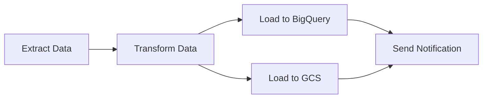

# How to Write and Deploy Your First Airflow DAG in Cloud Composer

Author: [nawazdhandala](https://www.github.com/nawazdhandala)

Tags: GCP, Cloud Composer, Airflow, DAG, Python

Description: A beginner-friendly guide to writing your first Apache Airflow DAG and deploying it to a Cloud Composer environment on Google Cloud.

---

If you are new to Apache Airflow, the learning curve can feel steep. DAGs, operators, tasks, sensors, XComs - there is a lot of vocabulary to absorb. But at its core, a DAG is just a Python file that defines what tasks to run and in what order. Cloud Composer handles all the infrastructure, so you can focus on the pipeline logic.

This article walks you through writing a simple but practical Airflow DAG and deploying it to Cloud Composer. By the end, you will have a working pipeline that you can build on.

## What Is a DAG?

DAG stands for Directed Acyclic Graph. In Airflow terms, it is a collection of tasks with defined dependencies. "Directed" means tasks have a specific execution order. "Acyclic" means there are no circular dependencies - task A cannot depend on task B if task B also depends on task A.

Here is a simple visualization of a DAG:



In this example, the extract step runs first, then transformation, then two parallel loads, and finally a notification after both loads complete.

## Step 1: Understand the DAG File Structure

Every Airflow DAG is a Python file with a few key components:

```python
# my_first_dag.py - A basic Airflow DAG structure

# 1. Import the required modules
from datetime import datetime, timedelta
from airflow import DAG
from airflow.operators.python import PythonOperator
from airflow.operators.bash import BashOperator

# 2. Define default arguments that apply to all tasks
default_args = {
    "owner": "data-engineering",      # Who owns this DAG
    "depends_on_past": False,          # Do not wait for previous runs to succeed
    "email_on_failure": False,         # Do not send emails on failure (for now)
    "retries": 1,                      # Retry failed tasks once
    "retry_delay": timedelta(minutes=5),  # Wait 5 minutes before retrying
}

# 3. Create the DAG object
dag = DAG(
    dag_id="my_first_dag",           # Unique identifier for this DAG
    default_args=default_args,
    description="A simple tutorial DAG",
    schedule_interval="@daily",       # Run once per day
    start_date=datetime(2025, 1, 1),  # When to start scheduling
    catchup=False,                    # Do not backfill past dates
    tags=["tutorial"],                # Tags for organizing in the UI
)

# 4. Define tasks
def greet():
    """A simple Python function used as a task."""
    print("Hello from Airflow! The pipeline is running.")

hello_task = PythonOperator(
    task_id="say_hello",
    python_callable=greet,
    dag=dag,
)

date_task = BashOperator(
    task_id="print_date",
    bash_command="date",
    dag=dag,
)

# 5. Set task dependencies
hello_task >> date_task  # hello_task runs before date_task
```

## Step 2: Write a Practical DAG

Let us write something more useful - a DAG that extracts data from an API, processes it, and stores it in Cloud Storage:

```python
# api_etl_dag.py - Extract data from an API and store in GCS
from datetime import datetime, timedelta
from airflow import DAG
from airflow.operators.python import PythonOperator
from airflow.providers.google.cloud.transfers.local_to_gcs import LocalFilesystemToGCSOperator
import json
import os

default_args = {
    "owner": "data-engineering",
    "retries": 2,
    "retry_delay": timedelta(minutes=5),
}

dag = DAG(
    dag_id="api_etl_pipeline",
    default_args=default_args,
    description="Extract data from API, transform, and load to GCS",
    schedule_interval="0 8 * * *",  # Run at 8 AM UTC daily
    start_date=datetime(2025, 1, 1),
    catchup=False,
    tags=["etl", "api"],
)


def extract_data(**context):
    """Fetch data from an API and save it locally."""
    import requests

    # Use the execution date for partitioning
    execution_date = context["ds"]

    # Fetch data from an API
    response = requests.get(
        "https://jsonplaceholder.typicode.com/posts",
        timeout=30
    )
    response.raise_for_status()
    data = response.json()

    # Save to a local temp file
    output_path = f"/tmp/api_data_{execution_date}.json"
    with open(output_path, "w") as f:
        json.dump(data, f)

    print(f"Extracted {len(data)} records for {execution_date}")

    # Pass the file path to downstream tasks using XCom
    return output_path


def transform_data(**context):
    """Clean and transform the extracted data."""
    # Pull the file path from the extract task using XCom
    ti = context["ti"]
    input_path = ti.xcom_pull(task_ids="extract")
    execution_date = context["ds"]

    # Read the raw data
    with open(input_path, "r") as f:
        raw_data = json.load(f)

    # Apply transformations
    transformed = []
    for record in raw_data:
        transformed.append({
            "id": record["id"],
            "user_id": record["userId"],
            "title": record["title"].strip(),
            "body_length": len(record["body"]),
            "extracted_date": execution_date,
        })

    # Save the transformed data
    output_path = f"/tmp/transformed_data_{execution_date}.json"
    with open(output_path, "w") as f:
        json.dump(transformed, f)

    print(f"Transformed {len(transformed)} records")
    return output_path


def upload_to_gcs(**context):
    """Upload the transformed data to Cloud Storage."""
    from google.cloud import storage

    ti = context["ti"]
    input_path = ti.xcom_pull(task_ids="transform")
    execution_date = context["ds"]

    # Upload to GCS
    client = storage.Client()
    bucket = client.bucket("my-data-bucket")
    blob = bucket.blob(f"api-data/{execution_date}/data.json")
    blob.upload_from_filename(input_path)

    print(f"Uploaded to gs://my-data-bucket/api-data/{execution_date}/data.json")


def cleanup_temp_files(**context):
    """Remove temporary local files."""
    execution_date = context["ds"]
    for prefix in ["api_data_", "transformed_data_"]:
        path = f"/tmp/{prefix}{execution_date}.json"
        if os.path.exists(path):
            os.remove(path)
            print(f"Cleaned up {path}")


# Define the tasks
extract = PythonOperator(
    task_id="extract",
    python_callable=extract_data,
    dag=dag,
)

transform = PythonOperator(
    task_id="transform",
    python_callable=transform_data,
    dag=dag,
)

upload = PythonOperator(
    task_id="upload_to_gcs",
    python_callable=upload_to_gcs,
    dag=dag,
)

cleanup = PythonOperator(
    task_id="cleanup",
    python_callable=cleanup_temp_files,
    trigger_rule="all_done",  # Run cleanup even if upstream tasks fail
    dag=dag,
)

# Set the execution order
extract >> transform >> upload >> cleanup
```

## Step 3: Deploy the DAG to Cloud Composer

Upload your DAG file to the Composer environment:

```bash
# Upload a single DAG file
gcloud composer environments storage dags import \
  --environment=my-composer-env \
  --location=us-central1 \
  --source=api_etl_dag.py
```

After uploading, Composer detects the new DAG file within a few minutes (depending on the `dag_dir_list_interval` setting). You can check the status:

```bash
# List all DAGs in the environment
gcloud composer environments run my-composer-env \
  --location=us-central1 \
  dags list
```

## Step 4: Monitor Your DAG in the Airflow UI

Access the Airflow web interface:

```bash
# Get the Airflow web UI URL
gcloud composer environments describe my-composer-env \
  --location=us-central1 \
  --format="value(config.airflowUri)"
```

In the UI, you can:

- See your DAG in the DAGs list
- Toggle it on/off (new DAGs are paused by default)
- Trigger a manual run by clicking the "Play" button
- View the execution graph showing task status
- Check task logs for debugging

## Step 5: Trigger a Manual Run

You can trigger your DAG manually from the CLI to test it:

```bash
# Trigger a DAG run for a specific date
gcloud composer environments run my-composer-env \
  --location=us-central1 \
  dags trigger -- api_etl_pipeline --exec-date "2025-01-15"

# Or trigger with the current date
gcloud composer environments run my-composer-env \
  --location=us-central1 \
  dags trigger -- api_etl_pipeline
```

## Step 6: Check Task Logs

If a task fails or you want to see the output, check the logs:

```bash
# View logs for a specific task in the most recent DAG run
gcloud composer environments run my-composer-env \
  --location=us-central1 \
  tasks logs -- api_etl_pipeline extract 2025-01-15
```

In the Airflow UI, click on a task in the graph view and select "Log" to see the full output.

## Using the TaskFlow API (Modern Syntax)

Airflow 2.x introduced the TaskFlow API, which provides a cleaner syntax using Python decorators:

```python
# modern_dag.py - Same pipeline using the TaskFlow API
from datetime import datetime, timedelta
from airflow.decorators import dag, task

@dag(
    dag_id="modern_etl_pipeline",
    schedule="@daily",
    start_date=datetime(2025, 1, 1),
    catchup=False,
    default_args={"retries": 2, "retry_delay": timedelta(minutes=5)},
    tags=["etl", "modern"],
)
def modern_etl_pipeline():

    @task
    def extract(ds=None):
        """Fetch data from the API."""
        import requests
        response = requests.get("https://jsonplaceholder.typicode.com/posts", timeout=30)
        return response.json()

    @task
    def transform(raw_data, ds=None):
        """Transform the raw data."""
        return [
            {
                "id": r["id"],
                "user_id": r["userId"],
                "title": r["title"].strip(),
                "body_length": len(r["body"]),
                "date": ds,
            }
            for r in raw_data
        ]

    @task
    def load(transformed_data, ds=None):
        """Upload processed data to Cloud Storage."""
        from google.cloud import storage
        import json

        client = storage.Client()
        bucket = client.bucket("my-data-bucket")
        blob = bucket.blob(f"api-data/{ds}/data.json")
        blob.upload_from_string(json.dumps(transformed_data))
        print(f"Loaded {len(transformed_data)} records")

    # Chain the tasks - data flows automatically through XCom
    raw = extract()
    transformed = transform(raw)
    load(transformed)

# Instantiate the DAG
modern_etl_pipeline()
```

The TaskFlow API handles XCom serialization and deserialization automatically. Data returned from one task is passed as an argument to the next.

## Common Beginner Mistakes

1. **Forgetting `catchup=False`** - Without this, Airflow tries to run your DAG for every interval since `start_date`, which can trigger hundreds of runs
2. **Top-level code execution** - Do not put database connections or API calls at the top level of your DAG file. They run every time the scheduler parses the file.
3. **Large XCom payloads** - XCom is stored in the Airflow metadata database. Do not pass large datasets through it. Use Cloud Storage instead.
4. **Not setting timeouts** - Add `execution_timeout` to prevent tasks from running forever

## Wrapping Up

Writing your first Airflow DAG is really just writing a Python script with some structure. Define your tasks, set up the dependencies, and let Composer handle the scheduling and execution. Start simple, use the Airflow UI to monitor and debug, and gradually add complexity as you get comfortable with the framework. The TaskFlow API makes modern DAGs significantly cleaner than the traditional operator-based approach.
