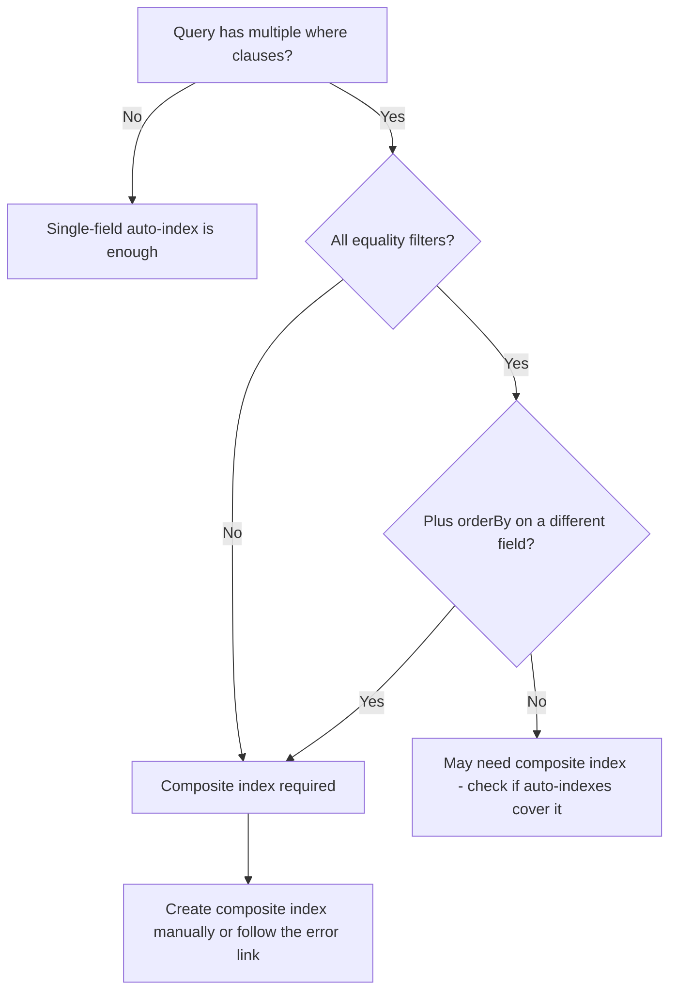

# How to Write Compound Queries with Multiple Where Clauses in Firestore

Author: [nawazdhandala](https://www.github.com/nawazdhandala)

Tags: GCP, Firestore, Queries, Compound Queries, NoSQL

Description: Learn how to build compound queries with multiple where clauses in Firestore, including equality filters, range queries, and required indexes.

---

Firestore's querying model is different from SQL. You cannot just throw arbitrary WHERE clauses together and expect them to work. Firestore requires indexes for compound queries, and there are rules about which combinations of filters are allowed. Understanding these rules saves you from frustrating "query requires an index" errors. In this post, I will walk through how to build effective compound queries in Firestore.

## Single-Field Queries

Let's start with the basics. Firestore automatically indexes every field, so single-field queries work out of the box:

```javascript
const admin = require('firebase-admin');
const db = admin.firestore();

// Simple equality query - no special index needed
const activeUsers = await db.collection('users')
    .where('active', '==', true)
    .get();

// Range query on a single field - also automatic
const recentUsers = await db.collection('users')
    .where('createdAt', '>', new Date('2026-01-01'))
    .get();

// Array contains query
const admins = await db.collection('users')
    .where('roles', 'array-contains', 'admin')
    .get();
```

## Combining Multiple Equality Filters

You can combine multiple equality (==) filters without a composite index:

```javascript
// Multiple equality filters work without a composite index
const activeAdminUsers = await db.collection('users')
    .where('active', '==', true)
    .where('role', '==', 'admin')
    .get();
```

Wait, that is not entirely accurate. While some simple combinations work with automatically created indexes, most multi-field queries require composite indexes. Firestore will tell you when you need one - the error message includes a direct link to create the required index.

## Equality Plus Range Queries

One of the most common compound query patterns is combining equality filters with a range filter:

```javascript
// Find active users created after a certain date
// This requires a composite index on (active, createdAt)
const results = await db.collection('users')
    .where('active', '==', true)
    .where('createdAt', '>', new Date('2026-01-01'))
    .orderBy('createdAt', 'desc')
    .get();
```

This query filters by an exact match on `active` and a range on `createdAt`. Firestore needs a composite index that covers both fields.

### Python Example

```python
from google.cloud import firestore

db = firestore.Client()

def get_active_recent_users():
    """Get active users created after January 1, 2026."""
    users_ref = db.collection('users')

    # Compound query: equality on active + range on createdAt
    query = (users_ref
        .where('active', '==', True)
        .where('createdAt', '>', datetime(2026, 1, 1))
        .order_by('createdAt', direction=firestore.Query.DESCENDING))

    return [{'id': doc.id, **doc.to_dict()} for doc in query.stream()]
```

## The Range Filter Rule

Firestore has an important restriction: **range filters and orderBy can only apply to a single field** (unless you have the right composite index). Here is what works and what does not:

```javascript
// This works: equality on field A, range on field B
const query1 = db.collection('products')
    .where('category', '==', 'electronics')
    .where('price', '>', 100)
    .where('price', '<', 500);

// This works: range on one field with orderBy on the same field
const query2 = db.collection('products')
    .where('price', '>', 100)
    .orderBy('price');

// This requires a composite index: range on field A, orderBy on field B
const query3 = db.collection('products')
    .where('price', '>', 100)
    .orderBy('createdAt', 'desc');

// This does NOT work: range filters on two different fields
// Firestore will reject this query
const query4 = db.collection('products')
    .where('price', '>', 100)
    .where('rating', '>', 4);  // Error: range on multiple fields
```

The last example fails because Firestore cannot efficiently serve range queries on two different fields simultaneously. You need to restructure your query or your data to work around this.

## Workarounds for Multiple Range Filters

When you need to filter on ranges of two fields, here are your options:

### Option 1: Filter One in the Query, Filter the Other Client-Side

```javascript
async function getAffordableHighRatedProducts() {
    // Range filter on price in the query
    const snapshot = await db.collection('products')
        .where('price', '>', 100)
        .where('price', '<', 500)
        .get();

    // Filter by rating on the client side
    const filtered = snapshot.docs
        .map(doc => ({ id: doc.id, ...doc.data() }))
        .filter(product => product.rating > 4);

    return filtered;
}
```

This works but reads more data than necessary. Only use it when the first filter is selective enough.

### Option 2: Create a Composite Field

```javascript
// When storing the document, create a derived field
async function addProduct(product) {
    // Create a price bracket field to convert a range into equality
    let priceBracket;
    if (product.price < 50) priceBracket = 'budget';
    else if (product.price < 200) priceBracket = 'mid';
    else priceBracket = 'premium';

    await db.collection('products').add({
        ...product,
        priceBracket: priceBracket
    });
}

// Now you can use equality on priceBracket and range on rating
const results = await db.collection('products')
    .where('priceBracket', '==', 'mid')
    .where('rating', '>', 4)
    .get();
```

## OrderBy Requirements

When using range filters, you must include an `orderBy` on the range field if you also want to order by another field:

```javascript
// Correct: orderBy on the range field first, then additional orderBy
const results = await db.collection('products')
    .where('category', '==', 'electronics')
    .where('price', '>', 100)
    .orderBy('price')          // Required: range field comes first
    .orderBy('createdAt', 'desc')  // Additional sort
    .get();
```

The first `orderBy` must match the range filter field. Additional `orderBy` clauses can sort on other fields but require a composite index.

## Composite Index Requirements

Here is a decision tree for when you need composite indexes:



## Creating Composite Indexes

You can create composite indexes through the console, the CLI, or a configuration file:

### Through the Error Link

The easiest way. Run your query, get the error message, click the link. Firestore creates the index for you.

### Using gcloud

```bash
# Create a composite index for querying by category and price
gcloud firestore indexes composite create \
    --collection-group=products \
    --field-config=field-path=category,order=ASCENDING \
    --field-config=field-path=price,order=ASCENDING
```

### Using a Configuration File

```json
{
  "indexes": [
    {
      "collectionGroup": "products",
      "queryScope": "COLLECTION",
      "fields": [
        { "fieldPath": "category", "order": "ASCENDING" },
        { "fieldPath": "price", "order": "ASCENDING" }
      ]
    },
    {
      "collectionGroup": "products",
      "queryScope": "COLLECTION",
      "fields": [
        { "fieldPath": "active", "order": "ASCENDING" },
        { "fieldPath": "rating", "order": "DESCENDING" },
        { "fieldPath": "createdAt", "order": "DESCENDING" }
      ]
    }
  ]
}
```

Deploy the indexes:

```bash
# Deploy all indexes from the configuration file
firebase deploy --only firestore:indexes
```

## Practical Query Patterns

### E-Commerce Product Search

```javascript
// Find active electronics under $500, sorted by rating
const products = await db.collection('products')
    .where('active', '==', true)
    .where('category', '==', 'electronics')
    .where('price', '<', 500)
    .orderBy('price')
    .limit(20)
    .get();
```

Index needed: `active ASC, category ASC, price ASC`

### Task Management

```javascript
// Find incomplete tasks for a specific project, ordered by due date
const tasks = await db.collection('tasks')
    .where('projectId', '==', 'project-123')
    .where('completed', '==', false)
    .orderBy('dueDate', 'asc')
    .get();
```

Index needed: `projectId ASC, completed ASC, dueDate ASC`

### Content Feed

```javascript
// Get published posts in a category, most recent first
const posts = await db.collection('posts')
    .where('status', '==', 'published')
    .where('category', '==', 'technology')
    .orderBy('publishedAt', 'desc')
    .limit(10)
    .get();
```

Index needed: `status ASC, category ASC, publishedAt DESC`

## Pagination with Compound Queries

Compound queries support cursor-based pagination:

```javascript
async function getProductsPage(category, lastDoc, pageSize = 20) {
    let query = db.collection('products')
        .where('category', '==', category)
        .where('active', '==', true)
        .orderBy('price', 'asc')
        .limit(pageSize);

    if (lastDoc) {
        // Start after the last document from the previous page
        query = query.startAfter(lastDoc);
    }

    const snapshot = await query.get();
    return {
        products: snapshot.docs.map(doc => ({ id: doc.id, ...doc.data() })),
        lastDoc: snapshot.docs[snapshot.docs.length - 1],
        hasMore: snapshot.docs.length === pageSize
    };
}
```

## Wrapping Up

Compound queries in Firestore require a bit more planning than SQL queries, but once you understand the rules they become second nature. The key principles are: you can combine any number of equality filters, you can add one range filter or orderBy clause without issues, and any other combination requires a composite index. When Firestore tells you an index is needed, the error message makes it one click to create it. Design your data model and indexes around your query patterns, and Firestore will serve those queries efficiently at any scale.
