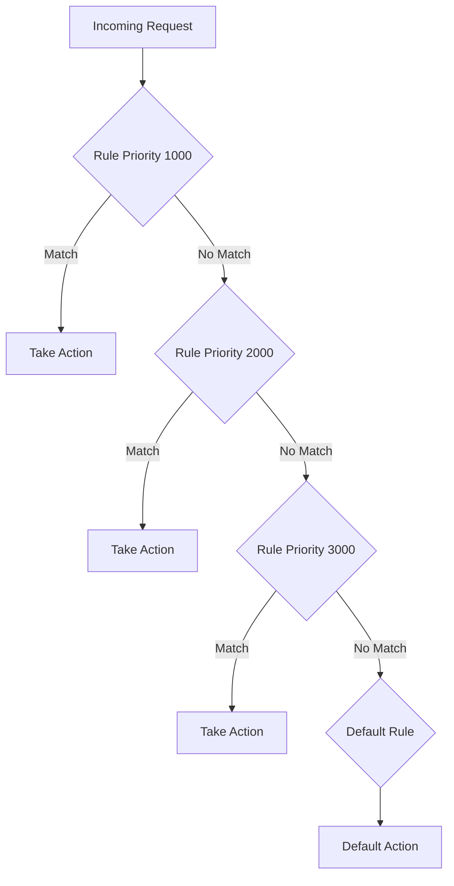

# How to Write Custom CEL Expressions for Advanced Cloud Armor Security Rules

Author: [nawazdhandala](https://www.github.com/nawazdhandala)

Tags: GCP, Cloud Armor, CEL, Security Rules, Web Application Firewall

Description: Master the Common Expression Language to create advanced Cloud Armor security rules that go beyond simple IP-based filtering for fine-grained traffic control.

---

Cloud Armor security policies are only as good as the rules you write for them. While basic rules like IP allowlists and denylists cover simple cases, real-world security needs are more nuanced. That is where CEL - the Common Expression Language - comes in. Cloud Armor uses CEL to let you write expressive match conditions that inspect request attributes like headers, paths, query parameters, and geographic origin.

If you have been relying on the basic match options in the Cloud Console, this guide will show you how to level up with custom CEL expressions.

## What is CEL?

CEL is a lightweight expression language developed by Google. It is designed to be safe, fast, and easy to evaluate. In Cloud Armor, CEL expressions are used in the `--expression` flag when creating rules. Each expression must evaluate to a boolean - true means the rule matches, false means it does not.

The key thing to understand is that CEL is not a full programming language. There are no loops, no variable assignments, and no side effects. It is purely for evaluating conditions.

## Available Request Attributes

Before writing expressions, you need to know what data you can work with. Cloud Armor exposes several request attributes:

| Attribute | Description |
|-----------|-------------|
| `request.headers['name']` | HTTP request header value |
| `request.method` | HTTP method (GET, POST, etc.) |
| `request.path` | URL path |
| `request.query` | Query string |
| `origin.ip` | Client IP address |
| `origin.region_code` | Two-letter country code |
| `origin.asn` | Autonomous System Number |
| `token.recaptcha_enterprise.score` | reCAPTCHA score |

## Basic CEL Expression Patterns

Let me start with some foundational patterns before getting into advanced territory.

### Matching by Country

Block or allow traffic from specific countries:

```bash
# Block traffic from two specific countries
gcloud compute security-policies rules create 1000 \
  --security-policy=my-policy \
  --expression="origin.region_code == 'XX' || origin.region_code == 'YY'" \
  --action=deny-403 \
  --description="Block traffic from specific regions"
```

### Matching by Request Path

Protect specific URL paths:

```bash
# Match requests to admin paths
gcloud compute security-policies rules create 1100 \
  --security-policy=my-policy \
  --expression="request.path.matches('/admin.*') || request.path.matches('/wp-admin.*')" \
  --action=deny-403 \
  --description="Block direct access to admin paths"
```

### Matching by Header Values

Inspect specific HTTP headers:

```bash
# Block requests with a missing or empty User-Agent header
gcloud compute security-policies rules create 1200 \
  --security-policy=my-policy \
  --expression="!has(request.headers['user-agent']) || request.headers['user-agent'] == ''" \
  --action=deny-403 \
  --description="Block requests without User-Agent header"
```

## Advanced CEL Patterns

Now let me get into the patterns that make CEL really useful.

### Combining Multiple Conditions

You can combine conditions with logical operators `&&` (AND), `||` (OR), and `!` (NOT):

```bash
# Block POST requests to login from outside the US without a valid referer
gcloud compute security-policies rules create 1300 \
  --security-policy=my-policy \
  --expression="request.method == 'POST' && request.path.matches('/login') && origin.region_code != 'US' && !request.headers['referer'].matches('https://yourdomain\\.com/.*')" \
  --action=deny-403 \
  --description="Block suspicious login attempts from foreign IPs without valid referer"
```

### Using the `has()` Function

The `has()` function checks whether a field exists. This is critical because accessing a header that does not exist will cause an evaluation error:

```bash
# Check if a custom header exists and has a specific value
gcloud compute security-policies rules create 1400 \
  --security-policy=my-policy \
  --expression="has(request.headers['x-custom-auth']) && request.headers['x-custom-auth'] == 'expected-value'" \
  --action=allow \
  --description="Allow requests with valid custom auth header"
```

### String Matching with `matches()`

The `matches()` function supports RE2 regular expressions:

```bash
# Block requests where the path contains SQL injection patterns
gcloud compute security-policies rules create 1500 \
  --security-policy=my-policy \
  --expression="request.path.matches('.*(\\'|\\\"|--).*') || request.query.matches('.*(union|select|insert|drop|delete).*')" \
  --action=deny-403 \
  --description="Block basic SQL injection patterns in URL"
```

### Using `inIpRange()` for CIDR Matching

For IP range matching, use the `inIpRange()` function:

```bash
# Allow traffic only from specific CIDR ranges
gcloud compute security-policies rules create 1600 \
  --security-policy=my-policy \
  --expression="inIpRange(origin.ip, '10.0.0.0/8') || inIpRange(origin.ip, '172.16.0.0/12')" \
  --action=allow \
  --description="Allow traffic from internal IP ranges"
```

### ASN-Based Filtering

Block or allow traffic from specific Autonomous Systems. This is useful for blocking known hosting providers often used by bot operators:

```bash
# Block traffic from specific ASNs associated with bot traffic
gcloud compute security-policies rules create 1700 \
  --security-policy=my-policy \
  --expression="origin.asn == 12345 || origin.asn == 67890" \
  --action=deny-403 \
  --description="Block traffic from suspicious ASNs"
```

## Building Complex Rule Sets

Real-world scenarios often need complex rule combinations. Here is a pattern for protecting an API endpoint with multiple layers of checks:

```bash
# Complex rule: protect API from abuse
# - Must have valid API key header
# - Must not be from blocked countries
# - Must have an acceptable content type for POST requests
gcloud compute security-policies rules create 2000 \
  --security-policy=my-policy \
  --expression="request.path.matches('/api/v1/.*') && request.method == 'POST' && (!has(request.headers['x-api-key']) || origin.region_code == 'XX' || !request.headers['content-type'].matches('application/json.*'))" \
  --action=deny-403 \
  --description="Block invalid API POST requests"
```

## Expression Evaluation Order

Cloud Armor evaluates rules by priority number, lowest first. Once a rule matches, Cloud Armor takes the specified action and stops evaluating. Keep this in mind when designing your rule set:



A good practice is to structure your rules like this:
- Priorities 100-999: Always-allow rules (your own IPs, health checks)
- Priorities 1000-4999: Deny rules (block known bad patterns)
- Priorities 5000-8999: Conditional rules (rate limiting, reCAPTCHA checks)
- Priority 2147483647: Default rule (deny or allow everything else)

## Debugging CEL Expressions

When a CEL expression does not behave as expected, use Cloud Logging to inspect what Cloud Armor is actually seeing:

```bash
# View detailed Cloud Armor logs including matched rules
gcloud logging read \
  'resource.type="http_load_balancer" AND jsonPayload.enforcedSecurityPolicy.configuredAction!=""' \
  --project=your-project-id \
  --limit=20 \
  --format="table(jsonPayload.enforcedSecurityPolicy.name, jsonPayload.enforcedSecurityPolicy.configuredAction, jsonPayload.enforcedSecurityPolicy.matchedFieldValue)"
```

You can also use preview mode to test rules without actually enforcing them:

```bash
# Create a rule in preview mode - logs matches but does not enforce
gcloud compute security-policies rules create 3000 \
  --security-policy=my-policy \
  --expression="request.headers['user-agent'].matches('.*curl.*')" \
  --action=deny-403 \
  --preview \
  --description="Preview: would block curl requests"
```

## Common Mistakes to Avoid

A few things that trip people up when writing CEL expressions:

1. **Forgetting `has()` checks** - Always check if a header exists before accessing it, otherwise the expression will error out
2. **Regex escaping** - CEL uses RE2 regex syntax. Remember to escape special characters properly
3. **Case sensitivity** - Header names are case-insensitive when accessed through `request.headers`, but values are case-sensitive. Use `.lower()` if you need case-insensitive value matching
4. **Expression length limits** - Cloud Armor has a maximum expression length. If your expression gets too long, split it into multiple rules

## Wrapping Up

CEL expressions give you the ability to write Cloud Armor rules that go far beyond basic IP filtering. By combining request attributes with logical operators and string matching, you can build sophisticated security policies that adapt to your specific threat landscape. Start with simple expressions, test them in preview mode, and gradually build complexity as you understand your traffic patterns. The key is to be precise in what you match and to always use `has()` checks before accessing optional fields.
