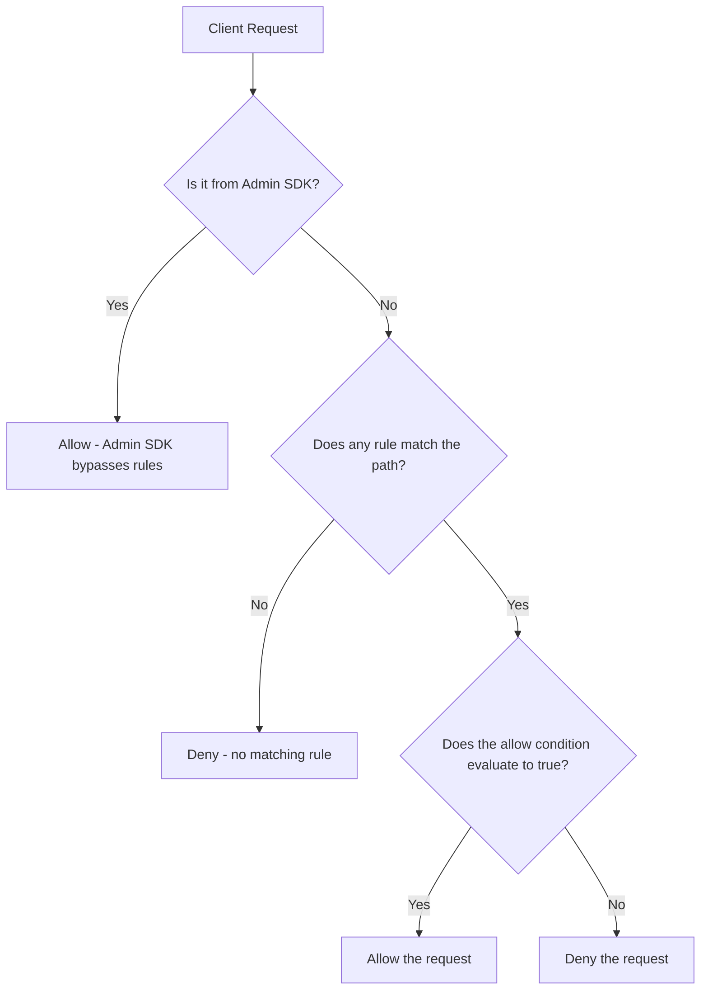

# How to Write Firestore Security Rules for User-Based Access Control

Author: [nawazdhandala](https://www.github.com/nawazdhandala)

Tags: GCP, Firestore, Security Rules, Access Control, Authentication

Description: A practical guide to writing Firestore security rules that restrict data access based on authenticated users with real-world examples and patterns.

---

Firestore security rules are the gatekeepers between your data and the outside world. When your mobile or web app talks directly to Firestore (through the Firebase SDKs), security rules determine who can read and write what. Get them wrong and you either lock out your users or expose everyone's data. In this post, I will walk through how to write effective security rules for user-based access control, from basic patterns to more advanced scenarios.

## How Security Rules Work

Firestore security rules evaluate every read and write request from client SDKs. They run on Google's servers, not in the client, so they cannot be bypassed. Each rule specifies a path pattern and conditions for allowing reads and writes.

Important: Security rules only apply to client SDK access. Server-side access using the Admin SDK bypasses rules entirely. This is by design - your backend server is trusted.

## The Basic Structure

Every Firestore security rules file starts with this structure:

```
rules_version = '2';
service cloud.firestore {
  match /databases/{database}/documents {

    // Your rules go here

  }
}
```

Within this structure, you define `match` blocks that specify which documents the rule applies to, and `allow` statements that specify the conditions for access.

## Rule 1: Users Can Only Access Their Own Data

The most common pattern. Each user has a document in the `users` collection with their user ID as the document ID:

```
rules_version = '2';
service cloud.firestore {
  match /databases/{database}/documents {

    // Users can only read and write their own profile
    match /users/{userId} {
      allow read, write: if request.auth != null && request.auth.uid == userId;
    }

  }
}
```

Breaking this down:
- `request.auth != null` checks that the user is authenticated
- `request.auth.uid == userId` checks that the authenticated user's ID matches the document ID

## Rule 2: Public Read, Authenticated Write

For content that anyone can read but only logged-in users can create:

```
rules_version = '2';
service cloud.firestore {
  match /databases/{database}/documents {

    // Anyone can read posts, only authenticated users can create them
    match /posts/{postId} {
      allow read: if true;
      allow create: if request.auth != null;
      allow update, delete: if request.auth != null
                            && request.auth.uid == resource.data.authorId;
    }

  }
}
```

Here we split the permissions:
- `read` is allowed for everyone (including unauthenticated users)
- `create` requires authentication
- `update` and `delete` require that the authenticated user is the post's author

## Rule 3: Validating Data on Write

Security rules can validate the data being written to prevent malformed documents:

```
rules_version = '2';
service cloud.firestore {
  match /databases/{database}/documents {

    match /users/{userId} {
      allow read: if request.auth != null && request.auth.uid == userId;

      // Validate the data structure on write
      allow write: if request.auth != null
                   && request.auth.uid == userId
                   && request.resource.data.keys().hasAll(['name', 'email'])
                   && request.resource.data.name is string
                   && request.resource.data.name.size() > 0
                   && request.resource.data.name.size() <= 128
                   && request.resource.data.email is string
                   && request.resource.data.email.matches('.*@.*\\..*');
    }

  }
}
```

This rule validates that:
- The document has `name` and `email` fields
- `name` is a non-empty string under 128 characters
- `email` looks like an email address (basic validation)

## Rule 4: Subcollection Access

For subcollections, you need nested match blocks:

```
rules_version = '2';
service cloud.firestore {
  match /databases/{database}/documents {

    // User profile access
    match /users/{userId} {
      allow read, write: if request.auth != null && request.auth.uid == userId;

      // User's orders subcollection - only the user can access
      match /orders/{orderId} {
        allow read: if request.auth != null && request.auth.uid == userId;
        allow create: if request.auth != null
                      && request.auth.uid == userId
                      && request.resource.data.keys().hasAll(['product', 'amount', 'status'])
                      && request.resource.data.amount is number
                      && request.resource.data.amount > 0;
        allow update: if request.auth != null && request.auth.uid == userId;
        allow delete: if false;  // Orders cannot be deleted by users
      }
    }

  }
}
```

This gives users access to their own orders but prevents deletion. The validation on `create` ensures every order has the required fields.

## Rule 5: Role-Based Access Control

For applications with admin users, check custom claims set on the authentication token:

```
rules_version = '2';
service cloud.firestore {
  match /databases/{database}/documents {

    // Helper function to check if the user is an admin
    function isAdmin() {
      return request.auth != null && request.auth.token.admin == true;
    }

    // Helper function to check if the user is authenticated
    function isAuthenticated() {
      return request.auth != null;
    }

    // Admin-only collection
    match /adminSettings/{docId} {
      allow read, write: if isAdmin();
    }

    // Users can read their own data, admins can read all
    match /users/{userId} {
      allow read: if isAuthenticated() && (request.auth.uid == userId || isAdmin());
      allow write: if isAuthenticated() && request.auth.uid == userId;
    }

    // Products: anyone can read, only admins can write
    match /products/{productId} {
      allow read: if true;
      allow write: if isAdmin();
    }

  }
}
```

Custom claims are set on the server side using the Admin SDK:

```javascript
// Server-side: set custom claims for an admin user
const admin = require('firebase-admin');

async function makeAdmin(uid) {
    await admin.auth().setCustomUserClaims(uid, { admin: true });
    console.log(`User ${uid} is now an admin`);
}
```

## Rule 6: Team-Based Access

For collaborative applications where users belong to teams:

```
rules_version = '2';
service cloud.firestore {
  match /databases/{database}/documents {

    // Team documents
    match /teams/{teamId} {
      // Anyone on the team can read
      allow read: if request.auth != null
                  && request.auth.uid in resource.data.members;

      // Only the team owner can update team settings
      allow update: if request.auth != null
                    && request.auth.uid == resource.data.ownerId;

      // Team documents within the team
      match /documents/{docId} {
        // Team members can read and create documents
        allow read, create: if request.auth != null
                            && request.auth.uid in get(/databases/$(database)/documents/teams/$(teamId)).data.members;

        // Only the document author can update or delete
        allow update, delete: if request.auth != null
                              && request.auth.uid == resource.data.authorId;
      }
    }

  }
}
```

The `get()` function reads another document within the rules. This lets you check team membership by reading the team document. Be aware that each `get()` call counts toward your Firestore reads and adds latency to rule evaluation.

## Rule 7: Rate Limiting with Timestamps

Prevent users from creating too many documents too quickly:

```
rules_version = '2';
service cloud.firestore {
  match /databases/{database}/documents {

    match /comments/{commentId} {
      allow read: if true;

      // Users can create comments but must wait between posts
      allow create: if request.auth != null
                    && request.resource.data.authorId == request.auth.uid
                    && request.resource.data.createdAt == request.time
                    // Ensure the comment has content
                    && request.resource.data.text is string
                    && request.resource.data.text.size() > 0
                    && request.resource.data.text.size() <= 5000;
    }

  }
}
```

The `request.time` check ensures the client cannot forge the creation timestamp.

## Security Rules Decision Flow

Here is how rules are evaluated:



Important: if no rule matches a path, access is denied by default. You must explicitly allow access.

## Testing Security Rules

Test your rules before deploying them. The Firebase Emulator Suite lets you test rules locally:

```bash
# Start the Firebase emulators including Firestore
firebase emulators:start --only firestore
```

Write tests using the rules testing library:

```javascript
const { initializeTestEnvironment, assertSucceeds, assertFails } = require('@firebase/rules-unit-testing');

let testEnv;

beforeAll(async () => {
    // Set up the test environment with your rules file
    testEnv = await initializeTestEnvironment({
        projectId: 'test-project',
        firestore: {
            rules: fs.readFileSync('firestore.rules', 'utf8'),
        },
    });
});

test('user can read their own profile', async () => {
    // Create a context for an authenticated user
    const userContext = testEnv.authenticatedContext('user-001');
    const userDoc = userContext.firestore().collection('users').doc('user-001');

    // This should succeed
    await assertSucceeds(userDoc.get());
});

test('user cannot read another user profile', async () => {
    const userContext = testEnv.authenticatedContext('user-001');
    const otherUserDoc = userContext.firestore().collection('users').doc('user-002');

    // This should fail
    await assertFails(otherUserDoc.get());
});

test('unauthenticated user cannot access user profiles', async () => {
    const anonContext = testEnv.unauthenticatedContext();
    const userDoc = anonContext.firestore().collection('users').doc('user-001');

    // This should fail
    await assertFails(userDoc.get());
});

test('admin can read any user profile', async () => {
    // Create context with admin custom claim
    const adminContext = testEnv.authenticatedContext('admin-001', { admin: true });
    const userDoc = adminContext.firestore().collection('users').doc('user-001');

    // This should succeed
    await assertSucceeds(userDoc.get());
});

afterAll(async () => {
    await testEnv.cleanup();
});
```

## Deploying Rules

Deploy your security rules:

```bash
# Deploy only Firestore security rules
firebase deploy --only firestore:rules
```

Rules deployment is atomic and takes effect within a few seconds.

## Common Mistakes to Avoid

**Leaving rules wide open during development.** It is tempting to set `allow read, write: if true;` while building your app. But this gets forgotten and pushed to production. Start with restrictive rules from day one.

**Not validating data on write.** Rules are your last line of defense against malformed data. Validate field types, required fields, and value ranges.

**Over-using get() calls.** Each `get()` in your rules adds latency and counts as a read. If you find yourself chaining multiple `get()` calls, consider restructuring your data model.

**Not testing rules.** Treat security rules like application code. Write tests, run them in CI, and catch permission issues before they reach production.

## Wrapping Up

Firestore security rules are not optional for any application that uses the client SDKs. They are the boundary between your users and your data. Start with the principle of least privilege - deny everything by default and explicitly allow only what each user needs. Use helper functions to keep rules readable, validate data on every write, and test your rules thoroughly. The investment in writing good security rules pays off every time you do not have a data breach.
