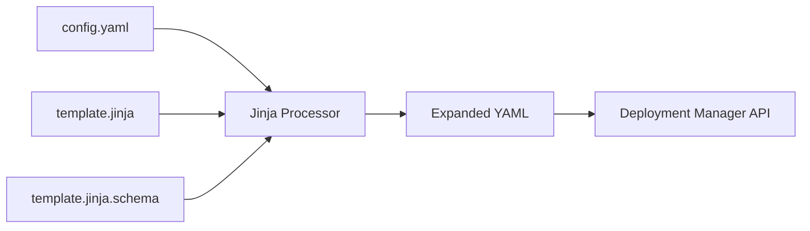

# How to Write Jinja Templates for Reusable Deployment Manager Configurations

Author: [nawazdhandala](https://www.github.com/nawazdhandala)

Tags: GCP, Deployment Manager, Jinja Templates, Infrastructure as Code, Cloud Automation

Description: Learn how to use Jinja2 templates in Google Cloud Deployment Manager to create reusable, parameterized infrastructure configurations that reduce duplication and errors.

---

Once you start managing more than a few resources with Deployment Manager, you will notice a lot of repetition. Creating three environments (dev, staging, prod) means writing nearly identical configurations three times, with small differences in machine sizes, disk sizes, and naming. Jinja templates solve this by letting you parameterize your configurations. You write the template once with variables, and then instantiate it with different values for each environment.

This guide covers how to write Jinja templates, pass parameters to them, use control structures, and organize templates for real-world projects.

## How Jinja Templates Work in Deployment Manager

Jinja2 is a templating engine that processes your template file and produces YAML output. Deployment Manager runs the Jinja processor before interpreting the YAML, so you can use Jinja constructs to generate dynamic configurations.



The workflow involves three files:

1. **config.yaml** - The main configuration that imports templates and passes parameters
2. **template.jinja** - The template file with Jinja2 syntax
3. **template.jinja.schema** - (Optional) Schema file that defines and validates parameters

## Your First Jinja Template

Let me start with a simple template that creates a Compute Engine instance with configurable properties.

First, create the template file.

```jinja
{# vm-instance.jinja #}
{# Template for creating a Compute Engine instance #}

resources:
- name: {{ env["name"] }}
  type: compute.v1.instance
  properties:
    zone: {{ properties["zone"] }}
    machineType: zones/{{ properties["zone"] }}/machineTypes/{{ properties["machineType"] }}
    disks:
    - deviceName: boot
      type: PERSISTENT
      boot: true
      autoDelete: true
      initializeParams:
        sourceImage: {{ properties["sourceImage"] }}
        diskSizeGb: {{ properties["diskSizeGb"] }}
    networkInterfaces:
    - network: global/networks/{{ properties["network"] }}
      
      accessConfigs:
      - name: External NAT
        type: ONE_TO_ONE_NAT
      
    tags:
      items:
      
      - {{ tag }}
      
```

Now create the configuration file that uses this template.

```yaml
# config.yaml
# Configuration that uses the VM template with specific parameters
imports:
- path: vm-instance.jinja

resources:
- name: web-server
  type: vm-instance.jinja
  properties:
    zone: us-central1-a
    machineType: e2-medium
    sourceImage: projects/debian-cloud/global/images/family/debian-12
    diskSizeGb: 20
    network: default
    externalIp: true
    tags:
    - http-server
    - ssh-server
```

Deploy it.

```bash
gcloud deployment-manager deployments create web-deployment \
    --config config.yaml
```

## Template Variables

Jinja templates in Deployment Manager have access to two main variable sources:

### Properties

Properties are passed from the configuration file. Access them with `{{ properties["propertyName"] }}`.

```yaml
# In config.yaml
resources:
- name: my-resource
  type: my-template.jinja
  properties:
    size: large
    count: 3
```

```jinja
{# In my-template.jinja #}
Size is: {{ properties["size"] }}
Count is: {{ properties["count"] }}
```

### Environment Variables

Deployment Manager provides built-in environment variables. Access them with `{{ env["variable"] }}`.

| Variable | Description |
|----------|-------------|
| `env["deployment"]` | The deployment name |
| `env["name"]` | The resource name from the config |
| `env["project"]` | The project ID |
| `env["project_number"]` | The project number |
| `env["current_time"]` | Deployment timestamp |
| `env["type"]` | The template name |
| `env["username"]` | The deploying user |

```jinja
{# Using environment variables for resource naming #}
resources:
- name: {{ env["deployment"] }}-{{ env["name"] }}-bucket
  type: storage.v1.bucket
  properties:
    name: {{ env["project"] }}-{{ env["deployment"] }}-storage
    location: US
```

## Control Structures

Jinja gives you loops and conditionals for generating dynamic configurations.

### Loops

Create multiple similar resources with a single template.

```jinja
{# multi-instance.jinja #}
{# Creates multiple VM instances from a list of configurations #}

resources:

- name: {{ instance.name }}
  type: compute.v1.instance
  properties:
    zone: {{ instance.zone }}
    machineType: zones/{{ instance.zone }}/machineTypes/{{ instance.machineType }}
    disks:
    - deviceName: boot
      type: PERSISTENT
      boot: true
      autoDelete: true
      initializeParams:
        sourceImage: projects/debian-cloud/global/images/family/debian-12
    networkInterfaces:
    - network: global/networks/default
      accessConfigs:
      - name: External NAT
        type: ONE_TO_ONE_NAT
    tags:
      items:
      
      - {{ tag }}
      

```

Use it from your configuration.

```yaml
# multi-instance-config.yaml
imports:
- path: multi-instance.jinja

resources:
- name: web-servers
  type: multi-instance.jinja
  properties:
    instances:
    - name: web-1
      zone: us-central1-a
      machineType: e2-small
      tags: [http-server]
    - name: web-2
      zone: us-central1-b
      machineType: e2-small
      tags: [http-server]
    - name: web-3
      zone: us-central1-c
      machineType: e2-small
      tags: [http-server]
```

### Conditionals

Include or exclude resource sections based on properties.

```jinja
{# conditional-instance.jinja #}
{# Creates a VM with optional features based on properties #}

resources:
- name: {{ env["name"] }}
  type: compute.v1.instance
  properties:
    zone: {{ properties["zone"] }}
    machineType: zones/{{ properties["zone"] }}/machineTypes/{{ properties["machineType"] }}
    disks:
    - deviceName: boot
      type: PERSISTENT
      boot: true
      autoDelete: true
      initializeParams:
        sourceImage: {{ properties["sourceImage"] }}
        diskSizeGb: {{ properties["diskSizeGb"] }}
    
    
    - deviceName: {{ disk.name }}
      type: PERSISTENT
      autoDelete: {{ disk.get("autoDelete", true) }}
      initializeParams:
        diskSizeGb: {{ disk.sizeGb }}
        diskType: zones/{{ properties["zone"] }}/diskTypes/{{ disk.get("type", "pd-standard") }}
    
    
    networkInterfaces:
    - network: global/networks/{{ properties.get("network", "default") }}
      
      accessConfigs:
      - name: External NAT
        type: ONE_TO_ONE_NAT
      
    
    labels:
      
      {{ key }}: "{{ value }}"
      
    
```

## Adding Schema Validation

Schema files validate properties before the template runs, catching errors early.

```yaml
# vm-instance.jinja.schema
# Schema validation for the VM instance template
info:
  title: VM Instance Template
  author: Platform Team
  description: Creates a Compute Engine instance with configurable properties
  version: 1.0

required:
- zone
- machineType
- sourceImage

properties:
  zone:
    type: string
    description: The GCE zone for the instance
    enum:
    - us-central1-a
    - us-central1-b
    - us-central1-c
    - us-east1-b
    - us-west1-a

  machineType:
    type: string
    description: The machine type
    default: e2-small

  sourceImage:
    type: string
    description: The source image for the boot disk

  diskSizeGb:
    type: integer
    description: Boot disk size in GB
    default: 20
    minimum: 10
    maximum: 500

  network:
    type: string
    description: VPC network name
    default: default

  externalIp:
    type: boolean
    description: Whether to assign an external IP
    default: false

  tags:
    type: array
    description: Network tags
    items:
      type: string

  labels:
    type: object
    description: Labels to apply to the instance
```

With the schema file, Deployment Manager validates the properties before even attempting to create resources. If you pass `diskSizeGb: 5` (below the minimum), you get a clear error message instead of an obscure API error.

## Composing Templates

For complex deployments, break your infrastructure into multiple templates and compose them.

```jinja
{# network-environment.jinja #}
{# Creates a complete network environment with VPC, subnets, and firewall #}

resources:
- name: {{ env["name"] }}-vpc
  type: compute.v1.network
  properties:
    autoCreateSubnetworks: false


- name: {{ env["name"] }}-{{ subnet.name }}
  type: compute.v1.subnetwork
  properties:
    ipCidrRange: {{ subnet.cidr }}
    network: $(ref.{{ env["name"] }}-vpc.selfLink)
    region: {{ subnet.region }}



- name: {{ env["name"] }}-{{ rule.name }}
  type: compute.v1.firewall
  properties:
    network: $(ref.{{ env["name"] }}-vpc.selfLink)
    allowed:
    
    - IPProtocol: {{ allow.protocol }}
      ports:
      
      - "{{ port }}"
      
    
    sourceRanges:
    
    - {{ range }}
    
    
    targetTags:
    
    - {{ tag }}
    
    


outputs:
- name: vpcSelfLink
  value: $(ref.{{ env["name"] }}-vpc.selfLink)

- name: {{ subnet.name }}SelfLink
  value: $(ref.{{ env["name"] }}-{{ subnet.name }}.selfLink)

```

Use it from the top-level configuration.

```yaml
# environment-config.yaml
imports:
- path: network-environment.jinja

resources:
- name: prod-network
  type: network-environment.jinja
  properties:
    subnets:
    - name: web-subnet
      cidr: 10.0.1.0/24
      region: us-central1
    - name: app-subnet
      cidr: 10.0.2.0/24
      region: us-central1
    - name: db-subnet
      cidr: 10.0.3.0/24
      region: us-central1
    firewallRules:
    - name: allow-http
      allowed:
      - protocol: TCP
        ports: [80, 443]
      sourceRanges: ["0.0.0.0/0"]
      targetTags: [http-server]
    - name: allow-internal
      allowed:
      - protocol: TCP
        ports: [0-65535]
      - protocol: UDP
        ports: [0-65535]
      sourceRanges: ["10.0.0.0/8"]
```

## Debugging Templates

When templates produce unexpected output, expand them to see the generated YAML.

```bash
# Expand the template to see the generated configuration
gcloud deployment-manager deployments create test-deployment \
    --config config.yaml \
    --preview

# View the expanded configuration
gcloud deployment-manager deployments describe test-deployment \
    --format="yaml(layout)"
```

Common issues:

- **Indentation errors** - Jinja template indentation must produce valid YAML. Be careful with loops and conditionals inside nested YAML structures.
- **Missing properties** - Use `properties.get("key", default)` to handle optional properties gracefully.
- **Type coercion** - Jinja outputs strings by default. For numbers and booleans, make sure the YAML parser interprets them correctly.

Jinja templates transform Deployment Manager from a simple configuration tool into a powerful infrastructure-as-code platform. They eliminate duplication, enforce consistency, and make it practical to manage large numbers of resources across multiple environments.
