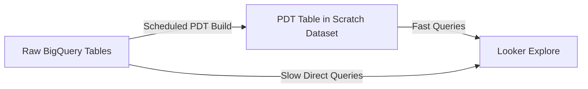

# How to Set Up Looker PDTs for Precomputed Aggregations

Author: [nawazdhandala](https://www.github.com/nawazdhandala)

Tags: GCP, Looker, PDTs, Persistent Derived Tables, BigQuery, Performance, LookML

Description: Learn how to use Looker Persistent Derived Tables to precompute expensive aggregations and speed up your Looker explores significantly.

---

If your Looker explores take more than a few seconds to return results, the underlying SQL is probably doing too much work at query time. Persistent Derived Tables (PDTs) solve this by precomputing expensive aggregations and storing the results as BigQuery tables that Looker manages automatically. Instead of aggregating millions of rows every time someone opens an Explore, Looker queries the pre-built summary table.

I have used PDTs to take explore load times from 30 seconds down to 2 seconds, and this guide covers the patterns and configuration that make that possible.

## What PDTs Actually Are

A Persistent Derived Table is a BigQuery table that Looker creates and maintains based on a SQL query you define in LookML. Looker runs the query on a schedule, writes the results to a scratch dataset in BigQuery, and then uses that table for all Explore queries.

The flow looks like this:



PDTs are transparent to end users. They interact with the same Explore fields as before, but the queries run against the precomputed table instead of the raw data.

## Basic PDT Configuration

Here is a simple PDT that precomputes daily order metrics:

```lookml
# views/daily_order_metrics.view.lkml
view: daily_order_metrics {
  derived_table: {
    sql: SELECT
      DATE(created_at) AS order_date,
      region,
      product_category,
      COUNT(DISTINCT order_id) AS total_orders,
      COUNT(DISTINCT customer_id) AS unique_customers,
      SUM(total_amount) AS revenue,
      AVG(total_amount) AS avg_order_value,
      SUM(CASE WHEN order_status = 'completed' THEN 1 ELSE 0 END) AS completed_orders,
      SUM(CASE WHEN order_status = 'cancelled' THEN 1 ELSE 0 END) AS cancelled_orders,
      SUM(discount_amount) AS total_discounts
    FROM `my-project.analytics.orders`
    GROUP BY 1, 2, 3 ;;

    # This makes it a PDT instead of a regular derived table
    datagroup_trigger: daily_datagroup
  }

  dimension: order_date {
    type: date
    sql: ${TABLE}.order_date ;;
  }

  dimension: region {
    type: string
    sql: ${TABLE}.region ;;
  }

  dimension: product_category {
    type: string
    sql: ${TABLE}.product_category ;;
  }

  measure: total_orders {
    type: sum
    sql: ${TABLE}.total_orders ;;
  }

  measure: total_revenue {
    type: sum
    sql: ${TABLE}.revenue ;;
    value_format_name: usd
  }

  measure: unique_customers {
    type: sum
    sql: ${TABLE}.unique_customers ;;
  }

  measure: avg_order_value {
    type: number
    sql: ${total_revenue} / NULLIF(${total_orders}, 0) ;;
    value_format_name: usd
  }

  measure: completion_rate {
    type: number
    sql: SUM(${TABLE}.completed_orders) / NULLIF(SUM(${TABLE}.total_orders), 0) ;;
    value_format_name: percent_1
  }
}
```

## Datagroups: Controlling When PDTs Rebuild

Datagroups define the schedule for PDT rebuilds. You can trigger rebuilds based on time or data changes.

### Time-Based Datagroup

```lookml
# models/analytics.model.lkml
datagroup: daily_datagroup {
  sql_trigger: SELECT CURRENT_DATE() ;;
  max_cache_age: "24 hours"
  label: "Daily Refresh"
  description: "Triggers once daily when the date changes"
}
```

The `sql_trigger` query runs on a schedule (configurable in Looker admin, typically every 5 minutes). When the result changes, the datagroup triggers and all associated PDTs rebuild.

### Data-Based Datagroup

Trigger rebuilds when new data arrives:

```lookml
datagroup: new_data_datagroup {
  sql_trigger: SELECT MAX(created_at) FROM `my-project.analytics.orders` ;;
  max_cache_age: "4 hours"
  label: "New Data Trigger"
  description: "Rebuilds when new orders are detected"
}
```

This is more efficient than time-based triggers because the PDT only rebuilds when there is actually new data.

### Hourly Datagroup

```lookml
datagroup: hourly_datagroup {
  sql_trigger: SELECT FLOOR(UNIX_SECONDS(CURRENT_TIMESTAMP()) / 3600) ;;
  max_cache_age: "1 hour"
  label: "Hourly Refresh"
  description: "Triggers every hour on the hour"
}
```

## Incremental PDTs

For large tables, rebuilding the entire PDT every day is expensive and slow. Incremental PDTs only process new data, appending it to the existing table.

```lookml
view: incremental_order_metrics {
  derived_table: {
    sql: SELECT
      DATE(created_at) AS order_date,
      region,
      COUNT(DISTINCT order_id) AS total_orders,
      SUM(total_amount) AS revenue
    FROM `my-project.analytics.orders`
    WHERE created_at >= TIMESTAMP()
      AND created_at < TIMESTAMP()
    GROUP BY 1, 2 ;;

    datagroup_trigger: daily_datagroup

    # Incremental PDT configuration
    increment_key: "order_date"
    increment_offset: 3  # Rebuild the last 3 days to catch late-arriving data

    # Partition the PDT table for efficient incremental updates
    partition_keys: ["order_date"]
    cluster_keys: ["region"]
  }

  dimension: order_date {
    type: date
    sql: ${TABLE}.order_date ;;
  }

  dimension: region {
    type: string
    sql: ${TABLE}.region ;;
  }

  measure: total_orders {
    type: sum
    sql: ${TABLE}.total_orders ;;
  }

  measure: revenue {
    type: sum
    sql: ${TABLE}.revenue ;;
    value_format_name: usd
  }
}
```

The `increment_key` tells Looker which field determines the incremental boundary. The `increment_offset` of 3 means Looker will rebuild the last 3 days of data each time, which handles late-arriving records.

## PDT Dependencies (Cascading PDTs)

Sometimes one PDT depends on another. Looker handles this through datagroup dependencies:

```lookml
# First PDT: daily order summary
view: daily_orders {
  derived_table: {
    sql: SELECT
      DATE(created_at) AS order_date,
      customer_id,
      SUM(total_amount) AS daily_spend
    FROM `my-project.analytics.orders`
    GROUP BY 1, 2 ;;
    datagroup_trigger: daily_datagroup
  }
}

# Second PDT: depends on the first
view: customer_weekly_summary {
  derived_table: {
    sql: SELECT
      customer_id,
      DATE_TRUNC(order_date, WEEK) AS week,
      SUM(daily_spend) AS weekly_spend,
      COUNT(DISTINCT order_date) AS active_days
    FROM ${daily_orders.SQL_TABLE_NAME}
    GROUP BY 1, 2 ;;
    datagroup_trigger: daily_datagroup
  }
}
```

When the datagroup triggers, Looker builds `daily_orders` first, then `customer_weekly_summary`. This cascading behavior is automatic - Looker resolves the dependency graph.

## Monitoring PDT Builds

Keep an eye on your PDT builds to catch failures early.

In Looker Admin, go to "Persistent Derived Tables" to see:

- Build status (success, failure, building)
- Last build time and duration
- Next scheduled build
- Error messages for failed builds

You can also query PDT build status through the Looker API:

```bash
# List PDT builds using the Looker API
curl -X GET "https://your-instance.cloud.looker.com/api/4.0/derived_table/graph/model/analytics" \
  -H "Authorization: token YOUR_API_TOKEN"
```

## Sizing and Performance Considerations

PDTs use your BigQuery project's resources. The SQL query that builds the PDT runs as a regular BigQuery job, which means it costs money and uses slots.

**Keep PDT queries efficient.** Use partition pruning in your PDT SQL by filtering on partitioned columns.

```lookml
# Efficient: only scans the last 90 days
derived_table: {
  sql: SELECT ...
  FROM `my-project.analytics.orders`
  WHERE created_at >= TIMESTAMP_SUB(CURRENT_TIMESTAMP(), INTERVAL 90 DAY)
  GROUP BY ... ;;
}
```

**Partition your PDTs.** BigQuery partitioning works on PDT tables too:

```lookml
derived_table: {
  sql: ... ;;
  partition_keys: ["order_date"]
  cluster_keys: ["region", "product_category"]
}
```

**Monitor BigQuery costs.** PDT rebuilds contribute to your BigQuery bill. Check the BigQuery admin console to see how much PDT builds cost:

```sql
-- Check PDT rebuild costs in BigQuery
SELECT
  job_id,
  user_email,
  total_bytes_processed / POW(1024, 3) AS gb_processed,
  total_slot_ms / 1000 AS slot_seconds,
  creation_time
FROM `my-project.region-us`.INFORMATION_SCHEMA.JOBS
WHERE creation_time > TIMESTAMP_SUB(CURRENT_TIMESTAMP(), INTERVAL 7 DAY)
  AND destination_table.dataset_id LIKE '%scratch%'
ORDER BY total_bytes_processed DESC
LIMIT 20;
```

## Common PDT Patterns

### Rolling 90-Day Metrics

```lookml
view: rolling_90day_metrics {
  derived_table: {
    sql: SELECT
      customer_id,
      COUNT(DISTINCT order_id) AS orders_90d,
      SUM(total_amount) AS revenue_90d,
      MAX(created_at) AS last_order_date
    FROM `my-project.analytics.orders`
    WHERE created_at >= TIMESTAMP_SUB(CURRENT_TIMESTAMP(), INTERVAL 90 DAY)
    GROUP BY 1 ;;
    datagroup_trigger: daily_datagroup
  }
}
```

### Funnel Conversion Metrics

```lookml
view: signup_funnel {
  derived_table: {
    sql: SELECT
      DATE(visit_date) AS date,
      traffic_source,
      COUNT(DISTINCT visitor_id) AS visitors,
      COUNT(DISTINCT CASE WHEN signed_up THEN visitor_id END) AS signups,
      COUNT(DISTINCT CASE WHEN first_purchase_date IS NOT NULL THEN visitor_id END) AS purchasers
    FROM `my-project.analytics.visitor_journey`
    GROUP BY 1, 2 ;;
    datagroup_trigger: daily_datagroup
  }
}
```

## Wrapping Up

PDTs are Looker's answer to the classic BI performance problem: aggregating large datasets at query time is slow. By precomputing these aggregations and storing them as managed BigQuery tables, you get fast Explore performance without asking users to change how they work. Start with your slowest Explores, identify the aggregations that take the longest, and wrap them in PDTs. Incremental PDTs keep rebuild costs manageable as your data grows, and datagroup triggers ensure your precomputed data stays fresh.
