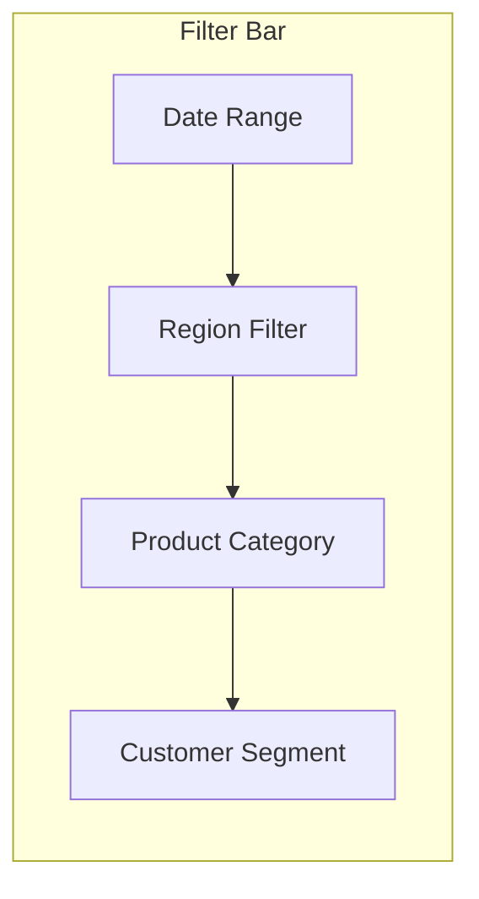
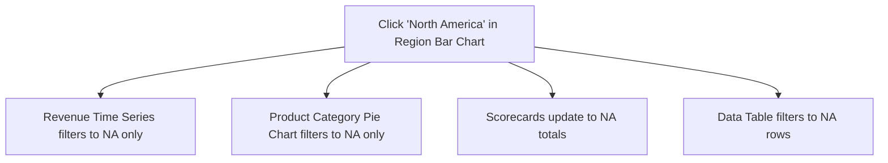
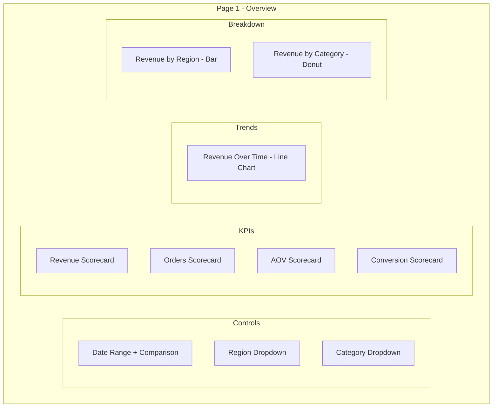

# How to Build a Looker Studio Dashboard with Date Range Controls and Filters

Author: [nawazdhandala](https://www.github.com/nawazdhandala)

Tags: GCP, Looker Studio, Dashboards, Date Range Controls, Filters, Data Visualization

Description: Learn how to build interactive Looker Studio dashboards with date range controls, drop-down filters, and cross-chart filtering for better user experience.

---

A dashboard without interactive controls is just a static report. The real value of Looker Studio comes from letting users explore data on their own - changing date ranges, filtering by region, drilling down into specific product categories. Getting the controls right is what separates dashboards that people actually use from ones that get bookmarked and forgotten.

This guide covers how to build effective date range controls, filter controls, and the interaction patterns that make dashboards intuitive.

## Adding a Date Range Control

The date range control is the single most important interactive element on any dashboard. Almost every business question involves a time dimension.

To add a date range control:

1. Click "Add a control" in the toolbar
2. Select "Date range control"
3. Place it at the top of your report page
4. In the properties panel, set the default date range

The default date range is important because it determines what users see when they first open the dashboard. Good defaults:

- **Last 30 days** - Works for most operational dashboards
- **This quarter** - Better for executive and financial reports
- **Last 7 days** - Good for real-time monitoring dashboards

Configure the default in the control properties:

1. Select the date range control
2. In the right panel under "Default date range," choose your preferred option
3. For custom defaults, select "Custom" and specify exact dates or relative ranges

## Applying Date Range to All Charts

By default, a date range control affects all charts on the page that use a date field. But you need to make sure each chart has its date dimension configured correctly.

For each chart that should respond to the date range:

1. Select the chart
2. In the data panel, check that a date dimension is assigned
3. The date field used in the chart must match the date field in the data source

If your data source has multiple date fields (like `order_date`, `ship_date`, `created_at`), the date range control will filter on the default date dimension of the data source. To change which date field the control uses:

1. Click on the date range control
2. In the properties panel, check if there is an option to set the date field
3. If not, go to your data source settings and set the correct default date

## Drop-Down Filter Controls

Drop-down filters let users filter by dimensions like region, product category, or customer segment.

To add a drop-down filter:

1. Click "Add a control"
2. Select "Drop-down list"
3. Place it next to the date range control
4. Set the control field to the dimension you want to filter on

Here is a practical layout with multiple filters:



Configure the drop-down:

1. Select the drop-down control
2. Set "Control field" to your dimension (e.g., `region`)
3. Under "Metric," optionally add a metric to show alongside values (e.g., revenue next to each region)
4. Check "Allow search" if you have many values
5. Set default selection to "None" (no filter) or a specific value

## Fixed-Size List Filters

For dimensions with a small number of values (under 10), a fixed-size list or button-style filter can be more user-friendly than a drop-down.

1. Click "Add a control"
2. Select "Fixed-size list"
3. Set the control field to your dimension
4. Resize the control to show all values at once

This creates a list where users can click to select one or multiple values without opening a dropdown.

## Checkbox Filters

For boolean dimensions or when users need to toggle specific options:

1. Click "Add a control"
2. Select "Checkbox"
3. Set the control field to a boolean or categorical dimension

This works well for things like "Include archived records" or "Show weekend data."

## Advanced Filter Control

For text-based filtering where users need to type a search:

1. Click "Add a control"
2. Select "Advanced filter"
3. Set the control field to the dimension you want to search

Users can then type partial matches, use contains/starts with operators, and build complex filter expressions.

## Cross-Chart Interactions

One of the most powerful features in Looker Studio is cross-chart filtering. When a user clicks on a segment in one chart, it filters all other charts on the page.

To enable this:

1. Select a chart (like a bar chart showing revenue by region)
2. Go to the chart properties
3. Under "Interactions," enable "Apply filter"

Now when someone clicks on "North America" in the bar chart, every other chart on the page filters to show only North American data.

This creates an exploration pattern where users can drill into any dimension by clicking:



To disable cross-filtering on specific charts (like summary scorecards that should always show totals), select the chart and uncheck "Apply filter" in its interaction settings.

## Filter Groups

When you have multiple pages in a report, you may want filters to persist across pages. Use filter groups to link controls together:

1. Right-click on a filter control
2. Select "Group" then "Create filter group"
3. Give the group a name
4. On other pages, create the same filter control and add it to the same group

Now changing the filter on one page affects all pages in the group.

## Comparison Date Ranges

For dashboards that need period-over-period comparisons, add a comparison date range:

1. Select the date range control
2. In the properties panel, enable "Comparison date range"
3. Choose "Previous period" or "Previous year" or a custom range

Charts that support comparison (like scorecards and time series) will automatically show the comparison values. Scorecards will display the delta and percentage change.

## Building a Complete Dashboard Layout

Here is a template for a well-structured dashboard with controls:



Some design principles that make dashboards easier to use:

**Place controls at the top.** Users expect filters at the top of the page, not buried in the middle.

**Use consistent colors.** If "North America" is blue in one chart, it should be blue in every chart.

**Add context to scorecards.** Enable comparison date ranges so users can see whether numbers are improving or declining.

**Label everything.** Add text boxes with section headers and brief descriptions of what each section shows.

## Performance Considerations

Every filter change triggers a new BigQuery query. To keep dashboards fast:

**Use data extracts for frequently accessed dashboards.** Data extracts cache the data and avoid repeated BigQuery queries.

**Limit the number of distinct values in filter controls.** A drop-down with 10,000 values is slow to load and hard to use. Pre-aggregate or group values in BigQuery before connecting.

**Avoid too many charts per page.** Each chart generates a separate query. Keep pages under 15 charts for reasonable load times.

**Use BI Engine.** BigQuery BI Engine dramatically improves dashboard performance by caching data in memory.

```bash
# Create a BI Engine reservation for your project
bq mk --bi_reservation --location=us --size=2G --project_id=my-project
```

## Common Mistakes

There are a few patterns I see often in poorly built dashboards:

**No default date range.** Users open the dashboard and see "Auto" or all-time data, which is slow and usually not what they want.

**Filters that do not affect all charts.** When the data source or date field is different between charts, the date range control only filters some of them. Always verify that every chart responds to the controls.

**Too many filter options.** Giving users 15 filter controls is overwhelming. Start with 2-3 controls and add more only when requested.

## Wrapping Up

Good dashboard controls are the difference between a report that gathers dust and one that becomes a daily tool. Start with a date range control and one or two dimension filters. Enable cross-chart interactions so users can explore by clicking. Use comparison date ranges to add context to scorecards. Keep performance in mind by using data extracts or BI Engine for frequently accessed dashboards. The goal is to let users answer their own questions without waiting for the data team to run queries.
