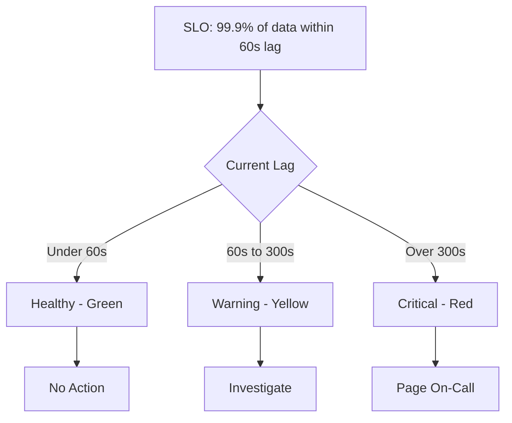

# How to Monitor Datastream Replication Lag and Throughput Metrics

Author: [nawazdhandala](https://www.github.com/nawazdhandala)

Tags: GCP, Datastream, Monitoring, Cloud Monitoring, Replication Lag, Metrics, Observability

Description: Learn how to monitor Google Cloud Datastream replication lag and throughput using Cloud Monitoring dashboards, alerts, and custom queries.

---

Running a Datastream CDC pipeline without proper monitoring is like flying blind. Everything seems fine until a downstream report shows stale data and you realize the stream has been lagging for hours. Setting up comprehensive monitoring from day one saves you from these surprises.

This guide covers the key metrics to watch, how to build monitoring dashboards, and the alerting policies that have saved me from production incidents.

## Key Datastream Metrics

Datastream exposes several metrics through Cloud Monitoring. These are the ones that matter most:

**Total latency** (`datastream.googleapis.com/stream/total_latency`) - The end-to-end time from when a change happens in the source database to when it appears in the destination. This is your primary health indicator.

**Throughput events** (`datastream.googleapis.com/stream/event_count`) - The number of CDC events processed per time period. A sudden drop in throughput can indicate source database issues or stream problems.

**Freshness lag** (`datastream.googleapis.com/stream/data_freshness`) - How stale the data in the destination is compared to the source. This is similar to total latency but measured from the destination's perspective.

**Unsupported events** (`datastream.googleapis.com/stream/unsupported_event_count`) - Events that Datastream could not process. These usually indicate schema issues or unsupported data types.

## Building a Monitoring Dashboard

Create a Cloud Monitoring dashboard that gives you a single pane of glass for all your streams.

```bash
# Create a monitoring dashboard using gcloud
gcloud monitoring dashboards create --config-from-file=dashboard.json
```

Here is the dashboard configuration JSON:

```json
{
  "displayName": "Datastream CDC Monitoring",
  "gridLayout": {
    "columns": "2",
    "widgets": [
      {
        "title": "Total Replication Latency",
        "xyChart": {
          "dataSets": [
            {
              "timeSeriesQuery": {
                "timeSeriesFilter": {
                  "filter": "metric.type=\"datastream.googleapis.com/stream/total_latency\" resource.type=\"datastream.googleapis.com/Stream\"",
                  "aggregation": {
                    "alignmentPeriod": "60s",
                    "perSeriesAligner": "ALIGN_PERCENTILE_99"
                  }
                }
              },
              "plotType": "LINE"
            }
          ],
          "yAxis": {
            "label": "Latency (seconds)"
          }
        }
      },
      {
        "title": "Event Throughput",
        "xyChart": {
          "dataSets": [
            {
              "timeSeriesQuery": {
                "timeSeriesFilter": {
                  "filter": "metric.type=\"datastream.googleapis.com/stream/event_count\" resource.type=\"datastream.googleapis.com/Stream\"",
                  "aggregation": {
                    "alignmentPeriod": "60s",
                    "perSeriesAligner": "ALIGN_RATE"
                  }
                }
              },
              "plotType": "LINE"
            }
          ],
          "yAxis": {
            "label": "Events per second"
          }
        }
      },
      {
        "title": "Unsupported Events",
        "xyChart": {
          "dataSets": [
            {
              "timeSeriesQuery": {
                "timeSeriesFilter": {
                  "filter": "metric.type=\"datastream.googleapis.com/stream/unsupported_event_count\" resource.type=\"datastream.googleapis.com/Stream\"",
                  "aggregation": {
                    "alignmentPeriod": "300s",
                    "perSeriesAligner": "ALIGN_SUM"
                  }
                }
              },
              "plotType": "STACKED_BAR"
            }
          ]
        }
      },
      {
        "title": "Data Freshness",
        "xyChart": {
          "dataSets": [
            {
              "timeSeriesQuery": {
                "timeSeriesFilter": {
                  "filter": "metric.type=\"datastream.googleapis.com/stream/data_freshness\" resource.type=\"datastream.googleapis.com/Stream\"",
                  "aggregation": {
                    "alignmentPeriod": "60s",
                    "perSeriesAligner": "ALIGN_MAX"
                  }
                }
              },
              "plotType": "LINE"
            }
          ]
        }
      }
    ]
  }
}
```

## Setting Up Alerting Policies

Dashboards are great for visual monitoring, but you need alerts to catch issues when you are not watching.

Create an alert for high replication lag:

```bash
# Create an alerting policy for replication lag over 5 minutes
gcloud alpha monitoring policies create \
  --display-name="Datastream High Replication Lag" \
  --condition-display-name="Lag exceeds 5 minutes" \
  --condition-filter='metric.type="datastream.googleapis.com/stream/total_latency" resource.type="datastream.googleapis.com/Stream"' \
  --condition-threshold-value=300 \
  --condition-threshold-comparison=COMPARISON_GT \
  --condition-threshold-duration=300s \
  --condition-threshold-aggregations-alignment-period=60s \
  --condition-threshold-aggregations-per-series-aligner=ALIGN_MAX \
  --notification-channels=projects/my-project/notificationChannels/CHANNEL_ID \
  --combiner=OR
```

Here is a more complete alerting setup using Terraform:

```hcl
# Alert for high replication lag
resource "google_monitoring_alert_policy" "datastream_lag" {
  display_name = "Datastream Replication Lag Alert"
  combiner     = "OR"

  conditions {
    display_name = "Total latency exceeds 5 minutes"
    condition_threshold {
      filter          = "metric.type=\"datastream.googleapis.com/stream/total_latency\" AND resource.type=\"datastream.googleapis.com/Stream\""
      comparison      = "COMPARISON_GT"
      threshold_value = 300
      duration        = "300s"

      aggregations {
        alignment_period   = "60s"
        per_series_aligner = "ALIGN_MAX"
      }
    }
  }

  notification_channels = [google_monitoring_notification_channel.email.name]

  alert_strategy {
    auto_close = "1800s"
  }
}

# Alert for zero throughput (stream may be stuck)
resource "google_monitoring_alert_policy" "datastream_throughput" {
  display_name = "Datastream Zero Throughput Alert"
  combiner     = "OR"

  conditions {
    display_name = "No events processed for 10 minutes"
    condition_absent {
      filter   = "metric.type=\"datastream.googleapis.com/stream/event_count\" AND resource.type=\"datastream.googleapis.com/Stream\""
      duration = "600s"

      aggregations {
        alignment_period   = "60s"
        per_series_aligner = "ALIGN_RATE"
      }
    }
  }

  notification_channels = [google_monitoring_notification_channel.email.name]
}

# Alert for unsupported events
resource "google_monitoring_alert_policy" "datastream_unsupported" {
  display_name = "Datastream Unsupported Events Alert"
  combiner     = "OR"

  conditions {
    display_name = "Unsupported events detected"
    condition_threshold {
      filter          = "metric.type=\"datastream.googleapis.com/stream/unsupported_event_count\" AND resource.type=\"datastream.googleapis.com/Stream\""
      comparison      = "COMPARISON_GT"
      threshold_value = 0
      duration        = "0s"

      aggregations {
        alignment_period   = "300s"
        per_series_aligner = "ALIGN_SUM"
      }
    }
  }

  notification_channels = [google_monitoring_notification_channel.email.name]
}
```

## Querying Metrics with MQL

For ad-hoc investigation, Monitoring Query Language (MQL) gives you flexible querying:

```
# Check average latency per stream over the last hour
fetch datastream.googleapis.com/Stream
| metric 'datastream.googleapis.com/stream/total_latency'
| align mean_aligner(1m)
| every 1m
| group_by [resource.stream_id], [mean(val())]
```

```
# Compare throughput across all streams
fetch datastream.googleapis.com/Stream
| metric 'datastream.googleapis.com/stream/event_count'
| align rate(1m)
| every 1m
| group_by [resource.stream_id], [sum(val())]
```

## Measuring Lag from the BigQuery Side

Cloud Monitoring metrics tell you about the stream itself, but you should also measure lag from the consumer's perspective. This catches issues where the stream reports healthy but BigQuery data is actually stale.

```sql
-- Check the freshness of replicated data per table
SELECT
  'orders' AS table_name,
  MAX(datastream_metadata.source_timestamp) AS latest_source_ts,
  TIMESTAMP_DIFF(
    CURRENT_TIMESTAMP(),
    MAX(datastream_metadata.source_timestamp),
    SECOND
  ) AS lag_seconds
FROM `my-project.replicated.orders`

UNION ALL

SELECT
  'customers' AS table_name,
  MAX(datastream_metadata.source_timestamp) AS latest_source_ts,
  TIMESTAMP_DIFF(
    CURRENT_TIMESTAMP(),
    MAX(datastream_metadata.source_timestamp),
    SECOND
  ) AS lag_seconds
FROM `my-project.replicated.customers`
```

You can schedule this query to run every few minutes and write results to a monitoring table:

```sql
-- Create a scheduled query for continuous lag monitoring
-- Run this every 5 minutes via BigQuery Scheduled Queries
INSERT INTO `my-project.monitoring.replication_lag` (
  table_name, latest_source_ts, lag_seconds, check_timestamp
)
SELECT
  table_name,
  latest_source_ts,
  lag_seconds,
  CURRENT_TIMESTAMP() AS check_timestamp
FROM (
  SELECT 'orders' AS table_name,
    MAX(datastream_metadata.source_timestamp) AS latest_source_ts,
    TIMESTAMP_DIFF(CURRENT_TIMESTAMP(), MAX(datastream_metadata.source_timestamp), SECOND) AS lag_seconds
  FROM `my-project.replicated.orders`
)
```

## Source Database Monitoring

Do not forget to monitor the source database side. Replication lag often originates from the source.

For MySQL, check binary log position:

```sql
-- Check MySQL replication status
SHOW MASTER STATUS;
SHOW BINARY LOGS;
```

For PostgreSQL, check replication slot lag:

```sql
-- Check PostgreSQL replication slot lag
SELECT
  slot_name,
  active,
  pg_size_pretty(
    pg_wal_lsn_diff(pg_current_wal_lsn(), restart_lsn)
  ) AS lag_size
FROM pg_replication_slots;
```

## Setting SLOs for Replication Freshness

Once you have metrics flowing, define Service Level Objectives for your replication pipeline:



A reasonable starting SLO for Datastream is 99.9% of the time, replication lag should be under 60 seconds. This allows for brief spikes during large transactions while still catching sustained lag issues.

## Common Lag Patterns and Causes

After monitoring many Datastream deployments, here are the patterns I see most often:

**Steady increase in lag** - Usually means the source is writing faster than Datastream can read. Check if your source database's write volume has increased.

**Periodic lag spikes** - Often caused by scheduled batch jobs in the source database (nightly batch inserts, hourly aggregations). These are usually harmless if lag recovers quickly.

**Sudden jump followed by flat line** - The stream has stalled. Check for errors in the stream status.

**Gradual increase over days** - Could indicate a slow resource leak or growing table sizes making individual operations slower.

## Wrapping Up

Monitoring is not optional for production Datastream deployments. At a minimum, you need alerts for high replication lag, zero throughput, and unsupported events. A monitoring dashboard gives you the visual context to understand trends, and BigQuery-side freshness checks provide an independent verification that data is actually flowing correctly. Set up your monitoring before you go to production, not after the first incident.
