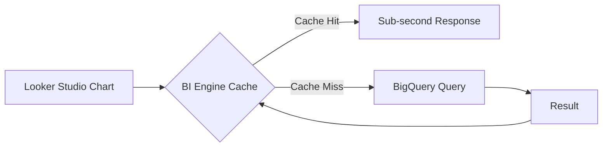

# How to Optimize Looker Studio Report Performance with Extract Data Sources

Author: [nawazdhandala](https://www.github.com/nawazdhandala)

Tags: GCP, Looker Studio, Performance, Data Extract, BigQuery, Optimization, Caching

Description: Learn how to use Looker Studio data extracts and other optimization techniques to dramatically improve dashboard load times and reduce BigQuery costs.

---

Slow dashboards do not get used. When a report takes 30 seconds to load or filters trigger a 10-second wait, users go back to asking the data team for ad-hoc queries. The most impactful thing you can do for Looker Studio performance is reduce the amount of work BigQuery has to do on every page load. Data extracts are the primary tool for this, but there are several other techniques that make a big difference.

This guide covers practical performance optimizations I have applied to dashboards serving hundreds of daily users.

## Understanding Why Dashboards Are Slow

Every chart in a Looker Studio report generates at least one BigQuery query. A typical dashboard page with 10 charts generates 10 separate queries every time someone opens the page. Change a filter, and all 10 queries run again.

The performance bottleneck is usually:

1. **BigQuery query execution time** - Large tables, complex joins, or missing partitions
2. **Number of queries per page** - Too many charts means too many concurrent queries
3. **Data source configuration** - Using raw tables instead of optimized views
4. **Cache misses** - Queries with dynamic date ranges always miss the cache

## Data Extracts: The Biggest Win

A data extract in Looker Studio creates a snapshot of your data that is stored in Google's infrastructure. When a user views the report, queries run against the extract instead of hitting BigQuery. This makes charts load almost instantly.

### Creating a Data Extract

1. Open your report in edit mode
2. Click "Resource" then "Manage added data sources"
3. Click on your BigQuery data source
4. Click "Extract data"
5. Configure the extract:
   - Select the dimensions and metrics to include
   - Set date range filters to limit the data
   - Enable auto-refresh and set the schedule

### Extract Configuration

Choose your fields carefully. Only include dimensions and metrics that your dashboard actually uses. Every extra field increases the extract size and refresh time.

For a typical sales dashboard, your extract might include:

```
Dimensions:
- order_date
- region
- product_category
- customer_segment

Metrics:
- revenue (SUM)
- order_count (COUNT)
- avg_order_value (AVG)
- unique_customers (COUNT DISTINCT)
```

Set the date range to limit the extract size. If your dashboard only shows the last 90 days, restrict the extract to 90 days of data.

### Auto-Refresh Schedule

Data extracts can refresh automatically:

- **Every 15 minutes** - For near-real-time dashboards
- **Every hour** - Good balance of freshness and cost
- **Every 12 hours** - For daily reporting dashboards
- **Daily** - For weekly or monthly summary dashboards

The refresh runs the BigQuery query once and updates the extract. Between refreshes, all chart interactions use the cached extract.

### Limitations of Data Extracts

There are important trade-offs:

- **Maximum 100 million rows** per extract. If your data exceeds this, pre-aggregate in BigQuery.
- **No custom SQL** in extracts. You must use a table or view as the source.
- **Fields are fixed** at extract creation. Adding a new field requires recreating the extract.
- **Data freshness** depends on the refresh schedule. Users do not see real-time data.

## BigQuery BI Engine

BI Engine is a BigQuery feature that caches query results in memory. It sits between Looker Studio and BigQuery, intercepting queries and serving results from its in-memory cache.

```bash
# Create a BI Engine reservation
bq mk --bi_reservation --location=us --size=1G --project_id=my-project
```

BI Engine works transparently. You do not need to change your data sources or reports. Once the reservation is created, queries that fit in the cache are served from memory instead of running against BigQuery storage.



Sizing your BI Engine reservation:

- **1 GB** - Good for dashboards querying up to a few hundred million rows
- **5 GB** - Handles most medium-sized analytics workloads
- **10+ GB** - For large datasets with many concurrent users

You can monitor BI Engine usage:

```bash
# Check BI Engine utilization
bq show --bi_reservation --location=us --project_id=my-project
```

## Optimizing BigQuery Tables

If you cannot use extracts or BI Engine, optimize the underlying BigQuery tables.

### Partitioning

Partition tables by the date column used in your dashboard's date range filter. This ensures BigQuery only scans the relevant date range.

```sql
-- Create a partitioned table for the dashboard
CREATE OR REPLACE TABLE `my-project.reporting.orders_partitioned`
PARTITION BY DATE(order_date)
CLUSTER BY region, product_category
AS SELECT * FROM `my-project.analytics.orders`;
```

### Clustering

Cluster tables on columns frequently used in filters. If your dashboard has a region filter and a category filter, cluster on both:

```sql
-- Clustering reduces the data scanned for filtered queries
CREATE OR REPLACE TABLE `my-project.reporting.orders_optimized`
PARTITION BY DATE(order_date)
CLUSTER BY region, product_category, customer_segment
AS SELECT * FROM `my-project.analytics.orders`;
```

### Pre-Aggregated Views

Instead of having Looker Studio aggregate millions of raw rows, create pre-aggregated views:

```sql
-- Pre-aggregated daily summary for the dashboard
CREATE OR REPLACE VIEW `my-project.reporting.daily_summary` AS
SELECT
  DATE(order_date) AS date,
  region,
  product_category,
  COUNT(*) AS order_count,
  SUM(revenue) AS total_revenue,
  AVG(revenue) AS avg_revenue,
  COUNT(DISTINCT customer_id) AS unique_customers
FROM `my-project.analytics.orders`
GROUP BY 1, 2, 3;
```

A dashboard querying this summary view scans thousands of rows instead of millions, making charts load much faster.

## Reducing Chart Count

Each chart is an independent query. More charts means more queries and slower page loads.

**Combine related metrics into one chart.** Instead of three separate scorecards for revenue, orders, and AOV, use a single scorecard with multiple metrics.

**Use pagination in tables.** A table showing all 10,000 products is slow. Set the default rows per page to 25 or 50.

**Split into multiple pages.** Instead of one page with 20 charts, create 4 pages with 5 charts each. Only the visible page's charts are queried.

**Remove unused charts.** Dashboard bloat is real. If a chart is not providing value, remove it.

## Caching Behavior

Looker Studio has built-in caching with approximately 15-minute TTL. You can control this:

**Enable data freshness controls.** In your data source settings, enable "Data freshness" and set it to the maximum acceptable staleness. This tells Looker Studio it can serve cached results for longer.

**Avoid dynamic date ranges for cache efficiency.** A filter for "Last 7 days" generates a different query each day, which misses the cache. Consider using fixed week boundaries instead (e.g., Monday to Sunday).

**Use the refresh button.** Add a note to your dashboard telling users to click the refresh button if they need the latest data, rather than relying on every interaction hitting BigQuery.

## Query Optimization for Custom SQL Sources

If you use custom SQL queries as your data source, optimize the SQL:

```sql
-- Bad: Scanning the entire table with no filters
SELECT * FROM `my-project.analytics.orders`

-- Good: Scoped to the data the dashboard actually needs
SELECT
  DATE(order_date) AS date,
  region,
  product_category,
  SUM(revenue) AS revenue,
  COUNT(*) AS orders
FROM `my-project.analytics.orders`
WHERE order_date >= DATE_SUB(CURRENT_DATE(), INTERVAL 90 DAY)
GROUP BY 1, 2, 3
```

The second query scans far less data and returns a much smaller result set.

## Monitoring Dashboard Performance

Keep track of how your dashboards are performing:

```sql
-- Check BigQuery query costs from Looker Studio
-- in the INFORMATION_SCHEMA
SELECT
  user_email,
  COUNT(*) AS query_count,
  SUM(total_bytes_processed) / POW(1024, 3) AS total_gb_processed,
  AVG(total_slot_ms) / 1000 AS avg_slot_seconds
FROM `my-project.region-us`.INFORMATION_SCHEMA.JOBS
WHERE creation_time > TIMESTAMP_SUB(CURRENT_TIMESTAMP(), INTERVAL 7 DAY)
  AND job_type = 'QUERY'
  AND statement_type = 'SELECT'
  AND STARTS_WITH(user_email, 'service-')
GROUP BY 1
ORDER BY total_gb_processed DESC;
```

## Performance Optimization Checklist

Here is a checklist to run through for any slow dashboard:

1. Are you using data extracts for stable data? Enable them.
2. Is BI Engine configured? Create a reservation.
3. Are BigQuery tables partitioned on the date field? Partition them.
4. Are tables clustered on filter dimensions? Add clustering.
5. Are you querying raw data? Create pre-aggregated views.
6. How many charts per page? Keep it under 15.
7. Are custom SQL queries optimized? Add date filters and aggregation.
8. Is the date range unnecessarily wide? Limit to what users need.

## Wrapping Up

Dashboard performance is a feature, not an afterthought. Data extracts are the single most effective optimization - they turn every chart interaction from a BigQuery query into an in-memory lookup. BI Engine provides a similar benefit without requiring you to manage extract refresh schedules. For the underlying data, partitioning, clustering, and pre-aggregation are standard BigQuery optimizations that directly translate to faster dashboards. Apply these techniques and your dashboards will load in seconds instead of minutes.
