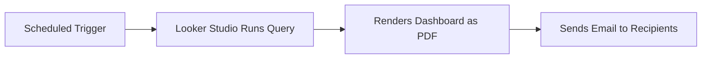

# How to Share and Embed Looker Studio Reports in Web Applications

Author: [nawazdhandala](https://www.github.com/nawazdhandala)

Tags: GCP, Looker Studio, Embedding, Reports, Web Applications, Dashboards, Sharing

Description: Learn how to share Looker Studio reports with stakeholders and embed interactive dashboards directly into your web applications.

---

Building a dashboard is only half the work. The other half is getting it in front of the right people. Looker Studio offers several ways to share and embed reports, from simple link sharing to full iframe embedding in your product. Each approach has different trade-offs around access control, interactivity, and customization.

This guide covers all the sharing and embedding options, including the gotchas that are not obvious from the documentation.

## Sharing via Link

The simplest sharing method is a direct link. Anyone with the link and appropriate permissions can view the report.

To share a report:

1. Click the "Share" button in the top-right corner of the report
2. Add email addresses or Google Groups
3. Choose permission level: Viewer or Editor
4. Click "Send"

You can also get a shareable link:

1. Click "Share"
2. Click "Get link"
3. Choose link visibility: Restricted, Anyone in your organization, or Anyone with the link
4. Copy the link

For organization-wide dashboards, "Anyone in your organization" is usually the right choice. It lets anyone with a company Google Workspace account view the report without individual sharing.

## Scheduling Email Delivery

For stakeholders who want regular updates without visiting the dashboard:

1. Click "File" then "Schedule email delivery"
2. Add recipients
3. Choose frequency (daily, weekly, monthly)
4. Select pages to include
5. Choose file format (PDF or inline images)
6. Set the delivery time

The scheduled email sends a snapshot of the dashboard at the configured time. Recipients see the data as it looks at that moment, with whatever default filters are applied.



One thing to watch: the email uses the owner's credentials to run the queries. If the owner loses access to the data source, the scheduled emails will fail silently.

## Downloading Reports

Users can download reports for offline sharing:

1. Click "File" then "Download as"
2. Choose PDF or CSV (for table data)

PDF exports include all pages with the current filter state. This is useful for board presentations or compliance reports where you need a point-in-time snapshot.

## Embedding in Web Applications

Embedding lets you include interactive Looker Studio dashboards directly in your web application. This is common for SaaS products that want to show analytics to their customers, or for internal portals that consolidate multiple tools.

### Step 1: Enable Embedding

1. Open your report in Looker Studio
2. Click "File" then "Embed report"
3. Toggle "Enable embedding" to on
4. Copy the embed URL

### Step 2: Add the iframe

Add the iframe to your web application:

```html
<!-- Basic Looker Studio embed -->
<iframe
  width="100%"
  height="600"
  src="https://lookerstudio.google.com/embed/reporting/REPORT_ID/page/PAGE_ID"
  frameborder="0"
  style="border: 0;"
  allowfullscreen
  sandbox="allow-storage-access-by-user-activation allow-scripts allow-same-origin allow-popups allow-popups-to-escape-sandbox">
</iframe>
```

### Step 3: Pass Filter Parameters via URL

You can pre-filter the embedded report using URL parameters. This is powerful for showing different data to different users.

```html
<!-- Embed with pre-applied filters -->
<iframe
  width="100%"
  height="600"
  src="https://lookerstudio.google.com/embed/reporting/REPORT_ID/page/PAGE_ID?params=%7B%22ds0.region%22:%22North%20America%22%7D"
  frameborder="0"
  style="border: 0;"
  allowfullscreen>
</iframe>
```

The URL parameter format is a URL-encoded JSON object where keys are `ds{index}.{field_name}` and values are the filter values.

Here is a JavaScript helper to build filter URLs dynamically:

```javascript
/**
 * Build a Looker Studio embed URL with dynamic filters.
 * @param {string} reportId - The Looker Studio report ID
 * @param {string} pageId - The page ID within the report
 * @param {Object} filters - Key-value pairs for filters
 * @returns {string} The complete embed URL with filters
 */
function buildLookerStudioUrl(reportId, pageId, filters) {
  const baseUrl = `https://lookerstudio.google.com/embed/reporting/${reportId}/page/${pageId}`;

  if (!filters || Object.keys(filters).length === 0) {
    return baseUrl;
  }

  // Build the filter params object
  // Keys follow the format: ds{dataSourceIndex}.{fieldName}
  const params = {};
  for (const [field, value] of Object.entries(filters)) {
    params[`ds0.${field}`] = value;
  }

  const encodedParams = encodeURIComponent(JSON.stringify(params));
  return `${baseUrl}?params=${encodedParams}`;
}

// Usage example: embed a report filtered to a specific customer
const url = buildLookerStudioUrl(
  'abc123-report-id',
  'p_overview',
  {
    'customer_id': 'CUST-456',
    'region': 'Europe'
  }
);

document.getElementById('dashboard-frame').src = url;
```

## Embedding with Authentication

By default, embedded reports require viewers to be signed in with a Google account that has access to the report. This works for internal applications but not for customer-facing embeds.

For public embeds (no authentication required):

1. Set the report sharing to "Anyone with the link can view"
2. Use "Owner's credentials" for the data source
3. Enable embedding

This means anyone who can see the iframe can view the data. Only do this for non-sensitive data.

For authenticated embeds in a SaaS product, you have two options:

**Option 1: Service account with row-level filtering.** Use a service account as the data source owner and pass customer-specific filters through URL parameters. The report shows all data, but the filter restricts what each customer sees.

```javascript
// Server-side code to generate filtered embed URLs per customer
function getCustomerDashboardUrl(customerId) {
  // Validate that the logged-in user belongs to this customer
  const filters = {
    'customer_id': customerId
  };

  return buildLookerStudioUrl(REPORT_ID, PAGE_ID, filters);
}
```

**Option 2: Separate reports per customer.** Create a copy of the report for each customer with pre-configured data source filters. This is more secure but harder to maintain.

## Responsive Embedding

Make the embed responsive for different screen sizes:

```html
<!-- Responsive Looker Studio embed -->
<div style="position: relative; padding-bottom: 56.25%; height: 0; overflow: hidden;">
  <iframe
    src="https://lookerstudio.google.com/embed/reporting/REPORT_ID/page/PAGE_ID"
    style="position: absolute; top: 0; left: 0; width: 100%; height: 100%; border: 0;"
    allowfullscreen
    sandbox="allow-storage-access-by-user-activation allow-scripts allow-same-origin allow-popups allow-popups-to-escape-sandbox">
  </iframe>
</div>
```

The padding-bottom percentage controls the aspect ratio. 56.25% gives a 16:9 ratio. Adjust to 75% for a 4:3 ratio.

## Embedding Specific Pages

If your report has multiple pages but you only want to embed one:

```html
<!-- Embed page 2 of a report -->
<iframe
  src="https://lookerstudio.google.com/embed/reporting/REPORT_ID/page/p_abcdef"
  width="100%"
  height="600"
  frameborder="0">
</iframe>
```

The page ID is visible in the URL when you navigate to that page in the Looker Studio editor.

## Hiding Controls in Embedded Reports

For embedded reports, you might want to hide the page navigation or filter controls to create a cleaner look:

Use CSS to hide specific elements in the iframe's parent container. Note that you cannot style inside the iframe due to cross-origin restrictions, but you can control the visible area:

```html
<!-- Crop the top of the report to hide navigation -->
<div style="overflow: hidden; height: 550px;">
  <iframe
    src="https://lookerstudio.google.com/embed/reporting/REPORT_ID/page/PAGE_ID"
    style="width: 100%; height: 600px; margin-top: -50px; border: 0;"
    scrolling="no">
  </iframe>
</div>
```

A better approach is to design the embedded report page without navigation elements. Create a dedicated page for embedding that has only the charts and controls you want external users to see.

## Security Considerations

When embedding reports, keep these security points in mind:

**Data exposure.** If the report is set to "Anyone with the link," the data is effectively public. Use URL filters to restrict data, but remember that technically savvy users can modify URL parameters.

**Content Security Policy.** Your web application's CSP headers need to allow framing from lookerstudio.google.com:

```
Content-Security-Policy: frame-src https://lookerstudio.google.com
```

**Cost implications.** Every view of an embedded report triggers BigQuery queries (unless using data extracts). High-traffic customer-facing embeds can generate significant BigQuery costs.

## Wrapping Up

Looker Studio provides flexible sharing and embedding options for different use cases. For internal teams, link sharing with scheduled emails works well. For product analytics, iframe embedding with URL-based filters lets you integrate dashboards into your application. The main decisions are around authentication (who can see the data), filtering (how to show the right data to each viewer), and performance (how to handle the query cost of high-traffic embeds). Start with simple sharing and move to embedding only when your use case requires it.
