# How to Automate Kubernetes Cluster Setup with Ansible

Author: [nawazdhandala](https://www.github.com/nawazdhandala)

Tags: Ansible, Kubernetes, Automation, Infrastructure, Configuration

Description: Learn how to use Ansible playbooks to automate Kubernetes cluster setup including node preparation and cluster bootstrapping.

---

Setting up a Kubernetes cluster manually is tedious and error-prone. Every node needs the same packages, kernel parameters, and container runtime configuration. Ansible automates all of this, making your cluster setup repeatable and version-controlled.

This guide walks through building Ansible playbooks that prepare nodes, install kubeadm, bootstrap a control plane, and join worker nodes.

## Automation Architecture


## Project Structure

Organize your Ansible project with a clean directory layout.

```
k8s-ansible/
  ansible.cfg
  inventory/
    hosts.yml
  group_vars/
    all.yml
    control_plane.yml
    workers.yml
  roles/
    prepare-nodes/
      tasks/main.yml
      handlers/main.yml
    container-runtime/
      tasks/main.yml
      templates/containerd-config.toml.j2
    kubernetes-install/
      tasks/main.yml
    cluster-init/
      tasks/main.yml
    worker-join/
      tasks/main.yml
  playbooks/
    site.yml
    reset.yml
```

## Inventory File

Define your cluster nodes in the inventory.

```yaml
# inventory/hosts.yml
# Defines all nodes in the Kubernetes cluster
all:
  children:
    control_plane:
      hosts:
        cp-1:
          ansible_host: 192.168.1.10
          ansible_user: ubuntu
        cp-2:
          ansible_host: 192.168.1.11
          ansible_user: ubuntu
        cp-3:
          ansible_host: 192.168.1.12
          ansible_user: ubuntu
    workers:
      hosts:
        worker-1:
          ansible_host: 192.168.1.20
          ansible_user: ubuntu
        worker-2:
          ansible_host: 192.168.1.21
          ansible_user: ubuntu
        worker-3:
          ansible_host: 192.168.1.22
          ansible_user: ubuntu
```

## Group Variables

```yaml
# group_vars/all.yml
# Variables shared across all nodes
kubernetes_version: "1.30"
kubernetes_apt_key_url: "https://pkgs.k8s.io/core:/stable:/v{{ kubernetes_version }}/deb/Release.key"
kubernetes_apt_repo: "https://pkgs.k8s.io/core:/stable:/v{{ kubernetes_version }}/deb/"

# Pod network CIDR for Calico
pod_network_cidr: "10.244.0.0/16"

# Service CIDR
service_cidr: "10.96.0.0/12"

# Container runtime
container_runtime: containerd
```

## Role: Prepare Nodes

This role configures kernel parameters and disables swap on all nodes.

```yaml
# roles/prepare-nodes/tasks/main.yml
# Prepares all nodes with required kernel modules and settings
---
- name: Disable swap immediately
  ansible.builtin.command: swapoff -a
  changed_when: true

- name: Remove swap entry from fstab
  ansible.builtin.lineinfile:
    path: /etc/fstab
    regexp: '\sswap\s'
    state: absent
  notify: reboot node

- name: Load required kernel modules
  ansible.builtin.modprobe:
    name: "{{ item }}"
    state: present
  loop:
    - overlay
    - br_netfilter

- name: Persist kernel modules across reboots
  ansible.builtin.copy:
    dest: /etc/modules-load.d/kubernetes.conf
    content: |
      overlay
      br_netfilter
    mode: '0644'

- name: Set required sysctl parameters
  ansible.builtin.sysctl:
    name: "{{ item.key }}"
    value: "{{ item.value }}"
    sysctl_file: /etc/sysctl.d/kubernetes.conf
    reload: true
  loop:
    - { key: 'net.bridge.bridge-nf-call-iptables', value: '1' }
    - { key: 'net.bridge.bridge-nf-call-ip6tables', value: '1' }
    - { key: 'net.ipv4.ip_forward', value: '1' }

- name: Install prerequisite packages
  ansible.builtin.apt:
    name:
      - apt-transport-https
      - ca-certificates
      - curl
      - gnupg
    state: present
    update_cache: true
```

```yaml
# roles/prepare-nodes/handlers/main.yml
---
- name: reboot node
  ansible.builtin.reboot:
    reboot_timeout: 300
```

## Role: Container Runtime

Install and configure containerd as the container runtime.

```yaml
# roles/container-runtime/tasks/main.yml
# Installs and configures containerd
---
- name: Install containerd
  ansible.builtin.apt:
    name: containerd
    state: present
    update_cache: true

- name: Create containerd configuration directory
  ansible.builtin.file:
    path: /etc/containerd
    state: directory
    mode: '0755'

- name: Generate default containerd configuration
  ansible.builtin.shell: containerd config default > /etc/containerd/config.toml
  args:
    creates: /etc/containerd/config.toml

- name: Enable SystemdCgroup in containerd config
  ansible.builtin.replace:
    path: /etc/containerd/config.toml
    regexp: 'SystemdCgroup = false'
    replace: 'SystemdCgroup = true'
  notify: restart containerd

- name: Enable and start containerd
  ansible.builtin.systemd:
    name: containerd
    state: started
    enabled: true
    daemon_reload: true
```

## Role: Kubernetes Install

Install kubeadm, kubelet, and kubectl on all nodes.

```yaml
# roles/kubernetes-install/tasks/main.yml
# Installs Kubernetes packages from the official repository
---
- name: Add Kubernetes apt signing key
  ansible.builtin.apt_key:
    url: "{{ kubernetes_apt_key_url }}"
    state: present

- name: Add Kubernetes apt repository
  ansible.builtin.apt_repository:
    repo: "deb {{ kubernetes_apt_repo }} /"
    state: present
    filename: kubernetes

- name: Install Kubernetes packages
  ansible.builtin.apt:
    name:
      - kubeadm
      - kubelet
      - kubectl
    state: present
    update_cache: true

- name: Hold Kubernetes packages at current version
  ansible.builtin.dpkg_selections:
    name: "{{ item }}"
    selection: hold
  loop:
    - kubeadm
    - kubelet
    - kubectl

- name: Enable kubelet service
  ansible.builtin.systemd:
    name: kubelet
    enabled: true
```

## Role: Cluster Init

Initialize the first control plane node.

```yaml
# roles/cluster-init/tasks/main.yml
# Initializes the Kubernetes control plane on the first node
---
- name: Check if cluster is already initialized
  ansible.builtin.stat:
    path: /etc/kubernetes/admin.conf
  register: kubeadm_init_check

- name: Initialize the Kubernetes cluster
  ansible.builtin.command: >
    kubeadm init
    --pod-network-cidr={{ pod_network_cidr }}
    --service-cidr={{ service_cidr }}
    --upload-certs
  register: kubeadm_init
  when: not kubeadm_init_check.stat.exists

- name: Create .kube directory for the user
  ansible.builtin.file:
    path: "/home/{{ ansible_user }}/.kube"
    state: directory
    owner: "{{ ansible_user }}"
    mode: '0755'

- name: Copy admin kubeconfig to user home
  ansible.builtin.copy:
    src: /etc/kubernetes/admin.conf
    dest: "/home/{{ ansible_user }}/.kube/config"
    remote_src: true
    owner: "{{ ansible_user }}"
    mode: '0600'

- name: Install Calico pod network
  ansible.builtin.command: >
    kubectl apply -f https://raw.githubusercontent.com/projectcalico/calico/v3.27.0/manifests/calico.yaml
  become: false
  when: not kubeadm_init_check.stat.exists

- name: Generate worker join command
  ansible.builtin.command: kubeadm token create --print-join-command
  register: join_command
  changed_when: false

- name: Store join command as a fact
  ansible.builtin.set_fact:
    kubernetes_join_command: "{{ join_command.stdout }}"
```

## Playbook Execution Flow

```mermaid
sequenceDiagram
    participant Admin
    participant Ansible
    participant CP as Control Plane
    participant W as Workers

    Admin->>Ansible: Run site.yml
    Ansible->>CP: Prepare nodes (swap, kernel, packages)
    Ansible->>W: Prepare nodes (swap, kernel, packages)
    Ansible->>CP: Install containerd
    Ansible->>W: Install containerd
    Ansible->>CP: Install kubeadm, kubelet, kubectl
    Ansible->>W: Install kubeadm, kubelet, kubectl
    Ansible->>CP: kubeadm init
    CP-->>Ansible: Join command token
    Ansible->>CP: Install Calico CNI
    Ansible->>W: kubeadm join (with token)
    W-->>Ansible: Nodes joined
    Ansible-->>Admin: Cluster ready
```



## Main Playbook

```yaml
# playbooks/site.yml
# Main playbook that orchestrates the full cluster setup
---
- name: Prepare all Kubernetes nodes
  hosts: all
  become: true
  roles:
    - prepare-nodes
    - container-runtime
    - kubernetes-install

- name: Initialize the control plane
  hosts: control_plane[0]
  become: true
  roles:
    - cluster-init

- name: Join worker nodes to the cluster
  hosts: workers
  become: true
  tasks:
    - name: Join the cluster
      ansible.builtin.command: "{{ hostvars[groups['control_plane'][0]].kubernetes_join_command }}"
      args:
        creates: /etc/kubernetes/kubelet.conf
```

```bash
# Run the full cluster setup
ansible-playbook -i inventory/hosts.yml playbooks/site.yml

# Verify the cluster
ansible -i inventory/hosts.yml control_plane[0] -a "kubectl get nodes" --become-user=ubuntu
```

## Conclusion

Ansible turns a multi-hour manual Kubernetes setup into a single command. You get repeatable, version-controlled infrastructure that you can test, review, and roll out consistently across environments. Store your playbooks in Git and treat your cluster configuration as code.

To monitor the Kubernetes clusters you build with Ansible, [OneUptime](https://oneuptime.com) offers integrated monitoring, alerting, and status pages that give your team full visibility into cluster health and application performance.
