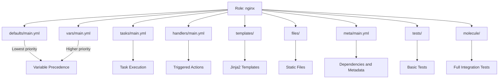
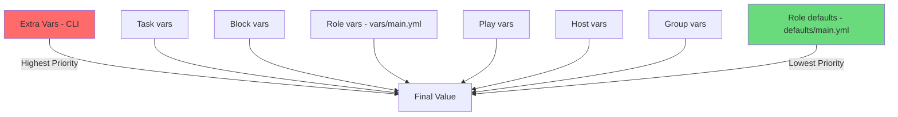

# How to Write Ansible Roles Following Best Practices

Author: [nawazdhandala](https://www.github.com/nawazdhandala)

Tags: Ansible, Roles, Best Practices, Automation, Configuration Management

Description: Learn how to write well-structured Ansible roles with proper variable handling, handlers, templates, and testing.

---

Ansible roles are the building blocks of maintainable automation. A well-written role is reusable, testable, and easy for your team to understand. A poorly written one becomes a liability that nobody wants to touch. This guide covers the practices that separate good roles from bad ones.

## Role Anatomy

Every Ansible role follows a standard directory structure. Understanding each directory's purpose is the first step.



## Creating a Role Skeleton

Use `ansible-galaxy init` to create the standard structure.

```bash
# Create a new role with the standard directory layout
ansible-galaxy init roles/nginx

# The generated structure:
# roles/nginx/
#   README.md
#   defaults/main.yml
#   files/
#   handlers/main.yml
#   meta/main.yml
#   tasks/main.yml
#   templates/
#   tests/
#   vars/main.yml
```

## Best Practice 1: Use defaults for User-Configurable Variables

Put all user-facing variables in `defaults/main.yml`. These have the lowest priority and are easy to override.

```yaml
# roles/nginx/defaults/main.yml
# All variables here can be overridden by the user
# Each variable is documented with a comment

# The port nginx listens on
nginx_listen_port: 80

# The server name for the default vhost
nginx_server_name: "_"

# Worker process count - auto means one per CPU core
nginx_worker_processes: "auto"

# Maximum number of simultaneous connections per worker
nginx_worker_connections: 1024

# Whether to enable gzip compression
nginx_gzip_enabled: true

# Gzip compression level (1-9)
nginx_gzip_comp_level: 5

# Log file paths
nginx_access_log: "/var/log/nginx/access.log"
nginx_error_log: "/var/log/nginx/error.log"

# Whether to install nginx from the official repository
nginx_use_official_repo: true
```

Reserve `vars/main.yml` for internal variables that users should not change.

```yaml
# roles/nginx/vars/main.yml
# Internal variables - not meant to be overridden
# These are platform-specific constants

nginx_package_name: "nginx"
nginx_service_name: "nginx"
nginx_conf_dir: "/etc/nginx"
nginx_conf_file: "{{ nginx_conf_dir }}/nginx.conf"
nginx_sites_available: "{{ nginx_conf_dir }}/sites-available"
nginx_sites_enabled: "{{ nginx_conf_dir }}/sites-enabled"
```

## Best Practice 2: Keep Tasks Small and Focused

Break large task files into smaller ones and include them from `main.yml`.

```yaml
# roles/nginx/tasks/main.yml
# Main entry point - includes subtasks in order
---
- name: Include OS-specific variables
  ansible.builtin.include_vars: "{{ ansible_os_family }}.yml"

- name: Install nginx
  ansible.builtin.include_tasks: install.yml

- name: Configure nginx
  ansible.builtin.include_tasks: configure.yml

- name: Set up virtual hosts
  ansible.builtin.include_tasks: vhosts.yml

- name: Ensure nginx is running
  ansible.builtin.include_tasks: service.yml
```

```yaml
# roles/nginx/tasks/install.yml
# Handles nginx package installation
---
- name: Add official nginx apt signing key
  ansible.builtin.apt_key:
    url: https://nginx.org/keys/nginx_signing.key
    state: present
  when: nginx_use_official_repo

- name: Add official nginx repository
  ansible.builtin.apt_repository:
    repo: "deb https://nginx.org/packages/{{ ansible_distribution | lower }} {{ ansible_distribution_release }} nginx"
    state: present
  when: nginx_use_official_repo

- name: Install nginx package
  ansible.builtin.apt:
    name: "{{ nginx_package_name }}"
    state: present
    update_cache: true
```

```yaml
# roles/nginx/tasks/configure.yml
# Manages the main nginx configuration file
---
- name: Deploy main nginx configuration
  ansible.builtin.template:
    src: nginx.conf.j2
    dest: "{{ nginx_conf_file }}"
    owner: root
    group: root
    mode: '0644'
    # Validate the config before applying
    validate: "nginx -t -c %s"
  notify: reload nginx

- name: Remove default site configuration
  ansible.builtin.file:
    path: "{{ nginx_sites_enabled }}/default"
    state: absent
  notify: reload nginx
```

## Best Practice 3: Write Idempotent Handlers

Handlers should only run when notified and should be idempotent.

```yaml
# roles/nginx/handlers/main.yml
# Handlers are triggered by notify directives in tasks
---
- name: reload nginx
  ansible.builtin.systemd:
    name: "{{ nginx_service_name }}"
    state: reloaded
  # Only reload if nginx is already running
  listen: "reload nginx"

- name: restart nginx
  ansible.builtin.systemd:
    name: "{{ nginx_service_name }}"
    state: restarted
  listen: "restart nginx"

- name: validate nginx config
  ansible.builtin.command: nginx -t
  changed_when: false
  listen: "validate nginx config"
```

## Best Practice 4: Use Templates with Validation

```jinja2
{# roles/nginx/templates/nginx.conf.j2 #}
{# Main nginx configuration file - managed by Ansible #}
{# Do not edit manually - changes will be overwritten #}

user www-data;
worker_processes {{ nginx_worker_processes }};
pid /run/nginx.pid;

events {
    worker_connections {{ nginx_worker_connections }};
    multi_accept on;
}

http {
    # Basic settings
    sendfile on;
    tcp_nopush on;
    tcp_nodelay on;
    keepalive_timeout 65;
    types_hash_max_size 2048;

    include {{ nginx_conf_dir }}/mime.types;
    default_type application/octet-stream;

    # Logging
    access_log {{ nginx_access_log }};
    error_log {{ nginx_error_log }};


    # Gzip compression
    gzip on;
    gzip_comp_level {{ nginx_gzip_comp_level }};
    gzip_types text/plain text/css application/json application/javascript;
    gzip_vary on;


    # Virtual host configs
    include {{ nginx_sites_enabled }}/*;
}
```

## Variable Precedence Flow

Understanding variable precedence prevents unexpected behavior.



## Best Practice 5: Define Role Metadata and Dependencies

```yaml
# roles/nginx/meta/main.yml
# Role metadata and dependencies
---
galaxy_info:
  author: your-team
  description: Installs and configures nginx web server
  license: MIT
  min_ansible_version: "2.14"
  platforms:
    - name: Ubuntu
      versions:
        - jammy
        - noble
    - name: Debian
      versions:
        - bookworm

# Roles that must run before this one
dependencies:
  - role: common
    vars:
      common_packages:
        - curl
        - gnupg
```

## Best Practice 6: Support Multiple OS Families

Use OS-specific variable files instead of long conditional blocks.

```yaml
# roles/nginx/vars/Debian.yml
nginx_package_name: nginx
nginx_service_name: nginx
nginx_user: www-data

# roles/nginx/vars/RedHat.yml
nginx_package_name: nginx
nginx_service_name: nginx
nginx_user: nginx
```

```yaml
# In tasks/main.yml - load the right variables automatically
- name: Include OS-specific variables
  ansible.builtin.include_vars: "{{ ansible_os_family }}.yml"
```

## Best Practice 7: Test with Molecule

Molecule provides a framework for testing Ansible roles.

```yaml
# molecule/default/molecule.yml
# Molecule test configuration
---
driver:
  name: docker
platforms:
  - name: ubuntu-jammy
    image: ubuntu:22.04
    pre_build_image: true
    command: /sbin/init
    privileged: true
  - name: debian-bookworm
    image: debian:bookworm
    pre_build_image: true
    command: /sbin/init
    privileged: true
provisioner:
  name: ansible
verifier:
  name: ansible
```

```yaml
# molecule/default/converge.yml
# The playbook Molecule runs to test the role
---
- name: Converge
  hosts: all
  become: true
  vars:
    nginx_listen_port: 8080
    nginx_gzip_enabled: true
  roles:
    - role: nginx
```

```yaml
# molecule/default/verify.yml
# Verification tasks to confirm the role worked
---
- name: Verify
  hosts: all
  become: true
  tasks:
    - name: Check nginx is installed
      ansible.builtin.package:
        name: nginx
        state: present
      check_mode: true
      register: nginx_installed

    - name: Verify nginx is installed
      ansible.builtin.assert:
        that: not nginx_installed.changed

    - name: Check nginx is running
      ansible.builtin.service:
        name: nginx
        state: started
      check_mode: true
      register: nginx_running

    - name: Verify nginx is running
      ansible.builtin.assert:
        that: not nginx_running.changed
```

```bash
# Run the full test lifecycle
molecule test

# Run just the converge step for iterative development
molecule converge

# Run verification checks
molecule verify

# Destroy test instances
molecule destroy
```

## Checklist

Follow this checklist when writing or reviewing Ansible roles:

- All user-configurable variables are in `defaults/main.yml` with comments
- Internal variables are in `vars/main.yml`
- Tasks are broken into small, focused files
- Every task has a descriptive `name`
- Templates include a managed-by-Ansible header comment
- Handlers use `listen` for flexibility
- The role supports multiple OS families using `include_vars`
- `meta/main.yml` defines platform support and dependencies
- Molecule tests cover at least one platform
- The README documents all default variables

## Conclusion

Good Ansible roles pay for themselves many times over. They reduce onboarding time, prevent configuration drift, and make infrastructure changes reviewable. Invest the time upfront in structure, testing, and documentation.

When your Ansible-managed infrastructure is running in production, [OneUptime](https://oneuptime.com) helps you monitor it end-to-end with application monitoring, alerting, and incident management so you know immediately when something goes wrong.
