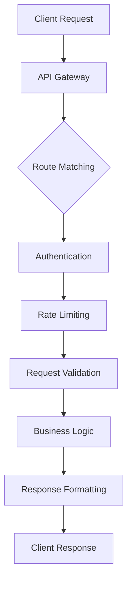
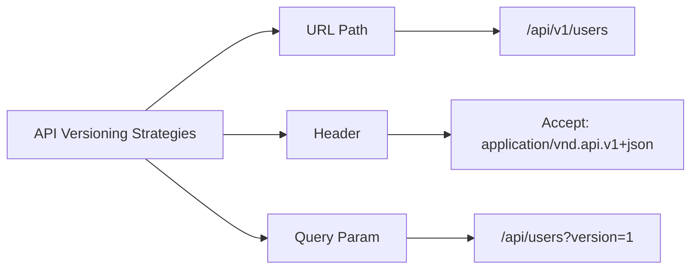
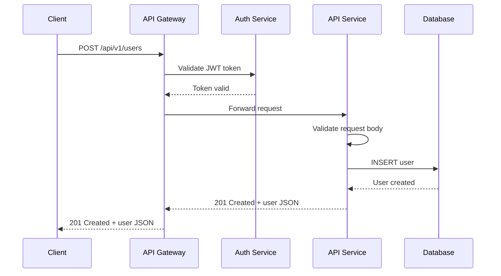

# REST API Design Best Practices for Production Services

Author: [nawazdhandala](https://www.github.com/nawazdhandala)

Tags: REST API, API Design, Best Practices, HTTP, Backend

Description: Essential REST API design best practices including resource naming, HTTP methods, error handling, versioning, and pagination.

---

Building a REST API that scales well and remains easy to consume requires discipline. This guide covers the key design principles you should follow when shipping APIs to production.

## Why REST API Design Matters

A poorly designed API creates friction for every consumer. Inconsistent naming, missing error details, and unclear versioning strategies lead to bugs, support tickets, and wasted engineering time. Good design pays dividends for years.



## Resource Naming Conventions

Use nouns for resources, not verbs. Resources represent entities in your system.

```text
# Good - nouns, plural, lowercase
GET    /api/v1/users
GET    /api/v1/users/123
POST   /api/v1/users
PUT    /api/v1/users/123
DELETE /api/v1/users/123

# Bad - verbs, inconsistent casing
GET    /api/v1/getUsers
POST   /api/v1/createUser
GET    /api/v1/UserList
```

For nested resources, keep the hierarchy shallow. Two levels deep is usually the maximum before things get unwieldy.

```text
# Good - shallow nesting
GET /api/v1/users/123/orders

# Avoid - deep nesting becomes hard to maintain
GET /api/v1/users/123/orders/456/items/789/reviews
```

## HTTP Methods and Status Codes

Use HTTP methods according to their semantics. Each method has a clear purpose.

```python
# Flask example showing proper HTTP method usage

from flask import Flask, jsonify, request

app = Flask(__name__)

# GET - Retrieve a resource (idempotent, safe)
@app.route("/api/v1/users/<int:user_id>", methods=["GET"])
def get_user(user_id):
    user = find_user(user_id)
    if not user:
        # 404 - Resource not found
        return jsonify({"error": "User not found"}), 404
    # 200 - Success
    return jsonify(user), 200

# POST - Create a new resource (not idempotent)
@app.route("/api/v1/users", methods=["POST"])
def create_user():
    data = request.get_json()
    if not data or not data.get("email"):
        # 400 - Bad request due to invalid input
        return jsonify({"error": "Email is required"}), 400
    user = save_user(data)
    # 201 - Resource created successfully
    return jsonify(user), 201

# PUT - Replace a resource entirely (idempotent)
@app.route("/api/v1/users/<int:user_id>", methods=["PUT"])
def update_user(user_id):
    data = request.get_json()
    user = replace_user(user_id, data)
    # 200 - Resource updated
    return jsonify(user), 200

# PATCH - Partially update a resource
@app.route("/api/v1/users/<int:user_id>", methods=["PATCH"])
def patch_user(user_id):
    data = request.get_json()
    user = partial_update_user(user_id, data)
    return jsonify(user), 200

# DELETE - Remove a resource (idempotent)
@app.route("/api/v1/users/<int:user_id>", methods=["DELETE"])
def delete_user(user_id):
    remove_user(user_id)
    # 204 - No content, deletion successful
    return "", 204
```

## Consistent Error Responses

Every error response should follow the same structure. Clients should never have to guess the format.

```json
{
  "error": {
    "code": "VALIDATION_ERROR",
    "message": "Request validation failed",
    "details": [
      {
        "field": "email",
        "message": "Must be a valid email address"
      },
      {
        "field": "age",
        "message": "Must be a positive integer"
      }
    ],
    "request_id": "req_abc123xyz"
  }
}
```

```python
# Standardized error response helper

def error_response(code, message, details=None, status=400):
    """
    Build a consistent error response.
    Always include a machine-readable code and a human-readable message.
    """
    body = {
        "error": {
            "code": code,
            "message": message,
            "request_id": generate_request_id(),
        }
    }
    # Include field-level details when available
    if details:
        body["error"]["details"] = details
    return jsonify(body), status
```

## API Versioning

Version your API from day one. The most common strategies are URL path versioning and header versioning.



URL path versioning is the simplest and most visible approach.

```python
# URL path versioning with Flask blueprints

from flask import Blueprint

# Version 1 blueprint
v1 = Blueprint("v1", __name__, url_prefix="/api/v1")

@v1.route("/users")
def list_users_v1():
    # Original implementation
    return jsonify(get_users_v1())

# Version 2 blueprint with breaking changes
v2 = Blueprint("v2", __name__, url_prefix="/api/v2")

@v2.route("/users")
def list_users_v2():
    # Updated response shape with pagination metadata
    return jsonify(get_users_v2())

# Register both versions
app.register_blueprint(v1)
app.register_blueprint(v2)
```

## Pagination

Never return unbounded lists. Use cursor-based pagination for large datasets and offset-based for simpler cases.

```python
# Cursor-based pagination implementation

@app.route("/api/v1/users", methods=["GET"])
def list_users():
    # Parse pagination parameters with sensible defaults
    cursor = request.args.get("cursor", None)
    limit = min(int(request.args.get("limit", 20)), 100)  # Cap at 100

    # Fetch one extra record to determine if there is a next page
    users, next_cursor = fetch_users_after_cursor(cursor, limit)

    return jsonify({
        "data": users,
        "pagination": {
            "next_cursor": next_cursor,
            "limit": limit,
            "has_more": next_cursor is not None,
        }
    }), 200
```

## Filtering and Sorting

Allow clients to filter and sort results with query parameters.

```text
# Filter by status and sort by creation date descending
GET /api/v1/orders?status=pending&sort=-created_at

# Multiple filters
GET /api/v1/products?category=electronics&min_price=100&max_price=500

# Field selection to reduce payload size
GET /api/v1/users?fields=id,name,email
```

```python
# Implementing query parameter filtering

@app.route("/api/v1/orders", methods=["GET"])
def list_orders():
    # Extract filter parameters
    status = request.args.get("status")
    sort_field = request.args.get("sort", "created_at")

    # Determine sort direction from the prefix
    if sort_field.startswith("-"):
        sort_direction = "DESC"
        sort_field = sort_field[1:]
    else:
        sort_direction = "ASC"

    # Whitelist allowed sort fields to prevent injection
    allowed_sorts = {"created_at", "updated_at", "total", "status"}
    if sort_field not in allowed_sorts:
        return error_response("INVALID_SORT", f"Sort by {sort_field} is not allowed")

    orders = query_orders(status=status, sort=sort_field, direction=sort_direction)
    return jsonify({"data": orders}), 200
```

## Request Validation

Validate all incoming data before processing. Return clear messages about what went wrong.

```python
# Using a schema library for validation

from marshmallow import Schema, fields, validate

class CreateUserSchema(Schema):
    """Schema for validating user creation requests."""
    email = fields.Email(required=True)
    name = fields.String(required=True, validate=validate.Length(min=1, max=255))
    role = fields.String(validate=validate.OneOf(["admin", "user", "viewer"]))

@app.route("/api/v1/users", methods=["POST"])
def create_user():
    schema = CreateUserSchema()
    errors = schema.validate(request.get_json())

    if errors:
        # Convert validation errors into the standard error format
        details = [
            {"field": field, "message": msgs[0]}
            for field, msgs in errors.items()
        ]
        return error_response("VALIDATION_ERROR", "Invalid input", details=details)

    # Proceed with validated data
    user = schema.load(request.get_json())
    return jsonify(save_user(user)), 201
```

## HATEOAS and Discoverability

Include links in your responses so clients can navigate the API without hardcoding URLs.

```json
{
  "data": {
    "id": 123,
    "name": "Alice",
    "email": "alice@example.com"
  },
  "links": {
    "self": "/api/v1/users/123",
    "orders": "/api/v1/users/123/orders",
    "profile": "/api/v1/users/123/profile"
  }
}
```

## The Complete API Flow



## Summary

Designing REST APIs well comes down to consistency. Use nouns for resources, proper HTTP methods for actions, standard status codes for outcomes, and predictable pagination for lists. Version your API early and validate every input.

If you are running REST APIs in production, [OneUptime](https://oneuptime.com) can help you monitor endpoint health, track response times, and alert you when error rates spike - so your API consumers always have a great experience.
