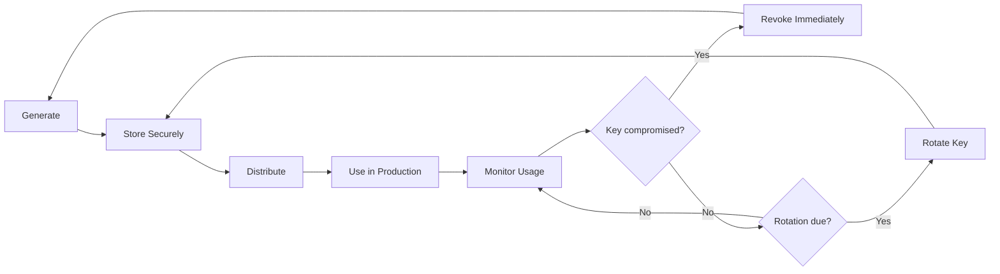
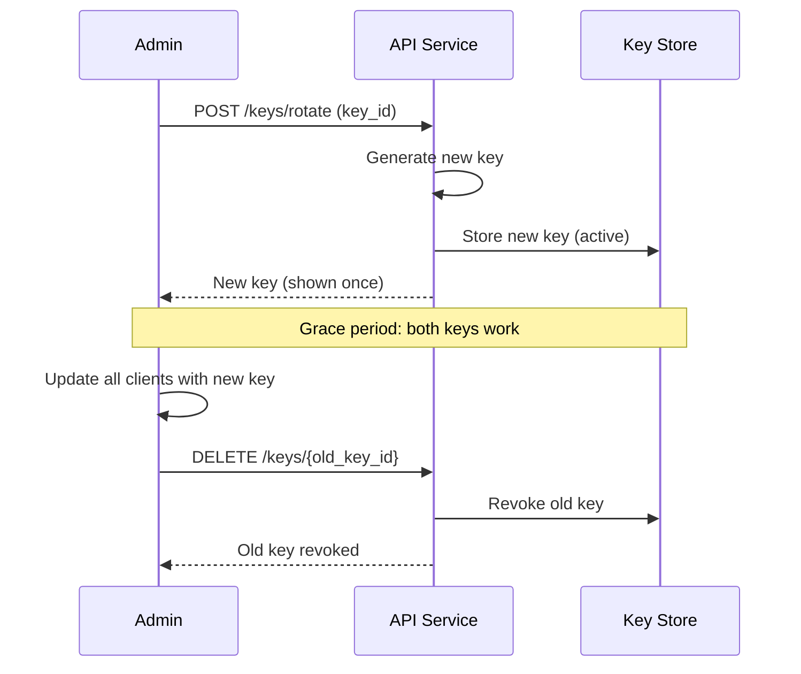
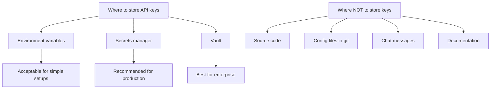

# API Key Management Best Practices for Secure Services

Author: [nawazdhandala](https://www.github.com/nawazdhandala)

Tags: API Keys, Security, Authentication, Best Practices, Key Management

Description: Best practices for API key management including generation, storage, rotation, and revocation strategies.

---

API keys are one of the most common authentication mechanisms for service-to-service communication and third-party integrations. Yet they are frequently mismanaged - hardcoded in source code, shared in chat messages, or never rotated. This guide covers best practices for the full lifecycle of API key management.

## API Key Lifecycle



## Generating Secure API Keys

API keys should be cryptographically random, sufficiently long, and include a prefix for easy identification.

```python
# key_generator.py
# Generate secure API keys with prefixes and metadata

import secrets
import hashlib
import time
from dataclasses import dataclass
from typing import Optional, List

@dataclass
class APIKey:
    """Represents an API key with metadata."""
    key_id: str
    prefix: str
    key_hash: str
    name: str
    scopes: List[str]
    created_at: float
    expires_at: Optional[float]
    last_used_at: Optional[float] = None
    is_active: bool = True


class APIKeyGenerator:
    # Key prefix identifies the type and environment
    # Format: {service}_{env}_{random}
    PREFIXES = {
        "production": "pk_live",
        "staging": "pk_test",
        "development": "pk_dev"
    }

    def __init__(self, environment="production"):
        self.prefix = self.PREFIXES.get(environment, "pk_dev")

    def generate(self, name, scopes, expires_in_days=None):
        """Generate a new API key."""
        # Generate 32 bytes of cryptographically secure random data
        random_part = secrets.token_urlsafe(32)

        # Create the full key with prefix
        full_key = f"{self.prefix}_{random_part}"

        # Generate a unique key ID
        key_id = secrets.token_hex(8)

        # Hash the key for storage (never store the raw key)
        key_hash = hashlib.sha256(full_key.encode()).hexdigest()

        # Calculate expiration if specified
        expires_at = None
        if expires_in_days:
            expires_at = time.time() + (expires_in_days * 86400)

        api_key = APIKey(
            key_id=key_id,
            prefix=self.prefix,
            key_hash=key_hash,
            name=name,
            scopes=scopes,
            created_at=time.time(),
            expires_at=expires_at
        )

        # Return both the key object (for storage) and the raw key
        # The raw key is shown to the user ONLY ONCE
        return api_key, full_key

    def validate(self, raw_key, stored_hash):
        """Validate a raw key against a stored hash."""
        # Hash the provided key
        provided_hash = hashlib.sha256(raw_key.encode()).hexdigest()
        # Use constant-time comparison to prevent timing attacks
        return secrets.compare_digest(provided_hash, stored_hash)
```

## Storing API Keys Securely

Never store raw API keys. Store only the hash, and return the raw key to the user exactly once at creation time.

```python
# key_store.py
# Secure API key storage with database

import psycopg2
import json
import logging

logger = logging.getLogger(__name__)

class APIKeyStore:
    def __init__(self, connection_string):
        self.conn = psycopg2.connect(connection_string)

    def initialize_table(self):
        """Create the API keys table if it does not exist."""
        cursor = self.conn.cursor()
        cursor.execute("""
            CREATE TABLE IF NOT EXISTS api_keys (
                key_id VARCHAR(16) PRIMARY KEY,
                prefix VARCHAR(10) NOT NULL,
                key_hash VARCHAR(64) NOT NULL UNIQUE,
                name VARCHAR(255) NOT NULL,
                scopes JSONB NOT NULL DEFAULT '[]',
                created_at TIMESTAMP NOT NULL DEFAULT NOW(),
                expires_at TIMESTAMP,
                last_used_at TIMESTAMP,
                is_active BOOLEAN NOT NULL DEFAULT TRUE,
                created_by VARCHAR(255),
                -- Index on hash for fast lookups during authentication
                CONSTRAINT unique_key_hash UNIQUE (key_hash)
            );

            -- Index for looking up keys by prefix (for key listing)
            CREATE INDEX IF NOT EXISTS idx_api_keys_prefix
                ON api_keys(prefix);

            -- Index for finding expired keys
            CREATE INDEX IF NOT EXISTS idx_api_keys_expires
                ON api_keys(expires_at)
                WHERE is_active = TRUE;
        """)
        self.conn.commit()

    def store_key(self, api_key, created_by):
        """Store an API key record (hash only, never the raw key)."""
        cursor = self.conn.cursor()
        cursor.execute("""
            INSERT INTO api_keys (key_id, prefix, key_hash, name, scopes,
                                  created_at, expires_at, created_by)
            VALUES (%s, %s, %s, %s, %s, TO_TIMESTAMP(%s), 
                    CASE WHEN %s IS NOT NULL THEN TO_TIMESTAMP(%s) END, %s)
        """, (
            api_key.key_id,
            api_key.prefix,
            api_key.key_hash,
            api_key.name,
            json.dumps(api_key.scopes),
            api_key.created_at,
            api_key.expires_at,
            api_key.expires_at,
            created_by
        ))
        self.conn.commit()
        logger.info(f"Stored API key {api_key.key_id} for {created_by}")

    def lookup_by_hash(self, key_hash):
        """Look up a key by its hash during authentication."""
        cursor = self.conn.cursor()
        cursor.execute("""
            SELECT key_id, prefix, scopes, expires_at, is_active
            FROM api_keys
            WHERE key_hash = %s
        """, (key_hash,))

        row = cursor.fetchone()
        if not row:
            return None

        # Update last_used_at timestamp
        cursor.execute("""
            UPDATE api_keys SET last_used_at = NOW()
            WHERE key_hash = %s
        """, (key_hash,))
        self.conn.commit()

        return {
            "key_id": row[0],
            "prefix": row[1],
            "scopes": row[2],
            "expires_at": row[3],
            "is_active": row[4]
        }

    def revoke_key(self, key_id):
        """Revoke an API key immediately."""
        cursor = self.conn.cursor()
        cursor.execute("""
            UPDATE api_keys SET is_active = FALSE
            WHERE key_id = %s
        """, (key_id,))
        self.conn.commit()
        logger.warning(f"Revoked API key {key_id}")
```

## Key Rotation Strategy

Implement graceful key rotation where old and new keys work simultaneously during a transition period.



```python
# key_rotation.py
# Graceful API key rotation with overlap period

import time
import logging

logger = logging.getLogger(__name__)

class KeyRotationManager:
    def __init__(self, key_store, key_generator):
        self.store = key_store
        self.generator = key_generator
        # Grace period in seconds (7 days)
        self.grace_period = 7 * 86400

    def rotate_key(self, old_key_id, name, scopes, created_by):
        """Create a new key and schedule the old one for deactivation."""
        # Generate the new replacement key
        new_api_key, raw_key = self.generator.generate(
            name=f"{name} (rotated)",
            scopes=scopes,
            expires_in_days=90
        )

        # Store the new key
        self.store.store_key(new_api_key, created_by)

        # Schedule the old key for deactivation after grace period
        deactivation_time = time.time() + self.grace_period
        self.store.schedule_deactivation(old_key_id, deactivation_time)

        logger.info(
            f"Key rotation initiated: {old_key_id} will be "
            f"deactivated in {self.grace_period // 86400} days"
        )

        # Return the new raw key (shown to user once)
        return new_api_key, raw_key

    def cleanup_expired_keys(self):
        """Deactivate keys past their scheduled deactivation time."""
        count = self.store.deactivate_expired_keys()
        if count > 0:
            logger.info(f"Deactivated {count} expired API keys")
        return count
```

## Scope-Based Access Control

Limit what each API key can do by assigning specific scopes.

```python
# scopes.py
# Scope-based access control for API keys

from functools import wraps
from fastapi import HTTPException, Request

# Define available scopes
SCOPES = {
    "read:users":    "Read user data",
    "write:users":   "Create and update users",
    "read:orders":   "Read order data",
    "write:orders":  "Create and update orders",
    "admin":         "Full administrative access",
}


def require_scopes(*required_scopes):
    """Decorator to enforce scope requirements on endpoints."""
    def decorator(func):
        @wraps(func)
        async def wrapper(request: Request, *args, **kwargs):
            # Get the authenticated key's scopes
            key_scopes = request.state.api_key_scopes

            # Check if the key has admin scope (bypasses all checks)
            if "admin" in key_scopes:
                return await func(request, *args, **kwargs)

            # Check if the key has all required scopes
            missing = set(required_scopes) - set(key_scopes)
            if missing:
                raise HTTPException(
                    status_code=403,
                    detail=f"Missing required scopes: {', '.join(missing)}"
                )

            return await func(request, *args, **kwargs)
        return wrapper
    return decorator
```

## Monitoring API Key Usage

Track how each API key is used to detect anomalies and unauthorized access.

```python
# key_monitoring.py
# Monitor API key usage patterns

from prometheus_client import Counter, Histogram
from collections import defaultdict

# Track requests per API key
key_requests = Counter(
    "api_key_requests_total",
    "Total requests per API key",
    ["key_id", "endpoint", "status"]
)

# Track request latency per key
key_latency = Histogram(
    "api_key_request_duration_seconds",
    "Request duration per API key",
    ["key_id"],
    buckets=[0.01, 0.05, 0.1, 0.25, 0.5, 1.0, 5.0]
)


def log_key_usage(key_id, endpoint, status_code, duration):
    """Record API key usage for monitoring."""
    key_requests.labels(
        key_id=key_id,
        endpoint=endpoint,
        status=str(status_code)
    ).inc()

    key_latency.labels(key_id=key_id).observe(duration)
```

## Never Hardcode Keys



```bash
# Use environment variables for local development
export API_KEY="pk_dev_abc123..."

# Use a secrets manager in production
# AWS Secrets Manager
aws secretsmanager get-secret-value --secret-id myapp/api-key

# HashiCorp Vault
vault kv get secret/myapp/api-key
```

With **OneUptime**, you can monitor API key usage across your services. Track authentication success and failure rates per key, detect unusual usage patterns, and set up alerts for compromised key indicators. OneUptime provides the observability you need to keep your API key infrastructure secure and reliable.
