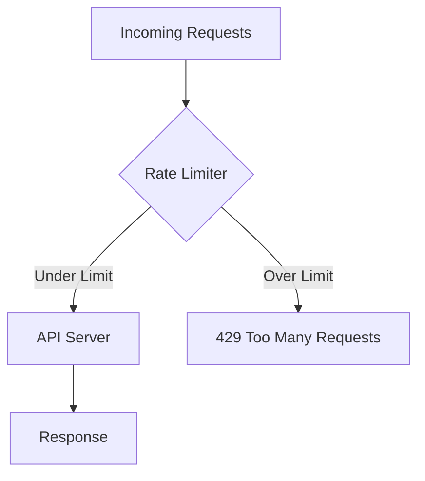
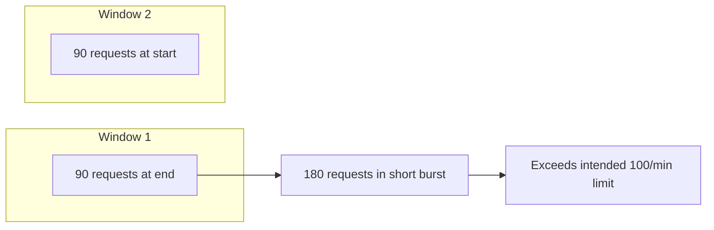
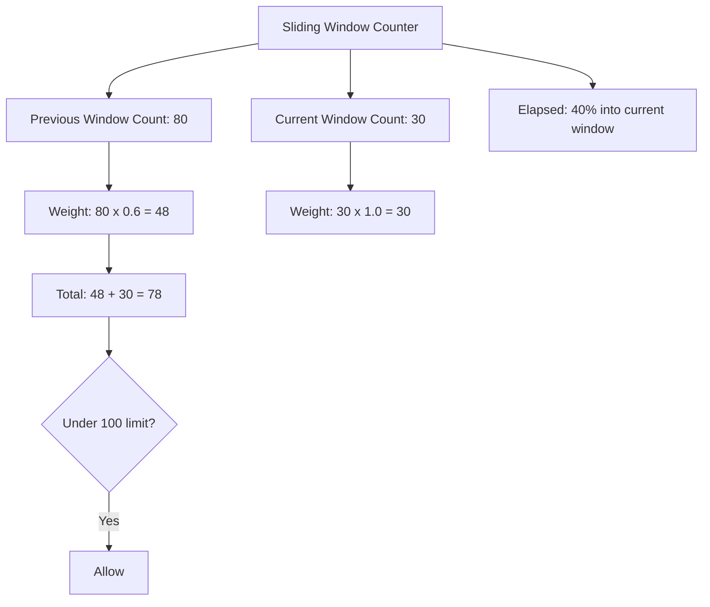
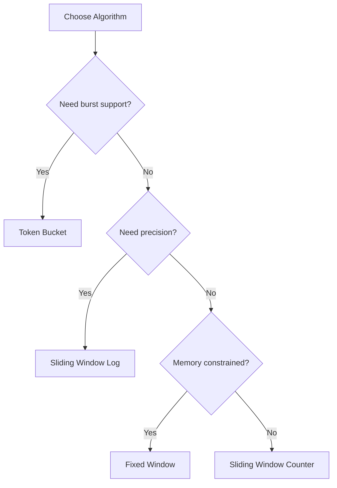

# How to Implement API Rate Limiting Strategies

Author: [nawazdhandala](https://www.github.com/nawazdhandala)

Tags: API, Rate Limiting, Token Bucket, Sliding Window, Security

Description: Learn different API rate limiting strategies including token bucket, sliding window, and fixed window algorithms.

---

Rate limiting protects your API from abuse, prevents resource exhaustion, and ensures fair usage across all clients. This guide covers the most common algorithms, how to implement them, and how to choose the right one for your use case.

## Why Rate Limiting Matters

Without rate limiting, a single client can overwhelm your API. Whether it is a bug in a client library, a denial-of-service attack, or a misconfigured integration, uncontrolled traffic can bring down your entire service.



## Fixed Window Algorithm

The simplest approach. Divide time into fixed windows (for example, 1-minute intervals) and count requests in each window.

```python
# fixed_window.py
# Simple fixed window rate limiter using Redis

import time
import redis

# Connect to Redis for shared state across instances
r = redis.Redis(host="localhost", port=6379, db=0)

def is_allowed_fixed_window(client_id: str, max_requests: int, window_seconds: int) -> bool:
    """
    Check if a request is allowed under the fixed window algorithm.

    The window resets completely at the boundary. For example, with a
    60-second window, the counter resets at the start of each minute.
    """
    # Create a key that changes every window
    current_window = int(time.time() // window_seconds)
    key = f"rate_limit:{client_id}:{current_window}"

    # Increment the counter and get the new value
    current_count = r.incr(key)

    # Set expiration on first request in this window
    if current_count == 1:
        r.expire(key, window_seconds)

    # Allow if under the limit
    return current_count <= max_requests


# Example usage
client = "user-123"
if is_allowed_fixed_window(client, max_requests=100, window_seconds=60):
    print("Request allowed")
else:
    print("Rate limit exceeded")
```

The fixed window has a weakness: a burst of requests at the end of one window and the start of the next can allow double the intended rate.



## Sliding Window Log

The sliding window log tracks the timestamp of every request. It gives precise rate limiting but uses more memory.

```python
# sliding_window_log.py
# Precise rate limiting using a sorted set of timestamps

import time
import redis

r = redis.Redis(host="localhost", port=6379, db=0)

def is_allowed_sliding_log(client_id: str, max_requests: int, window_seconds: int) -> bool:
    """
    Check if a request is allowed using the sliding window log algorithm.

    Stores each request timestamp in a sorted set. Removes expired entries
    and counts the remaining ones to determine if the limit is reached.
    """
    key = f"rate_limit:log:{client_id}"
    now = time.time()
    window_start = now - window_seconds

    # Use a pipeline to make this atomic
    pipe = r.pipeline()

    # Remove timestamps older than the window
    pipe.zremrangebyscore(key, 0, window_start)

    # Count remaining timestamps in the window
    pipe.zcard(key)

    # Add the current request timestamp
    pipe.zadd(key, {str(now): now})

    # Set expiry on the key to clean up eventually
    pipe.expire(key, window_seconds)

    results = pipe.execute()
    request_count = results[1]  # zcard result

    # Allow if the count before adding this request is under the limit
    return request_count < max_requests
```

## Sliding Window Counter

A hybrid approach that combines the efficiency of fixed windows with the accuracy of sliding windows.

```python
# sliding_window_counter.py
# Weighted approach that blends two adjacent fixed windows

import time
import redis

r = redis.Redis(host="localhost", port=6379, db=0)

def is_allowed_sliding_counter(client_id: str, max_requests: int, window_seconds: int) -> bool:
    """
    Check if a request is allowed using the sliding window counter.

    This algorithm uses two fixed windows and weights their counts
    based on how far into the current window we are. It is more
    accurate than fixed window and uses less memory than the log.
    """
    now = time.time()
    current_window = int(now // window_seconds)
    previous_window = current_window - 1

    # How far into the current window we are (0.0 to 1.0)
    elapsed_ratio = (now % window_seconds) / window_seconds

    # Get counts for current and previous windows
    current_key = f"rate_limit:sw:{client_id}:{current_window}"
    previous_key = f"rate_limit:sw:{client_id}:{previous_window}"

    current_count = int(r.get(current_key) or 0)
    previous_count = int(r.get(previous_key) or 0)

    # Weighted count: full current window + proportional previous window
    # The portion of the previous window that overlaps is (1 - elapsed_ratio)
    weighted_count = current_count + previous_count * (1 - elapsed_ratio)

    if weighted_count >= max_requests:
        return False

    # Increment the current window counter
    pipe = r.pipeline()
    pipe.incr(current_key)
    pipe.expire(current_key, window_seconds * 2)
    pipe.execute()

    return True
```



## Token Bucket Algorithm

The token bucket allows bursts while enforcing an average rate. Tokens are added at a fixed rate, and each request consumes one token.

```python
# token_bucket.py
# Token bucket rate limiter with burst support

import time
import redis

r = redis.Redis(host="localhost", port=6379, db=0)

def is_allowed_token_bucket(
    client_id: str,
    bucket_capacity: int,
    refill_rate: float,  # tokens per second
) -> bool:
    """
    Check if a request is allowed using the token bucket algorithm.

    The bucket starts full with bucket_capacity tokens. Each request
    removes one token. Tokens are refilled at refill_rate per second.
    This allows short bursts up to bucket_capacity while enforcing
    an average rate of refill_rate requests per second.
    """
    key = f"rate_limit:tb:{client_id}"
    now = time.time()

    # Get current bucket state
    bucket = r.hgetall(key)

    if not bucket:
        # Initialize a full bucket
        tokens = bucket_capacity - 1  # Subtract 1 for this request
        r.hset(key, mapping={"tokens": tokens, "last_refill": now})
        r.expire(key, 3600)
        return True

    # Calculate tokens to add since last refill
    last_refill = float(bucket[b"last_refill"])
    elapsed = now - last_refill
    tokens = float(bucket[b"tokens"])

    # Add new tokens based on elapsed time
    tokens = min(bucket_capacity, tokens + elapsed * refill_rate)

    if tokens < 1:
        # No tokens available, reject the request
        return False

    # Consume one token for this request
    tokens -= 1
    r.hset(key, mapping={"tokens": tokens, "last_refill": now})
    r.expire(key, 3600)

    return True
```

## Returning Rate Limit Headers

Always tell clients about their rate limit status in response headers.

```python
# middleware.py
# Express-style middleware that adds rate limit headers

from flask import Flask, request, jsonify, make_response

app = Flask(__name__)

@app.before_request
def rate_limit_middleware():
    """
    Check rate limits before processing any request.
    Add standard rate limit headers to every response.
    """
    client_id = request.headers.get("X-API-Key", request.remote_addr)
    max_requests = 100
    window_seconds = 60

    allowed, remaining, reset_at = check_rate_limit(client_id, max_requests, window_seconds)

    # Store rate limit info for the after_request handler
    request.rate_limit_info = {
        "limit": max_requests,
        "remaining": remaining,
        "reset": reset_at,
    }

    if not allowed:
        response = make_response(
            jsonify({"error": "Rate limit exceeded. Try again later."}),
            429,
        )
        # Include Retry-After header so clients know when to retry
        response.headers["Retry-After"] = str(reset_at - int(time.time()))
        return response

@app.after_request
def add_rate_limit_headers(response):
    """Attach rate limit headers to every response."""
    info = getattr(request, "rate_limit_info", None)
    if info:
        response.headers["X-RateLimit-Limit"] = str(info["limit"])
        response.headers["X-RateLimit-Remaining"] = str(info["remaining"])
        response.headers["X-RateLimit-Reset"] = str(info["reset"])
    return response
```

## Choosing the Right Algorithm



| Algorithm | Precision | Memory | Burst Control | Complexity |
|---|---|---|---|---|
| Fixed Window | Low | Low | None | Simple |
| Sliding Window Log | High | High | None | Medium |
| Sliding Window Counter | Medium | Low | None | Medium |
| Token Bucket | Medium | Low | Yes | Medium |

## Distributed Rate Limiting

When running multiple API instances, centralize your rate limiting state in Redis or a similar shared store.

```python
# distributed_limiter.py
# Lua script for atomic rate limiting in Redis

SLIDING_WINDOW_SCRIPT = """
local key = KEYS[1]
local max_requests = tonumber(ARGV[1])
local window = tonumber(ARGV[2])
local now = tonumber(ARGV[3])

-- Remove expired entries
redis.call('ZREMRANGEBYSCORE', key, 0, now - window)

-- Count current entries
local count = redis.call('ZCARD', key)

if count < max_requests then
    -- Add this request
    redis.call('ZADD', key, now, now .. '-' .. math.random(1000000))
    redis.call('EXPIRE', key, window)
    return 1
else
    return 0
end
"""

# Register the script once, then call it by SHA
script_sha = r.script_load(SLIDING_WINDOW_SCRIPT)

def is_allowed_distributed(client_id: str, max_requests: int, window_seconds: int) -> bool:
    """Atomic rate limiting using a Lua script in Redis."""
    key = f"rate_limit:dist:{client_id}"
    result = r.evalsha(script_sha, 1, key, max_requests, window_seconds, time.time())
    return result == 1
```

## Summary

Rate limiting is a critical layer of defense for any API. Fixed windows are simple but imprecise. Sliding window counters offer a good balance of accuracy and efficiency. Token buckets handle bursts gracefully. Use Redis for distributed state and always return rate limit headers so clients can self-regulate.

Use [OneUptime](https://oneuptime.com) to monitor your API rate limit metrics, track 429 response rates, and alert your team when clients are consistently hitting their limits - a sign that limits may need adjustment or that abuse is occurring.
