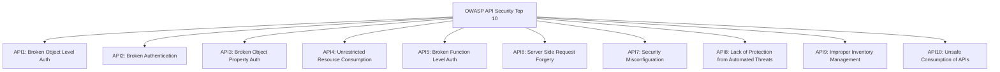
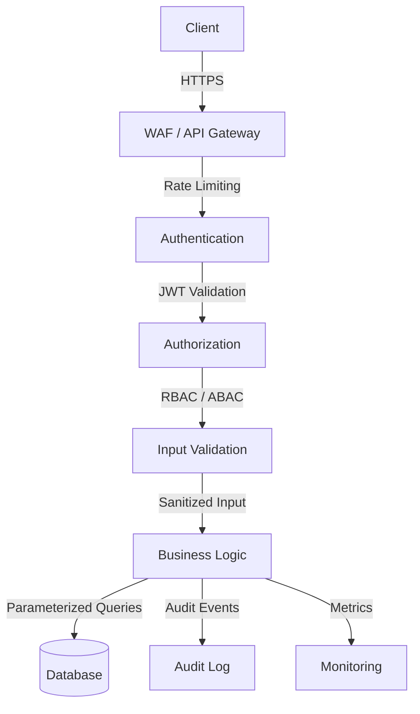

# API Security Best Practices for Production Applications

Author: [nawazdhandala](https://www.github.com/nawazdhandala)

Tags: API Security, Authentication, Authorization, OWASP, Best Practices

Description: Essential API security best practices including authentication, input validation, rate limiting, and OWASP API Security Top 10.

---

## Introduction

APIs are the backbone of modern applications, but they are also a prime target for attackers. A single insecure endpoint can expose sensitive data, enable account takeovers, or bring down your entire system. This guide covers essential API security best practices grounded in the OWASP API Security Top 10.

## OWASP API Security Top 10 Overview



## Authentication and Authorization

### JWT Validation Middleware

```python
# Secure JWT validation middleware for FastAPI
from fastapi import FastAPI, Request, HTTPException, Depends
from fastapi.security import HTTPBearer, HTTPAuthorizationCredentials
import jwt
import httpx
from functools import lru_cache

app = FastAPI()
security = HTTPBearer()

# Cache JWKS keys to avoid fetching on every request
@lru_cache(maxsize=1)
def get_jwks():
    """Fetch and cache the JWKS from the identity provider."""
    response = httpx.get("https://auth.example.com/.well-known/jwks.json")
    return response.json()

async def validate_token(
    credentials: HTTPAuthorizationCredentials = Depends(security),
) -> dict:
    """Validate the JWT token and return decoded claims."""
    token = credentials.credentials

    try:
        # Decode the token header to find the signing key ID
        header = jwt.get_unverified_header(token)
        jwks = get_jwks()

        # Find the matching key in the JWKS
        signing_key = None
        for key in jwks["keys"]:
            if key["kid"] == header["kid"]:
                signing_key = jwt.algorithms.RSAAlgorithm.from_jwk(key)
                break

        if not signing_key:
            raise HTTPException(status_code=401, detail="Invalid signing key")

        # Validate signature, expiration, issuer, and audience
        claims = jwt.decode(
            token,
            signing_key,
            algorithms=["RS256"],  # Only allow expected algorithms
            audience="my-api",
            issuer="https://auth.example.com",
            options={
                "require": ["exp", "iss", "aud", "sub"],
            },
        )
        return claims

    except jwt.ExpiredSignatureError:
        raise HTTPException(status_code=401, detail="Token expired")
    except jwt.InvalidTokenError as e:
        raise HTTPException(status_code=401, detail=f"Invalid token: {str(e)}")
```

### Object-Level Authorization

```python
# Prevent Broken Object Level Authorization (BOLA)
from fastapi import APIRouter, Depends, HTTPException

router = APIRouter()

@router.get("/api/v1/orders/{order_id}")
async def get_order(order_id: str, claims: dict = Depends(validate_token)):
    """Fetch an order - always verify ownership."""
    # Extract the authenticated user's ID from token claims
    user_id = claims["sub"]

    # Always filter by user_id to prevent unauthorized access
    order = await db.orders.find_one({
        "_id": order_id,
        "user_id": user_id,  # Critical: ensures the user owns this order
    })

    if not order:
        # Return 404 instead of 403 to prevent information leakage
        raise HTTPException(status_code=404, detail="Order not found")

    return order
```

## Input Validation

### Request Validation with Pydantic

```python
# Strict input validation using Pydantic models
from pydantic import BaseModel, Field, EmailStr, field_validator
from typing import Optional
import re

class CreateUserRequest(BaseModel):
    """Validated user creation request with strict constraints."""

    # Limit string lengths to prevent abuse
    username: str = Field(
        min_length=3,
        max_length=30,
        pattern=r"^[a-zA-Z0-9_]+$",  # Only alphanumeric and underscores
    )
    email: EmailStr  # Validates email format
    password: str = Field(min_length=12, max_length=128)
    display_name: Optional[str] = Field(default=None, max_length=100)

    @field_validator("password")
    @classmethod
    def validate_password_strength(cls, v: str) -> str:
        """Enforce password complexity requirements."""
        if not re.search(r"[A-Z]", v):
            raise ValueError("Password must contain at least one uppercase letter")
        if not re.search(r"[a-z]", v):
            raise ValueError("Password must contain at least one lowercase letter")
        if not re.search(r"\d", v):
            raise ValueError("Password must contain at least one digit")
        if not re.search(r"[!@#$%^&*(),.?\":{}|<>]", v):
            raise ValueError("Password must contain at least one special character")
        return v

@router.post("/api/v1/users")
async def create_user(request: CreateUserRequest):
    """Create user with validated input - Pydantic rejects invalid data."""
    # At this point, all input has been validated and sanitized
    return await user_service.create(request)
```

## Rate Limiting

### Token Bucket Rate Limiter

```python
# Token bucket rate limiter using Redis
import redis.asyncio as redis
import time
from fastapi import Request, HTTPException

class RateLimiter:
    """Token bucket rate limiter backed by Redis."""

    def __init__(self, redis_client: redis.Redis):
        self.redis = redis_client

    async def check_rate_limit(
        self,
        key: str,
        max_tokens: int = 100,      # Maximum burst capacity
        refill_rate: float = 10.0,   # Tokens added per second
    ) -> bool:
        """Check if request is within rate limits using token bucket."""
        now = time.time()
        pipe = self.redis.pipeline()

        # Lua script for atomic token bucket operations
        lua_script = """
        local key = KEYS[1]
        local max_tokens = tonumber(ARGV[1])
        local refill_rate = tonumber(ARGV[2])
        local now = tonumber(ARGV[3])

        -- Get current bucket state
        local bucket = redis.call('HMGET', key, 'tokens', 'last_refill')
        local tokens = tonumber(bucket[1]) or max_tokens
        local last_refill = tonumber(bucket[2]) or now

        -- Calculate tokens to add since last refill
        local elapsed = now - last_refill
        tokens = math.min(max_tokens, tokens + (elapsed * refill_rate))

        -- Try to consume one token
        if tokens >= 1 then
            tokens = tokens - 1
            redis.call('HMSET', key, 'tokens', tokens, 'last_refill', now)
            redis.call('EXPIRE', key, 3600)
            return 1
        else
            return 0
        end
        """

        result = await self.redis.eval(lua_script, 1, key, max_tokens, refill_rate, now)
        return result == 1

# Dependency for FastAPI routes
async def rate_limit_dependency(request: Request):
    """FastAPI dependency that enforces rate limiting per IP."""
    client_ip = request.client.host
    limiter = RateLimiter(request.app.state.redis)

    if not await limiter.check_rate_limit(f"rate_limit:{client_ip}"):
        raise HTTPException(
            status_code=429,
            detail="Too many requests. Please try again later.",
            headers={"Retry-After": "10"},
        )
```

## Security Headers

```python
# Security headers middleware
from fastapi import FastAPI
from starlette.middleware.base import BaseHTTPMiddleware
from starlette.requests import Request
from starlette.responses import Response

class SecurityHeadersMiddleware(BaseHTTPMiddleware):
    """Add security headers to all API responses."""

    async def dispatch(self, request: Request, call_next) -> Response:
        response = await call_next(request)

        # Prevent MIME type sniffing
        response.headers["X-Content-Type-Options"] = "nosniff"

        # Prevent clickjacking
        response.headers["X-Frame-Options"] = "DENY"

        # Control referrer information
        response.headers["Referrer-Policy"] = "strict-origin-when-cross-origin"

        # Content Security Policy for API responses
        response.headers["Content-Security-Policy"] = "default-src 'none'; frame-ancestors 'none'"

        # Strict Transport Security (HTTPS only)
        response.headers["Strict-Transport-Security"] = "max-age=31536000; includeSubDomains"

        # Remove server header to avoid information leakage
        response.headers.pop("server", None)

        return response

app = FastAPI()
app.add_middleware(SecurityHeadersMiddleware)
```

## API Security Architecture



## Request Logging and Audit Trail

```python
# Structured audit logging for security events
import structlog
from datetime import datetime, timezone

# Configure structured logger
logger = structlog.get_logger("audit")

async def log_security_event(
    event_type: str,
    user_id: str,
    resource: str,
    action: str,
    result: str,
    request: Request,
    details: dict = None,
):
    """Log a structured security audit event."""
    await logger.ainfo(
        "security_event",
        event_type=event_type,
        user_id=user_id,
        resource=resource,
        action=action,
        result=result,
        client_ip=request.client.host,
        user_agent=request.headers.get("user-agent", "unknown"),
        timestamp=datetime.now(timezone.utc).isoformat(),
        request_id=request.state.request_id,
        details=details or {},
    )

# Usage in route handlers
@router.delete("/api/v1/users/{user_id}")
async def delete_user(user_id: str, claims: dict = Depends(validate_token), request: Request = None):
    """Delete a user with full audit logging."""
    # Check admin permissions
    if "admin" not in claims.get("roles", []):
        await log_security_event("authorization", claims["sub"], f"user:{user_id}", "delete", "denied", request)
        raise HTTPException(status_code=403, detail="Insufficient permissions")

    await user_service.delete(user_id)
    await log_security_event("authorization", claims["sub"], f"user:{user_id}", "delete", "success", request)
    return {"status": "deleted"}
```

## CORS Configuration

```python
# Strict CORS configuration for production
from fastapi.middleware.cors import CORSMiddleware

# Only allow specific, trusted origins
ALLOWED_ORIGINS = [
    "https://app.example.com",
    "https://admin.example.com",
]

app.add_middleware(
    CORSMiddleware,
    allow_origins=ALLOWED_ORIGINS,     # Never use ["*"] in production
    allow_credentials=True,
    allow_methods=["GET", "POST", "PUT", "DELETE"],
    allow_headers=["Authorization", "Content-Type"],
    max_age=3600,  # Cache preflight responses for 1 hour
)
```

## Conclusion

API security is not a single feature but a layered approach. Combine authentication, authorization, input validation, rate limiting, security headers, and audit logging. Follow the OWASP API Security Top 10 as your baseline and continuously monitor for anomalies.

To monitor your API endpoints, track error rates, and get alerted on security anomalies, check out [OneUptime](https://oneuptime.com) for comprehensive API monitoring and incident management.
