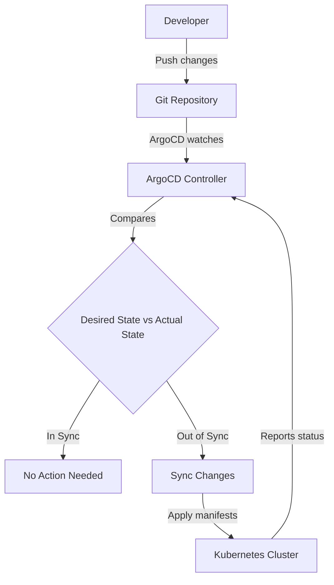
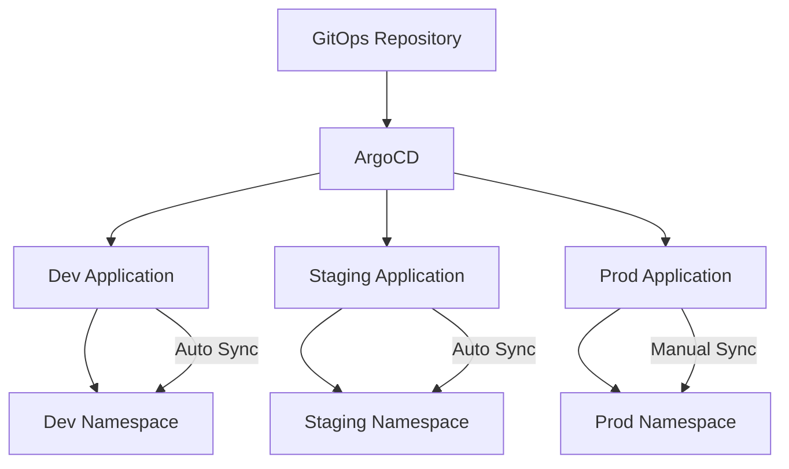
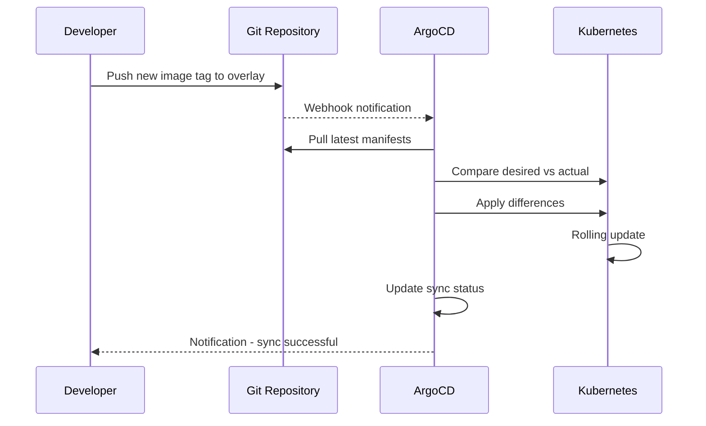

# How to Set Up ArgoCD for GitOps Deployments on Kubernetes

Author: [nawazdhandala](https://www.github.com/nawazdhandala)

Tags: ArgoCD, GitOps, Kubernetes, Continuous Delivery, Automation

Description: Step-by-step guide to setting up ArgoCD for GitOps-based continuous delivery to Kubernetes clusters.

---

## Introduction

GitOps is a deployment methodology where Git is the single source of truth for your infrastructure and application state. ArgoCD is the most popular GitOps tool for Kubernetes. It continuously monitors your Git repositories and automatically syncs your Kubernetes cluster to match the desired state defined in Git.

This guide covers installing ArgoCD, configuring applications, setting up automated sync, and managing multi-environment deployments.

## How ArgoCD Works



The key principle: you never run `kubectl apply` directly. Instead, you commit changes to Git, and ArgoCD applies them automatically.

## Installing ArgoCD

Install ArgoCD into your Kubernetes cluster.

```bash
# Create the argocd namespace
kubectl create namespace argocd

# Install ArgoCD using the official manifests
kubectl apply -n argocd -f \
  https://raw.githubusercontent.com/argoproj/argo-cd/stable/manifests/install.yaml

# Wait for all ArgoCD pods to be ready
kubectl wait --for=condition=ready pod \
  -l app.kubernetes.io/part-of=argocd \
  -n argocd \
  --timeout=300s
```

## Accessing the ArgoCD UI

```bash
# Get the initial admin password
kubectl -n argocd get secret argocd-initial-admin-secret \
  -o jsonpath="{.data.password}" | base64 -d

# Port-forward the ArgoCD server to access the UI
kubectl port-forward svc/argocd-server -n argocd 8080:443

# Or install the ArgoCD CLI
brew install argocd

# Log in via CLI
argocd login localhost:8080 --username admin --password <password>

# Change the default password
argocd account update-password
```

## Git Repository Structure

Organize your manifests in a Git repository for ArgoCD to manage.

```
gitops-repo/
  apps/
    my-app/
      base/
        deployment.yaml
        service.yaml
        configmap.yaml
        kustomization.yaml
      overlays/
        dev/
          kustomization.yaml
          patches/
            replicas.yaml
        staging/
          kustomization.yaml
          patches/
            replicas.yaml
        prod/
          kustomization.yaml
          patches/
            replicas.yaml
```

## Base Kubernetes Manifests

```yaml
# apps/my-app/base/deployment.yaml
apiVersion: apps/v1
kind: Deployment
metadata:
  name: my-app
  labels:
    app: my-app
spec:
  replicas: 1
  selector:
    matchLabels:
      app: my-app
  template:
    metadata:
      labels:
        app: my-app
    spec:
      containers:
        - name: my-app
          image: ghcr.io/myorg/my-app:latest
          ports:
            - containerPort: 8080
          resources:
            requests:
              cpu: 100m
              memory: 128Mi
            limits:
              cpu: 500m
              memory: 256Mi
```

```yaml
# apps/my-app/base/service.yaml
apiVersion: v1
kind: Service
metadata:
  name: my-app
spec:
  selector:
    app: my-app
  ports:
    - port: 80
      targetPort: 8080
```

```yaml
# apps/my-app/base/kustomization.yaml
# Kustomize base listing all resources
apiVersion: kustomize.config.k8s.io/v1beta1
kind: Kustomization
resources:
  - deployment.yaml
  - service.yaml
  - configmap.yaml
```

## Environment Overlays

```yaml
# apps/my-app/overlays/prod/kustomization.yaml
# Production overlay with environment-specific patches
apiVersion: kustomize.config.k8s.io/v1beta1
kind: Kustomization
resources:
  - ../../base
namespace: production
patches:
  - path: patches/replicas.yaml
images:
  - name: ghcr.io/myorg/my-app
    newTag: v1.2.3
```

```yaml
# apps/my-app/overlays/prod/patches/replicas.yaml
# Scale up to 3 replicas in production
apiVersion: apps/v1
kind: Deployment
metadata:
  name: my-app
spec:
  replicas: 3
```

## Creating an ArgoCD Application

### Using the CLI

```bash
# Create an ArgoCD application pointing to the Git repo
argocd app create my-app-prod \
  --repo https://github.com/myorg/gitops-repo.git \
  --path apps/my-app/overlays/prod \
  --dest-server https://kubernetes.default.svc \
  --dest-namespace production \
  --sync-policy automated \
  --auto-prune \
  --self-heal
```

### Using a Declarative Application Manifest

```yaml
# argocd/applications/my-app-prod.yaml
apiVersion: argoproj.io/v1alpha1
kind: Application
metadata:
  name: my-app-prod
  namespace: argocd
  # Finalizer ensures resources are cleaned up when app is deleted
  finalizers:
    - resources-finalizer.argocd.argoproj.io
spec:
  project: default

  # Source: where to find the manifests
  source:
    repoURL: https://github.com/myorg/gitops-repo.git
    targetRevision: main
    path: apps/my-app/overlays/prod

  # Destination: where to deploy
  destination:
    server: https://kubernetes.default.svc
    namespace: production

  # Sync policy: how ArgoCD manages the application
  syncPolicy:
    automated:
      # Automatically sync when Git changes are detected
      selfHeal: true
      # Remove resources that are no longer in Git
      prune: true
    syncOptions:
      # Create the namespace if it does not exist
      - CreateNamespace=true
    retry:
      limit: 3
      backoff:
        duration: 5s
        factor: 2
        maxDuration: 3m
```

## Multi-Environment Setup



```yaml
# argocd/applications/my-app-dev.yaml
apiVersion: argoproj.io/v1alpha1
kind: Application
metadata:
  name: my-app-dev
  namespace: argocd
spec:
  project: default
  source:
    repoURL: https://github.com/myorg/gitops-repo.git
    targetRevision: develop
    path: apps/my-app/overlays/dev
  destination:
    server: https://kubernetes.default.svc
    namespace: dev
  syncPolicy:
    automated:
      selfHeal: true
      prune: true
```

## App of Apps Pattern

Manage multiple applications with a parent application.

```yaml
# argocd/app-of-apps.yaml
# Parent application that manages all child applications
apiVersion: argoproj.io/v1alpha1
kind: Application
metadata:
  name: app-of-apps
  namespace: argocd
spec:
  project: default
  source:
    repoURL: https://github.com/myorg/gitops-repo.git
    targetRevision: main
    # This directory contains all Application manifests
    path: argocd/applications
  destination:
    server: https://kubernetes.default.svc
    namespace: argocd
  syncPolicy:
    automated:
      selfHeal: true
      prune: true
```

## Sync Flow



## Rollback with ArgoCD

```bash
# View the sync history
argocd app history my-app-prod

# Rollback to a previous revision
argocd app rollback my-app-prod <REVISION_NUMBER>

# Or simply revert the Git commit and let ArgoCD sync
git revert HEAD
git push origin main
```

## Health Checks

ArgoCD has built-in health checks for Kubernetes resources. You can also define custom health checks.

```yaml
# argocd-cm ConfigMap for custom health checks
apiVersion: v1
kind: ConfigMap
metadata:
  name: argocd-cm
  namespace: argocd
data:
  # Custom health check for CRDs
  resource.customizations.health.mycrd.example.com_MyResource: |
    hs = {}
    if obj.status ~= nil then
      if obj.status.phase == "Running" then
        hs.status = "Healthy"
      elseif obj.status.phase == "Failed" then
        hs.status = "Degraded"
        hs.message = obj.status.message
      else
        hs.status = "Progressing"
      end
    end
    return hs
```

## Monitoring ArgoCD and Your Deployments

ArgoCD tells you what is deployed, but you also need to know if what is deployed is actually working. OneUptime (https://oneuptime.com) complements ArgoCD by monitoring the health and performance of your deployed applications. While ArgoCD ensures your desired state matches reality, OneUptime monitors uptime, response times, and error rates to verify your applications are serving users correctly after every GitOps sync.
