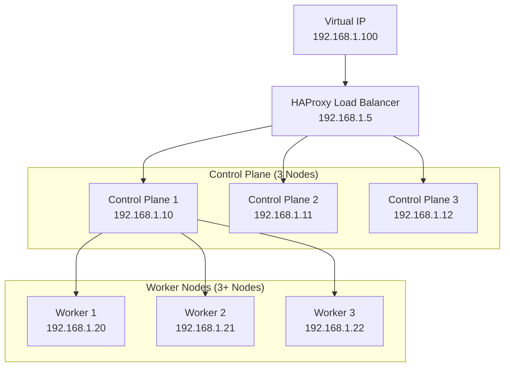
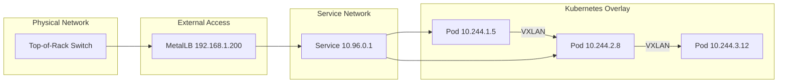

# How to Set Up a Production Kubernetes Cluster on Bare Metal

Author: [nawazdhandala](https://www.github.com/nawazdhandala)

Tags: Bare Metal, Kubernetes, Production, Infrastructure, On-Premise

Description: A comprehensive guide to setting up a production Kubernetes cluster on bare metal servers with networking and storage.

---

Running Kubernetes on bare metal gives you full control over your infrastructure, eliminates cloud provider costs, and can deliver better performance for latency-sensitive workloads. However, it also means you are responsible for networking, load balancing, storage, and high availability - things that cloud providers handle for you.

This guide walks you through setting up a production-ready Kubernetes cluster on bare metal servers from scratch.

## Cluster Architecture



## Step 1: Prepare the Nodes

Run these commands on every node (both control plane and worker nodes).

```bash
#!/bin/bash
# prepare-node.sh
# Prepares a bare metal server for Kubernetes installation

# Disable swap (Kubernetes requires swap to be off)
sudo swapoff -a
sudo sed -i '/ swap / s/^/#/' /etc/fstab

# Load required kernel modules for container networking
cat <<EOF | sudo tee /etc/modules-load.d/k8s.conf
overlay
br_netfilter
EOF

sudo modprobe overlay
sudo modprobe br_netfilter

# Set required sysctl parameters for Kubernetes networking
cat <<EOF | sudo tee /etc/sysctl.d/k8s.conf
net.bridge.bridge-nf-call-iptables  = 1
net.bridge.bridge-nf-call-ip6tables = 1
net.ipv4.ip_forward                 = 1
EOF

# Apply sysctl parameters without reboot
sudo sysctl --system

# Install containerd as the container runtime
sudo apt-get update
sudo apt-get install -y containerd

# Configure containerd to use systemd cgroup driver
sudo mkdir -p /etc/containerd
containerd config default | sudo tee /etc/containerd/config.toml
sudo sed -i 's/SystemdCgroup = false/SystemdCgroup = true/' /etc/containerd/config.toml
sudo systemctl restart containerd
sudo systemctl enable containerd

# Install kubeadm, kubelet, and kubectl
sudo apt-get install -y apt-transport-https ca-certificates curl
curl -fsSL https://pkgs.k8s.io/core:/stable:/v1.30/deb/Release.key | \
  sudo gpg --dearmor -o /etc/apt/keyrings/kubernetes-apt-keyring.gpg
echo 'deb [signed-by=/etc/apt/keyrings/kubernetes-apt-keyring.gpg] https://pkgs.k8s.io/core:/stable:/v1.30/deb/ /' | \
  sudo tee /etc/apt/sources.list.d/kubernetes.list
sudo apt-get update
sudo apt-get install -y kubelet kubeadm kubectl
sudo apt-mark hold kubelet kubeadm kubectl
```

## Step 2: Set Up HAProxy for API Server Load Balancing

On your load balancer node, install and configure HAProxy to distribute API server traffic across control plane nodes.

```bash
# Install HAProxy and Keepalived for high availability
sudo apt-get install -y haproxy keepalived
```

```nginx
# /etc/haproxy/haproxy.cfg
# HAProxy configuration for Kubernetes API server load balancing
global
    log /dev/log local0
    maxconn 4096
    daemon

defaults
    log     global
    mode    tcp
    option  tcplog
    timeout connect 5s
    timeout client  30s
    timeout server  30s

# Frontend that listens on port 6443 for API server requests
frontend kubernetes-api
    bind *:6443
    default_backend kubernetes-api-backend

# Backend with all three control plane nodes
backend kubernetes-api-backend
    balance roundrobin
    option tcp-check
    server cp1 192.168.1.10:6443 check fall 3 rise 2
    server cp2 192.168.1.11:6443 check fall 3 rise 2
    server cp3 192.168.1.12:6443 check fall 3 rise 2
```

## Step 3: Initialize the First Control Plane Node

```bash
# Initialize the cluster on the first control plane node
# The control-plane-endpoint points to the HAProxy VIP
sudo kubeadm init \
  --control-plane-endpoint "192.168.1.100:6443" \
  --upload-certs \
  --pod-network-cidr "10.244.0.0/16" \
  --service-cidr "10.96.0.0/12"

# Set up kubectl for the current user
mkdir -p $HOME/.kube
sudo cp -i /etc/kubernetes/admin.conf $HOME/.kube/config
sudo chown $(id -u):$(id -g) $HOME/.kube/config
```

## Step 4: Join Additional Control Plane and Worker Nodes

```bash
# Join additional control plane nodes (use the command from kubeadm init output)
sudo kubeadm join 192.168.1.100:6443 \
  --token <token> \
  --discovery-token-ca-cert-hash sha256:<hash> \
  --control-plane \
  --certificate-key <cert-key>

# Join worker nodes
sudo kubeadm join 192.168.1.100:6443 \
  --token <token> \
  --discovery-token-ca-cert-hash sha256:<hash>
```

## Step 5: Install a CNI Plugin (Calico)

```bash
# Install Calico for pod networking and network policy support
kubectl apply -f https://raw.githubusercontent.com/projectcalico/calico/v3.27.0/manifests/calico.yaml

# Verify all nodes are Ready
kubectl get nodes -o wide
```

## Step 6: Install MetalLB for Load Balancing

On bare metal, there is no cloud load balancer. MetalLB fills this gap by assigning external IPs to LoadBalancer-type services.

```yaml
# metallb-config.yaml
# Configure MetalLB with an IP address pool for services
apiVersion: metallb.io/v1beta1
kind: IPAddressPool
metadata:
  name: default-pool
  namespace: metallb-system
spec:
  # Reserve a range of IPs on your network for MetalLB
  addresses:
    - 192.168.1.200-192.168.1.250
---
apiVersion: metallb.io/v1beta1
kind: L2Advertisement
metadata:
  name: default
  namespace: metallb-system
spec:
  ipAddressPools:
    - default-pool
```

```bash
# Install MetalLB using Helm
helm repo add metallb https://metallb.github.io/metallb
helm install metallb metallb/metallb --namespace metallb-system --create-namespace

# Wait for MetalLB pods to be ready, then apply the config
kubectl wait --namespace metallb-system \
  --for=condition=ready pod \
  --selector=app.kubernetes.io/name=metallb \
  --timeout=120s
kubectl apply -f metallb-config.yaml
```

## Step 7: Set Up Storage with Longhorn

```bash
# Install Longhorn for distributed block storage
helm repo add longhorn https://charts.longhorn.io
helm install longhorn longhorn/longhorn \
  --namespace longhorn-system \
  --create-namespace \
  --set defaultSettings.defaultReplicaCount=3
```

```yaml
# longhorn-storageclass.yaml
# Make Longhorn the default storage class
apiVersion: storage.k8s.io/v1
kind: StorageClass
metadata:
  name: longhorn
  annotations:
    storageclass.kubernetes.io/is-default-class: "true"
provisioner: driver.longhorn.io
reclaimPolicy: Delete
volumeBindingMode: Immediate
parameters:
  numberOfReplicas: "3"
  staleReplicaTimeout: "2880"
```

## Network Topology



## Step 8: Install Monitoring

```bash
# Install the kube-prometheus-stack for monitoring
helm repo add prometheus-community https://prometheus-community.github.io/helm-charts
helm install monitoring prometheus-community/kube-prometheus-stack \
  --namespace monitoring \
  --create-namespace \
  --set grafana.adminPassword='MonitoringPass123!'
```

## Production Checklist

Before going to production, verify the following: etcd is running on all three control plane nodes with regular backups configured, the CNI plugin is healthy and network policies are in place, storage replication is working across nodes, node firewalls allow only required ports (6443, 2379-2380, 10250, 10259, 10257), and you have monitoring and alerting configured.

For monitoring your bare metal Kubernetes cluster, [OneUptime](https://oneuptime.com) provides a complete observability platform. You can monitor node health, track cluster metrics via OpenTelemetry, set up status pages for your services, and manage incidents with on-call scheduling. OneUptime is especially valuable for bare metal setups where you do not have cloud provider health dashboards to fall back on.
