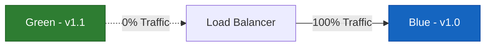
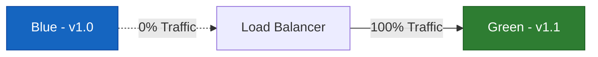
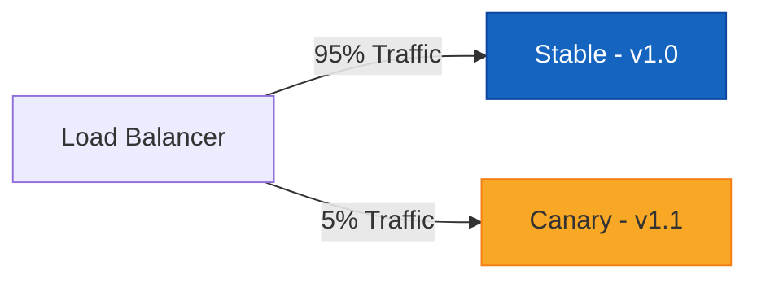
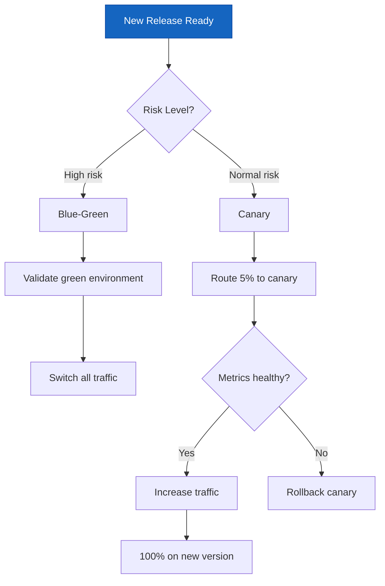

# How to Implement Blue-Green and Canary Deployment Strategies

Author: [nawazdhandala](https://www.github.com/nawazdhandala)

Tags: Deployment, Blue-Green, Canary, Kubernetes, CI/CD

Description: Learn how to implement blue-green and canary deployment strategies on Kubernetes for zero-downtime releases.

---

Deploying new code to production is one of the riskiest things you do regularly. A bad deployment can take down your entire service. Blue-green and canary deployments minimize that risk by giving you control over how traffic shifts to new versions. This guide shows you how to implement both strategies on Kubernetes.

## The Problem with Rolling Updates

Kubernetes rolling updates replace pods one at a time. While this avoids full downtime, it has drawbacks:

- No easy way to roll back instantly if something goes wrong
- Both old and new versions run simultaneously with no traffic control
- No ability to test the new version with a subset of users first

## Blue-Green Deployments

Blue-green deployment maintains two identical environments. One (blue) serves production traffic. The other (green) hosts the new version. After validating the green environment, you switch traffic all at once.



After the switch:



### Implementing Blue-Green on Kubernetes

The key is using a Kubernetes Service with a selector that you can switch between two Deployments.

```yaml
# blue-deployment.yaml
# The currently active production deployment
apiVersion: apps/v1
kind: Deployment
metadata:
  name: myapp-blue
  labels:
    app: myapp
    version: blue
spec:
  replicas: 3
  selector:
    matchLabels:
      app: myapp
      version: blue
  template:
    metadata:
      labels:
        app: myapp
        version: blue
    spec:
      containers:
        - name: myapp
          image: myapp:1.0.0
          ports:
            - containerPort: 8080
          # Readiness probe ensures traffic only goes to healthy pods
          readinessProbe:
            httpGet:
              path: /health
              port: 8080
            initialDelaySeconds: 5
            periodSeconds: 10
          resources:
            requests:
              cpu: 100m
              memory: 128Mi
            limits:
              cpu: 500m
              memory: 256Mi
```

```yaml
# green-deployment.yaml
# The new version waiting to receive traffic
apiVersion: apps/v1
kind: Deployment
metadata:
  name: myapp-green
  labels:
    app: myapp
    version: green
spec:
  replicas: 3
  selector:
    matchLabels:
      app: myapp
      version: green
  template:
    metadata:
      labels:
        app: myapp
        version: green
    spec:
      containers:
        - name: myapp
          image: myapp:1.1.0
          ports:
            - containerPort: 8080
          readinessProbe:
            httpGet:
              path: /health
              port: 8080
            initialDelaySeconds: 5
            periodSeconds: 10
          resources:
            requests:
              cpu: 100m
              memory: 128Mi
            limits:
              cpu: 500m
              memory: 256Mi
```

```yaml
# service.yaml
# The Service selector determines which deployment gets traffic
# Change the version label to switch between blue and green
apiVersion: v1
kind: Service
metadata:
  name: myapp
spec:
  selector:
    app: myapp
    # Switch this value between "blue" and "green" to cut over
    version: blue
  ports:
    - port: 80
      targetPort: 8080
  type: ClusterIP
```

### Blue-Green Switch Script

```bash
#!/bin/bash
# blue-green-switch.sh
# Switches traffic from one environment to the other

set -euo pipefail

CURRENT=$(kubectl get svc myapp -o jsonpath='{.spec.selector.version}')
echo "Current active version: $CURRENT"

# Determine the target version
if [ "$CURRENT" = "blue" ]; then
    TARGET="green"
else
    TARGET="blue"
fi

echo "Switching to: $TARGET"

# Verify the target deployment is healthy before switching
READY=$(kubectl get deployment myapp-$TARGET -o jsonpath='{.status.readyReplicas}')
DESIRED=$(kubectl get deployment myapp-$TARGET -o jsonpath='{.spec.replicas}')

if [ "$READY" != "$DESIRED" ]; then
    echo "ERROR: Target deployment not fully ready ($READY/$DESIRED pods)"
    exit 1
fi

# Perform the switch by updating the Service selector
kubectl patch svc myapp -p "{\"spec\":{\"selector\":{\"version\":\"$TARGET\"}}}"

echo "Traffic switched to $TARGET successfully"
```

## Canary Deployments

Canary deployments gradually shift a small percentage of traffic to the new version. If the canary is healthy, you increase the traffic percentage until the new version handles 100%.



### Canary with Nginx Ingress

You can implement canary deployments using Nginx Ingress annotations to split traffic by weight.

```yaml
# canary-ingress.yaml
# Routes a percentage of traffic to the canary deployment
apiVersion: networking.k8s.io/v1
kind: Ingress
metadata:
  name: myapp-canary
  annotations:
    # Enable canary mode
    nginx.ingress.kubernetes.io/canary: "true"
    # Send 10% of traffic to the canary
    nginx.ingress.kubernetes.io/canary-weight: "10"
spec:
  ingressClassName: nginx
  rules:
    - host: myapp.example.com
      http:
        paths:
          - path: /
            pathType: Prefix
            backend:
              service:
                name: myapp-canary
                port:
                  number: 80
```

### Progressive Canary Rollout Script

```bash
#!/bin/bash
# canary-rollout.sh
# Gradually increases canary traffic while monitoring health

set -euo pipefail

# Traffic weights for each stage of the rollout
WEIGHTS=(5 10 25 50 75 100)
# How long to observe each stage before progressing (in seconds)
OBSERVE_PERIOD=120
# Health check endpoint
HEALTH_URL="http://myapp-canary.default.svc.cluster.local/health"

for weight in "${WEIGHTS[@]}"; do
    echo "Setting canary weight to ${weight}%"

    # Update the canary ingress weight
    kubectl annotate ingress myapp-canary \
        nginx.ingress.kubernetes.io/canary-weight="$weight" \
        --overwrite

    echo "Observing for ${OBSERVE_PERIOD} seconds..."
    sleep "$OBSERVE_PERIOD"

    # Check canary health
    HTTP_CODE=$(curl -s -o /dev/null -w "%{http_code}" "$HEALTH_URL" || echo "000")

    if [ "$HTTP_CODE" != "200" ]; then
        echo "Canary health check failed (HTTP $HTTP_CODE) - rolling back"
        kubectl annotate ingress myapp-canary \
            nginx.ingress.kubernetes.io/canary-weight="0" \
            --overwrite
        exit 1
    fi

    echo "Canary healthy at ${weight}% traffic"
done

echo "Canary rollout complete - promoting to stable"
```

## Comparing the Strategies

| Aspect | Blue-Green | Canary |
|--------|-----------|--------|
| Traffic switch | All at once | Gradual |
| Rollback speed | Instant | Fast |
| Resource cost | 2x infrastructure | 1x + small canary |
| Risk exposure | Full blast radius | Limited to canary % |
| Complexity | Simple | Moderate |
| Best for | Database migrations, breaking changes | Gradual feature rollouts |



## Key Metrics to Watch During Deployments

During any deployment strategy, monitor these metrics closely:

- **Error rate** - compare old version vs new version error rates
- **Latency** - p50, p95, and p99 response times
- **Throughput** - requests per second on each version
- **Resource usage** - CPU and memory consumption of new pods
- **Business metrics** - conversion rates, checkout completions

OneUptime helps you monitor deployments in real time. Track error rates, latency percentiles, and custom business metrics across deployment versions. Set up automated alerts that trigger a rollback when your canary exceeds error thresholds. Monitor your blue-green switches with instant visibility into which version is serving traffic. Get started at [https://oneuptime.com](https://oneuptime.com).
