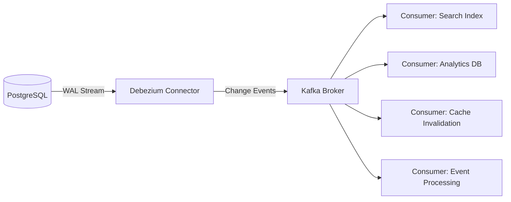
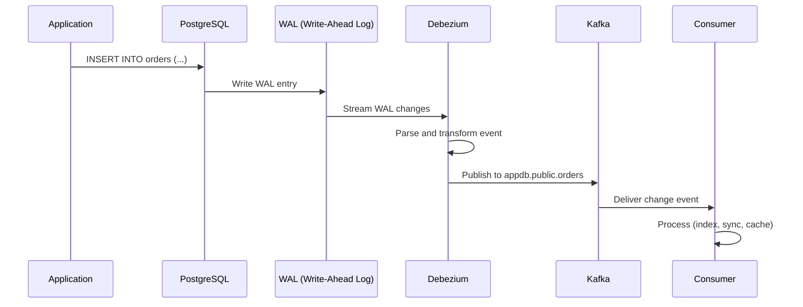
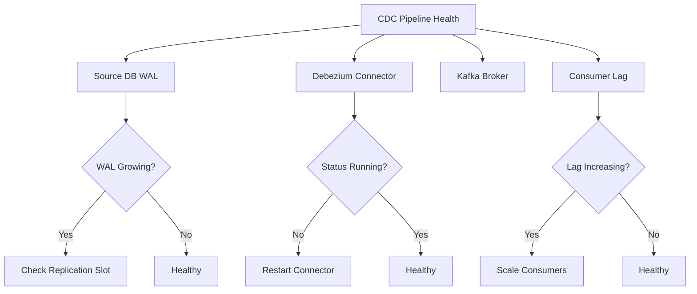

# How to Implement Change Data Capture with Debezium and Kafka

Author: [nawazdhandala](https://www.github.com/nawazdhandala)

Tags: CDC, Debezium, Kafka, Database, Event Streaming

Description: Learn how to implement Change Data Capture with Debezium and Kafka for real-time data synchronization between databases.

---

Change Data Capture (CDC) is a pattern that tracks row-level changes in your database and streams them as events. Instead of polling databases or building custom sync logic, CDC gives you a real-time stream of every insert, update, and delete. Debezium, built on top of Apache Kafka Connect, is the most popular open-source CDC platform and supports PostgreSQL, MySQL, MongoDB, SQL Server, and more.

This guide covers setting up Debezium with Kafka on Kubernetes for real-time data synchronization.

## CDC Architecture Overview



Debezium reads the database's write-ahead log (WAL) or binary log, converts each change into a structured event, and publishes it to a Kafka topic. Downstream consumers can then process these events independently.

## Step 1: Deploy Kafka on Kubernetes with Strimzi

```bash
# Install the Strimzi Kafka operator
kubectl create namespace kafka
kubectl apply -f https://strimzi.io/install/latest?namespace=kafka

# Wait for the operator to be ready
kubectl wait --for=condition=Ready pod -l name=strimzi-cluster-operator -n kafka --timeout=300s
```

```yaml
# kafka-cluster.yaml
# Deploy a 3-broker Kafka cluster with Strimzi
apiVersion: kafka.strimzi.io/v1beta2
kind: Kafka
metadata:
  name: cdc-cluster
  namespace: kafka
spec:
  kafka:
    version: 3.7.0
    replicas: 3
    listeners:
      # Internal listener for in-cluster communication
      - name: plain
        port: 9092
        type: internal
        tls: false
      # TLS listener for secure communication
      - name: tls
        port: 9093
        type: internal
        tls: true
    config:
      # Replication settings for durability
      offsets.topic.replication.factor: 3
      transaction.state.log.replication.factor: 3
      transaction.state.log.min.isr: 2
      default.replication.factor: 3
      min.insync.replicas: 2
      # Log retention settings
      log.retention.hours: 168
      log.segment.bytes: 1073741824
    storage:
      type: persistent-claim
      size: 100Gi
      class: standard
    resources:
      requests:
        cpu: 500m
        memory: 2Gi
      limits:
        cpu: "2"
        memory: 4Gi
  zookeeper:
    replicas: 3
    storage:
      type: persistent-claim
      size: 20Gi
      class: standard
  entityOperator:
    topicOperator: {}
    userOperator: {}
```

```bash
# Apply the Kafka cluster manifest
kubectl apply -f kafka-cluster.yaml

# Wait for the cluster to be ready
kubectl wait kafka/cdc-cluster --for=condition=Ready --timeout=600s -n kafka
```

## Step 2: Configure the Source Database

The source database needs to be configured to support logical replication. Here is the setup for PostgreSQL.

```sql
-- Enable logical replication in PostgreSQL
-- Add these settings to postgresql.conf:
-- wal_level = logical
-- max_replication_slots = 4
-- max_wal_senders = 4

-- Create a dedicated user for Debezium with replication privileges
CREATE USER debezium WITH REPLICATION LOGIN PASSWORD 'debezium_password';

-- Grant the debezium user access to the target database and tables
GRANT USAGE ON SCHEMA public TO debezium;
GRANT SELECT ON ALL TABLES IN SCHEMA public TO debezium;
ALTER DEFAULT PRIVILEGES IN SCHEMA public GRANT SELECT ON TABLES TO debezium;

-- Create a publication for the tables you want to capture
-- This tells PostgreSQL which tables to include in the WAL stream
CREATE PUBLICATION debezium_publication FOR TABLE
    orders,
    customers,
    products,
    order_items;

-- Verify the publication is active
SELECT * FROM pg_publication;
SELECT * FROM pg_publication_tables;
```

## Step 3: Deploy Kafka Connect with Debezium

```yaml
# kafka-connect.yaml
# Deploy Kafka Connect with the Debezium PostgreSQL connector
apiVersion: kafka.strimzi.io/v1beta2
kind: KafkaConnect
metadata:
  name: debezium-connect
  namespace: kafka
  annotations:
    # Enable the connector operator to manage connectors
    strimzi.io/use-connector-resources: "true"
spec:
  version: 3.7.0
  replicas: 2
  bootstrapServers: cdc-cluster-kafka-bootstrap:9092
  config:
    # Connector group and offset settings
    group.id: debezium-connect
    offset.storage.topic: connect-offsets
    config.storage.topic: connect-configs
    status.storage.topic: connect-status
    offset.storage.replication.factor: 3
    config.storage.replication.factor: 3
    status.storage.replication.factor: 3
    # Use JSON converters for event serialization
    key.converter: org.apache.kafka.connect.json.JsonConverter
    value.converter: org.apache.kafka.connect.json.JsonConverter
    key.converter.schemas.enable: true
    value.converter.schemas.enable: true
  build:
    # Build a custom Connect image with the Debezium connector
    output:
      type: docker
      image: my-registry.com/debezium-connect:latest
      pushSecret: registry-credentials
    plugins:
      - name: debezium-postgres
        artifacts:
          - type: tgz
            url: https://repo1.maven.org/maven2/io/debezium/debezium-connector-postgres/2.6.0.Final/debezium-connector-postgres-2.6.0.Final-plugin.tar.gz
  resources:
    requests:
      cpu: 500m
      memory: 1Gi
    limits:
      cpu: "2"
      memory: 2Gi
```

## Step 4: Create the Debezium Connector

```yaml
# debezium-connector.yaml
# Configure the Debezium PostgreSQL connector
apiVersion: kafka.strimzi.io/v1beta2
kind: KafkaConnector
metadata:
  name: postgres-source-connector
  namespace: kafka
  labels:
    strimzi.io/cluster: debezium-connect
spec:
  class: io.debezium.connector.postgresql.PostgresConnector
  tasksMax: 1
  config:
    # Database connection settings
    database.hostname: postgres-service.databases.svc.cluster.local
    database.port: 5432
    database.user: debezium
    database.password: debezium_password
    database.dbname: appdb
    # Logical name for this database server (used as Kafka topic prefix)
    topic.prefix: appdb
    # Use pgoutput for PostgreSQL 10+
    plugin.name: pgoutput
    # Capture changes from these tables only
    table.include.list: public.orders,public.customers,public.products,public.order_items
    # Slot name for replication
    slot.name: debezium_slot
    # Publication name we created earlier
    publication.name: debezium_publication
    # Snapshot mode: initial takes a full snapshot, then streams changes
    snapshot.mode: initial
    # Heartbeat to keep the replication slot alive
    heartbeat.interval.ms: 10000
    # Transform tombstone events
    tombstones.on.delete: true
```

## CDC Event Flow



## Step 5: Build a Change Event Consumer

```python
# consumer.py
# Consumes CDC events from Kafka and syncs data to Elasticsearch
from kafka import KafkaConsumer
import json
from elasticsearch import Elasticsearch

# Connect to Kafka and subscribe to the orders topic
consumer = KafkaConsumer(
    "appdb.public.orders",
    bootstrap_servers=["cdc-cluster-kafka-bootstrap.kafka.svc:9092"],
    # Start from the earliest available message
    auto_offset_reset="earliest",
    # Consumer group for coordinated consumption
    group_id="search-indexer",
    # Deserialize message values as JSON
    value_deserializer=lambda m: json.loads(m.decode("utf-8")),
)

# Connect to Elasticsearch for indexing
es = Elasticsearch(["http://elasticsearch.search.svc:9200"])

def process_change_event(event):
    """Process a Debezium CDC event and sync to Elasticsearch."""
    payload = event.get("payload", {})
    operation = payload.get("op")
    source = payload.get("source", {})

    # Extract the table name and primary key
    table = source.get("table")
    # The 'after' field contains the row data after the change
    after = payload.get("after", {})
    # The 'before' field contains the row data before the change
    before = payload.get("before", {})

    if operation == "c":
        # CREATE: Index the new document
        doc_id = after.get("id")
        print(f"Indexing new order: {doc_id}")
        es.index(index=f"{table}-index", id=doc_id, document=after)

    elif operation == "u":
        # UPDATE: Update the existing document
        doc_id = after.get("id")
        print(f"Updating order: {doc_id}")
        es.index(index=f"{table}-index", id=doc_id, document=after)

    elif operation == "d":
        # DELETE: Remove the document from the index
        doc_id = before.get("id")
        print(f"Deleting order: {doc_id}")
        es.delete(index=f"{table}-index", id=doc_id, ignore=[404])

    elif operation == "r":
        # READ: Snapshot event during initial load
        doc_id = after.get("id")
        print(f"Snapshot indexing order: {doc_id}")
        es.index(index=f"{table}-index", id=doc_id, document=after)

# Main consumer loop
print("Starting CDC consumer for search indexing...")
for message in consumer:
    try:
        process_change_event(message.value)
    except Exception as e:
        # Log the error but continue processing
        print(f"Error processing event: {e}")
        print(f"Problematic event: {json.dumps(message.value)[:200]}")
```

## Step 6: Monitor the CDC Pipeline

```yaml
# cdc-monitoring.yaml
# Prometheus ServiceMonitor for Kafka Connect metrics
apiVersion: monitoring.coreos.com/v1
kind: ServiceMonitor
metadata:
  name: debezium-connect-monitor
  namespace: kafka
spec:
  selector:
    matchLabels:
      strimzi.io/kind: KafkaConnect
  endpoints:
    - port: tcp-prometheus
      path: /metrics
      interval: 15s
```

```bash
# Check the connector status
kubectl exec -n kafka cdc-cluster-kafka-0 -- bin/kafka-consumer-groups.sh \
  --bootstrap-server localhost:9092 \
  --group search-indexer \
  --describe

# Check the replication slot lag in PostgreSQL
kubectl exec -n databases postgres-0 -- psql -U postgres -c \
  "SELECT slot_name, pg_size_pretty(pg_wal_lsn_diff(pg_current_wal_lsn(), restart_lsn)) AS lag
   FROM pg_replication_slots;"
```

## CDC Pipeline Health



## Ensuring Pipeline Reliability

A CDC pipeline is only as good as its monitoring. If the connector fails silently or consumer lag grows unchecked, your downstream systems will serve stale data.

[OneUptime](https://oneuptime.com) helps you monitor every component of your CDC pipeline. Set up monitors for your Kafka brokers, Debezium connectors, and consumer applications. Track consumer lag as a custom metric and get alerted when it exceeds your threshold. Use OneUptime's incident management to coordinate response when the pipeline breaks, and publish status updates on a status page so that downstream teams know when data synchronization is delayed. With OpenTelemetry integration, you can trace events through the entire pipeline from database change to downstream processing.
