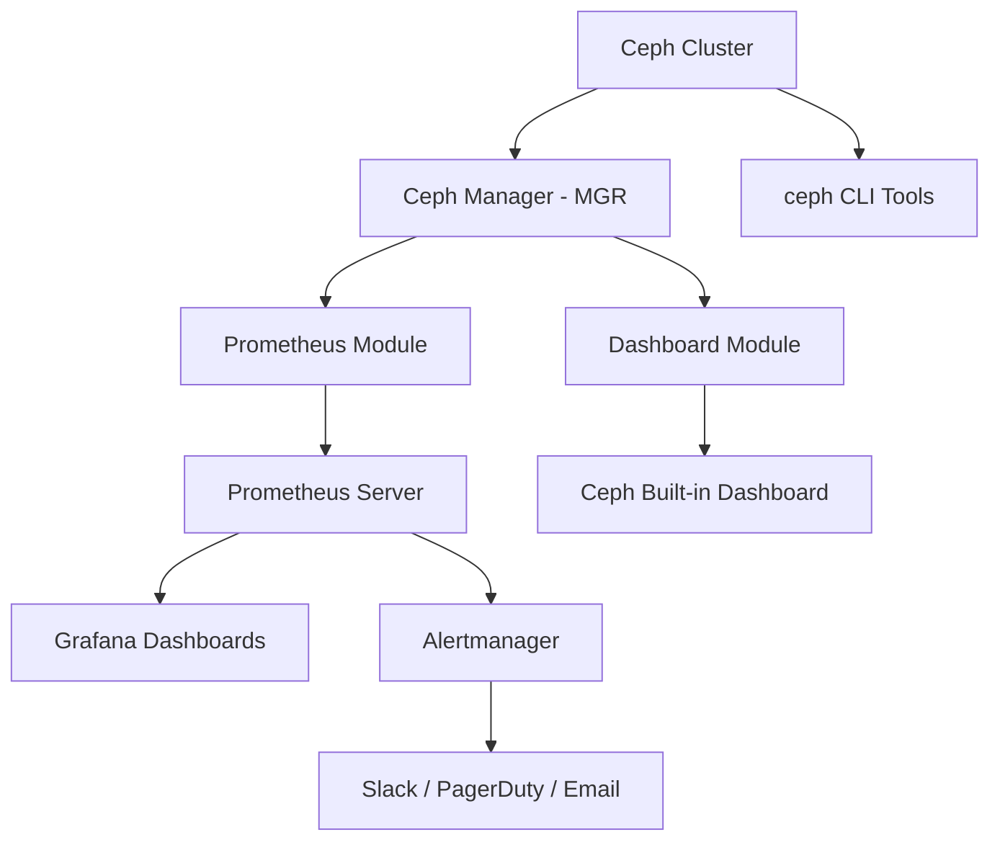
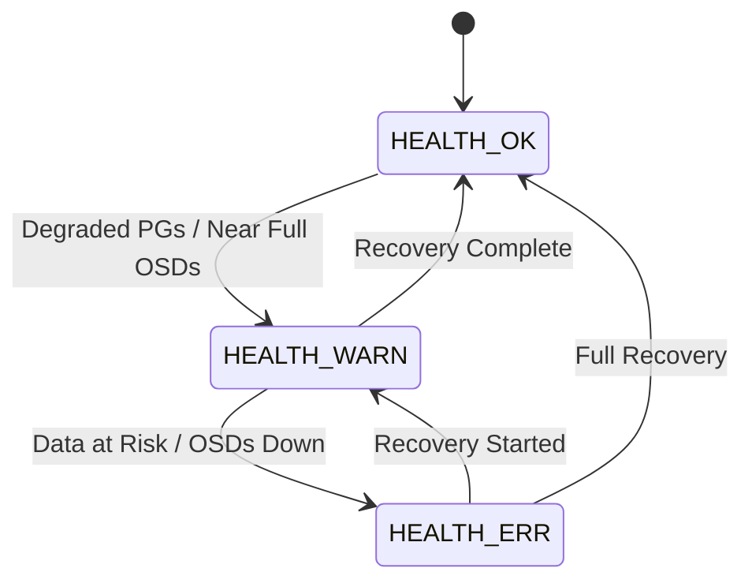
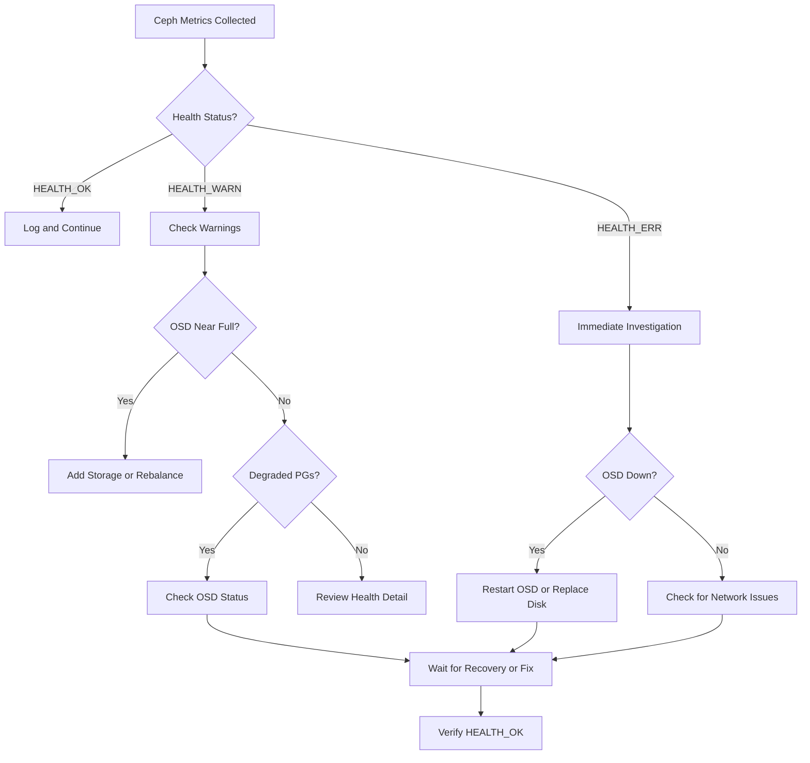

# How to Monitor Ceph Cluster Health and Performance

Author: [nawazdhandala](https://www.github.com/nawazdhandala)

Tags: Ceph, Monitoring, Health, Performance, Prometheus

Description: Learn how to monitor Ceph cluster health and performance using built-in tools, Prometheus, and Grafana dashboards.

---

Running a Ceph cluster without proper monitoring is like driving without a dashboard. You need visibility into cluster health, disk usage, IOPS, latency, and recovery operations to keep your storage reliable. This guide covers how to monitor Ceph using its built-in tools, Prometheus, and Grafana.

## Monitoring Architecture



## Built-in Health Checks

Ceph has a comprehensive built-in health check system. Start with the basics before adding external monitoring.

```bash
# Overall cluster health summary
# HEALTH_OK means everything is fine
# HEALTH_WARN means something needs attention
# HEALTH_ERR means data is at risk
ceph status

# Detailed health information with explanations
ceph health detail

# Watch cluster events in real time
ceph -w

# Check OSD (storage daemon) status
ceph osd status

# View disk usage across the cluster
ceph df

# Check pool-level statistics
ceph osd pool stats
```

### Understanding Cluster States



## Key Metrics to Monitor

These are the critical metrics you should track for any Ceph cluster.

```bash
# Check OSD utilization - watch for uneven distribution
ceph osd df tree

# Monitor placement group states
# All PGs should be active+clean in a healthy cluster
ceph pg stat

# View detailed PG status
ceph pg dump_stuck unclean
ceph pg dump_stuck inactive
ceph pg dump_stuck stale

# Check for slow OSD operations (slow ops indicate latency problems)
ceph daemon osd.0 dump_historic_slow_ops

# Monitor recovery and backfill progress
ceph status | grep -E "recovery|backfill"
```

## Enabling the Prometheus Module

Ceph Manager has a built-in Prometheus exporter module.

```bash
# Enable the Prometheus module on the Ceph Manager
ceph mgr module enable prometheus

# Verify it is running (default port 9283)
ceph mgr services

# Test the metrics endpoint
curl http://<mgr-host>:9283/metrics | head -50
```

## Prometheus Configuration

Configure Prometheus to scrape metrics from the Ceph Manager.

```yaml
# prometheus.yml
# Add this job to your Prometheus configuration
global:
  scrape_interval: 15s
  evaluation_interval: 15s

scrape_configs:
  - job_name: 'ceph'
    # Scrape interval for Ceph metrics
    scrape_interval: 10s
    static_configs:
      - targets:
          # List all Ceph Manager hosts
          - 'ceph-mgr-1:9283'
          - 'ceph-mgr-2:9283'
    # Relabel to add cluster name as a label
    relabel_configs:
      - source_labels: [__address__]
        target_label: cluster
        replacement: 'production-ceph'
```

For Rook-managed clusters on Kubernetes, create a ServiceMonitor instead.

```yaml
# service-monitor.yaml
# Prometheus Operator ServiceMonitor for Rook Ceph
apiVersion: monitoring.coreos.com/v1
kind: ServiceMonitor
metadata:
  name: rook-ceph-mgr
  namespace: rook-ceph
  labels:
    team: storage
spec:
  namespaceSelector:
    matchNames:
      - rook-ceph
  selector:
    matchLabels:
      app: rook-ceph-mgr
      rook_cluster: rook-ceph
  endpoints:
    - port: http-metrics
      path: /metrics
      interval: 10s
```

## Essential Prometheus Alerts

Set up alerts for the most critical Ceph health scenarios.

```yaml
# ceph-alerts.yaml
# Prometheus alerting rules for Ceph cluster health
groups:
  - name: ceph-health
    rules:
      # Alert when Ceph cluster is not healthy
      - alert: CephClusterUnhealthy
        expr: ceph_health_status != 0
        for: 5m
        labels:
          severity: critical
        annotations:
          summary: "Ceph cluster is unhealthy"
          description: "Ceph cluster has been in a non-OK state for 5 minutes."

      # Alert when an OSD goes down
      - alert: CephOSDDown
        expr: ceph_osd_up == 0
        for: 2m
        labels:
          severity: warning
        annotations:
          summary: "Ceph OSD {{ $labels.ceph_daemon }} is down"

      # Alert when disk usage exceeds 80%
      - alert: CephOSDNearFull
        expr: (ceph_osd_stat_bytes_used / ceph_osd_stat_bytes) * 100 > 80
        for: 5m
        labels:
          severity: warning
        annotations:
          summary: "OSD {{ $labels.ceph_daemon }} is {{ $value }}% full"

      # Alert when disk usage exceeds 90% - critical
      - alert: CephOSDFull
        expr: (ceph_osd_stat_bytes_used / ceph_osd_stat_bytes) * 100 > 90
        for: 1m
        labels:
          severity: critical
        annotations:
          summary: "OSD {{ $labels.ceph_daemon }} is critically full at {{ $value }}%"

      # Alert on slow OSD requests
      - alert: CephSlowOps
        expr: ceph_healthcheck_slow_ops > 0
        for: 5m
        labels:
          severity: warning
        annotations:
          summary: "Ceph cluster has slow operations"

      # Alert when PGs are not active+clean
      - alert: CephPGsUnhealthy
        expr: ceph_pg_total - ceph_pg_active_clean > 0
        for: 10m
        labels:
          severity: warning
        annotations:
          summary: "{{ $value }} PGs are not active+clean"
```

## Key Prometheus Queries

Use these PromQL queries for dashboarding and ad-hoc investigation.

```promql
# Cluster total capacity and usage
ceph_cluster_total_bytes
ceph_cluster_total_used_bytes

# Cluster usage percentage
(ceph_cluster_total_used_bytes / ceph_cluster_total_bytes) * 100

# Read and write IOPS across the cluster
rate(ceph_pool_rd[5m])
rate(ceph_pool_wr[5m])

# Read and write throughput in bytes per second
rate(ceph_pool_rd_bytes[5m])
rate(ceph_pool_wr_bytes[5m])

# Average OSD apply latency in milliseconds
ceph_osd_apply_latency_ms

# Average OSD commit latency in milliseconds
ceph_osd_commit_latency_ms

# Number of OSDs in each state
count(ceph_osd_up == 1)
count(ceph_osd_up == 0)

# Recovery operations in progress
ceph_pg_recovering
ceph_pg_recovery_wait
```

## Monitoring Workflow



## Ceph Dashboard

Ceph includes a built-in web dashboard for visual monitoring.

```bash
# Enable the dashboard module
ceph mgr module enable dashboard

# Create a self-signed certificate
ceph dashboard create-self-signed-cert

# Set the dashboard admin password
echo "your-secure-password" > /tmp/dashboard-pass.txt
ceph dashboard ac-user-create admin -i /tmp/dashboard-pass.txt administrator
rm /tmp/dashboard-pass.txt

# Get the dashboard URL
ceph mgr services | grep dashboard
```

For Rook deployments, access the dashboard through a Kubernetes service.

```bash
# Get the dashboard service address
kubectl -n rook-ceph get service rook-ceph-mgr-dashboard

# Port-forward for local access
kubectl -n rook-ceph port-forward svc/rook-ceph-mgr-dashboard 8443:8443

# Get the admin password from the Kubernetes secret
kubectl -n rook-ceph get secret rook-ceph-dashboard-password \
  -o jsonpath="{['data']['password']}" | base64 -d && echo
```

## Automating Health Checks with a Script

Create a simple health check script for cron or a monitoring agent.

```bash
#!/bin/bash
# ceph-health-check.sh
# Runs Ceph health checks and exits with appropriate code
# Exit codes: 0 = healthy, 1 = warning, 2 = error

# Get the current health status
HEALTH=$(ceph health -f json 2>/dev/null)
STATUS=$(echo "$HEALTH" | jq -r '.status')

case "$STATUS" in
  HEALTH_OK)
    echo "OK: Ceph cluster is healthy"
    exit 0
    ;;
  HEALTH_WARN)
    CHECKS=$(echo "$HEALTH" | jq -r '.checks | keys[]')
    echo "WARNING: Ceph cluster warnings - $CHECKS"
    exit 1
    ;;
  HEALTH_ERR)
    CHECKS=$(echo "$HEALTH" | jq -r '.checks | keys[]')
    echo "CRITICAL: Ceph cluster errors - $CHECKS"
    exit 2
    ;;
  *)
    echo "UNKNOWN: Could not determine Ceph health"
    exit 3
    ;;
esac
```

## Conclusion

Effective Ceph monitoring combines built-in health checks, Prometheus metrics collection, alerting rules, and dashboards. The key metrics to watch are cluster health status, OSD utilization, PG states, IOPS, and latency. Set up alerts for any deviation from HEALTH_OK and track disk usage trends to plan capacity ahead of time.

For end-to-end monitoring of your Ceph-backed infrastructure, [OneUptime](https://oneuptime.com) gives you a single pane of glass to track storage health alongside application performance, with built-in alerting and status pages to keep your team and users informed.
